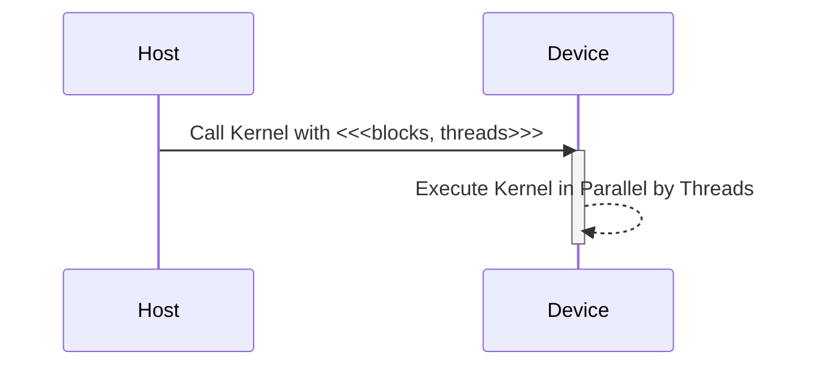
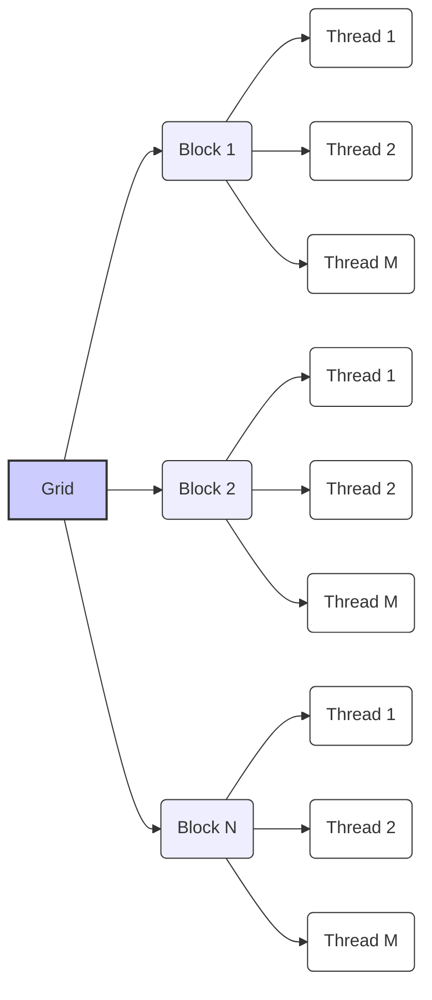
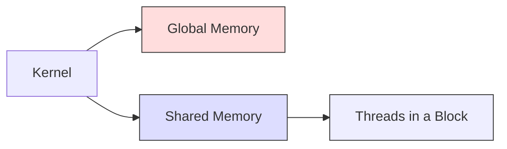
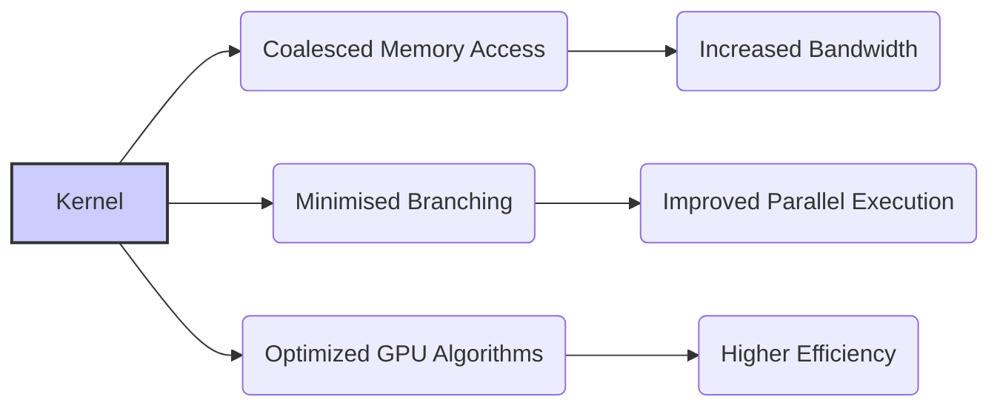
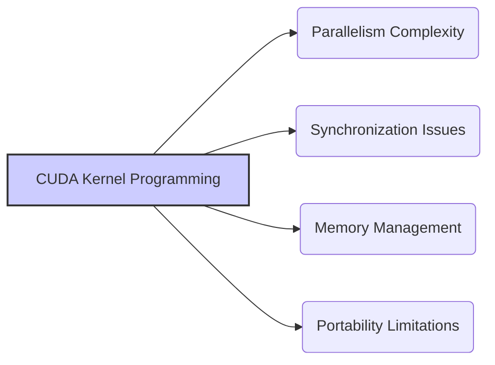

Okay, I will add Mermaid diagrams to enhance the text as requested.

## CUDA Kernel Functions: The Building Blocks of Parallel Computation

```mermaid
graph LR
    A[Host (CPU)] --> B{Kernel Launch};
    B --> C[Device (GPU)];
    C --> D[Grid of Threads];
    D --> E[Block of Threads];
    E --> F[Thread];
    F --> G[Execution of Kernel Code];
    style A fill:#f9f,stroke:#333,stroke-width:2px
    style C fill:#ccf,stroke:#333,stroke-width:2px
    style D fill:#ddf,stroke:#333,stroke-width:1px
    style E fill:#eef,stroke:#333,stroke-width:1px
    style F fill:#fff,stroke:#333,stroke-width:1px
```

### Introdução

Em CUDA, as **funções *kernel*** são o ponto central da programação paralela na GPU. São funções que são executadas por milhares de *threads* simultaneamente, e são utilizadas para realizar os cálculos intensivos das aplicações CUDA. A compreensão detalhada de como as funções *kernel* funcionam, de como elas são declaradas, dos tipos de dados que elas podem utilizar, da forma como os *threads* são organizados e como os dados são acessados, é fundamental para o desenvolvimento de aplicações que explorem o máximo potencial da GPU. Este capítulo detalha a estrutura, o funcionamento e a utilização de funções *kernel* em CUDA, explorando todos os aspectos relevantes para a criação de código eficiente, sempre com base nas informações do contexto fornecido.

### Declaração e Qualificadores de Função Kernel

Em CUDA, as funções que são executadas na GPU são declaradas utilizando o qualificador `__global__`. O qualificador `__global__` é utilizado para indicar que a função é um *kernel* e que pode ser chamada a partir do código do *host* (CPU) para ser executada no *device* (GPU). A utilização desse qualificador é essencial para que o compilador NVCC saiba como o código deve ser tratado.

**Conceito 1: `__global__` como Qualificador de Kernel**

*   **`__global__`:** O qualificador `__global__` é utilizado para declarar funções que serão executadas na GPU.
*   **Chamada do Host:** Funções declaradas com `__global__` são chamadas a partir do código do *host*, utilizando a sintaxe `<<<blocks, threads>>>`.
*   **Execução no Device:** Funções declaradas com `__global__` são executadas por vários *threads* em paralelo na GPU.
*   **Modelo SPMD:** A execução de *kernels* segue o modelo SPMD (Single Program Multiple Data), onde o mesmo código é executado em diferentes partes dos dados.



**Lemma 1:** O qualificador `__global__` é essencial para declarar uma função *kernel* em CUDA, e indica que a função será executada na GPU por vários *threads* em paralelo.

**Prova:** O qualificador `__global__` indica ao compilador que a função é um *kernel* e deve ser compilada para a arquitetura da GPU, e também indica para o *driver* CUDA que essa função será utilizada para a execução paralela.  $\blacksquare$

O exemplo abaixo demonstra a declaração de uma função *kernel* utilizando o qualificador `__global__`:

```c++
__global__ void vecAddKernel(float* A, float* B, float* C, int n) {
    int i = blockIdx.x * blockDim.x + threadIdx.x;
    if (i < n) {
        C[i] = A[i] + B[i];
    }
}
```
Nesse exemplo, o qualificador `__global__` indica que a função `vecAddKernel` é um *kernel* e que será executada pelos *threads* na GPU.

**Prova do Lemma 1:** A utilização do qualificador `__global__` é essencial para que o código seja compilado para a arquitetura da GPU e para que a função possa ser chamada pelo código do *host*. $\blacksquare$

**Corolário 1:** A utilização do qualificador `__global__` é o primeiro passo para a criação de funções *kernel* em CUDA e para a exploração do paralelismo da arquitetura da GPU.

### Organização dos Threads e Acesso aos Dados

Dentro de um *kernel*, os *threads* são organizados hierarquicamente em *grids* e *blocks*. Cada *thread* possui um índice único dentro do *block* e cada *block* possui um índice único dentro do *grid*, e essas informações são utilizadas para calcular o índice global de cada *thread*, o que permite que ele acesse a parte correta dos dados que deve ser processada.

**Conceito 2: Hierarquia de Threads e Variáveis Predefinidas**

*   **Grid:** O *grid* é o conjunto de todos os *threads* que executam o mesmo *kernel*.
*   **Block:** O *block* é um grupo de *threads* que compartilham memória e que podem ser sincronizados, e fazem parte do *grid*.
*   **`threadIdx`:** A variável `threadIdx` contém o índice do *thread* dentro do *block*.
*   **`blockIdx`:** A variável `blockIdx` contém o índice do *block* dentro do *grid*.
*   **`blockDim`:** A variável `blockDim` contém as dimensões do *block*.
*   **Índice Global:** O índice global de cada *thread* é calculado a partir das variáveis predefinidas e é utilizado para acessar a parte correta dos dados.



**Lemma 2:** A utilização das variáveis predefinidas `threadIdx`, `blockIdx` e `blockDim` permite que cada *thread* calcule o seu índice global e acesse a parte correspondente dos dados, realizando o processamento de forma paralela e eficiente.

**Prova:** As variáveis predefinidas permitem o mapeamento dos *threads* sobre o espaço de dados, e garantem que o processamento seja feito de forma correta. $\blacksquare$

O exemplo a seguir demonstra como utilizar as variáveis `threadIdx`, `blockIdx` e `blockDim` para calcular o índice global de um *thread* em um problema 1D:

```c++
__global__ void kernelExample(float* A, float* B, int n) {
    int i = blockIdx.x * blockDim.x + threadIdx.x;
    if (i < n) {
       B[i] = A[i] * 2;
    }
}
```
Nesse exemplo, a variável `i` representa o índice global do *thread*, e é calculada utilizando as variáveis predefinidas.

**Prova do Lemma 2:** O uso dessas variáveis permite que cada *thread* realize a sua parte do processamento sem conflitos ou necessidade de sincronização, e garante a execução paralela da aplicação.  $\blacksquare$

**Corolário 2:** A utilização das variáveis predefinidas é essencial para o desenvolvimento de *kernels* que explorem o paralelismo oferecido pela arquitetura da GPU.

### Tipos de Memória Acessíveis em Kernel Functions

Dentro de um *kernel*, os *threads* podem acessar diferentes tipos de memória, que são utilizadas para armazenar os dados que serão processados e os resultados. Cada tipo de memória tem características diferentes, e o seu uso adequado é essencial para o desempenho das aplicações CUDA. Os tipos de memória mais comuns acessados por *kernels* são a memória global e a memória compartilhada.

**Conceito 3: Acesso à Memória Global e Compartilhada**

*   **Memória Global:** A memória global é a principal área de memória acessível por todos os *threads* da GPU. Essa memória é utilizada para armazenar os dados de entrada e saída do *kernel*. O acesso à memória global possui uma alta latência, e deve ser feito de forma eficiente.
*   **Memória Compartilhada:** A memória compartilhada é uma região de memória que é compartilhada por todos os *threads* dentro de um mesmo *block*, e tem uma baixa latência e um *bandwidth* maior do que a memória global. A memória compartilhada é utilizada para a troca de informações entre os *threads* de um mesmo bloco.



**Lemma 3:** Os *kernels* podem acessar tanto a memória global, que é acessível por todos os *threads*, quanto a memória compartilhada, que é acessível apenas pelos *threads* do mesmo *block*, e a utilização eficiente desses tipos de memória é fundamental para a otimização do desempenho das aplicações CUDA.

**Prova:** A utilização eficiente da memória compartilhada, para a troca de informações entre *threads* dentro do mesmo bloco, diminui a necessidade de acesso à memória global, que é mais lenta e gera um menor tempo de execução. $\blacksquare$

O exemplo abaixo demonstra como as variáveis `A` e `B`, que são ponteiros para a memória global, e como a variável `sm_data`, que está localizada na memória compartilhada, são acessadas dentro de um *kernel*:

```c++
__global__ void kernelExample(float *A, float *B, int n) {
    __shared__ float sm_data[256];
    int i = blockIdx.x * blockDim.x + threadIdx.x;
    if(i < n) {
        sm_data[threadIdx.x] = A[i]; // Access global memory to load data to shared memory
        __syncthreads();
        B[i] = sm_data[threadIdx.x] * 2; // Access shared memory for computation
    }
}
```

**Prova do Lemma 3:** O uso da memória global e compartilhada é essencial para o desenvolvimento de aplicações que utilizem os recursos da GPU de forma eficiente, e o conhecimento do funcionamento da memória é fundamental para que a aplicação tenha o melhor desempenho possível. $\blacksquare$

**Corolário 3:** A escolha correta da memória a ser utilizada, e o uso eficiente da memória compartilhada são importantes para a otimização do desempenho dos *kernels*, e para minimizar a latência dos acessos.

### Variáveis Predefinidas para Identificação dos Threads

Dentro de um *kernel*, os *threads* utilizam variáveis predefinidas, que são inicializadas pelo *driver* CUDA, para identificar a sua localização dentro do *grid* e do *block*. Essas variáveis são:

1.  **`threadIdx`:** Um vetor que contém o índice do *thread* dentro do *block*.
2.  **`blockIdx`:** Um vetor que contém o índice do *block* dentro do *grid*.
3.  **`blockDim`:** Um vetor que contém as dimensões do *block*.
4.  **`gridDim`:** Um vetor que contém as dimensões do *grid*.

**Conceito 4: Mecanismo de Identificação dos Threads**

As variáveis predefinidas permitem que cada *thread* calcule o seu índice global, e acesse a parte correspondente dos dados, e a combinação das informações sobre o *thread* e o *block* permite que cada *thread* realize o seu trabalho de forma independente e em paralelo.

**Lemma 4:** O uso das variáveis predefinidas, `threadIdx`, `blockIdx` e `blockDim` permite que cada *thread* calcule o seu índice global e acesse a parte correta dos dados, e garante que cada *thread* realize a sua tarefa sem interferir no trabalho de outros *threads*.

**Prova:** O uso das variáveis permite o mapeamento correto dos *threads* sobre o espaço de dados, e garante que a computação seja feita de forma paralela e sem conflitos.  $\blacksquare$

O exemplo abaixo demonstra como as variáveis `threadIdx`, `blockIdx` e `blockDim` são utilizadas para calcular o índice global de cada *thread* num *kernel* 1D:

```c++
__global__ void kernelExample(float* A, float* B, int n) {
    int i = blockIdx.x * blockDim.x + threadIdx.x;
    if (i < n) {
        B[i] = A[i] * 2;
    }
}
```

Nesse exemplo, o índice global `i` é calculado combinando o índice do bloco (`blockIdx.x`), as dimensões do bloco (`blockDim.x`) e o índice do *thread* (`threadIdx.x`).

**Prova do Lemma 4:** O uso das variáveis predefinidas permite que a execução paralela seja feita de forma correta e eficiente. $\blacksquare$

**Corolário 4:** As variáveis predefinidas são elementos fundamentais da arquitetura CUDA e são usadas para que cada *thread* saiba qual a sua responsabilidade e o seu local na execução paralela.

### Otimização e Desafios na Programação de Kernel Functions

**Pergunta Teórica Avançada:** Como o *coalescing* dos acessos à memória global, a minimização do uso de *branching* e a otimização dos algoritmos para a arquitetura da GPU afetam a eficiência das funções *kernel* em CUDA, e como essas técnicas podem ser implementadas na prática?

**Resposta:** A otimização das funções *kernel* envolve:

1.  ***Coalescing* de Acessos à Memória Global:** O *coalescing* de acessos à memória global garante que os *threads* de um mesmo *warp* acessem dados contíguos na memória, o que diminui o número de transações de memória e aumenta o *bandwidth*.
2.  **Minimização do *Branching*:** O *branching*, que ocorre quando os *threads* seguem caminhos de execução diferentes devido a comandos como `if` e `switch`, diminui a eficiência do processamento paralelo, já que os *threads* de um mesmo *warp* devem executar o mesmo código. É importante evitar o *branching* no código do *kernel*.
3.  **Algoritmos Otimizados para GPU:** A utilização de algoritmos que sejam adequados à arquitetura da GPU pode aumentar o desempenho da aplicação, e o uso de algoritmos sequenciais pode diminuir a eficiência, já que a arquitetura da GPU é otimizada para o processamento paralelo.



**Lemma 5:** O *coalescing* dos acessos à memória global, a minimização do *branching* e a utilização de algoritmos otimizados para GPU são essenciais para a otimização de *kernels* em CUDA, e para que eles explorem ao máximo a capacidade de processamento paralelo da GPU.

**Prova:** A utilização dessas técnicas garante um melhor aproveitamento dos recursos do *hardware*, e diminui o tempo de execução dos *kernels*. $\blacksquare$

A utilização correta das ferramentas disponíveis e o conhecimento da arquitetura da GPU são fundamentais para a otimização dos *kernels*.

**Prova do Lemma 5:** A combinação de todas as técnicas de otimização é fundamental para o desenvolvimento de aplicações de alto desempenho.  $\blacksquare$

**Corolário 5:** A utilização dessas técnicas de otimização é fundamental para o desenvolvimento de aplicações CUDA eficientes e que aproveitem ao máximo o potencial do *hardware* da GPU.

### Desafios e Limitações na Programação de Kernel Functions

**Pergunta Teórica Avançada:** Quais são os principais desafios e limitações na programação de funções *kernel* em CUDA, e como esses desafios podem ser abordados para melhorar a escalabilidade e a robustez das aplicações?

**Resposta:** A programação de *kernels* em CUDA apresenta alguns desafios e limitações:

1.  **Complexidade do Paralelismo:** A programação paralela é mais complexa do que a programação sequencial, e exige um entendimento profundo da arquitetura do *hardware* e da forma como os *threads* executam o código.
2.  **Sincronização:** A sincronização entre *threads* pode gerar *overhead* e diminuir o desempenho, e a falta de sincronização pode gerar resultados incorretos.
3.  **Gerenciamento da Memória:** A utilização eficiente da memória compartilhada e da memória global é fundamental para o desempenho, e o uso incorreto da memória pode gerar *crashes* ou lentidão na execução.
4.  **Portabilidade:** O código de um *kernel* escrito para uma determinada arquitetura de GPU pode não funcionar da mesma forma em outra arquitetura, o que exige testes e otimizações específicas para cada *hardware*.



**Lemma 6:** A complexidade da programação paralela, as dificuldades da sincronização entre os *threads*, a necessidade de um gerenciamento eficiente da memória e as limitações da portabilidade são os principais desafios na programação de funções *kernel* em CUDA.

**Prova:** Os problemas mencionados são inerentes à arquitetura paralela e exigem um planejamento cuidadoso para que sejam mitigados. $\blacksquare$

Para superar esses desafios, é necessário um conhecimento profundo da arquitetura CUDA, e utilizar as técnicas de otimização e depuração de código disponíveis, além de um bom planejamento do código.

**Prova do Lemma 6:** O conhecimento da arquitetura e da API CUDA, o uso de técnicas de depuração e otimização, e o planejamento adequado das aplicações são as ferramentas essenciais para o desenvolvimento de aplicações eficientes e robustas.  $\blacksquare$

**Corolário 6:** O desenvolvimento de funções *kernel* eficientes e robustas é um desafio complexo que exige um profundo conhecimento da arquitetura CUDA e das técnicas de programação paralela.

### Conclusão

As funções *kernel* são o componente principal das aplicações CUDA e o entendimento detalhado da estrutura, do funcionamento, da organização dos *threads*, do acesso à memória e dos desafios relacionados ao seu desenvolvimento é fundamental para o sucesso da aplicação. A utilização do qualificador `__global__`, o uso das variáveis predefinidas para o cálculo do índice global, a escolha correta da memória e das técnicas de otimização, são etapas essenciais para a criação de *kernels* que explorem o máximo do potencial da arquitetura paralela da GPU. O conhecimento de todos os aspectos da arquitetura e da API CUDA são essenciais para o desenvolvimento de aplicações de alto desempenho.

### Referências

[^4]: "The execution starts with host (CPU) execution. When a kernel function is called, or launched, it is executed by a large number of threads on a device." *(Trecho de <página 44>)*

[^15]: "First, there is a CUDA specific keyword `__global__` in front of the declaration of `vecAddKernel()`. This keyword indicates that the function is a kernel and that it can be called from a host function to generate a grid of threads on a device." *(Trecho de <página 55>)*

Deseja que eu continue com as próximas seções?
