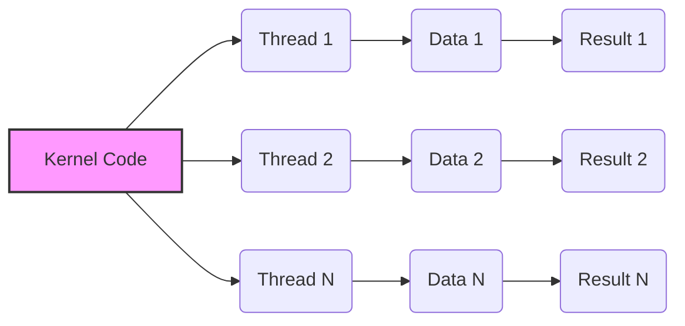
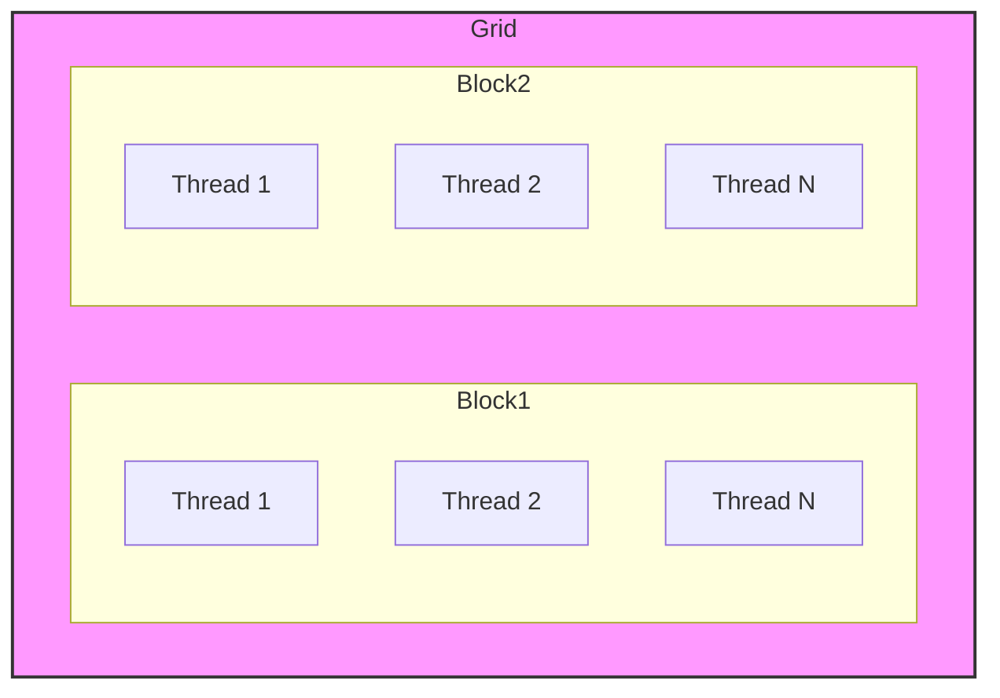

Okay, I will add Mermaid diagrams to enhance the text as requested.

## SPMD (Single Program, Multiple Data) Paradigm in CUDA: A Foundation for Parallelism



### Introdução

Em CUDA, a programação paralela na GPU é realizada através do modelo **SPMD (Single Program, Multiple Data)**, que significa que todos os *threads* executam o mesmo código (o *kernel*), mas sobre partes diferentes do conjunto de dados. A compreensão do modelo SPMD é essencial para o desenvolvimento de aplicações CUDA eficientes e escaláveis, pois ele define como os *threads* são organizados e como o trabalho é distribuído entre eles. Este capítulo explora em profundidade o paradigma SPMD em CUDA, detalhando as suas características, os seus benefícios, como os *kernels* são escritos para se adequar a esse modelo, as técnicas de otimização, e os desafios envolvidos na sua utilização, sempre com base nas informações do contexto fornecido.

### Definição do Paradigma SPMD

O paradigma SPMD (Single Program, Multiple Data) é um modelo de programação paralela onde múltiplos processadores (ou *threads*) executam o mesmo código, mas sobre diferentes partes de um conjunto de dados. Em CUDA, o modelo SPMD é a base para a execução paralela dos *kernels* na GPU, onde milhares de *threads* executam o mesmo código do *kernel* sobre diferentes partes dos dados.

**Conceito 1: Execução de um Mesmo Código por Múltiplos Threads**

*   **Single Program:** Todos os *threads* executam o mesmo código fonte, que é definido pela função *kernel*. O código do *kernel* é um programa único que é executado por vários *threads*.
*   **Multiple Data:** Cada *thread* opera sobre uma parte diferente dos dados. O *thread* obtém a sua parte de dados utilizando o cálculo de um índice global, utilizando as variáveis predefinidas da API CUDA, e realiza o processamento daquela parte dos dados.
*   **Paralelismo:** A execução dos *threads* ocorre em paralelo na GPU, e cada *thread* executa o seu trabalho de forma independente, o que permite que a aplicação explore o potencial da arquitetura da GPU.

**Lemma 1:** O paradigma SPMD é a base do modelo de programação paralela em CUDA, e garante que o mesmo código seja executado por vários *threads* simultaneamente, em diferentes partes do conjunto de dados.

**Prova:** O modelo SPMD permite que um único programa seja executado em paralelo por diversos processadores, o que diminui a complexidade do código e maximiza o uso do *hardware*.  $\blacksquare$

O diagrama a seguir ilustra o conceito do paradigma SPMD, mostrando como vários *threads* executam o mesmo código sobre diferentes partes do mesmo conjunto de dados, e como o processamento ocorre de forma paralela.


**Prova do Lemma 1:** O modelo SPMD permite que todos os processadores executem o mesmo código, utilizando apenas a diferença dos índices para garantir que cada um processe a parte correta dos dados.  $\blacksquare$

**Corolário 1:** O modelo SPMD é fundamental para a programação paralela em CUDA, e a compreensão desse modelo é essencial para o desenvolvimento de aplicações que utilizem todo o potencial das GPUs.

### Implementação do SPMD em CUDA

Em CUDA, o modelo SPMD é implementado através das funções *kernel*, que são declaradas utilizando o qualificador `__global__`. Essas funções são lançadas a partir do *host*, e cada *thread* executa uma instância desse *kernel*. A distribuição do trabalho entre os *threads* é feita através do uso das variáveis predefinidas `threadIdx`, `blockIdx` e `blockDim`, que permitem que cada *thread* identifique a sua localização dentro do *grid* e do *block*, e calcule o índice global para o acesso aos dados.

**Conceito 2: Kernel Functions e Distribuição de Trabalho**

*   **`__global__`:** As funções *kernel* são declaradas utilizando o qualificador `__global__`, o que indica que elas serão executadas na GPU por vários *threads*.
*   **Variáveis Predefinidas:** As variáveis predefinidas `threadIdx`, `blockIdx` e `blockDim` permitem que cada *thread* calcule o seu índice global e acesse a parte correspondente dos dados, dentro da estrutura que foi definida.
*   **Distribuição de Dados:** Cada *thread* acessa uma parte diferente dos dados, com base no seu índice global, o que permite a execução paralela do código, e garante que cada elemento do conjunto de dados seja processado.
*   **SPMD:** Todos os *threads* executam o mesmo código do *kernel*, mas com diferentes dados.

**Lemma 2:** A utilização de funções *kernel*, declaradas com `__global__`, juntamente com as variáveis predefinidas, permite a implementação do modelo SPMD em CUDA, e garante que cada *thread* execute a sua parte do trabalho de forma independente e em paralelo.

**Prova:** As variáveis predefinidas permitem que o *thread* calcule o seu índice e realize as operações sobre a parte correta dos dados, e o uso de todos os *threads* garante o processamento em paralelo.  $\blacksquare$

O exemplo a seguir demonstra como um *kernel* utiliza as variáveis predefinidas para calcular o índice global e acessar os dados correspondentes.

```c++
__global__ void vecAddKernel(float* A, float* B, float* C, int n) {
    int i = blockIdx.x * blockDim.x + threadIdx.x;
    if (i < n) {
        C[i] = A[i] + B[i];
    }
}
```

Nesse exemplo, o índice global `i` é calculado utilizando `blockIdx.x`, `blockDim.x` e `threadIdx.x`, e cada *thread* realiza a operação de adição sobre a parte correspondente dos vetores `A`, `B` e `C`.

**Prova do Lemma 2:** O código executado é idêntico em todos os *threads* (SPMD), e a diferença do índice garante que cada *thread* processe dados diferentes.  $\blacksquare$

**Corolário 2:** O uso de funções *kernel* e variáveis predefinidas é fundamental para a implementação do paradigma SPMD em CUDA, e garante que cada *thread* possa executar a sua parte do trabalho de forma eficiente e correta.

### O Papel dos Grids e Blocks no Modelo SPMD

A organização hierárquica dos *threads* em *grids* e *blocks* é essencial para a implementação do modelo SPMD em CUDA, e permite que a execução paralela seja feita de forma escalável e eficiente. Os *grids* e *blocks* fornecem um mecanismo para organizar o trabalho e para garantir que os dados sejam acessados corretamente pelos *threads*.

**Conceito 3: Organização Hierárquica da Execução Paralela**

*   **Grid:** O *grid* é a estrutura que contém todos os *threads* que executam o mesmo *kernel*. O *grid* pode ter uma, duas ou três dimensões e define a quantidade total de *threads* que serão utilizados na execução do *kernel*.
*   **Block:** O *block* é uma unidade de organização dos *threads* dentro do *grid*, e os *threads* dentro de um *block* podem compartilhar memória e se sincronizar. O *block* também pode ter uma, duas ou três dimensões.
*   **SPMD:** O modelo SPMD é implementado dentro de cada *block*, onde todos os *threads* executam o mesmo código, e onde o uso das variáveis predefinidas permite que cada *thread* acesse e processe uma parte diferente dos dados.

**Lemma 3:** A organização dos *threads* em *grids* e *blocks* permite a implementação do modelo SPMD em CUDA, e garante que o trabalho possa ser distribuído e que cada *thread* possa acessar os dados corretos para o seu processamento.

**Prova:** A estrutura hierárquica permite que o trabalho seja dividido e distribuído entre os *threads* de forma organizada e eficiente. $\blacksquare$

O diagrama a seguir ilustra a organização dos *threads* em *grids* e *blocks*, mostrando como cada *thread* executa o mesmo código do *kernel*, e como o uso das variáveis predefinidas permite que ele processe partes diferentes dos dados.



**Prova do Lemma 3:** A organização hierárquica permite que os *threads* executem de forma paralela e que a capacidade da GPU seja utilizada da forma mais eficiente. $\blacksquare$

**Corolário 3:** A utilização da estrutura de *grids* e *blocks* é fundamental para a implementação do modelo SPMD e para que a execução paralela seja realizada de forma eficiente em CUDA.

### Otimizações na Implementação do SPMD

**Pergunta Teórica Avançada:** Como a escolha do tamanho do *block*, o uso da memória compartilhada e o *coalescing* de acessos à memória global afetam o desempenho de aplicações CUDA que utilizam o modelo SPMD, e quais são as melhores práticas para utilizar esses recursos?

**Resposta:** A otimização do modelo SPMD em CUDA envolve:

1.  **Tamanho do Block:** A escolha do tamanho do *block* deve ser feita considerando a arquitetura da GPU, o tamanho dos *warps* (grupos de 32 *threads*), e as características do problema. É importante que o número de *threads* por bloco seja um múltiplo de 32 e que o tamanho do bloco seja adequado para o processamento da parte correspondente dos dados.
2.  **Memória Compartilhada:** O uso da memória compartilhada permite que os *threads* dentro de um mesmo *block* compartilhem dados de forma rápida, diminuindo o número de acessos à memória global. A utilização correta da memória compartilhada aumenta a localidade e a eficiência do processamento.
3.  ***Coalescing*:** O acesso à memória global deve ser *coalesced*, o que significa que os *threads* de um mesmo *warp* devem acessar dados contíguos na memória, para diminuir o número de transações de memória e aumentar o *bandwidth*.

**Lemma 4:** A combinação de uma escolha correta do tamanho do *block*, o uso da memória compartilhada para o compartilhamento de dados e o *coalescing* dos acessos à memória global, permitem maximizar o desempenho de aplicações CUDA que utilizam o modelo SPMD.

**Prova:** As três técnicas permitem que o *hardware* da GPU seja utilizado de forma eficiente, e que o tempo de execução do *kernel* seja minimizado. $\blacksquare$

O exemplo a seguir demonstra o uso da memória compartilhada para armazenar dados que serão utilizados por todos os *threads* de um *block*.

```c++
__global__ void kernelExample(float *A, float *B, int n) {
    __shared__ float sm_data[256];
    int i = blockIdx.x * blockDim.x + threadIdx.x;
    if (i < n) {
        sm_data[threadIdx.x] = A[i];
        __syncthreads();
        B[i] = sm_data[threadIdx.x] * 2;
    }
}
```

**Prova do Lemma 4:** A combinação das técnicas de otimização permite que a execução seja mais eficiente e que o desempenho do código seja maximizado. $\blacksquare$

**Corolário 4:** A otimização da execução dos *kernels* através de técnicas como a escolha do tamanho do *block*, a utilização da memória compartilhada e o *coalescing* de acessos à memória global é fundamental para o desenvolvimento de aplicações CUDA de alto desempenho.

### Desafios e Limitações do SPMD

**Pergunta Teórica Avançada:** Quais são os principais desafios e limitações do modelo SPMD em CUDA, e como esses desafios podem ser abordados para melhorar a escalabilidade e a robustez das aplicações?

**Resposta:** A utilização do modelo SPMD em CUDA apresenta alguns desafios e limitações:

1.  **Desbalanceamento de Carga:** O desbalanceamento de carga ocorre quando alguns *threads* têm mais trabalho do que outros, o que pode levar a uma baixa utilização dos recursos e a um baixo desempenho, especialmente quando o trabalho a ser executado por cada *thread* depende dos dados a serem processados.
2.  **Sincronização:** A sincronização entre *threads*, especialmente quando envolve a utilização de memória global, pode gerar um *overhead* significativo e diminuir o desempenho, e a falta de sincronização pode levar a problemas de concorrência e resultados incorretos.
3.  **Divergência de Fluxo:** A divergência de fluxo ocorre quando os *threads* de um mesmo *warp* seguem caminhos diferentes no código, devido a comandos condicionais, como `if` e `else`. A divergência de fluxo diminui a eficiência da execução, pois os *threads* do *warp* devem ser executados em sequência e com instruções diferentes.
4.  **Complexidade do Código:** A programação com o modelo SPMD pode se tornar complexa, principalmente quando o problema exige algoritmos sofisticados e comunicação eficiente entre os *threads*. A dificuldade de escrever código paralelos pode gerar erros, e o código pode não ser tão eficiente quanto o esperado.

**Lemma 5:** Os problemas de desbalanceamento de carga, sincronização, divergência de fluxo e a complexidade do código são os principais desafios e limitações no uso do modelo SPMD em CUDA, e o conhecimento desses problemas é essencial para o desenvolvimento de aplicações robustas e escaláveis.

**Prova:** O desbalanceamento de carga gera ociosidade em alguns processadores, a sincronização diminui o desempenho, e a divergência do fluxo faz com que parte do processamento seja feito de forma sequencial, diminuindo o desempenho do paralelismo. $\blacksquare$

Para superar esses desafios, é necessário utilizar técnicas de otimização, como o *load balancing* dinâmico, a minimização de *branching*, e a utilização de algoritmos que sejam adaptados para a arquitetura da GPU. O uso eficiente da memória compartilhada, e a sincronização através da função `__syncthreads()` devem ser feitos de forma consciente para minimizar o *overhead*.

**Prova do Lemma 5:** O conhecimento dos limites e a utilização de técnicas de otimização permitem o melhor aproveitamento do paralelismo e o aumento do desempenho. $\blacksquare$

**Corolário 5:** O conhecimento das limitações do modelo SPMD e o uso das técnicas de otimização são essenciais para o desenvolvimento de aplicações CUDA de alto desempenho.

### Conclusão

O paradigma SPMD é um modelo fundamental para a programação paralela em CUDA, e a sua compreensão é essencial para o desenvolvimento de aplicações eficientes que explorem o potencial de processamento das GPUs. O uso das funções *kernel* declaradas com `__global__`, das variáveis predefinidas para o cálculo do índice global e da organização hierárquica dos *threads* em *grids* e *blocks* são os mecanismos que permitem que o modelo SPMD seja aplicado na prática. A escolha do tamanho do *block*, o uso da memória compartilhada e a otimização do acesso à memória global são etapas essenciais para a criação de *kernels* eficientes que explorem o potencial do paralelismo. O conhecimento do funcionamento do sistema, e a utilização das ferramentas da API CUDA permitem o desenvolvimento de aplicações paralelas e que utilizem todos os recursos da arquitetura CUDA.

### Referências

[^6]: "Note that SPMD is not the same as SIMD (single instruction, multiple data) [Flynn1972]. In an SPMD system, the parallel processing units execute the same program on multiple parts of the data. However, these processing units do not need to be executing the same instruction at the same time. In an SIMD system, all processing units are executing the same instruction at any instant." *(Trecho de <página 53>)*

Deseja que eu continue com as próximas seções?
