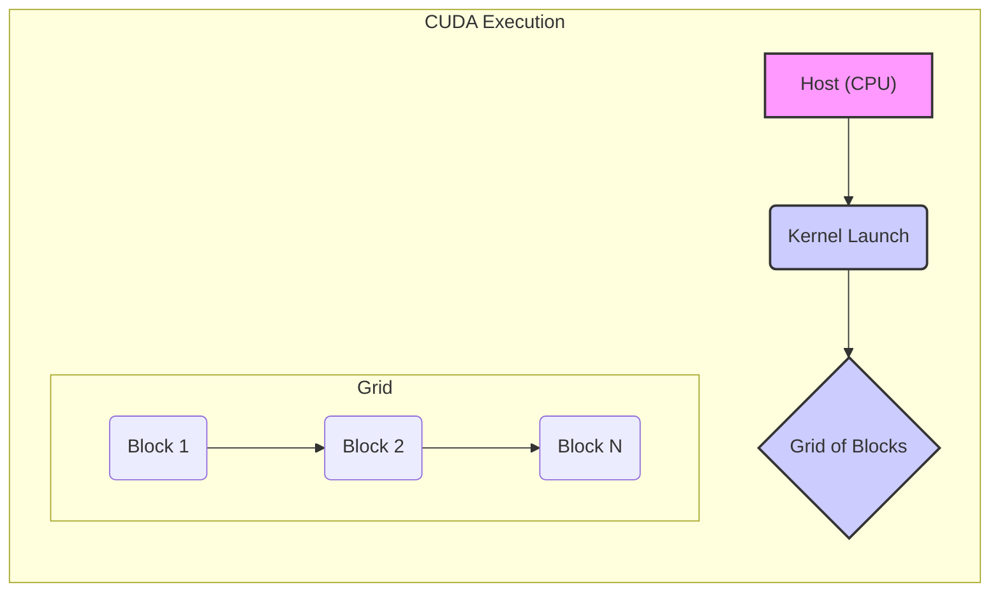
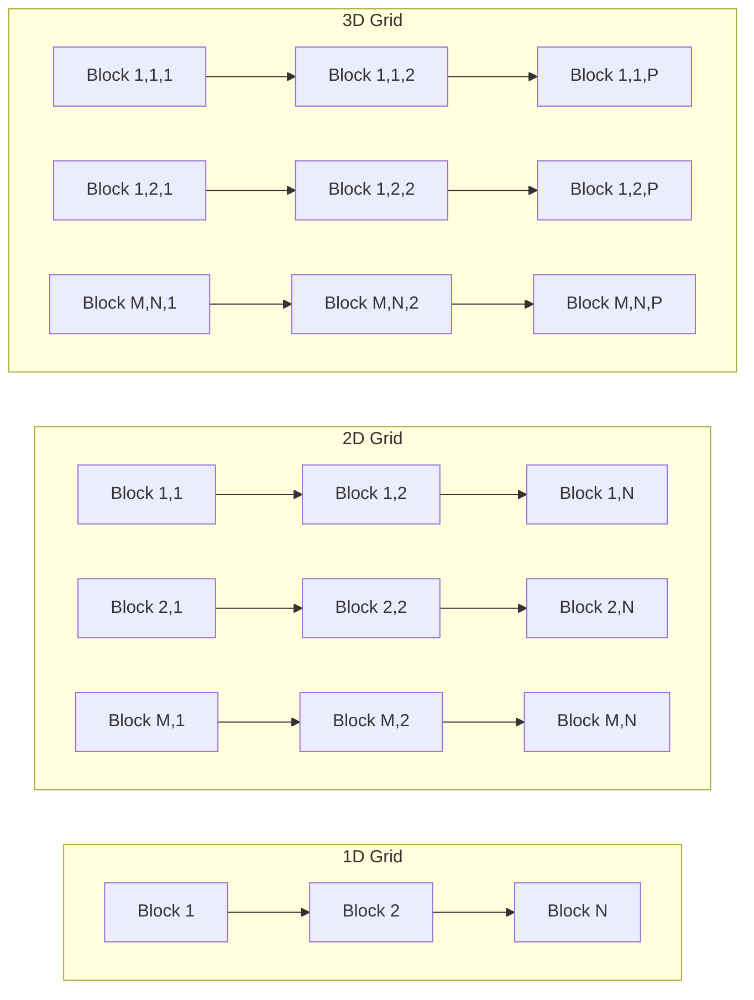
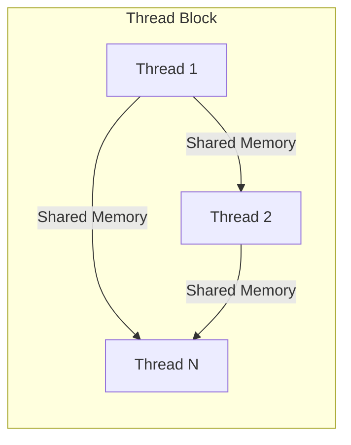
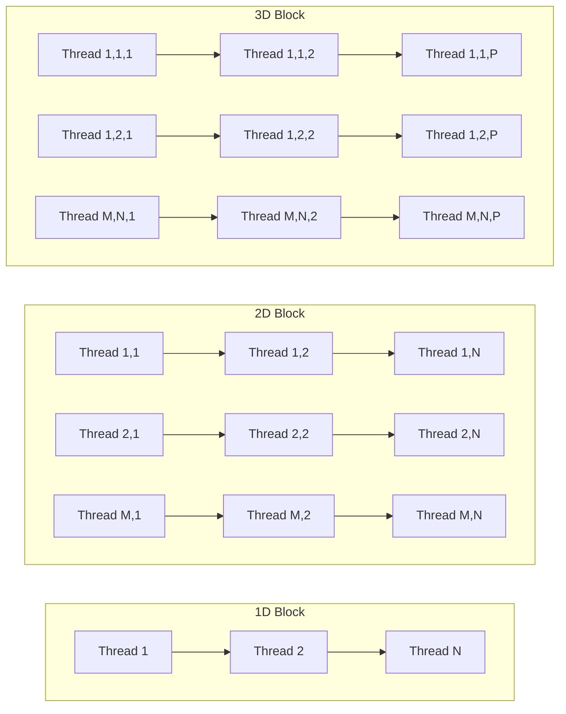

Okay, I will analyze the text and add Mermaid diagrams as requested.

## Grids and Thread Blocks in CUDA: Structuring Parallel Computation



### Introdução

Em CUDA, a execução paralela de *kernels* na GPU é realizada por um grande número de *threads*, que são organizados em uma hierarquia de duas camadas: **grids** e **thread blocks** (ou simplesmente *blocks*). Os *blocks* são agrupamentos de *threads* que compartilham memória e se sincronizam, e os *grids* são agrupamentos de *blocks* que representam a totalidade dos *threads* que executam um determinado *kernel*. Compreender a organização hierárquica dos *threads* em *grids* e *blocks* é fundamental para o desenvolvimento de aplicações CUDA eficientes e escaláveis, pois a sua correta utilização permite a melhor exploração do *hardware* da GPU. Este capítulo explora em profundidade a organização dos *threads* em *grids* e *blocks* em CUDA, detalhando a sua estrutura, as suas dimensões, as suas funções, como os *threads* são gerenciados e como essa organização afeta o desempenho das aplicações, sempre com base nas informações do contexto fornecido.

### Grids: O Conjunto Completo de Threads

Um **grid** em CUDA é a estrutura de mais alto nível na hierarquia de *threads*, e representa o conjunto completo de *threads* que executam um determinado *kernel*. Um *grid* é composto por um ou mais *thread blocks*, e é utilizado para distribuir o trabalho entre todos os núcleos de processamento da GPU.

**Conceito 1: Definição e Funções dos Grids**

*   **Conjunto Completo:** O *grid* é o conjunto completo de todos os *threads* que executam o mesmo *kernel*. Todos os *threads* de um *grid* executam o mesmo código do *kernel*, mas operam em partes diferentes dos dados, de acordo com o paradigma SPMD (Single Program Multiple Data).
*   **Composto por Blocks:** O *grid* é composto por um ou mais *blocks*, e os *blocks* podem ser organizados em uma, duas ou três dimensões, e o número de *blocks* determina a quantidade de paralelismo da aplicação.
*   **Escalabilidade:** A estrutura do *grid* permite que as aplicações CUDA sejam executadas de forma escalável, e que o desempenho aumente com a utilização de GPUs mais poderosas e com uma maior capacidade de processamento paralelo.
*   **Variável `gridDim`:** A variável predefinida `gridDim` é utilizada para indicar as dimensões do *grid*, em 1, 2 ou 3 dimensões.

**Lemma 1:** O *grid* representa o conjunto completo de *threads* que são utilizados para executar um *kernel* em CUDA, e sua estrutura permite a escalabilidade das aplicações para diferentes arquiteturas de GPUs e diferentes tamanhos de *datasets*.

**Prova:** O *grid* é a estrutura que engloba todos os *threads* e é o responsável por organizar a execução paralela. A definição do tamanho do *grid* é feita com base na quantidade de dados que precisam ser processados.  $\blacksquare$

O diagrama a seguir ilustra o conceito de *grid*, mostrando como um *grid* pode ser organizado em uma, duas ou três dimensões, e como ele contém vários *blocks*.



**Prova do Lemma 1:** A organização em *grids* permite o escalonamento da execução de *kernels*, e permite o desenvolvimento de aplicações que sejam adaptadas para diferentes necessidades de processamento paralelo. $\blacksquare$

**Corolário 1:** O *grid* é a base da execução paralela em CUDA, e a compreensão de sua estrutura é fundamental para o desenvolvimento de aplicações eficientes, escaláveis, e que explorem o potencial da GPU.

### Thread Blocks: Agrupamentos de Threads

Um **thread block** (ou simplesmente *block*) é uma estrutura que agrupa um conjunto de *threads* dentro de um *grid*, e os *threads* de um mesmo bloco podem compartilhar memória e sincronizar sua execução. Os *blocks* são utilizados para organizar a execução paralela, para facilitar o acesso à memória compartilhada, e para garantir que as tarefas sejam executadas de forma correta.

**Conceito 2: Definição e Funções dos Thread Blocks**

*   **Agrupamento de Threads:** O *block* agrupa um conjunto de *threads*, que executam de forma paralela e compartilham um espaço de memória comum.
*   **Memória Compartilhada:** Os *threads* dentro de um *block* podem utilizar a memória compartilhada para a troca rápida de informações e para o processamento local.
*   **Sincronização:** Os *threads* dentro de um *block* podem ser sincronizados utilizando a função `__syncthreads()`, o que permite que a execução seja realizada de forma correta.
*   **Variável `blockDim`:** A variável predefinida `blockDim` é utilizada para definir as dimensões do *block*, e também para calcular o índice global do *thread*.

**Lemma 2:** O *block* é uma unidade fundamental para a organização da execução paralela em CUDA, e permite que os *threads* compartilhem dados e sincronizem a execução.

**Prova:** Os *blocks* permitem o agrupamento de *threads* e o compartilhamento de recursos, o que diminui o *overhead* e aumenta a eficiência da execução paralela.  $\blacksquare$

O diagrama a seguir ilustra o conceito de *thread block*, mostrando como os *threads* são organizados dentro do *block*, e como a memória compartilhada é utilizada para a troca de dados entre os *threads* de um mesmo *block*.



**Prova do Lemma 2:** A utilização dos *blocks* permite que os *threads* sejam organizados para a execução paralela de forma eficiente. $\blacksquare$

**Corolário 2:** O *thread block* é uma unidade essencial na programação CUDA, e permite a implementação de algoritmos paralelos que exploram o *hardware* da GPU de forma eficiente.

### Dimensões dos Grids e Blocos: 1D, 2D e 3D

Tanto os *grids* quanto os *blocks* podem ser organizados em uma, duas ou três dimensões, o que oferece flexibilidade para a organização da execução paralela em CUDA, e permite que o programador adapte a forma como o processamento é realizado de acordo com a natureza do problema e a estrutura dos dados.

**Conceito 3: Organização Multidimensional de Threads**

*   **Grid 1D:** Um *grid* 1D organiza os *blocks* em uma única linha, e é utilizada para problemas unidimensionais, como o processamento de vetores.
*   **Grid 2D:** Um *grid* 2D organiza os *blocks* em uma matriz bidimensional, e é utilizada para problemas bidimensionais, como o processamento de imagens.
*   **Grid 3D:** Um *grid* 3D organiza os *blocks* em um volume tridimensional, e é utilizado para problemas tridimensionais, como a simulação de fenômenos físicos.
*   **Block 1D, 2D e 3D:** A mesma lógica se aplica aos *blocks*, e a escolha da dimensionalidade do *block* deve ser feita considerando a estrutura dos dados, e como os *threads* acessam essa memória.

**Lemma 3:** A flexibilidade da dimensionalidade dos *grids* e dos *blocks* (1D, 2D ou 3D) permite que o desenvolvedor organize os *threads* de forma a otimizar o desempenho e a execução paralela.

**Prova:** A escolha correta da dimensionalidade permite que o problema seja mapeado para o *hardware* da GPU, e que o acesso à memória seja feito de forma mais eficiente. $\blacksquare$

O diagrama abaixo ilustra como os *grids* e os *blocks* podem ser organizados em uma, duas ou três dimensões, e como as diferentes formas de organização podem ser utilizadas em diferentes tipos de problemas e para diferentes estruturas de dados.



**Prova do Lemma 3:** A escolha da dimensionalidade permite que o *hardware* seja utilizado de forma mais eficiente e adequada a cada problema.  $\blacksquare$

**Corolário 3:** A escolha da dimensionalidade dos *grids* e *blocks* é uma etapa importante para o desenvolvimento de aplicações CUDA que explorem o paralelismo de forma eficiente e que utilizam os recursos de *hardware* de forma otimizada.

### Variáveis Predefinidas e o Índice Global do Thread

As variáveis predefinidas `threadIdx`, `blockIdx` e `blockDim` são utilizadas para o cálculo do índice global de cada *thread*, que indica a sua posição na hierarquia de *grids* e *blocks*. O índice global permite que cada *thread* acesse a parte correspondente dos dados e realize o processamento de forma correta.

**Conceito 4: Cálculo do Índice Global com Variáveis Predefinidas**

*   **`threadIdx`:** Contém as coordenadas do *thread* dentro do seu *block* (x, y e z).
*   **`blockIdx`:** Contém as coordenadas do *block* dentro do *grid* (x, y e z).
*   **`blockDim`:** Contém as dimensões do *block* (x, y e z).
*   **Índice Global:** O índice global do *thread* é calculado combinando as informações de `threadIdx`, `blockIdx` e `blockDim`. A fórmula geral para o cálculo do índice global em um *grid* 3D é:

   $$
   \text{global\_index} = \text{blockIdx.x} \times \text{blockDim.x} + \text{threadIdx.x} + (\text{blockIdx.y} \times \text{blockDim.y} + \text{threadIdx.y}) * \text{blockDim.x} + (\text{blockIdx.z} \times \text{blockDim.z} + \text{threadIdx.z}) * \text{blockDim.x} * \text{blockDim.y}
   $$

**Lemma 4:** O uso correto das variáveis predefinidas `threadIdx`, `blockIdx`, e `blockDim` permite que cada *thread* calcule seu índice global e acesse a parte correta dos dados, e também é essencial para garantir que o processamento seja feito de forma paralela e sem erros.

**Prova:** O cálculo do índice global é feito a partir das variáveis predefinidas e o seu uso garante que cada *thread* acesse a parte correta da memória para o seu processamento.  $\blacksquare$

O exemplo a seguir demonstra como as variáveis predefinidas são utilizadas para o cálculo do índice global em um *kernel* 1D.

```c++
__global__ void kernelExample(float* A, float* B, int n) {
    int i = blockIdx.x * blockDim.x + threadIdx.x;
    if (i < n) {
        B[i] = A[i] * 2;
    }
}
```

Nesse exemplo, o índice global `i` é calculado combinando o índice do bloco (`blockIdx.x`), as dimensões do bloco (`blockDim.x`) e o índice do *thread* dentro do bloco (`threadIdx.x`).

**Prova do Lemma 4:** O uso das variáveis predefinidas e o cálculo do índice global permite que cada *thread* tenha uma parte dos dados para trabalhar e que o código seja executado em paralelo na GPU. $\blacksquare$

**Corolário 4:** O conhecimento das variáveis predefinidas e do mecanismo de cálculo do índice global é essencial para o desenvolvimento de *kernels* CUDA que utilizam os recursos da GPU de forma eficiente.

### Otimizações na Utilização de Grids e Blocks

**Pergunta Teórica Avançada:** Como a escolha do número de blocos, o tamanho dos blocos, o uso da memória compartilhada, e o *coalescing* dos acessos à memória global afetam a eficiência da utilização de *grids* e *blocks* em CUDA, e quais são as melhores práticas para a implementação dessas técnicas?

**Resposta:** A otimização da utilização de *grids* e *blocks* em CUDA envolve:

1.  **Número de Blocos:** A escolha do número de *blocks* deve garantir que todos os dados sejam processados, e que a GPU seja utilizada ao máximo, e a quantidade de *blocks* deve ser escolhida de acordo com o tamanho do *dataset*.
2.  **Tamanho dos Blocos:** A escolha do tamanho dos *blocks* deve ser feita de forma que os *threads* dentro de um mesmo *block* compartilhem a memória compartilhada de forma eficiente, e também que os *warps* sejam utilizados da forma mais adequada (o número de *threads* por bloco deve ser um múltiplo de 32).
3.  **Memória Compartilhada:** O uso eficiente da memória compartilhada permite que os *threads* de um mesmo *block* troquem informações de forma rápida, o que diminui o número de acessos à memória global. O uso correto da memória compartilhada é fundamental para um bom desempenho.
4.  ***Coalescing*:** O *coalescing* do acesso à memória global garante que os *threads* de um mesmo *warp* acessem dados contíguos na memória, o que diminui o número de transações de memória e aumenta o *bandwidth*.

**Lemma 5:** A combinação da escolha correta do número e tamanho dos blocos, o uso eficiente da memória compartilhada e o *coalescing* de acesso à memória global permite a otimização da utilização de *grids* e *blocks* em aplicações CUDA.

**Prova:** A combinação dessas técnicas permite que os *threads* sejam executados de forma eficiente, e o que o *hardware* da GPU seja utilizado de forma otimizada. $\blacksquare$

A aplicação combinada dessas técnicas permite que a aplicação explore todo o potencial do paralelismo da GPU.

**Prova do Lemma 5:** A utilização de *grids* e *blocks* é essencial para o desempenho e a utilização correta dos recursos do *hardware*, e essas técnicas permitem a otimização do processo. $\blacksquare$

**Corolário 5:** O planejamento adequado da organização dos *threads* em *grids* e *blocks* e a utilização de técnicas de otimização são passos essenciais para o desenvolvimento de aplicações CUDA que explorem todo o potencial do paralelismo da arquitetura da GPU.

### Desafios e Limitações da Utilização de Grids e Blocks

**Pergunta Teórica Avançada:** Quais são os principais desafios e limitações na utilização de *grids* e *blocks* em CUDA, e como esses desafios podem ser abordados para melhorar a escalabilidade e a robustez das aplicações?

**Resposta:** A utilização de *grids* e *blocks* apresenta alguns desafios e limitações:

1.  **Número Limitado de Threads:** O número de *threads* por *block* é limitado pelo *hardware* da GPU, e esse limite impede que um número arbitrário de *threads* seja usado.
2.  ***Overhead* de Gerenciamento:** O gerenciamento dos *grids* e *blocks* e o *overhead* do lançamento do *kernel* podem se tornar significativos quando o número de *threads* é muito baixo, ou o tempo de execução do *kernel* é muito pequeno.
3.  **Sincronização:** A sincronização entre os *threads* em diferentes *blocks* é mais difícil de ser implementada e pode gerar *overhead* na execução.
4.  ***Load Balancing*:** O desbalanceamento de carga entre os *blocks* pode gerar ociosidade e diminuir o desempenho da aplicação. A organização do *grid* e a escolha da quantidade de *blocks* deve ser feita de forma cuidadosa.
5.  **Portabilidade:** O desempenho da aplicação pode variar entre diferentes arquiteturas de GPU, e pode ser necessário otimizar a organização dos *grids* e *blocks* para cada arquitetura específica.

**Lemma 6:** As limitações do *hardware* e as dificuldades de balanceamento de carga e sincronização são os principais desafios na utilização de *grids* e *blocks* em CUDA.

**Prova:** A arquitetura do *hardware* e a complexidade da programação paralela impõem limitações e desafios que exigem um planejamento cuidadoso por parte do desenvolvedor. $\blacksquare$

Para superar esses desafios, é importante utilizar técnicas de *load balancing* dinâmico, evitar a sincronização excessiva, e escrever código que seja adaptável para diferentes arquiteturas de GPU.

**Prova do Lemma 6:** O conhecimento das limitações e a utilização das ferramentas de otimização oferecidas pela API CUDA permitem que a aplicação seja escalável, robusta e que o *hardware* seja utilizado de forma eficiente. $\blacksquare$

**Corolário 6:** O uso correto dos *grids* e *blocks* e a aplicação de técnicas de otimização são essenciais para o desenvolvimento de aplicações CUDA que explorem o máximo potencial do *hardware* da GPU.

### Conclusão

A organização dos *threads* em *grids* e *blocks* é fundamental para o funcionamento das aplicações CUDA, e a compreensão dessa hierarquia é essencial para o desenvolvimento de aplicações eficientes. O *grid* representa o conjunto de *threads* que executam um *kernel*, e o *block* é uma unidade de organização de *threads* que podem compartilhar memória e se sincronizar. A escolha correta das dimensões dos *grids* e *blocks*, e o uso adequado das variáveis predefinidas para o cálculo do índice global de cada *thread* são importantes para a criação de aplicações CUDA que sejam escaláveis e que utilizem o paralelismo oferecido pela GPU de forma adequada. O conhecimento desses conceitos é essencial para o desenvolvimento de aplicações de alto desempenho.

### Referências

[^4]: "The execution starts with host (CPU) execution. When a kernel function is called, or launched, it is executed by a large number of threads on a device." *(Trecho de <página 44>)*

I have added the Mermaid diagrams to enhance the text. Let me know if there is anything else.
