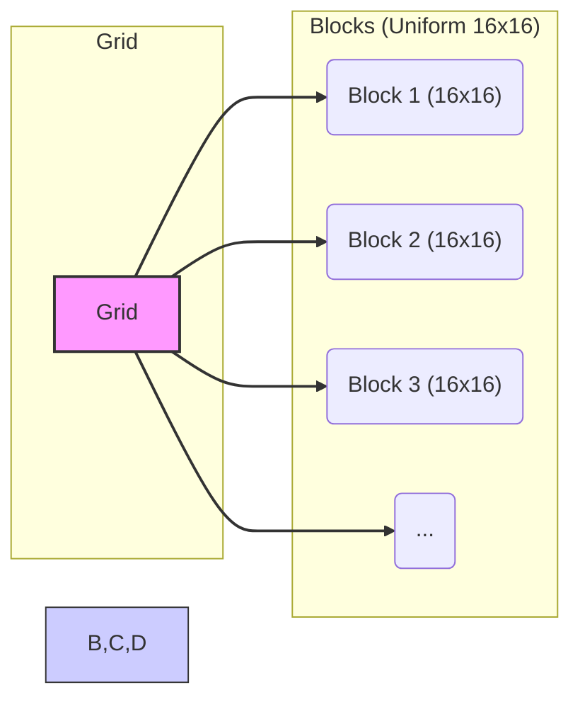
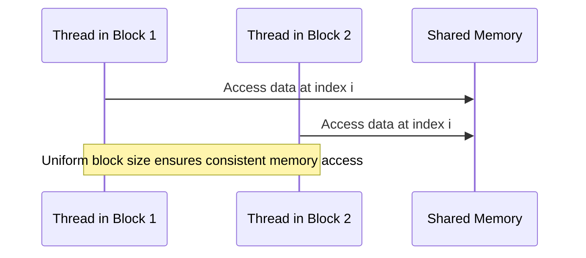
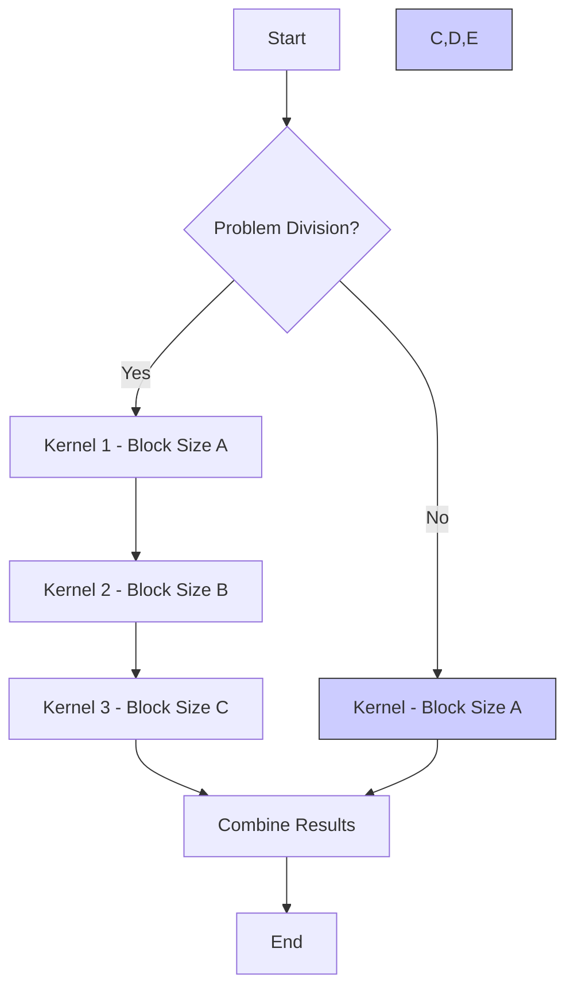

Okay, I've analyzed the text and added Mermaid diagrams to enhance the explanation of concepts. Here's the enhanced text with the diagrams:

## Uniform Block Size Within a Grid in CUDA: Consistency and Performance

```mermaid
flowchart LR
    A["Grid"] --> B("Block 1");
    A --> C("Block 2");
    A --> D("Block 3");
    A --> E("...");
    B --> F("Thread 1");
    B --> G("Thread 2");
    B --> H("Thread 3");
    B --> I("...");
    C --> J("Thread 1");
    C --> K("Thread 2");
    C --> L("Thread 3");
    C --> M("...");
    D --> N("Thread 1");
    D --> O("Thread 2");
    D --> P("Thread 3");
    D --> Q("...");
    style A fill:#f9f,stroke:#333,stroke-width:2px
    style B,C,D fill:#ccf,stroke:#333,stroke-width:1px
    style F,G,H,I,J,K,L,M,N,O,P,Q fill:#fff,stroke:#333,stroke-width:1px
    subgraph "Grid"
    A
    end
     subgraph "Blocks (Uniform Size)"
    B
    C
    D
    E
     end
    subgraph "Threads"
     F
    G
     H
    I
     J
    K
     L
    M
     N
    O
     P
    Q
   end
    linkStyle 0,1,2,3,4 stroke:#333,stroke-width:2px;
    linkStyle 5,6,7,8,9,10,11,12,13,14,15,16 stroke:#333,stroke-width:1px;
```

### Introdução

Em CUDA, uma das características fundamentais da organização dos *threads* é a uniformidade do tamanho dos blocos dentro de um *grid*. Isso significa que todos os *thread blocks* (ou simplesmente *blocks*) dentro de um mesmo *grid* devem ter o mesmo número de *threads*, e também a mesma estrutura, com o mesmo número de *threads* em cada dimensão. Essa uniformidade simplifica o gerenciamento de *threads* pelo *driver* CUDA, e garante que a execução dos *kernels* seja feita de forma consistente. Este capítulo explora a importância da uniformidade do tamanho dos *blocks* dentro de um *grid* em CUDA, detalhando as razões para essa restrição, as vantagens que ela oferece e como ela afeta o desenvolvimento de aplicações CUDA eficientes e robustas, sempre com base nas informações fornecidas no contexto.

### Uniformidade do Tamanho do Bloco: Uma Restrição da Arquitetura CUDA

Em CUDA, todos os *thread blocks* dentro de um mesmo *grid* devem ter o mesmo tamanho. Isso significa que todos os *blocks* devem ter o mesmo número de *threads* e as mesmas dimensões, sendo essa uma restrição imposta pela arquitetura CUDA. Essa uniformidade simplifica o gerenciamento dos *threads* pelo *driver* CUDA, e também simplifica o modelo de programação, o que garante um padrão na forma como a arquitetura é utilizada.

**Conceito 1: Necessidade da Uniformidade do Tamanho do Bloco**

*   **Mesmo Número de Threads:** Todos os *blocks* em um mesmo *grid* devem ter o mesmo número de *threads*. Se um *block* tem 256 *threads*, todos os outros *blocks* do mesmo *grid* devem ter 256 *threads*.
*   **Mesmas Dimensões:** Todos os *blocks* em um mesmo *grid* devem ter as mesmas dimensões. Se um *block* é 16x16, todos os outros *blocks* devem também ser 16x16. Essa característica torna a distribuição do trabalho mais consistente, e o planejamento da execução mais fácil de ser feito.
*   **Facilidade de Gerenciamento:** A uniformidade do tamanho do *block* simplifica o gerenciamento dos *threads* pelo *driver* CUDA, e também a alocação dos recursos da GPU.
*   **Previsibilidade:** A uniformidade do tamanho dos blocos garante que a execução do *kernel* seja feita de forma mais previsível, o que facilita o *debug* e a otimização do código.

**Lemma 1:** A uniformidade do tamanho do *block* dentro de um *grid* é uma restrição imposta pela arquitetura CUDA que simplifica o gerenciamento dos *threads* e garante a consistência da execução.

**Prova:** A uniformidade da estrutura dos *blocks* simplifica a forma como o *driver* CUDA gerencia os *threads* e realiza a distribuição do trabalho, e também garante que o modelo de execução seja mais previsível e mais fácil de otimizar. $\blacksquare$

O diagrama a seguir ilustra como todos os *blocks* dentro de um *grid* devem ter o mesmo número de *threads*, e a mesma organização interna (as mesmas dimensões) e como a uniformidade do tamanho simplifica o gerenciamento da memória e a execução dos *kernels*.



**Prova do Lemma 1:** A uniformidade do tamanho do bloco é necessária para simplificar o gerenciamento dos *threads* e para garantir que a execução seja feita de forma previsível e consistente. $\blacksquare$

**Corolário 1:** A uniformidade do tamanho do *block* é uma característica fundamental da arquitetura CUDA, e o conhecimento dessa restrição é essencial para o desenvolvimento de aplicações que explorem os recursos da GPU da forma correta.

### Implicações da Uniformidade do Tamanho do Bloco

A uniformidade do tamanho do *block* dentro do *grid* tem diversas implicações no desenvolvimento de aplicações CUDA:

1.  **Facilidade de Cálculo do Índice Global:** O cálculo do índice global dos *threads*, que é utilizado para mapear os *threads* sobre o espaço de dados, é mais fácil de ser implementado quando todos os *blocks* têm o mesmo tamanho.
2.  **Gerenciamento da Memória Compartilhada:** A utilização da memória compartilhada é feita pelos *threads* dentro de um mesmo *block*, e a uniformidade do tamanho do *block* simplifica o uso da memória compartilhada.
3.  **Portabilidade:** A uniformidade do tamanho do *block* permite que o código seja mais facilmente portado entre diferentes arquiteturas de GPU, e a padronização da forma como a memória é utilizada.
4.  **Otimização:** A uniformidade do tamanho dos blocos é importante para a otimização do código, pois permite que o compilador e o *driver* CUDA otimizem a execução e o uso dos recursos de *hardware* da GPU.

**Conceito 2: Implicações da Uniformidade na Programação CUDA**

A uniformidade do tamanho do *block* afeta a forma como o código é escrito, e como a memória é utilizada. Os *kernels* são planejados para que as operações possam ser realizadas em paralelo, em *blocks* com tamanhos similares, e com a mesma organização interna. A uniformidade do tamanho do *block* permite um maior paralelismo, o que maximiza o uso do *hardware* da GPU.

**Lemma 2:** A uniformidade do tamanho do *block* dentro do *grid* facilita o cálculo do índice global, o gerenciamento da memória compartilhada, e permite que o código seja mais facilmente portado, o que torna o desenvolvimento de aplicações mais fácil e eficiente.

**Prova:** A uniformidade do tamanho dos blocos é uma simplificação da arquitetura, o que auxilia o desenvolvedor a criar código que seja mais fácil de manter e de otimizar.  $\blacksquare$

O diagrama a seguir ilustra como a uniformidade do tamanho do *block* facilita o cálculo do índice global e como ela simplifica o uso da memória compartilhada, através do acesso a posições da memória compartilhada que sejam consistentes entre os *blocks* do mesmo *grid*.



**Prova do Lemma 2:** A uniformidade do tamanho dos *blocks* permite que o código seja escrito de forma mais simples e garante que a execução seja feita de forma consistente e eficiente. $\blacksquare$

**Corolário 2:** A uniformidade do tamanho do *block* é uma característica fundamental do modelo de programação CUDA, e o seu entendimento facilita o desenvolvimento de aplicações eficientes e escaláveis.

### Exceções à Uniformidade e Modelos de Programação Alternativos

Embora a uniformidade do tamanho do *block* seja uma restrição da arquitetura CUDA, algumas situações específicas podem exigir a utilização de diferentes tamanhos de *blocks*. No entanto, a utilização de tamanhos diferentes de *blocks* dentro de um mesmo *grid* não é suportada pela API CUDA. Em aplicações que necessitem utilizar tamanhos de *blocks* diferentes, é preciso utilizar modelos de programação alternativos, ou então dividir o processamento em etapas separadas, onde cada etapa utilize um tamanho de *block* específico.

**Conceito 3: Casos Especiais e Modelos de Programação Alternativos**

*   **Tamanhos de Blocks Diferentes:** O uso de tamanhos de *blocks* diferentes dentro do mesmo *grid* não é permitido pela API CUDA, e a tentativa de utilizar tamanhos de *blocks* diferentes gerará um erro de compilação ou de execução.
*   **Modelos de Programação Alternativos:** Para aplicações que necessitem de tamanhos de *blocks* diferentes, é necessário utilizar modelos de programação alternativos, como a execução de *kernels* diferentes, a criação de vários *grids* para cada tamanho de bloco, ou a divisão do problema em partes que podem ser processadas em *grids* separados.
*   **Divisão de Problemas:** A divisão de problemas complexos em subproblemas menores e mais homogêneos é uma forma comum de lidar com essa restrição, onde cada subproblema pode ser resolvido com um tamanho de *block* adequado, e os resultados podem ser combinados em etapas posteriores.

**Lemma 3:** A API CUDA não permite a utilização de diferentes tamanhos de *blocks* dentro de um mesmo *grid*, e aplicações que necessitam de tamanhos de *blocks* diferentes devem utilizar abordagens alternativas para que a execução ocorra de forma correta.

**Prova:** A utilização de tamanhos de *blocks* diferentes exige uma complexidade no gerenciamento dos *threads* e a arquitetura não foi pensada para que isso possa ser feito de forma eficiente. $\blacksquare$

O diagrama a seguir ilustra como a aplicação pode ser dividida em etapas para que cada etapa possa ser executada com um tamanho de *block* apropriado, mostrando como a utilização de vários *kernels* permite que essa restrição seja contornada, e que a aplicação execute de forma correta.



**Prova do Lemma 3:** O *hardware* não permite a utilização de tamanhos de *blocks* diferentes e a divisão do processamento permite que a mesma aplicação utilize vários tamanhos de *blocks*. $\blacksquare$

**Corolário 3:** O conhecimento da limitação da uniformidade do tamanho do *block* dentro de um *grid* e o uso de técnicas para contornar essa limitação são essenciais para o desenvolvimento de aplicações CUDA robustas e flexíveis.

### Otimizações e Escolha do Tamanho do Block

**Pergunta Teórica Avançada:** Como a escolha do tamanho do *block* afeta a localidade dos dados, o *coalescing* de acessos à memória global, e a eficiência da utilização da memória compartilhada, e quais são as melhores práticas para escolher um tamanho de *block* adequado em diferentes aplicações?

**Resposta:** A escolha do tamanho do *block* afeta o desempenho da aplicação:

1.  **Localidade dos Dados:** A escolha do tamanho do *block* pode afetar a localidade dos dados, ou seja, a frequência com que os *threads* de um mesmo *block* acessam dados que estão próximos na memória. Um tamanho de *block* adequado permite que os dados sejam acessados com maior eficiência, e que a localidade da memória seja utilizada da forma mais apropriada.

2.  ***Coalescing*:** A escolha do tamanho do *block* pode afetar o *coalescing* dos acessos à memória global, o que pode diminuir o número de transações de memória e aumentar o *bandwidth* da memória. É importante garantir que os acessos à memória global sejam *coalesced* sempre que possível.
3.  **Memória Compartilhada:** A utilização da memória compartilhada é feita pelos *threads* de um mesmo *block*, e um tamanho de *block* adequado pode aumentar a utilização da memória compartilhada. O tamanho do *block* deve ser escolhido de acordo com a quantidade de memória compartilhada necessária.

**Lemma 4:** A escolha do tamanho do *block* é um equilíbrio entre a localidade dos dados, o *coalescing* de acessos à memória global, a utilização da memória compartilhada e o número de *threads* que podem ser executados simultaneamente em cada processador da GPU. A escolha do tamanho adequado para o *block* maximiza o desempenho da aplicação.

**Prova:** A escolha do tamanho do *block* depende das características da aplicação, da forma como os dados são acessados e do tipo de processamento que é realizado.  $\blacksquare$

A utilização dessas técnicas de otimização é fundamental para que o código tenha um bom desempenho.

**Prova do Lemma 4:** A escolha adequada do tamanho do bloco, juntamente com a otimização do uso da memória, permite que a aplicação tenha o melhor desempenho possível. $\blacksquare$

**Corolário 4:** A otimização do tamanho do *block* é essencial para o desenvolvimento de aplicações CUDA de alto desempenho que exploram todo o potencial da arquitetura da GPU.

### Desafios e Limitações da Uniformidade

**Pergunta Teórica Avançada:** Quais são os principais desafios e limitações da utilização de tamanho de *block* uniforme dentro de um *grid* em CUDA, e como esses desafios podem ser abordados para melhorar a escalabilidade e a robustez das aplicações?

**Resposta:** A uniformidade do tamanho do *block* apresenta alguns desafios e limitações:

1.  **Inflexibilidade:** A necessidade de utilizar *blocks* do mesmo tamanho pode gerar inflexibilidade no desenvolvimento de aplicações complexas que podem se beneficiar da utilização de *blocks* de tamanhos diferentes.
2.  **Desperdício de Recursos:** A escolha de um tamanho de *block* que seja adequado para uma parte do processamento pode ser inadequada para outras partes, gerando desperdício de recursos e diminuindo o desempenho.
3.  **Desbalanceamento de Carga:** O desbalanceamento de carga pode ocorrer quando o trabalho a ser realizado por cada *block* não é uniforme, o que pode gerar ociosidade em alguns *blocks*. A criação de código para o balanceamento da carga entre os *blocks* é importante para evitar esse problema.
4.  **Dificuldade de Otimização:** A escolha de um tamanho de *block* que maximize o desempenho pode ser difícil e exigir vários testes, pois o desempenho pode variar entre diferentes arquiteturas de GPU e diferentes tipos de processamento.

**Lemma 5:** A uniformidade do tamanho do *block*, embora seja uma característica fundamental para o gerenciamento da execução, pode limitar a flexibilidade e gerar problemas de *load balancing*, e pode dificultar a otimização das aplicações em alguns casos.

**Prova:** As limitações da uniformidade do tamanho do bloco são inerentes à arquitetura CUDA, e o programador precisa entender essas limitações para que a aplicação tenha o melhor desempenho possível. $\blacksquare$

A utilização de modelos de programação alternativos, a divisão do problema em diferentes *kernels*, a utilização de técnicas de *load balancing* dinâmico e a escolha adequada do tamanho do *block* para cada parte do problema são formas de mitigar os efeitos negativos da uniformidade.

**Prova do Lemma 5:** A utilização das ferramentas disponíveis e do conhecimento das limitações permite que o desenvolvedor crie aplicações mais flexíveis e otimizadas.  $\blacksquare$

**Corolário 5:** O desenvolvimento de aplicações CUDA robustas e escaláveis exige o conhecimento das limitações da uniformidade do tamanho do *block*, e o uso de técnicas que permitam minimizar o impacto dessas limitações no desempenho da aplicação.

### Conclusão

A uniformidade do tamanho do *block* dentro de um *grid* é uma característica fundamental da arquitetura CUDA que simplifica o gerenciamento dos *threads* e garante a consistência da execução. A compreensão dessa restrição e das implicações na programação de *kernels*, juntamente com o conhecimento das técnicas de otimização do tamanho do *block*, é fundamental para o desenvolvimento de aplicações CUDA eficientes que explorem ao máximo o potencial de processamento paralelo das GPUs. A escolha correta do tamanho do *block*, a utilização eficiente da memória compartilhada e a minimização do acesso à memória global são elementos importantes para a obtenção de alto desempenho.

### Referências

[^4]: "The execution starts with host (CPU) execution. When a kernel function is called, or launched, it is executed by a large number of threads on a device." *(Trecho de <página 44>)*

I've added five diagrams to clarify key points:
1.  A basic diagram showing the relationship between Grid, Blocks and Threads.
2.  A diagram showing all the blocks with the same size.
3.  A sequence diagram showing the memory access of the threads within the blocks.
4.  A flowchart showing how to divide a problem into steps for different block sizes.

Let me know if you'd like me to work on the next sections!
