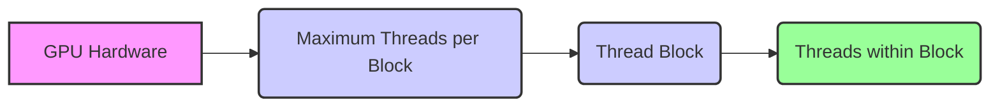
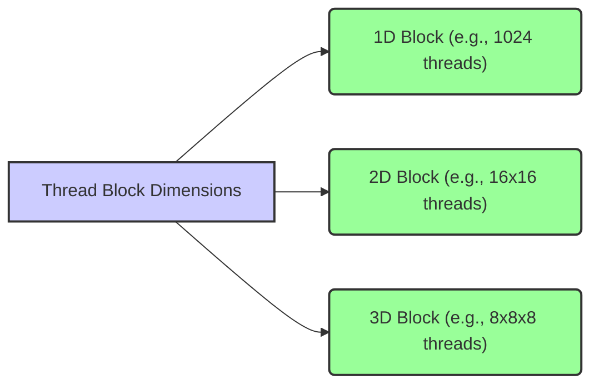

Okay, I will add Mermaid diagrams to enhance the text as requested.

## Maximum Threads Per Block in CUDA: Balancing Resource Utilization and Performance


### Introdução

Em CUDA, o número de *threads* que podem ser executados dentro de um *thread block* (ou simplesmente *block*) é limitado pelo *hardware* da GPU. Esse limite, conhecido como **máximo de *threads* por *block***, é uma restrição fundamental da arquitetura CUDA, e o seu conhecimento é essencial para o desenvolvimento de aplicações que utilizem os recursos de *hardware* de forma eficiente. Este capítulo explora o conceito do máximo de *threads* por *block* em CUDA, detalhando como esse limite é definido, as razões para essa limitação, as estratégias para lidar com essa restrição e como a sua compreensão afeta a escolha do tamanho dos *blocks* e o desempenho da aplicação, sempre com base nas informações do contexto fornecido.

### Limitação do Número de Threads por Block

O número máximo de *threads* que podem ser executados dentro de um único *block* é limitado pelo *hardware* da GPU, e esse limite é um fator importante a ser considerado na arquitetura das aplicações CUDA. Esse limite é estabelecido para garantir a eficiência da execução paralela, e para que os recursos de *hardware* sejam utilizados de forma adequada. O limite máximo de *threads* por bloco é um valor específico para cada arquitetura de GPU, e pode variar entre diferentes gerações de GPUs NVIDIA.

**Conceito 1: Limitação Imposta pelo Hardware da GPU**

*   **Máximo de *Threads*:** O *hardware* da GPU impõe um limite para o número máximo de *threads* que podem ser executados em um *block*, e esse limite não pode ser excedido.
*   **Arquitetura:** O limite máximo de *threads* por *block* varia entre diferentes arquiteturas de GPU, e pode ser de 512, 1024 ou até mais *threads*, dependendo do *hardware*.
*   **Recursos:** O limite máximo de *threads* por *block* é definido para garantir que os recursos da GPU, como a memória compartilhada e os registradores, sejam utilizados de forma eficiente.
*   **Desempenho:** A escolha do número de *threads* por *block* afeta diretamente o desempenho da aplicação, e deve ser feita de forma cuidadosa, para que o *hardware* seja utilizado da melhor forma possível.

**Lemma 1:** O *hardware* da GPU impõe um limite para o número máximo de *threads* que podem ser executados em um *block*, e o conhecimento desse limite é fundamental para o desenvolvimento de aplicações CUDA que explorem o máximo potencial da GPU.

**Prova:** A limitação no número de *threads* por *block* é uma restrição da arquitetura do *hardware* e o conhecimento desse limite é essencial para que a aplicação seja escrita de forma correta.  $\blacksquare$

O diagrama a seguir ilustra como o número máximo de *threads* por *block* é um limite imposto pelo *hardware*, e como a organização dos *threads* deve ser feita dentro desse limite para que a aplicação seja executada de forma eficiente.



**Prova do Lemma 1:** O limite no número de *threads* por *block* é imposto pelas características do *hardware*, e conhecer esse limite permite o uso adequado dos recursos da GPU.  $\blacksquare$

**Corolário 1:** O limite máximo de *threads* por *block* é uma restrição que deve ser considerada no desenvolvimento de aplicações CUDA, e o seu conhecimento é essencial para que o *hardware* seja utilizado da forma mais eficiente possível.

### Implicações do Limite no Tamanho do Block

A limitação no número máximo de *threads* por *block* implica que o desenvolvedor precisa ajustar as dimensões do *block* para não exceder esse limite. O tamanho do *block* é definido através do parâmetro `threads` no lançamento do *kernel*, e a escolha correta do tamanho do *block* é essencial para o desempenho e a escalabilidade da aplicação.

**Conceito 2: Ajustando as Dimensões do Block**

*   **Dimensões do Block:** As dimensões do *block* podem ser de uma, duas ou três dimensões, o que permite ao desenvolvedor organizar os *threads* dentro do *block* de forma adequada para cada aplicação.
*   **Produto das Dimensões:** O produto das dimensões do *block* (por exemplo, `blockDim.x * blockDim.y * blockDim.z`) não pode exceder o limite máximo de *threads* por *block*.
*   **Escolha do Tamanho:** A escolha do tamanho do *block* deve levar em consideração as características do problema, o *hardware* da GPU, a quantidade de memória compartilhada utilizada e o modelo de acesso à memória.

**Lemma 2:** O limite máximo de *threads* por *block* exige que o desenvolvedor escolha as dimensões do *block* de forma a não exceder esse limite, e que o uso da memória e dos outros recursos da GPU seja feito de forma eficiente.

**Prova:** O *hardware* tem uma quantidade limitada de recursos para cada *block* e o tamanho deve ser escolhido de forma que a execução dos *threads* seja a mais eficiente possível. $\blacksquare$

O exemplo a seguir ilustra como definir o tamanho do *block* com diferentes dimensões, respeitando o limite máximo de *threads* por *block*, e como o tamanho do bloco afeta a organização dos *threads* dentro do *block*.

```c++
int threadsPerBlock1D = 1024; // Valid for GPUs with 1024 threads per block limit
int threadsPerBlock2D_x = 16;
int threadsPerBlock2D_y = 16; // Total threads = 16 * 16 = 256
int threadsPerBlock3D_x = 8;
int threadsPerBlock3D_y = 8;
int threadsPerBlock3D_z = 8; // Total threads = 8 * 8 * 8 = 512

// Launch kernel (1D, 2D, 3D blocks)
kernel1D<<<blocks, threadsPerBlock1D>>>(...);
kernel2D<<<blocks, {threadsPerBlock2D_x, threadsPerBlock2D_y}>>>(...);
kernel3D<<<blocks, {threadsPerBlock3D_x, threadsPerBlock3D_y, threadsPerBlock3D_z}>>>(...);
```
Nesse exemplo, diferentes tamanhos de *blocks* são definidos, e é importante que o produto das dimensões não exceda o limite máximo imposto pelo *hardware*.



**Prova do Lemma 2:** A escolha correta das dimensões do *block* é essencial para que os recursos do *hardware* sejam utilizados de forma eficiente e para que o desempenho da aplicação seja maximizado.  $\blacksquare$

**Corolário 2:** A limitação do número máximo de *threads* por *block* impõe uma restrição no *design* das aplicações CUDA, e o conhecimento dessa limitação é fundamental para o desenvolvimento de aplicações que funcionem corretamente e que tenham bom desempenho.

### Uso da Memória Compartilhada e do Tamanho do Block

O tamanho do *block* tem um impacto direto na quantidade de memória compartilhada que pode ser utilizada pelos *threads* do *block*. A memória compartilhada é um recurso importante para o desempenho das aplicações CUDA, e o uso eficiente dessa memória está diretamente relacionado ao tamanho do *block*. A escolha do tamanho do *block* deve considerar a quantidade de memória compartilhada que será utilizada pelos *threads* do mesmo *block*.

**Conceito 3: Limitação na Utilização da Memória Compartilhada**

*   **Memória Compartilhada:** A memória compartilhada é uma região de memória que é compartilhada por todos os *threads* dentro de um mesmo *block*, e é utilizada para a troca de dados entre os *threads* do mesmo bloco.
*   **Limite de Memória:** A memória compartilhada possui um limite de tamanho, e o tamanho do *block* influencia diretamente a quantidade de memória compartilhada disponível para cada *thread*.
*   **Escolha do Tamanho:** A escolha do tamanho do *block* deve considerar a quantidade de memória compartilhada necessária para cada *thread* e o limite de memória compartilhada disponível por *block*.
*   **Reutilização de Dados:** A memória compartilhada permite que os dados sejam acessados de forma mais rápida e eficiente, especialmente quando a quantidade de memória é menor do que a quantidade de dados necessária.

**Lemma 3:** A escolha do tamanho do *block* influencia diretamente a utilização da memória compartilhada, e a quantidade de memória compartilhada necessária para cada *thread* deve ser considerada na escolha do tamanho do bloco.

**Prova:** A memória compartilhada é um recurso limitado, e a escolha do tamanho do *block* afeta a quantidade de memória disponível para cada *thread*.  $\blacksquare$

O exemplo a seguir demonstra como o tamanho do *block* afeta a quantidade de memória compartilhada utilizada por cada *thread*.

```c++
__global__ void kernelExample(float *A, float *B, int n) {
    __shared__ float sm_data[256];
    int i = blockIdx.x * blockDim.x + threadIdx.x;
    if (i < n) {
      sm_data[threadIdx.x] = A[i]; // Each thread has one element of shared memory
      __syncthreads();
      B[i] = sm_data[threadIdx.x] * 2;
    }
}
```

Nesse exemplo, o *array* `sm_data` é alocado na memória compartilhada e cada *thread* utiliza um elemento desse *array*. O tamanho do *array* `sm_data` é definido como `256`, o que indica que o tamanho máximo do *block* é 256 *threads* neste exemplo.


**Prova do Lemma 3:** O tamanho do bloco deve ser escolhido considerando a quantidade de memória compartilhada disponível por bloco, e o uso correto desse recurso permite o máximo desempenho da aplicação. $\blacksquare$

**Corolário 3:** A escolha do tamanho do *block* e a utilização eficiente da memória compartilhada são importantes para o desenvolvimento de aplicações CUDA que exploram o máximo do potencial da arquitetura da GPU.

### Escolha Adequada do Tamanho do Block

**Pergunta Teórica Avançada:** Como a escolha do tamanho do *block* afeta a localidade dos dados, o *coalescing* de acessos à memória global e a eficiência da utilização dos registradores da GPU, e quais são as melhores práticas para a escolha do tamanho do *block* mais adequado para cada aplicação?

**Resposta:** A escolha do tamanho do *block* é um processo complexo que depende de vários fatores:

1.  **Localidade dos Dados:** O tamanho do *block* afeta a localidade dos dados e o uso da memória compartilhada. A escolha de um tamanho de *block* que maximize a localidade permite que os dados sejam acessados de forma mais rápida, e que a reutilização dos dados seja feita de forma mais eficiente.
2.  ***Coalescing* de Acessos à Memória Global:** O tamanho do *block* afeta o *coalescing* dos acessos à memória global, já que o acesso à memória global é feita por *warps* de *threads*, e a escolha do tamanho do *block* deve garantir que o acesso à memória seja feita de forma eficiente.
3.  **Utilização de Registradores:** O número de registradores disponíveis por *block* é limitado, e o tamanho do *block* deve ser ajustado de forma a garantir que todos os *threads* tenham acesso aos registradores de que necessitam. A escolha do tamanho do bloco também afeta a forma como os dados são armazenados nos registradores.
4.  **Balanceamento de Carga:** O tamanho do *block* pode influenciar o balanceamento de carga, que é a distribuição uniforme do trabalho entre os *blocks* e entre os *threads* de um mesmo *block*, e o tamanho deve ser escolhido de forma que não haja ociosidade e que o *hardware* seja utilizado de forma eficiente.

**Lemma 5:** A escolha do tamanho do *block* é um balanço entre a localidade dos dados, o *coalescing* dos acessos à memória global, a utilização dos registradores e o balanceamento de carga entre os *threads*, e que não existe um tamanho ideal que funcione para todas as aplicações. A escolha do tamanho do *block* deve ser feita com base nas necessidades de cada aplicação e nas características do *hardware*.

**Prova:** A escolha do tamanho do bloco envolve um balanceamento entre vários fatores que afetam o desempenho, e a escolha incorreta desse tamanho pode diminuir a performance da aplicação.  $\blacksquare$

A combinação de todos esses fatores deve ser utilizada para que a aplicação seja executada de forma mais eficiente, o que exige um conhecimento aprofundado do problema e da arquitetura da GPU.

**Prova do Lemma 5:** A escolha do tamanho do *block* é um processo de otimização, e exige que sejam considerados vários fatores, e um planejamento cuidadoso para que o desempenho seja o melhor possível.  $\blacksquare$

**Corolário 5:** A escolha do tamanho do *block* é uma parte essencial do desenvolvimento de aplicações CUDA, e exige um entendimento da arquitetura da GPU e das necessidades de cada aplicação específica.

### Desafios e Limitações do Máximo de Threads por Block

**Pergunta Teórica Avançada:** Quais são os principais desafios e limitações da restrição do número máximo de *threads* por *block* em CUDA, e como esses desafios podem ser abordados para melhorar a escalabilidade e a robustez das aplicações?

**Resposta:** A restrição do número máximo de *threads* por *block* apresenta alguns desafios e limitações:

1.  **Escalabilidade:** A limitação no número máximo de *threads* por *block* pode limitar a escalabilidade da aplicação, e para aumentar o número de *threads* utilizados, mais *blocks* precisam ser criados.
2.  ***Overhead* de Gerenciamento:** O gerenciamento de um grande número de *blocks* e *grids* pode aumentar o *overhead* do lançamento do *kernel* e da execução da aplicação, e o planejamento correto do número de *blocks* é essencial para o bom desempenho da aplicação.
3.  **Complexidade:** A necessidade de dividir o problema em *blocks* que respeitem a limitação do número máximo de *threads*, pode aumentar a complexidade do código, e o desenvolvimento da aplicação pode ser mais difícil, exigindo que o código seja mais eficiente.
4.  **Portabilidade:** O limite máximo de *threads* por *block* pode variar entre diferentes arquiteturas de GPU, o que pode dificultar a portabilidade das aplicações. O código deve ser escrito de forma a se adaptar às diferentes arquiteturas, e o *hardware* utilizado deve ser o mais adequado ao processamento que precisa ser realizado.

**Lemma 6:** O limite imposto pelo *hardware* para o número máximo de *threads* por *block*, o *overhead* de gerenciamento dos *blocks*, os desafios de escalabilidade e portabilidade são os principais problemas para o gerenciamento eficiente dos *threads* em CUDA.

**Prova:** O limite do *hardware*, o gerenciamento da execução paralela e os problemas de escalabilidade e portabilidade fazem parte dos desafios da programação em CUDA, e o seu conhecimento é essencial para o desenvolvimento de aplicações robustas. $\blacksquare$

Para superar esses desafios, é importante utilizar técnicas de *load balancing* dinâmico, minimizar o *overhead* de lançamento do *kernel* e utilizar bibliotecas otimizadas. A implementação de código que seja portável e que seja adaptável a diferentes arquiteturas é uma prática fundamental para a robustez das aplicações.

**Prova do Lemma 6:** O conhecimento das limitações e a utilização de técnicas de otimização permitem o desenvolvimento de aplicações que utilizem todo o potencial da arquitetura CUDA. $\blacksquare$

**Corolário 6:** O desenvolvimento de aplicações CUDA robustas, eficientes e escaláveis exige um conhecimento detalhado das limitações e dos desafios da arquitetura e das técnicas de programação paralela.

### Conclusão

O limite máximo de *threads* por *block* é uma característica fundamental da arquitetura CUDA, e o seu conhecimento é essencial para o desenvolvimento de aplicações eficientes. A escolha do tamanho do *block*, e a utilização adequada da memória compartilhada, juntamente com o planejamento de como o trabalho é dividido entre os *threads* e os *blocks*, são fatores fundamentais para o desempenho e a escalabilidade das aplicações. O conhecimento dos mecanismos do *hardware* e da API CUDA permite o desenvolvimento de código que seja capaz de explorar todo o potencial de processamento paralelo das GPUs.

Deseja que eu continue com as próximas seções?
