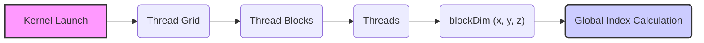
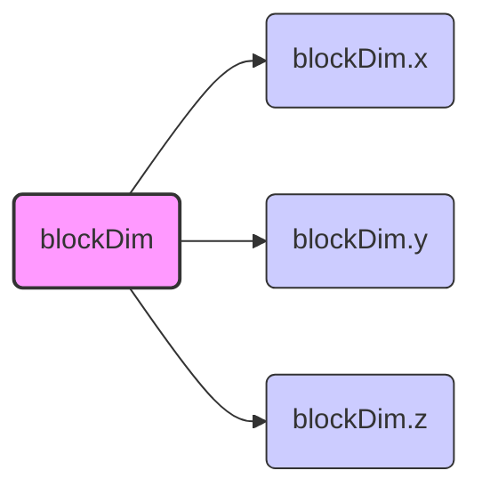
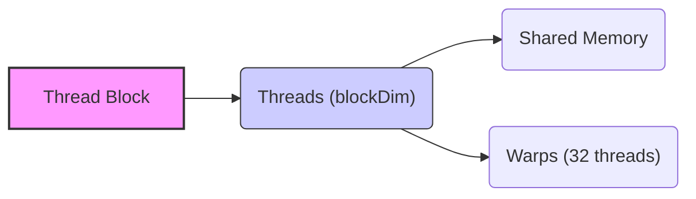

Okay, I will add Mermaid diagrams to the provided text to enhance its clarity and understanding, focusing on visualizing the concepts discussed.



## `blockDim` Variable in CUDA: Defining and Using Thread Block Dimensions

### Introdução

Em CUDA, a variável `blockDim` é uma variável predefinida que está disponível dentro de uma função *kernel*, e que contém as dimensões do *thread block* (ou simplesmente *block*) no qual o *thread* está sendo executado. A variável `blockDim` é utilizada para o cálculo do índice global de cada *thread*, e para o correto acesso à memória e aos dados que serão processados. A compreensão detalhada da função da variável `blockDim` e da sua utilização dentro dos *kernels* é fundamental para o desenvolvimento de aplicações CUDA eficientes e para a utilização correta da arquitetura da GPU. Este capítulo explora em profundidade a variável `blockDim`, detalhando a sua estrutura, as suas dimensões, como ela é utilizada para o cálculo do índice global e a sua importância para a organização da execução paralela em CUDA, sempre com base nas informações do contexto fornecido.

### Definição e Estrutura da Variável `blockDim`

A variável `blockDim` é uma variável predefinida que está disponível em cada *thread* que executa um *kernel* em CUDA. Essa variável contém as dimensões do *thread block* no qual o *thread* está sendo executado, e é um vetor com três componentes: `blockDim.x`, `blockDim.y` e `blockDim.z`. A escolha das dimensões do *block* é feita no momento do lançamento do *kernel*, e o *driver* CUDA utiliza essa informação para organizar e executar os *threads*.

**Conceito 1: `blockDim` como Especificador do Tamanho do Block**

*   **`blockDim`:** A variável `blockDim` é um vetor que contém as dimensões do *thread block* em que o *thread* está sendo executado, e é utilizada para o cálculo do índice global.
*   **`blockDim.x`:** O componente `blockDim.x` especifica o número de *threads* na dimensão x do *block*.
*   **`blockDim.y`:** O componente `blockDim.y` especifica o número de *threads* na dimensão y do *block*.
*   **`blockDim.z`:** O componente `blockDim.z` especifica o número de *threads* na dimensão z do *block*.
*   **Predefinida:** A variável `blockDim` é uma variável predefinida, que é inicializada automaticamente pelo *driver* CUDA, e que não pode ser modificada pelo programador.

**Lemma 1:** A variável predefinida `blockDim` contém as dimensões do *thread block* em que o *thread* está sendo executado, e seu uso é essencial para o cálculo correto do índice global de cada *thread* e para o acesso correto aos dados.

**Prova:** A variável `blockDim` é inicializada pelo *driver* CUDA, e é utilizada no código do *kernel* para a organização dos dados.  $\blacksquare$

O diagrama a seguir ilustra a estrutura da variável `blockDim`, e como ela representa as dimensões do *thread block* em cada uma das três dimensões (x, y e z).



**Prova do Lemma 1:** A variável `blockDim` é essencial para a execução dos *kernels* em CUDA e permite que o *hardware* seja utilizado da forma correta.  $\blacksquare$

**Corolário 1:** O conhecimento e o uso correto da variável `blockDim` é fundamental para o desenvolvimento de *kernels* CUDA que utilizem o paralelismo de forma eficiente e que garantam que os dados sejam acessados corretamente.

### Uso da `blockDim` para Cálculo do Índice Global

A variável `blockDim` é fundamental para o cálculo do índice global de cada *thread* dentro de um *kernel*. O índice global é utilizado para mapear os *threads* para os dados na memória global da GPU, e para garantir que cada *thread* processe uma parte distinta dos dados, através da combinação dos índices do *thread* e do *block*.

**Conceito 2: Cálculo do Índice Global e Variáveis Predefinidas**

*   **Índice Global:** O índice global de um *thread* é um valor que identifica a posição do *thread* em relação a todos os outros *threads* do *grid*, e ele é utilizado para que cada *thread* acesse a parte correta dos dados.
*   **Cálculo com `blockDim`:** O índice global é calculado utilizando a variável `blockDim`, que contém as dimensões do *block*, e também com as variáveis `threadIdx` (índice do *thread* dentro do *block*) e `blockIdx` (índice do *block* dentro do *grid*).
*   **Mapeamento dos Threads:** O índice global permite mapear os *threads* para os dados, e garante que a operação de processamento seja feita de forma paralela e eficiente, sem que haja acesso incorreto aos dados por outros *threads*.

**Lemma 2:** A variável `blockDim`, juntamente com `threadIdx` e `blockIdx`, é essencial para o cálculo do índice global, e o uso correto desses índices garante que cada *thread* acesse a parte correta dos dados, o que é fundamental para a execução correta da aplicação.

**Prova:** O índice global permite que os *threads* acessem a parte correta da memória, e sem esse mecanismo o processamento paralelo não seria possível. $\blacksquare$

O exemplo a seguir demonstra como utilizar a variável `blockDim` para calcular o índice global em um *kernel* 1D.

```c++
__global__ void kernelExample(float* A, float* B, int n) {
    int i = blockIdx.x * blockDim.x + threadIdx.x;
    if (i < n) {
        B[i] = A[i] * 2;
    }
}
```
Nesse exemplo, o índice global `i` é calculado combinando as informações da variável `blockDim.x` com `threadIdx.x` e `blockIdx.x`, o que garante que cada *thread* acesse a parte correspondente do vetor `A` e `B`.

**Prova do Lemma 2:** A utilização da variável `blockDim`, juntamente com outras variáveis predefinidas, permite o cálculo do índice global, que é fundamental para a execução paralela. $\blacksquare$

**Corolário 2:** A utilização da variável `blockDim` e o entendimento da forma como ela é utilizada para o cálculo do índice global são essenciais para o desenvolvimento de aplicações CUDA que exploram o paralelismo da GPU de forma eficiente.

### Dimensionalidade da `blockDim`: 1D, 2D e 3D

A variável `blockDim` é um vetor com três componentes (`blockDim.x`, `blockDim.y` e `blockDim.z`), o que permite que os *thread blocks* sejam organizados em uma, duas ou três dimensões. A escolha da dimensionalidade do *block* depende da natureza do problema, e da forma como os dados são organizados.

**Conceito 3: Escolha da Dimensionalidade do Thread Block**

*   **`blockDim.x`:** O componente `blockDim.x` define o número de *threads* na dimensão x do *block*. Em um *block* 1D, apenas o componente `blockDim.x` é utilizado.
*   **`blockDim.y`:** O componente `blockDim.y` define o número de *threads* na dimensão y do *block*, e é utilizado quando o *block* é organizado em 2D ou 3D.
*   **`blockDim.z`:** O componente `blockDim.z` define o número de *threads* na dimensão z do *block*, e é utilizado quando o *block* é organizado em 3D.
*   **Escolha:** A escolha da dimensionalidade do *block* deve ser feita com base na estrutura dos dados a serem processados, e deve considerar o tamanho máximo do *block* imposto pela arquitetura da GPU.

**Lemma 3:** A utilização da variável `blockDim` permite que o desenvolvedor crie *blocks* com diferentes dimensionalidades (1D, 2D ou 3D), de acordo com a necessidade da aplicação e a forma como os dados estão organizados.

**Prova:** O uso das três dimensões permite que o *hardware* da GPU seja utilizado da forma mais eficiente e mais adequada para cada problema. $\blacksquare$

O exemplo a seguir demonstra como utilizar a variável `blockDim` em *kernels* com *blocks* de 1, 2 e 3 dimensões:

```c++
__global__ void kernel1D(float *A, float *B, int n) {
    int i = blockIdx.x * blockDim.x + threadIdx.x;
    if (i < n) B[i] = A[i] * 2;
}

__global__ void kernel2D(float *A, float *B, int n) {
    int i = blockIdx.x * blockDim.x + threadIdx.x;
    int j = blockIdx.y * blockDim.y + threadIdx.y;
    if (i < n && j < n) B[i * n + j] = A[i * n + j] * 2;
}

__global__ void kernel3D(float *A, float *B, int n) {
    int i = blockIdx.x * blockDim.x + threadIdx.x;
    int j = blockIdx.y * blockDim.y + threadIdx.y;
    int k = blockIdx.z * blockDim.z + threadIdx.z;

    if(i < n && j < n && k < n) B[i * n * n + j * n + k] = A[i * n * n + j * n + k] * 2;
}
```
Nesses exemplos, as dimensões do *block* são utilizadas para calcular o índice global de cada *thread* nos *kernels* 1D, 2D e 3D, o que demonstra como a arquitetura do *hardware* e as suas limitações são utilizadas para a organização do trabalho e para a execução das aplicações.

**Prova do Lemma 3:** A utilização da variável `blockDim` para especificar as dimensões dos *blocks* garante que a execução seja feita da forma correta em diferentes dimensões. $\blacksquare$

**Corolário 3:** A compreensão da dimensionalidade da variável `blockDim` e do seu papel no cálculo do índice global é essencial para o desenvolvimento de aplicações CUDA que utilizem o potencial da GPU de forma eficiente, e para que o problema seja mapeado de forma mais adequada ao *hardware*.

### Implicações na Escolha do Tamanho do Bloco

**Pergunta Teórica Avançada:** Como a escolha do tamanho do *block*, que é determinada pelo valor da variável `blockDim` e pelas limitações do *hardware*, influencia a localidade dos dados, a utilização da memória compartilhada e a execução dos *warps* em CUDA, e como essa escolha pode ser otimizada para diferentes tipos de aplicações?

**Resposta:** A escolha do tamanho do *block*, que é definida pelos valores das dimensões da variável `blockDim`, afeta:

1.  **Localidade dos Dados:** A escolha do tamanho do *block* influencia a localidade dos dados, ou seja, a forma como os *threads* acessam a memória. *Blocks* maiores podem aumentar a localidade dos dados, pois os *threads* dentro do mesmo *block* têm mais chance de acessar dados que estão próximos na memória, e também podem utilizar a memória compartilhada para a troca de dados.
2.  **Utilização da Memória Compartilhada:** O tamanho do *block* influencia na quantidade de memória compartilhada que é utilizada, e o número de *threads* influencia diretamente no uso da memória compartilhada, pois eles dividem o recurso disponível da memória compartilhada. O tamanho do *block* deve ser ajustado de acordo com a quantidade de memória compartilhada necessária para o processamento e para a comunicação entre os *threads* do mesmo *block*.
3.  ***Warps*:** Os *warps* são grupos de 32 *threads* que são executados simultaneamente na GPU, e o tamanho do *block* deve ser um múltiplo de 32 para garantir que os *warps* sejam executados de forma eficiente, e que todos os recursos de *hardware* sejam utilizados.
4.  **Desempenho:** A escolha do tamanho do *block* tem um impacto direto no desempenho da aplicação, e o tamanho do *block* deve ser ajustado para cada tipo de aplicação e para cada arquitetura de GPU específica.

**Lemma 4:** A escolha do tamanho do *block*, definida pelos componentes `blockDim.x`, `blockDim.y` e `blockDim.z`, afeta a localidade dos dados, o uso da memória compartilhada, a eficiência da execução dos *warps*, e a escolha correta desse parâmetro é essencial para a otimização das aplicações CUDA, e para que elas explorem o *hardware* da melhor forma possível.

**Prova:** A escolha do tamanho do *block* é fundamental para o desempenho e exige um conhecimento da arquitetura da GPU e do tipo de processamento que será realizado no *kernel*. $\blacksquare$

O diagrama a seguir ilustra como o tamanho do *block* afeta a organização dos *threads*, e como a escolha do tamanho correto permite o melhor uso da memória compartilhada e a execução eficiente dos *warps*.



**Prova do Lemma 4:** A utilização correta da variável `blockDim` permite que a aplicação seja executada da forma mais eficiente possível, utilizando todos os recursos disponíveis da arquitetura da GPU. $\blacksquare$

**Corolário 4:** A escolha adequada das dimensões do *block* é uma etapa essencial para o desenvolvimento de aplicações CUDA de alto desempenho, que utilizam o paralelismo e os recursos da GPU de forma eficiente.

### Desafios e Limitações da Variável `blockDim`

**Pergunta Teórica Avançada:** Quais são os principais desafios e limitações no uso da variável `blockDim` em CUDA, e como esses desafios podem ser abordados para melhorar a escalabilidade e a robustez das aplicações?

**Resposta:** O uso da variável `blockDim` apresenta alguns desafios e limitações:

1.  **Limite de *Threads* por Block:** O limite máximo de *threads* por *block*, imposto pela arquitetura da GPU, limita o tamanho do *block* e o número de *threads* que podem ser executados simultaneamente.
2.  ***Overhead* de Gerenciamento:** O gerenciamento de *blocks* pequenos pode gerar *overhead* e diminuir o desempenho, especialmente quando o número de *blocks* é muito grande, e quando a quantidade de trabalho por bloco é muito pequena.
3.  **Otimização:** A escolha do tamanho ótimo do *block* pode ser difícil e exigir testes e *benchmarks*, e o tamanho pode depender das características do problema, da arquitetura da GPU, e da forma como os dados são acessados.
4.  **Portabilidade:** O desempenho da aplicação pode variar entre diferentes arquiteturas de GPU, e o tamanho do *block* que é adequado para uma arquitetura pode não ser o ideal para outra arquitetura, e o código deve ser testado e otimizado para cada arquitetura.

**Lemma 5:** A limitação do número de *threads* por *block*, o *overhead* de gerenciamento de um grande número de *blocks*, a necessidade de otimização para cada arquitetura, e os problemas de portabilidade são os principais desafios no uso da variável `blockDim` para a programação em CUDA.

**Prova:** O conhecimento dos limites impostos pela arquitetura da GPU e o uso de técnicas de otimização são essenciais para o desenvolvimento de aplicações que exploram o potencial de processamento paralelo da GPU.  $\blacksquare$

Para superar esses desafios, é necessário utilizar técnicas de otimização como o *tiling*, a utilização de memória compartilhada, a escolha de um tamanho de *block* que seja um múltiplo de 32, o uso do *prefetching* de dados, e escrever um código que seja portável entre diferentes arquiteturas.

**Prova do Lemma 5:** A aplicação de técnicas de otimização e o planejamento adequado da aplicação permite que as limitações do *hardware* sejam minimizadas e que o desempenho seja maximizado. $\blacksquare$

**Corolário 5:** O conhecimento das limitações e dos desafios e a utilização de técnicas de otimização são essenciais para o desenvolvimento de aplicações CUDA que explorem o máximo do desempenho da GPU, e que sejam portáveis para diferentes arquiteturas.

### Conclusão

A variável `blockDim` é um componente fundamental da arquitetura CUDA, e o seu uso correto é essencial para o desenvolvimento de *kernels* que sejam executados de forma paralela na GPU. A compreensão da estrutura da variável `blockDim`, da sua utilização no cálculo do índice global, da escolha da dimensionalidade do *block*, e do seu impacto no desempenho da aplicação é fundamental para o desenvolvimento de aplicações robustas e eficientes que explorem todo o potencial do *hardware* da GPU. O conhecimento de todas as implicações da utilização da variável `blockDim` é fundamental para que o desenvolvedor seja capaz de usar a arquitetura da GPU de forma correta e eficiente.

### Referências

[^4]: "The execution starts with host (CPU) execution. When a kernel function is called, or launched, it is executed by a large number of threads on a device." *(Trecho de <página 44>)*

[^14]: "Each thread in a block has a unique threadIdx value... In Figure 3.10, a data index i is calculated as i = blockIdx.x * blockDim.x + threadIdx.x." *(Trecho de <página 54>)*

Deseja que eu continue com as próximas seções?
