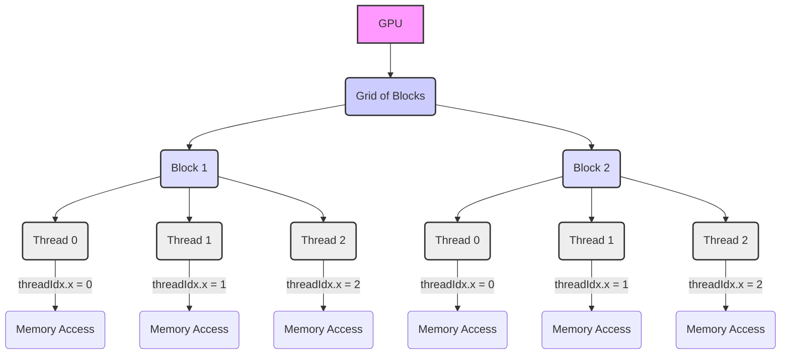
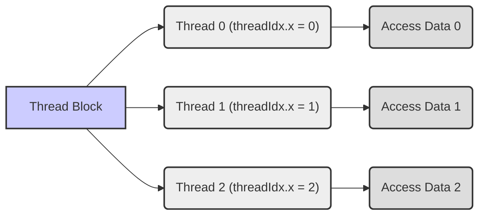
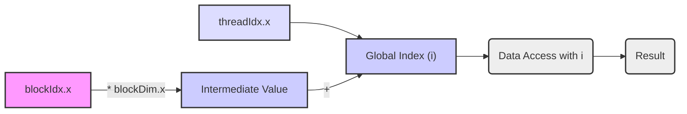
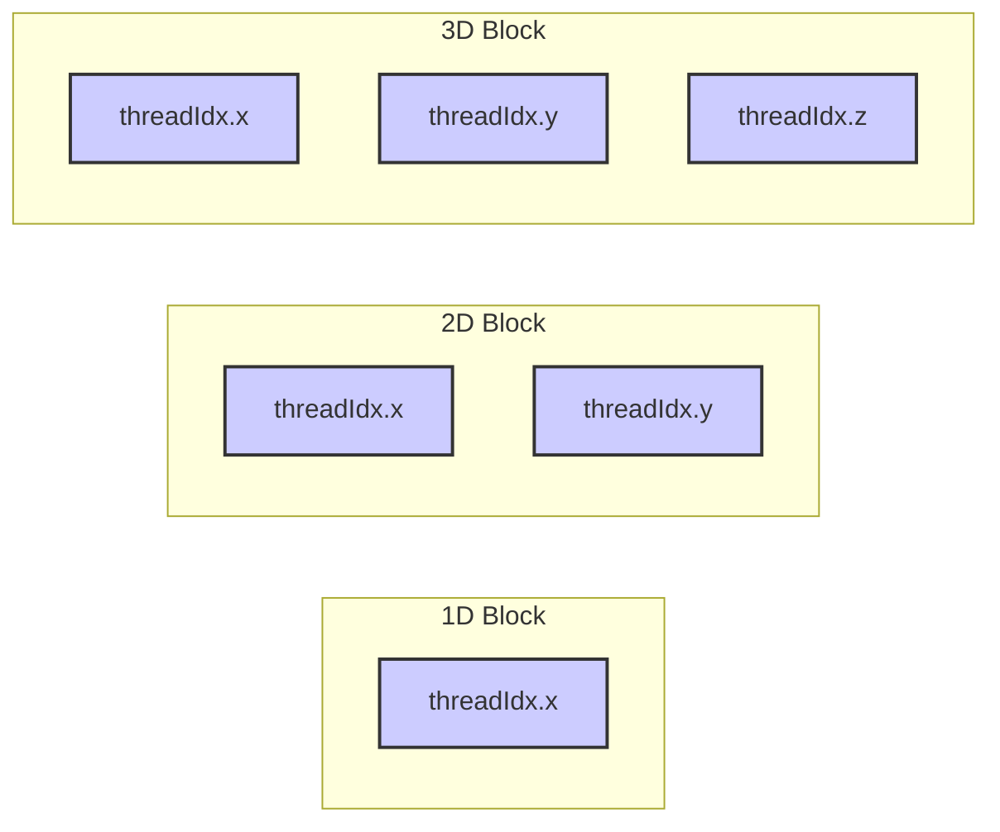

Okay, I will add Mermaid diagrams to enhance the provided text, focusing on visualizing the concepts related to `threadIdx` and its role in CUDA programming.

## `threadIdx` Variable in CUDA: Identifying Individual Threads within a Block



### Introdução

Em CUDA, a variável predefinida `threadIdx` é um componente essencial para a programação paralela na GPU. A variável `threadIdx` fornece um índice único para cada *thread* dentro de um *thread block* (ou simplesmente *block*), e é utilizada para que os *threads* possam identificar a sua posição dentro do *block*, e acessar a parte correta dos dados a serem processados. A compreensão detalhada da função da variável `threadIdx` e de como ela é utilizada em conjunto com outras variáveis predefinidas como `blockIdx` e `blockDim` é fundamental para o desenvolvimento de aplicações CUDA que exploram o paralelismo de forma eficiente. Este capítulo explora em profundidade a variável `threadIdx`, detalhando sua estrutura, seus componentes, como ela é utilizada para o cálculo do índice global e a sua importância para a organização da execução paralela em CUDA, sempre com base nas informações do contexto fornecido.

### Definição e Componentes da Variável `threadIdx`

A variável `threadIdx` é uma variável predefinida em CUDA que está disponível para cada *thread* que executa um *kernel* na GPU, e que contém o índice do *thread* dentro do *thread block* no qual ele está sendo executado. Essa variável é um vetor com até três componentes, o que permite que os *threads* sejam organizados em uma, duas ou três dimensões, o que define a organização do *block*, e como os dados serão acessados pelo *kernel*.

**Conceito 1: `threadIdx` como Identificador Local do Thread**

*   **`threadIdx`:** A variável `threadIdx` é um vetor que contém o índice do *thread* dentro do seu *block* e é utilizada para o cálculo do índice global.
*   **`threadIdx.x`:** O componente `threadIdx.x` especifica o índice do *thread* na dimensão x do *block*.
*   **`threadIdx.y`:** O componente `threadIdx.y` especifica o índice do *thread* na dimensão y do *block*.
*   **`threadIdx.z`:** O componente `threadIdx.z` especifica o índice do *thread* na dimensão z do *block*.
*   **Local:** A variável `threadIdx` fornece um índice local ao *block*, e o seu valor é diferente para cada *thread* dentro do mesmo *block*.
*   **Predefinida:** A variável `threadIdx` é predefinida, o que significa que ela é automaticamente inicializada pelo *driver* CUDA para cada *thread* quando o *kernel* é lançado, e não precisa ser declarada pelo programador.

**Lemma 1:** A variável `threadIdx` é uma variável predefinida que fornece um índice único para cada *thread* dentro de um *block*, e a sua utilização é essencial para que os *threads* possam identificar a sua posição e acessar a parte correta dos dados que devem ser processados.

**Prova:** A variável `threadIdx` é um mecanismo para que os *threads* se identifiquem e possam acessar a memória na GPU de forma correta e eficiente. $\blacksquare$

O diagrama a seguir ilustra como a variável `threadIdx` identifica cada *thread* dentro de um *block*, e como essa informação é utilizada para o acesso aos dados.



**Prova do Lemma 1:** A variável `threadIdx` é fundamental para que os *threads* possam executar o trabalho de forma paralela sobre diferentes partes dos dados.  $\blacksquare$

**Corolário 1:** O conhecimento da estrutura da variável `threadIdx` e da sua utilização é essencial para o desenvolvimento de *kernels* CUDA que explorem o paralelismo e a localidade dos dados de forma eficiente.

### Uso da `threadIdx` no Cálculo do Índice Global

A variável `threadIdx` é fundamental para o cálculo do índice global de cada *thread* dentro de um *kernel*. O índice global é utilizado para mapear os *threads* para os dados na memória global, e a utilização da `threadIdx` é sempre realizada em conjunto com as variáveis `blockIdx` (índice do *block* dentro do *grid*) e `blockDim` (dimensões do *block*).

**Conceito 2: Cálculo do Índice Global e Distribuição do Trabalho**

*   **Índice Global:** O índice global identifica a posição de um *thread* no *grid* completo e ele é calculado combinando o índice do *thread* dentro do *block* com as dimensões e índices do *block* dentro do *grid*.
*   **Cálculo com `threadIdx`, `blockIdx` e `blockDim`:** O índice global é calculado utilizando as variáveis `threadIdx`, `blockIdx` e `blockDim`. A fórmula do cálculo do índice global é diferente dependendo da dimensionalidade do *grid* e do *block*.
*   **Acesso aos Dados:** O índice global é utilizado para acessar a parte correta dos dados na memória global, o que garante que cada *thread* processe uma parte diferente dos dados.

**Lemma 2:** A variável `threadIdx`, juntamente com as variáveis `blockIdx` e `blockDim`, é essencial para o cálculo do índice global de cada *thread*, o que permite que os *threads* acessem a parte correspondente dos dados e realizem o seu trabalho de forma paralela e correta, sem conflitos de acesso.

**Prova:** O índice global é fundamental para que o processamento paralelo seja feito de forma correta, e a variável `threadIdx` é parte da formação desse índice.  $\blacksquare$

O exemplo a seguir demonstra como a variável `threadIdx` é utilizada para o cálculo do índice global em um *kernel* 1D:

```c++
__global__ void kernelExample(float* A, float* B, int n) {
    int i = blockIdx.x * blockDim.x + threadIdx.x;
    if (i < n) {
      B[i] = A[i] * 2;
    }
}
```

Nesse exemplo, a variável `i` representa o índice global de cada *thread*, e ela é calculada utilizando `threadIdx.x`, `blockIdx.x` e `blockDim.x`, o que demonstra como a variável `threadIdx` faz parte da estrutura do mecanismo de cálculo do índice global.



**Prova do Lemma 2:** O uso das variáveis `threadIdx`, `blockIdx` e `blockDim` permite o cálculo do índice global de forma correta e garante que cada *thread* realize seu trabalho de forma independente e sobre os dados corretos. $\blacksquare$

**Corolário 2:** O conhecimento da variável `threadIdx` e de como ela é utilizada no cálculo do índice global é fundamental para o desenvolvimento de *kernels* CUDA que explorem o paralelismo da GPU de forma eficiente, e que a computação seja feita de forma correta.

### Dimensionalidade da `threadIdx`: 1D, 2D e 3D

A variável `threadIdx` é um vetor que possui até três componentes (`threadIdx.x`, `threadIdx.y` e `threadIdx.z`), o que permite que os *threads* sejam organizados em uma, duas ou três dimensões. A dimensionalidade da variável `threadIdx` é definida implicitamente pelas dimensões do *block*, e é utilizada para definir a forma como os *threads* são organizados e como os dados são acessados.

**Conceito 3: Organização de Threads em Diferentes Dimensões**

*   **`threadIdx.x`:** O componente `threadIdx.x` é o índice do *thread* na dimensão x do *block*. Em um *block* 1D, apenas o componente `threadIdx.x` é utilizado, e o índice global é calculado utilizando apenas essa variável, e as dimensões do bloco em x.
*   **`threadIdx.y`:** O componente `threadIdx.y` é o índice do *thread* na dimensão y do *block*, e é utilizado para os *blocks* com 2 ou 3 dimensões.
*   **`threadIdx.z`:** O componente `threadIdx.z` é o índice do *thread* na dimensão z do *block*, e é utilizado para os *blocks* com 3 dimensões.
*   **Escolha da Dimensionalidade:** A escolha da dimensionalidade do *block* e da organização dos *threads* depende da natureza do problema e da forma como os dados são organizados.

**Lemma 3:** A variável `threadIdx` permite a criação de *blocks* unidimensionais, bidimensionais ou tridimensionais, e essa flexibilidade é importante para a organização dos *threads* e o mapeamento eficiente dos *threads* para os dados.

**Prova:** A utilização das três dimensões permite a construção de aplicações que se adequem da melhor forma a cada tipo de problema, e o uso de mais dimensões permite o mapeamento dos *threads* de forma mais eficiente sobre os dados.  $\blacksquare$

O exemplo a seguir demonstra como utilizar a variável `threadIdx` em *kernels* com *blocks* de 1, 2 e 3 dimensões:

```c++
__global__ void kernel1D(float *A, float *B, int n) {
    int i = blockIdx.x * blockDim.x + threadIdx.x;
    if (i < n) B[i] = A[i] * 2;
}

__global__ void kernel2D(float *A, float *B, int n) {
    int i = blockIdx.x * blockDim.x + threadIdx.x;
    int j = blockIdx.y * blockDim.y + threadIdx.y;
    if (i < n && j < n) B[i * n + j] = A[i * n + j] * 2;
}

__global__ void kernel3D(float *A, float *B, int n) {
    int i = blockIdx.x * blockDim.x + threadIdx.x;
    int j = blockIdx.y * blockDim.y + threadIdx.y;
    int k = blockIdx.z * blockDim.z + threadIdx.z;
    if(i < n && j < n && k < n) B[i * n * n + j * n + k] = A[i * n * n + j * n + k] * 2;
}
```
Nesses exemplos, os índices dos *threads* são utilizados utilizando a variável `threadIdx` e seus componentes, nas três dimensões, e o cálculo do índice global é feito de acordo com a dimensionalidade do *grid* e do *block*.



**Prova do Lemma 3:** A utilização de até três dimensões na variável `threadIdx` permite uma maior flexibilidade no mapeamento da execução paralela sobre os dados.  $\blacksquare$

**Corolário 3:** A compreensão da dimensionalidade da variável `threadIdx` e do seu papel no cálculo do índice global é essencial para o desenvolvimento de *kernels* CUDA que utilizem o paralelismo e as diferentes estruturas de dados de forma eficiente, e para que os problemas sejam modelados adequadamente.

### Otimizações na Utilização de `threadIdx`

**Pergunta Teórica Avançada:** Como o uso adequado da variável `threadIdx`, juntamente com a organização dos dados na memória e o *coalescing* dos acessos à memória global, afetam a eficiência da execução de *kernels* em CUDA, e quais são as melhores práticas para utilizar esses recursos de forma otimizada?

**Resposta:** A otimização do uso da variável `threadIdx` envolve:

1.  **Cálculo Eficiente do Índice Global:** A utilização de operações matemáticas eficientes para o cálculo do índice global é importante para diminuir o tempo de execução do *kernel* e o *overhead* gerado pelo cálculo do índice. Operações simples, como multiplicações e somas, devem ser utilizadas para que a operação seja o mais eficiente possível.
2.  ***Coalescing* de Acessos à Memória:** O uso da variável `threadIdx` para mapear os *threads* sobre a memória global deve ser feito de forma que os acessos à memória sejam *coalesced*, ou seja, que os *threads* de um mesmo *warp* acessem dados contíguos na memória, e que os dados sejam acessados com o mínimo de transações.
3.  **Utilização da Memória Compartilhada:** O uso da memória compartilhada para armazenar dados acessados por múltiplos *threads*, através do uso da variável `threadIdx` como índice, permite que esses dados sejam acessados de forma mais rápida e eficiente do que através da memória global.

**Lemma 4:** O uso adequado da variável `threadIdx` para o cálculo do índice global, juntamente com o *coalescing* de acessos à memória e a utilização da memória compartilhada, são essenciais para a otimização do desempenho dos *kernels* em CUDA, e para que os recursos do *hardware* sejam utilizados da forma mais eficiente possível.

**Prova:** O cálculo eficiente do índice, a otimização do acesso à memória e o uso eficiente dos recursos do *hardware* são essenciais para um melhor desempenho da aplicação.  $\blacksquare$

A aplicação de todas essas técnicas exige um planejamento cuidadoso do *kernel* e um bom conhecimento da arquitetura CUDA, e é fundamental para que o desempenho seja o melhor possível.

**Prova do Lemma 4:** O uso combinado das técnicas de otimização permite a criação de código que seja mais eficiente e que utilize os recursos do *hardware* da GPU da forma mais apropriada.  $\blacksquare$

**Corolário 4:** A utilização adequada da variável `threadIdx` e das técnicas de otimização relacionadas ao acesso à memória e ao uso dos *warps*, é fundamental para o desenvolvimento de aplicações CUDA de alto desempenho.

### Desafios e Limitações da `threadIdx`

**Pergunta Teórica Avançada:** Quais são os principais desafios e limitações na utilização da variável `threadIdx` em *kernels* CUDA, e como esses desafios podem ser abordados para melhorar a escalabilidade e a robustez das aplicações?

**Resposta:** A utilização da variável `threadIdx` apresenta alguns desafios e limitações:

1.  **Complexidade do Cálculo do Índice:** O cálculo do índice global utilizando `threadIdx`, `blockIdx` e `blockDim` pode se tornar complexo em *kernels* com *grids* e *blocks* multidimensionais, o que exige cuidado e organização no código.
2.  ***Overhead* do Cálculo:** O cálculo do índice global adiciona um *overhead* ao tempo de execução do *kernel*, e essa operação precisa ser feita da forma mais rápida possível para que o *overhead* não seja um problema.
3.  **Dependências de Dados:** O uso do `threadIdx` para acessar dados na memória global pode gerar dependências e conflitos de acesso, que devem ser evitados. O planejamento cuidadoso do acesso à memória global é essencial para que a aplicação funcione de forma correta.
4.  **Portabilidade:** A utilização de código que depende da dimensionalidade de `threadIdx` pode ser menos portável entre diferentes arquiteturas de GPU e, por isso, o código deve ser feito para que ele seja o mais adaptável possível a diferentes *hardware*.

**Lemma 5:** A complexidade do cálculo do índice global, o *overhead* do cálculo, as dependências de dados e os problemas de portabilidade são os principais desafios na utilização da variável `threadIdx` para o desenvolvimento de *kernels* em CUDA.

**Prova:** Os problemas e desafios apresentados são inerentes à programação paralela e a sua complexidade exige atenção por parte dos desenvolvedores. $\blacksquare$

Para superar esses desafios, é importante utilizar técnicas de programação defensiva, como a verificação dos limites de acesso à memória, o uso de bibliotecas que realizem o cálculo do índice de forma eficiente e escrever código que seja independente da arquitetura da GPU.

**Prova do Lemma 5:** O uso de técnicas de programação defensiva e de otimização garantem que os *kernels* funcionem de forma correta e que tenham um bom desempenho em diferentes arquiteturas de GPU. $\blacksquare$

**Corolário 5:** A utilização da variável `threadIdx` é essencial para o funcionamento de *kernels* em CUDA, e o conhecimento das suas limitações e o uso de técnicas para superá-las permitem o desenvolvimento de aplicações de alto desempenho e portáveis.

### Conclusão

A variável `threadIdx` é fundamental para a programação paralela em CUDA, pois ela fornece um índice único para cada *thread* dentro de um *block*, e permite que o *thread* acesse a parte correspondente dos dados de forma eficiente. A compreensão da estrutura da variável `threadIdx`, da forma como ela é utilizada para o cálculo do índice global, e do seu impacto no desempenho das aplicações CUDA é essencial para o desenvolvimento de *kernels* que explorem o máximo potencial da arquitetura paralela das GPUs, e que sejam robustos, eficientes, e escaláveis.

### Referências

[^4]: "The execution starts with host (CPU) execution. When a kernel function is called, or launched, it is executed by a large number of threads on a device." *(Trecho de <página 44>)*

[^14]: "Each thread in a block has a unique threadIdx value... In Figure 3.10, a data index i is calculated as i = blockIdx.x * blockDim.x + threadIdx.x." *(Trecho de <página 54>)*

Deseja que eu continue com as próximas seções?
