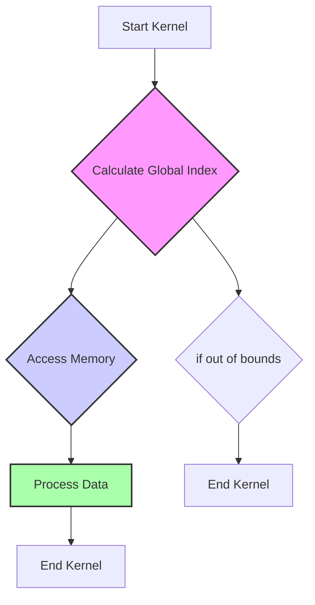
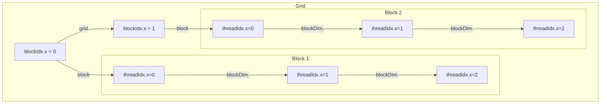
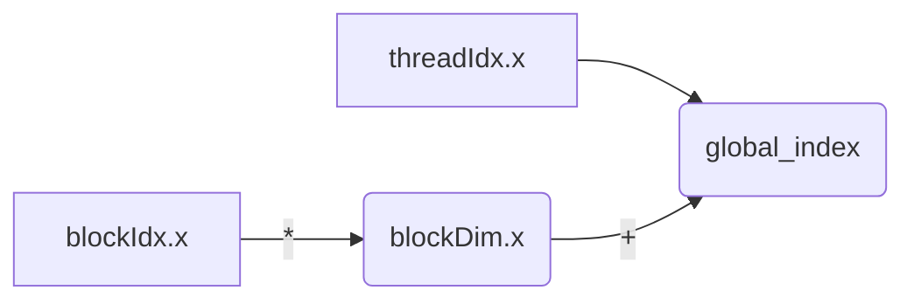
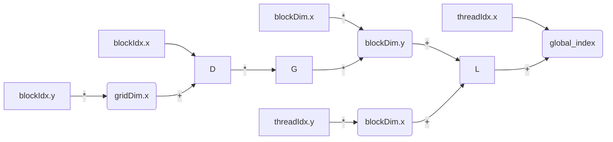
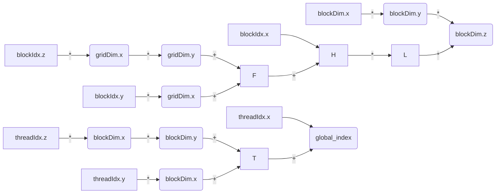
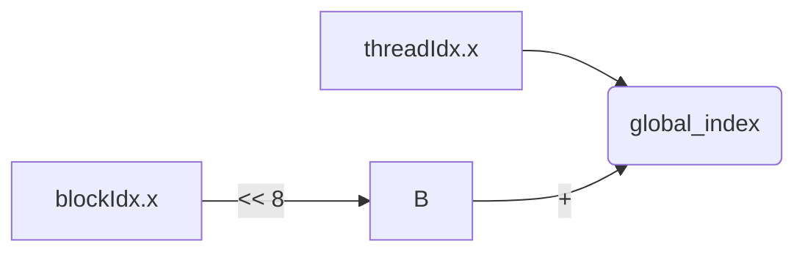

Okay, here's the enhanced text with Mermaid diagrams added:

## Unique Global Thread ID Calculation in CUDA: Mapping Threads to Data



### Introdução

Em CUDA, o cálculo do **índice global** de cada *thread* é um passo essencial para a execução correta dos *kernels* na GPU. O índice global é um identificador único que permite que cada *thread* acesse a sua parte específica dos dados e realize o processamento correspondente. O cálculo do índice global é feito utilizando as variáveis predefinidas `threadIdx`, `blockIdx` e `blockDim`, e a compreensão detalhada de como esse cálculo funciona é fundamental para o desenvolvimento de aplicações CUDA eficientes. Este capítulo explora em profundidade o processo de cálculo do índice global de *threads* em CUDA, detalhando como as variáveis predefinidas são utilizadas, como o cálculo é feito em diferentes dimensionalidades, e como o índice global é utilizado para mapear os *threads* aos dados de forma segura e eficiente, sempre com base nas informações do contexto fornecido.

### Variáveis Predefinidas para Cálculo do Índice Global

O cálculo do índice global em CUDA utiliza as variáveis predefinidas `threadIdx`, `blockIdx` e `blockDim`, que são automaticamente inicializadas pelo *driver* CUDA para cada *thread* que é executado na GPU. Essas variáveis fornecem informações sobre a posição do *thread* dentro do seu *block* e a posição do *block* dentro do *grid*, o que permite que o índice global seja calculado.

**Conceito 1: Variáveis para Identificação dos Threads**

*   **`threadIdx`:** A variável `threadIdx` contém o índice do *thread* dentro do seu *block*, e é um vetor que pode ter até três componentes (`threadIdx.x`, `threadIdx.y` e `threadIdx.z`). O índice do *thread* é sempre local, e é utilizado em conjunto com os índices do *block*.
*   **`blockIdx`:** A variável `blockIdx` contém o índice do *block* dentro do *grid*, e também é um vetor que pode ter até três componentes (`blockIdx.x`, `blockIdx.y` e `blockIdx.z`). O índice do *block* é fundamental para definir a posição dos *threads* no *grid* e para calcular o seu índice global.
*   **`blockDim`:** A variável `blockDim` contém as dimensões do *block*, e também é um vetor que pode ter até três componentes (`blockDim.x`, `blockDim.y` e `blockDim.z`). A variável `blockDim` é utilizada para o cálculo do índice global e garante que o mapeamento entre *threads* e dados seja feito de forma correta.



**Lemma 1:** As variáveis predefinidas `threadIdx`, `blockIdx` e `blockDim` fornecem as informações necessárias para que cada *thread* calcule o seu índice global, e são utilizadas para que cada *thread* acesse a parte correta dos dados e execute o seu processamento de forma independente.

**Prova:** As variáveis são iniciadas pelo *driver* CUDA para cada *thread*, e o seu uso é fundamental para a organização da execução paralela.  $\blacksquare$

O diagrama a seguir ilustra como as variáveis `threadIdx`, `blockIdx` e `blockDim` são utilizadas para calcular o índice global de cada *thread* e como essa variável é utilizada para o acesso à memória global e ao processamento da informação.

**Prova do Lemma 1:** As variáveis predefinidas fornecem as informações de posição para que cada *thread* possa realizar o seu trabalho de forma independente e paralela. $\blacksquare$

**Corolário 1:** O conhecimento e o uso correto das variáveis predefinidas `threadIdx`, `blockIdx` e `blockDim` são essenciais para o desenvolvimento de *kernels* CUDA que explorem o paralelismo da GPU de forma eficiente.

### Cálculo do Índice Global em 1D

O cálculo do índice global em 1D é a forma mais simples de mapear *threads* para dados, e é utilizada em aplicações que envolvem o processamento de vetores ou *arrays* unidimensionais. Nesse caso, apenas as variáveis `threadIdx.x`, `blockIdx.x` e `blockDim.x` são utilizadas para o cálculo do índice global.

**Conceito 2: Fórmula do Índice Global em 1D**

O índice global de um *thread* em um *grid* 1D é calculado utilizando a seguinte fórmula:

$$
\text{global\_index} = \text{blockIdx.x} \times \text{blockDim.x} + \text{threadIdx.x}
$$

*   **`blockIdx.x`:** O índice do *block* na dimensão x do *grid*.
*   **`blockDim.x`:** O número de *threads* na dimensão x do *block*.
*   **`threadIdx.x`:** O índice do *thread* na dimensão x do *block*.

**Lemma 2:** O índice global em um *grid* 1D é calculado a partir do produto do índice do *block* com o número de *threads* por bloco, somado ao índice do *thread* dentro do bloco, o que permite que cada *thread* obtenha um índice único para o acesso aos dados.

**Prova:** A fórmula garante que cada *thread* tenha um índice único e que todos os *threads* do *grid* cubram todos os elementos do conjunto de dados, e permite o mapeamento correto dos *threads* sobre o espaço dos dados. $\blacksquare$

O exemplo abaixo demonstra como calcular o índice global em um *kernel* 1D, utilizando a fórmula acima:

```c++
__global__ void vecAddKernel(float* A, float* B, float* C, int n) {
    int i = blockIdx.x * blockDim.x + threadIdx.x;
    if (i < n) {
        C[i] = A[i] + B[i];
    }
}
```

Nesse exemplo, a variável `i` representa o índice global de cada *thread*, e ela é calculada combinando as informações de `blockIdx.x`, `blockDim.x` e `threadIdx.x`.



**Prova do Lemma 2:** A combinação dos valores de `blockIdx.x`, `blockDim.x` e `threadIdx.x` permite o cálculo do índice global, que é utilizado para o acesso a memória.  $\blacksquare$

**Corolário 2:** O cálculo correto do índice global em 1D é fundamental para a execução correta de *kernels* que processam vetores e outras estruturas de dados unidimensionais.

### Cálculo do Índice Global em 2D

O cálculo do índice global em 2D é utilizado em aplicações que envolvem o processamento de matrizes, imagens e outros dados bidimensionais. Nesse caso, os *blocks* e os *threads* são organizados em duas dimensões, e é necessário combinar as informações das dimensões x e y para calcular o índice global.

**Conceito 3: Fórmula do Índice Global em 2D**

O índice global de um *thread* em um *grid* 2D pode ser calculado de várias formas. Uma das formas mais comuns é utilizar a seguinte fórmula, que lineariza os índices bidimensionais em um índice unidimensional.

$$
\text{global\_index} = (\text{blockIdx.y} \times \text{gridDim.x} + \text{blockIdx.x}) \times \text{blockDim.x} \times \text{blockDim.y} + \text{threadIdx.y} * \text{blockDim.x} + \text{threadIdx.x}
$$

*   **`blockIdx.x` e `blockIdx.y`:** Os índices do *block* nas dimensões x e y do *grid*.
*   **`blockDim.x` e `blockDim.y`:** As dimensões do *block* nas dimensões x e y.
*   **`threadIdx.x` e `threadIdx.y`:** Os índices do *thread* nas dimensões x e y do *block*.
* **`gridDim.x`:** O tamanho do *grid* na dimensão x.

**Lemma 3:** O índice global em 2D é calculado a partir dos índices e dimensões dos *blocks* e dos *threads* nas dimensões x e y, de forma que cada *thread* possua um índice único em um *grid* bidimensional.

**Prova:** O uso correto das variáveis predefinidas permite o cálculo do índice, e garante que cada *thread* acesse uma parte única da memória. $\blacksquare$

O exemplo a seguir demonstra como calcular o índice global em um *kernel* 2D:

```c++
__global__ void kernel2D(float *A, float *B, int width, int height) {
    int x = blockIdx.x * blockDim.x + threadIdx.x;
    int y = blockIdx.y * blockDim.y + threadIdx.y;
    if (x < width && y < height) {
        B[y * width + x] = A[y * width + x] * 2;
    }
}
```
Nesse exemplo, o índice global é calculado utilizando as variáveis `blockIdx.x`, `blockDim.x`, `threadIdx.x`, `blockIdx.y` e `blockDim.y` e `threadIdx.y`, e os índices `x` e `y` são utilizados para acessar os dados em uma matriz bidimensional.



**Prova do Lemma 3:** O cálculo correto do índice global garante que a execução paralela seja realizada de forma correta sobre dados bidimensionais.  $\blacksquare$

**Corolário 3:** O conhecimento e a utilização da fórmula do índice global em 2D é fundamental para o desenvolvimento de *kernels* CUDA que processam imagens ou outras estruturas de dados bidimensionais, garantindo que cada *thread* tenha o seu índice correto e acesse a parte dos dados que lhe foi destinada.

### Cálculo do Índice Global em 3D

O cálculo do índice global em 3D é utilizado em aplicações que envolvem o processamento de volumes tridimensionais, como simulações físicas, e dados volumétricos. Nesse caso, os *blocks* e os *threads* são organizados em três dimensões, e o índice global é calculado utilizando informações das três dimensões.

**Conceito 4: Fórmula do Índice Global em 3D**

O índice global de um *thread* em um *grid* 3D pode ser calculado utilizando a seguinte fórmula, que lineariza os índices tridimensionais em um índice unidimensional:

$$
\text{global\_index} = (\text{blockIdx.z} \times \text{gridDim.x} \times \text{gridDim.y} + \text{blockIdx.y} \times \text{gridDim.x} + \text{blockIdx.x}) \times \text{blockDim.x} \times \text{blockDim.y} \times \text{blockDim.z} + \text{threadIdx.z} * \text{blockDim.x} * \text{blockDim.y} + \text{threadIdx.y} * \text{blockDim.x} + \text{threadIdx.x}
$$

*   **`blockIdx.x`, `blockIdx.y` e `blockIdx.z`:** Os índices do *block* nas dimensões x, y e z do *grid*.
*   **`blockDim.x`, `blockDim.y` e `blockDim.z`:** As dimensões do *block* nas dimensões x, y e z.
*   **`threadIdx.x`, `threadIdx.y` e `threadIdx.z`:** Os índices do *thread* nas dimensões x, y e z do *block*.
*  **`gridDim.x` e `gridDim.y`:** As dimensões do *grid* nas dimensões x e y.

**Lemma 4:** O índice global em 3D é calculado combinando os índices e as dimensões dos *blocks* e dos *threads* nas três dimensões, e o seu resultado é um identificador único para cada *thread* dentro de um *grid* tridimensional.

**Prova:** O cálculo do índice global permite que os *threads* acessem e manipulem os dados em um espaço de memória tridimensional de forma organizada, e garante o bom funcionamento do código. $\blacksquare$

O exemplo a seguir demonstra como calcular o índice global em um *kernel* 3D:

```c++
__global__ void kernel3D(float *A, float *B, int width, int height, int depth) {
    int x = blockIdx.x * blockDim.x + threadIdx.x;
    int y = blockIdx.y * blockDim.y + threadIdx.y;
    int z = blockIdx.z * blockDim.z + threadIdx.z;

    if (x < width && y < height && z < depth) {
      B[z * width * height + y * width + x] = A[z * width * height + y * width + x] * 2;
    }
}
```
Nesse exemplo, os índices `x`, `y` e `z` são utilizados para calcular o índice global dentro de um volume tridimensional, e a utilização desses índices permite acessar os elementos do *array* de forma correta.


**Prova do Lemma 4:** O cálculo do índice global em 3D permite que o processamento paralelo seja realizado sobre dados volumétricos de forma correta e eficiente. $\blacksquare$

**Corolário 4:** O entendimento do cálculo do índice global em 3D é fundamental para o desenvolvimento de *kernels* CUDA que processam estruturas de dados tridimensionais.

### Otimizações no Cálculo do Índice Global

**Pergunta Teórica Avançada:** Como a utilização de operações de *bit shifting* e a minimização do número de operações aritméticas afetam o desempenho do cálculo do índice global em *kernels* CUDA, e como essas técnicas podem ser implementadas na prática?

**Resposta:** A otimização do cálculo do índice global envolve:

1.  **Bit Shifting:** A utilização de operações de *bit shifting* (deslocamento de *bits*) para a multiplicação e a divisão por potências de 2 pode aumentar a eficiência do cálculo do índice, pois operações de *bit shifting* são mais rápidas do que multiplicações e divisões. Essa técnica só pode ser utilizada quando o tamanho do *block* e o tamanho dos dados são potências de 2.

2.  **Minimizar Operações Aritméticas:** A minimização do número de operações aritméticas no cálculo do índice global pode diminuir o tempo de execução do *kernel*. A escolha das operações deve ser feita de forma que o resultado possa ser obtido com o mínimo de operações possíveis.
3.  **Aproveitar a Ordem dos *Threads*:** O aproveitamento da ordem em que os *threads* são executados pode otimizar o cálculo do índice global, e o uso da função `__ldg` para carregar os dados da memória global para a *cache* é uma alternativa para acesso mais eficiente.

**Lemma 5:** A utilização de operações de *bit shifting*, a minimização do número de operações aritméticas e o aproveitamento da ordem dos *threads* permite otimizar o cálculo do índice global, e melhorar o desempenho das aplicações CUDA.

**Prova:** A utilização dessas técnicas diminui o tempo gasto no cálculo do índice, o que impacta diretamente no desempenho da aplicação. $\blacksquare$

O exemplo a seguir demonstra como utilizar operações de *bit shifting* para calcular o índice global quando o tamanho do *block* é uma potência de 2.

```c++
__global__ void kernelExample(float* A, float* B, int n) {
    int i = (blockIdx.x << 8) + threadIdx.x;  // blockDim.x = 256 = 2^8
    if (i < n) B[i] = A[i] * 2;
}
```
Nesse exemplo, a operação de multiplicação por 256 (que corresponde ao tamanho do *block*) é substituída por uma operação de deslocamento de *bits* (`<< 8`).



**Prova do Lemma 5:** A otimização do cálculo do índice global diminui o *overhead* da operação e aumenta o desempenho da aplicação. $\blacksquare$

**Corolário 5:** A aplicação de técnicas de otimização no cálculo do índice global é fundamental para o desenvolvimento de *kernels* CUDA eficientes.

### Desafios e Limitações no Cálculo do Índice Global

**Pergunta Teórica Avançada:** Quais são os principais desafios e limitações no cálculo do índice global de *threads* em CUDA, e como esses desafios podem ser abordados para melhorar a escalabilidade e a robustez das aplicações?

**Resposta:** O cálculo do índice global apresenta alguns desafios e limitações:

1.  **Complexidade do Cálculo:** O cálculo do índice global pode se tornar complexo em aplicações com *grids* e *blocks* multidimensionais, o que pode dificultar a leitura e a manutenção do código.

2.  ***Overhead* do Cálculo:** O cálculo do índice global adiciona um *overhead* à execução do *kernel* e essa operação deve ser feita da forma mais eficiente possível.

3.  **Dependências de Dados:** O uso do índice global para acessar a memória global pode gerar dependências de dados e conflitos de acesso à memória, e o acesso deve ser planejado para evitar esses problemas.
4.  **Portabilidade:** A escolha da forma como o índice é calculado pode ser específica para uma determinada arquitetura, e pode gerar problemas de portabilidade quando a aplicação é executada em arquiteturas diferentes.

**Lemma 6:** A complexidade do cálculo do índice global, o *overhead* do cálculo, as dependências de dados e os problemas de portabilidade são os principais desafios e limitações no cálculo do índice global de *threads* em CUDA, e o conhecimento desses problemas é essencial para que a aplicação seja desenvolvida de forma correta.

**Prova:** A utilização correta da variável `threadIdx` e o planejamento do acesso à memória são essenciais para o bom funcionamento da aplicação, e o tratamento das dificuldades de sincronização e de dependência também. $\blacksquare$

Para superar esses desafios, é importante utilizar técnicas de programação defensiva, como a verificação dos limites dos acessos aos *arrays*, a utilização de funções auxiliares para simplificar o código e o uso de mecanismos de sincronização para garantir a execução correta do código.

**Prova do Lemma 6:** O tratamento dos problemas de sincronização, dos limites da arquitetura e da portabilidade exige planejamento e conhecimento da API CUDA e do *hardware* utilizado. $\blacksquare$

**Corolário 6:** O desenvolvimento de aplicações robustas e escaláveis exige que os desafios e limitações no cálculo do índice global sejam considerados, e que técnicas de otimização e programação defensiva sejam utilizadas para a criação de código que funcione corretamente em diferentes *hardwares*.

### Conclusão

O cálculo do índice global utilizando as variáveis predefinidas `threadIdx`, `blockIdx` e `blockDim` é um componente essencial da programação paralela em CUDA, e permite que cada *thread* acesse a parte correta dos dados e realize o processamento de forma independente e eficiente. A compreensão detalhada de como esse cálculo funciona em diferentes dimensionalidades e de como as técnicas de otimização podem ser aplicadas é fundamental para o desenvolvimento de aplicações CUDA que explorem todo o potencial da arquitetura da GPU e que sejam escaláveis e robustas.

### Referências

[^14]: "Each thread in a block has a unique threadIdx value... In Figure 3.10, a data index i is calculated as i = blockIdx.x * blockDim.x + threadIdx.x." *(Trecho de <página 54>)*
