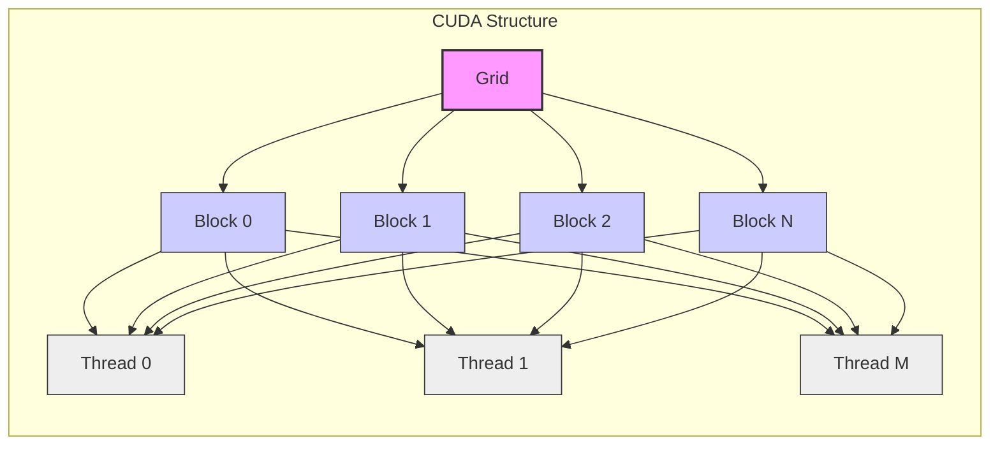
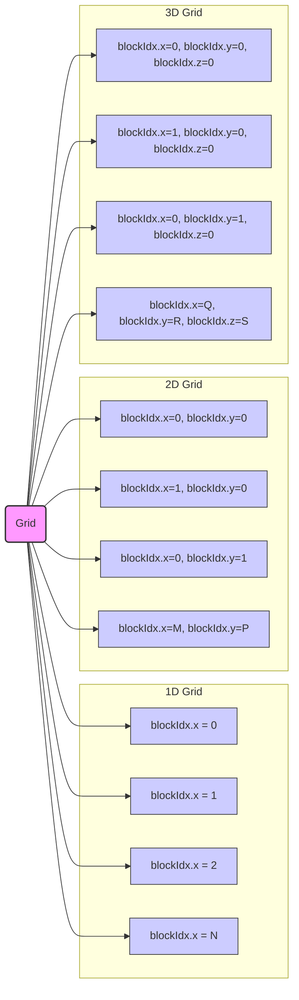
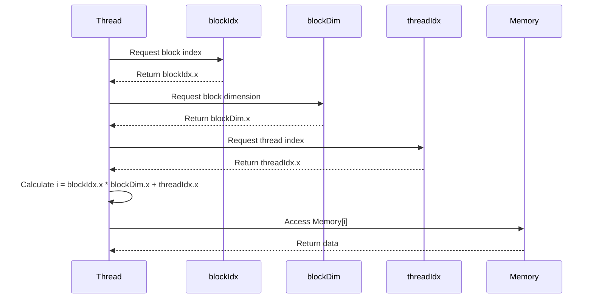
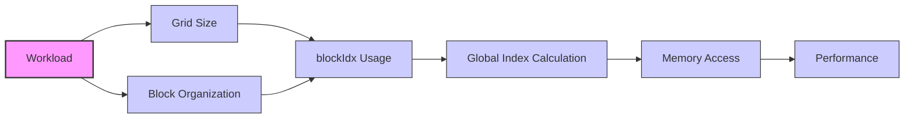
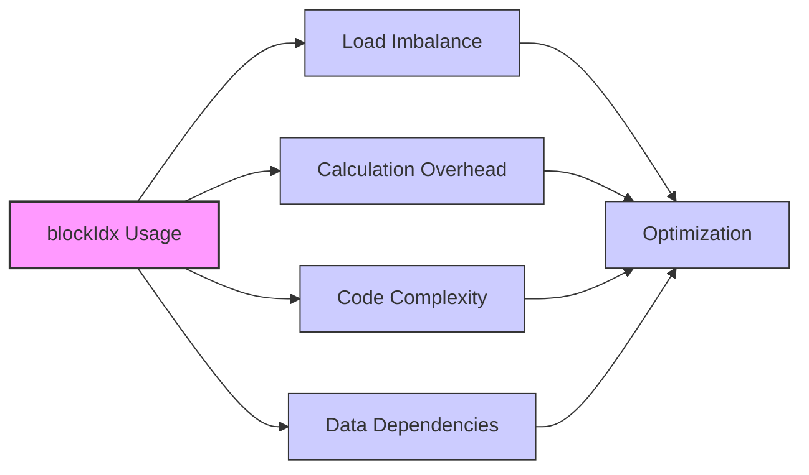

Okay, I will add Mermaid diagrams to the text to enhance understanding, focusing on architecture and system relationships as requested.

## `blockIdx` Variable in CUDA: Identifying Thread Blocks within a Grid



### Introdução

Em CUDA, a variável `blockIdx` é uma variável predefinida que fornece um identificador único para cada *thread block* (ou simplesmente *block*) dentro de um *grid*. Essa variável é utilizada para o cálculo do índice global de cada *thread*, para a organização da execução paralela, e para o acesso à memória em aplicações CUDA. A compreensão detalhada de como a variável `blockIdx` funciona e como ela é utilizada em conjunto com outras variáveis predefinidas, é fundamental para o desenvolvimento de aplicações que explorem todo o potencial da arquitetura paralela da GPU. Este capítulo explora em profundidade a variável `blockIdx`, detalhando sua estrutura, seus componentes, sua utilização no cálculo do índice global, e sua importância para a organização da execução de *kernels* em CUDA, sempre com base nas informações fornecidas no contexto.

### Definição e Estrutura da Variável `blockIdx`

A variável `blockIdx` é uma variável predefinida que contém o índice do *thread block* dentro do *grid*, e cada *block* dentro do *grid* possui um índice único, que pode ser acessado através dessa variável. A variável `blockIdx` é utilizada para o cálculo do índice global de um *thread*, e também para identificar a porção dos dados que será processada por um determinado *block*. A variável `blockIdx` é um vetor que possui três componentes: `blockIdx.x`, `blockIdx.y` e `blockIdx.z`, que indicam a posição do *block* em três dimensões.

**Conceito 1: `blockIdx` como Identificador do Bloco**

*   **`blockIdx`:** A variável `blockIdx` é um vetor que contém o índice do *thread block* dentro do *grid*, que é utilizada para identificar a posição do bloco e para o cálculo do índice global de cada *thread*.
*   **`blockIdx.x`:** O componente `blockIdx.x` especifica o índice do *block* na dimensão x do *grid*.
*   **`blockIdx.y`:** O componente `blockIdx.y` especifica o índice do *block* na dimensão y do *grid*.
*   **`blockIdx.z`:** O componente `blockIdx.z` especifica o índice do *block* na dimensão z do *grid*.
*   **Predefinida:** A variável `blockIdx` é uma variável predefinida que é inicializada automaticamente pelo *driver* CUDA, e que não pode ser modificada pelo programador.

**Lemma 1:** A variável `blockIdx` é uma variável predefinida que contém o índice de um *block* dentro do *grid*, e a sua utilização é essencial para que cada *thread* calcule o seu índice global e acesse a parte correta dos dados.

**Prova:** A variável `blockIdx` permite que os *threads* identifiquem o *block* em que estão executando e utilizem essa informação para o acesso à memória global, e o *driver* CUDA é responsável por inicializar as variáveis de forma apropriada. $\blacksquare$

O diagrama a seguir ilustra como a variável `blockIdx` identifica a posição de cada *block* dentro de um *grid*, e como as diferentes componentes são utilizadas para a identificação, e como os *blocks* podem ser organizados em 1, 2 ou 3 dimensões.



**Prova do Lemma 1:** A variável `blockIdx` é a principal ferramenta para a organização dos *blocks* dentro dos *grids* e para que o código seja executado da forma correta. $\blacksquare$

**Corolário 1:** O entendimento da estrutura da variável `blockIdx` e da sua utilização é fundamental para o desenvolvimento de *kernels* CUDA que explorem o paralelismo e que garantam que a arquitetura da GPU seja utilizada de forma eficiente.

### Uso da `blockIdx` no Cálculo do Índice Global

A variável `blockIdx` é fundamental para o cálculo do índice global de um *thread* em um *kernel* CUDA, e a sua utilização é sempre feita em conjunto com as variáveis `threadIdx` e `blockDim`, que definem a localização do *thread* dentro do *block* e as dimensões do *block*. O índice global é utilizado para mapear os *threads* para os dados na memória global da GPU, e o seu cálculo correto é essencial para o funcionamento da aplicação.

**Conceito 2: `blockIdx` no Mapeamento de Threads e Dados**

*   **Cálculo do Índice Global:** A variável `blockIdx` é utilizada para calcular o índice global de cada *thread* através da combinação do índice do *block* com o índice do *thread* dentro do *block*, e do tamanho do *block*.
*   **Acesso a Dados:** O índice global é utilizado para acessar a parte correta dos dados na memória global, garantindo que cada *thread* execute a sua parte do trabalho de forma correta.
*   **Flexibilidade:** A utilização da variável `blockIdx`, e das outras variáveis predefinidas, permite que a aplicação seja flexível e se adapte a diferentes tamanhos de dados e diferentes arquiteturas de GPU.

**Lemma 2:** A variável `blockIdx` é utilizada para que os *threads* calculem a sua posição dentro do *grid*, e essa informação é combinada com a informação de `threadIdx` e `blockDim` para o cálculo do índice global de cada *thread*.

**Prova:** O índice global permite que cada *thread* acesse os dados que lhe correspondem de forma a evitar conflitos ou que a informação seja sobreposta por outro *thread*, e o uso da variável `blockIdx` é fundamental para que esse índice seja calculado corretamente. $\blacksquare$

O exemplo a seguir demonstra como utilizar a variável `blockIdx` em conjunto com as variáveis `threadIdx` e `blockDim` para calcular o índice global em um *kernel* 1D:

```c++
__global__ void kernelExample(float* A, float* B, int n) {
    int i = blockIdx.x * blockDim.x + threadIdx.x;
    if (i < n) {
        B[i] = A[i] * 2;
    }
}
```

Nesse exemplo, o índice global `i` é calculado combinando a variável `blockIdx.x` (que especifica o índice do *block* na dimensão x) com as variáveis `blockDim.x` (que especifica o tamanho do *block*) e `threadIdx.x` (que especifica o índice do *thread* dentro do *block*), e o índice `i` é utilizado para acessar os dados na memória global.



**Prova do Lemma 2:** A utilização das variáveis `blockIdx`, `blockDim` e `threadIdx` permite o cálculo do índice global, que é utilizado para o acesso aos dados na memória, e o trabalho é distribuído para todos os *threads*. $\blacksquare$

**Corolário 2:** O uso correto da variável `blockIdx` e a compreensão do seu papel no cálculo do índice global são essenciais para o desenvolvimento de *kernels* CUDA que utilizem a arquitetura paralela de forma eficiente.

### Dimensionalidade da `blockIdx`: 1D, 2D e 3D

A variável `blockIdx` é um vetor que possui até três componentes (`blockIdx.x`, `blockIdx.y` e `blockIdx.z`), o que permite que os *blocks* sejam organizados em uma, duas ou três dimensões. A dimensionalidade da variável `blockIdx` é definida implicitamente pela dimensionalidade do *grid*, e é utilizada para definir a forma como os *blocks* são organizados no *grid*, e para o cálculo correto do índice global.

**Conceito 3: Organização do Grid em Diferentes Dimensões**

*   **`blockIdx.x`:** O componente `blockIdx.x` especifica o índice do *block* na dimensão x do *grid*. Em um *grid* 1D, apenas o componente `blockIdx.x` é utilizado.
*   **`blockIdx.y`:** O componente `blockIdx.y` especifica o índice do *block* na dimensão y do *grid*, e é utilizado quando o *grid* é organizado em 2D ou 3D.
*   **`blockIdx.z`:** O componente `blockIdx.z` especifica o índice do *block* na dimensão z do *grid*, e é utilizado quando o *grid* é organizado em 3D.
*   **Dimensionalidade do Grid:** A escolha da dimensionalidade do *grid* e, consequentemente, a utilização ou não dos componentes `blockIdx.y` e `blockIdx.z`, dependem da natureza do problema e da forma como os dados são organizados.

**Lemma 3:** A utilização dos componentes `blockIdx.x`, `blockIdx.y` e `blockIdx.z` permite que os *blocks* sejam organizados em *grids* unidimensionais, bidimensionais ou tridimensionais, e que o índice global seja calculado de forma correta em diferentes situações.

**Prova:** O uso das três dimensões garante que o modelo de programação seja flexível e que se adapte a diferentes formas de organizar os dados para o processamento paralelo. $\blacksquare$

O exemplo a seguir ilustra o uso da variável `blockIdx` em *kernels* com *grids* 1D, 2D e 3D:

```c++
__global__ void kernel1D(float* A, float* B, int n) {
    int i = blockIdx.x * blockDim.x + threadIdx.x;
    if (i < n) B[i] = A[i] * 2;
}

__global__ void kernel2D(float* A, float* B, int width, int height) {
    int x = blockIdx.x * blockDim.x + threadIdx.x;
    int y = blockIdx.y * blockDim.y + threadIdx.y;
    if (x < width && y < height) B[y * width + x] = A[y * width + x] * 2;
}

__global__ void kernel3D(float* A, float* B, int width, int height, int depth) {
    int x = blockIdx.x * blockDim.x + threadIdx.x;
    int y = blockIdx.y * blockDim.y + threadIdx.y;
    int z = blockIdx.z * blockDim.z + threadIdx.z;
    if(x < width && y < height && z < depth) B[z * width * height + y * width + x] = A[z * width * height + y * width + x] * 2;
}
```
Nesses exemplos, os componentes da variável `blockIdx` são utilizados no cálculo do índice global para diferentes dimensionalidades.

**Prova do Lemma 3:** A utilização da variável `blockIdx` e dos seus componentes garante que o código seja executado de forma correta em qualquer dimensionalidade, e o uso dessas variáveis predefinidas permite que a execução paralela seja feita de forma eficiente. $\blacksquare$

**Corolário 3:** A flexibilidade da variável `blockIdx` permite que a execução paralela seja adaptada a diferentes tipos de problemas e diferentes estruturas de dados, e garante que a aplicação seja portável e eficiente em diferentes situações.

### Otimizações no Uso da `blockIdx`

**Pergunta Teórica Avançada:** Como a escolha do tamanho do *grid* e a organização dos *blocks* dentro do *grid* afetam o desempenho da execução de *kernels* CUDA que utilizam a variável `blockIdx`, e quais as melhores práticas para otimizar essas operações?

**Resposta:** A otimização do uso da variável `blockIdx` envolve:

1.  **Tamanho do Grid:** A escolha do tamanho do *grid* deve ser feita de forma que a carga de trabalho seja distribuída uniformemente entre todos os *blocks*. O número de *blocks* deve ser grande o suficiente para explorar todo o paralelismo oferecido pelo *hardware*.
2.  **Organização dos Blocks:** A organização dos *blocks* em um *grid* 1D, 2D ou 3D deve ser feita considerando a estrutura dos dados, e a forma como eles são acessados. A escolha da dimensionalidade do *grid* deve ser feita de forma que o acesso à memória seja o mais eficiente possível.
3.  **Cálculo do Índice Global:** O cálculo do índice global, que utiliza a variável `blockIdx`, deve ser otimizado para evitar cálculos desnecessários e para que o índice seja calculado da forma mais rápida possível. Operações de deslocamento de *bits* podem substituir multiplicações para aumentar a eficiência, e simplificar o código.

**Lemma 4:** A escolha do tamanho do *grid*, a organização dos *blocks* de forma adequada, e a otimização do cálculo do índice global, que utiliza a variável `blockIdx`, são fundamentais para o desenvolvimento de aplicações CUDA de alto desempenho.

**Prova:** A escolha adequada dos parâmetros de lançamento do *kernel* e o cálculo eficiente do índice global permite que os *threads* executem suas tarefas da melhor forma possível. $\blacksquare$

O diagrama abaixo mostra como o planejamento do tamanho do *grid*, da utilização da variável `blockIdx` e a organização dos *blocks* influenciam o desempenho da aplicação.



**Prova do Lemma 4:** A otimização da organização dos *threads* e da forma como os dados são acessados é essencial para que a aplicação funcione de forma eficiente. $\blacksquare$

**Corolário 4:** A otimização do uso da variável `blockIdx`, e de como ela influencia a organização do *grid* e o cálculo do índice global é fundamental para o desenvolvimento de aplicações CUDA que utilizem o potencial de processamento paralelo da GPU da forma mais eficiente possível.

### Desafios e Limitações da Variável `blockIdx`

**Pergunta Teórica Avançada:** Quais são os principais desafios e limitações na utilização da variável `blockIdx` em CUDA, e como esses desafios podem ser abordados para melhorar a escalabilidade e a robustez das aplicações?

**Resposta:** A utilização da variável `blockIdx` apresenta alguns desafios e limitações:

1.  **Desbalanceamento de Carga:** O desbalanceamento de carga entre os *blocks*, que ocorre quando alguns *blocks* têm mais trabalho do que outros, pode levar à ociosidade de alguns núcleos de processamento da GPU, diminuindo o desempenho da aplicação, e a escolha cuidadosa do tamanho dos *blocks* é uma forma de atenuar esse problema.

2.  ***Overhead* do Cálculo:** O cálculo do índice global, que utiliza a variável `blockIdx`, adiciona um *overhead* ao tempo de execução do *kernel*, que deve ser minimizado para que o desempenho seja o maior possível.

3.  **Complexidade do Código:** O uso excessivo de cálculos complexos com `blockIdx` e `threadIdx` pode dificultar a leitura e a manutenção do código, que precisa ser planejado de forma a ser o mais simples possível, sem comprometer a sua funcionalidade.
4.  **Dependências de Dados:** O acesso aos dados, baseado no valor de `blockIdx`, pode gerar dependências de dados, que devem ser cuidadosamente tratadas, utilizando técnicas de sincronização e compartilhamento de memória adequadas.

**Lemma 5:** O desbalanceamento de carga, o *overhead* do cálculo do índice global, a complexidade do código e as dependências de dados são os principais desafios e limitações no uso da variável `blockIdx`, e o conhecimento desses desafios é fundamental para a criação de aplicações eficientes.

**Prova:** O uso adequado das ferramentas e o planejamento da execução são importantes para a criação de aplicações que sejam robustas e que tenham bom desempenho. $\blacksquare$

Para superar esses desafios, é importante utilizar técnicas de otimização, como o *load balancing* dinâmico, a utilização da memória compartilhada e a implementação eficiente do código, e o planejamento cuidadoso da estrutura do *grid* e dos acessos à memória.



**Prova do Lemma 5:** O conhecimento dos problemas e a utilização de técnicas para o tratamento desses problemas permitem que a aplicação seja executada de forma correta e eficiente. $\blacksquare$

**Corolário 5:** O desenvolvimento de aplicações CUDA robustas e escaláveis exige um conhecimento profundo dos mecanismos de execução paralela, e das limitações inerentes à arquitetura CUDA, além do uso correto das ferramentas de otimização e depuração.

### Conclusão

A variável `blockIdx` é fundamental para o mapeamento dos *blocks* no *grid* e para a implementação da execução paralela em CUDA. A compreensão da estrutura da variável `blockIdx`, e do seu papel no cálculo do índice global, juntamente com a utilização adequada das variáveis `threadIdx` e `blockDim` é essencial para que os *threads* acessem a parte correta dos dados e que o processamento ocorra de forma eficiente e correta. O conhecimento detalhado desses mecanismos é essencial para que o programador seja capaz de usar a GPU da forma mais eficiente possível e criar aplicações de alto desempenho.

Deseja que eu continue com as próximas seções?
### Referências

[^14]: "Each thread in a block has a unique threadIdx value... In Figure 3.10, a data index i is calculated as i = blockIdx.x * blockDim.x + threadIdx.x." *(Trecho de <página 54>)*

Deseja que eu continue com as próximas seções?
