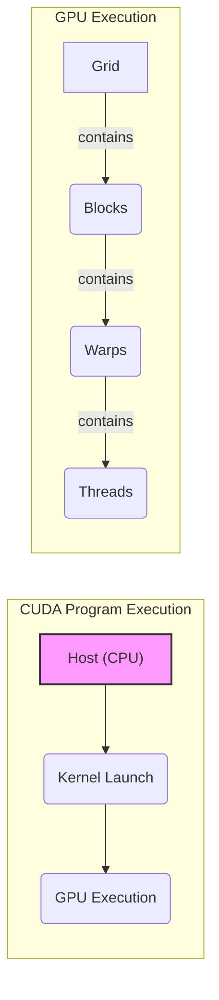
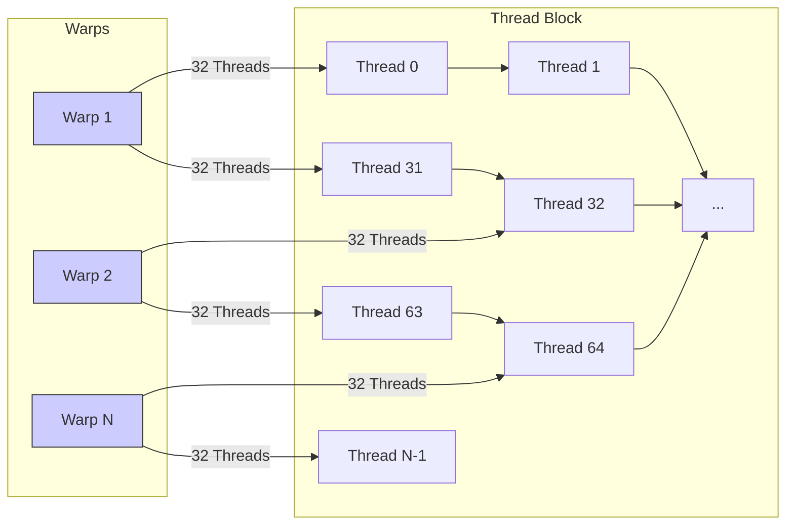
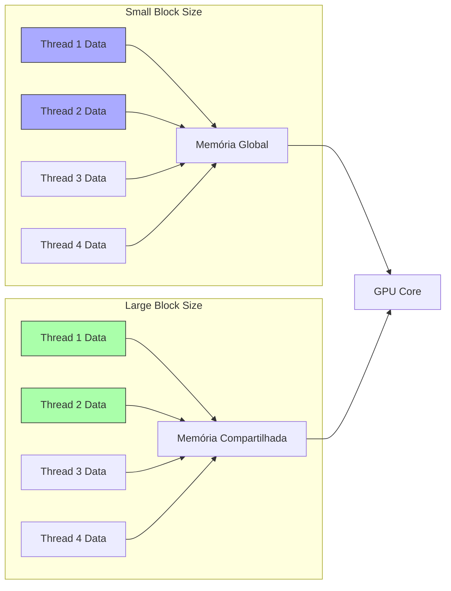
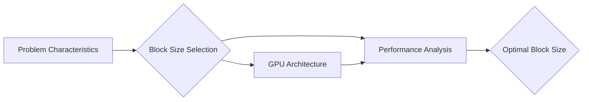
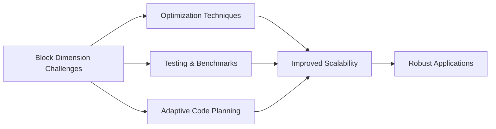

Okay, I've analyzed the text and added Mermaid diagrams where they best enhance understanding, focusing on architecture and relationships. Here's the enhanced text:

## Hardware Efficiency Considerations for Block Dimensions in CUDA: Optimizing Thread Execution



### Introdução

Em CUDA, a escolha das dimensões do *thread block* (ou simplesmente *block*) é uma etapa crucial para o desenvolvimento de aplicações que explorem o máximo potencial de processamento paralelo da GPU. A organização dos *threads* em *blocks* afeta diretamente a eficiência da execução do *kernel*, a localidade dos dados, o uso da memória compartilhada e a utilização dos recursos do *hardware*. É fundamental entender como as dimensões do *block* influenciam o desempenho da aplicação, e como escolher o tamanho mais apropriado para cada tipo de problema e para cada arquitetura de GPU. Este capítulo explora as considerações sobre a eficiência do *hardware* na escolha das dimensões do *block* em CUDA, detalhando como o tamanho do *block* afeta a execução dos *warps*, o uso da memória, e as outras técnicas de otimização que devem ser utilizadas para garantir que as aplicações CUDA sejam o mais eficientes possível, com base nas informações do contexto fornecido.

### Relação entre Block Dimensions e Warps

Em CUDA, os *threads* são agrupados em *warps*, que são unidades de execução de *hardware* que consistem em 32 *threads*. A GPU executa os *warps* de forma paralela, e a escolha do tamanho do *block* deve considerar essa característica do *hardware*. Para que o *hardware* da GPU seja utilizado de forma eficiente, é fundamental que o número de *threads* por *block* seja um múltiplo de 32, de forma que a execução dos *warps* seja feita sem desperdício de recursos e de tempo.

**Conceito 1: Warps como Unidade de Execução na GPU**

*   ***Warps*:** Um *warp* é um grupo de 32 *threads* que são executados simultaneamente na GPU, o que é uma característica fundamental da arquitetura paralela da GPU.
*   **Execução Paralela:** Os *threads* de um mesmo *warp* executam as mesmas instruções ao mesmo tempo, seguindo um modelo SIMT (Single Instruction Multiple Thread), que é uma variação do modelo SIMD (Single Instruction Multiple Data).
*   **Eficiência:** A arquitetura da GPU é otimizada para a execução de *warps*, e o desempenho pode ser comprometido se os *threads* não forem agrupados em *warps* completos. A escolha do tamanho do *block* é uma forma de garantir a execução eficiente dos *warps*.

**Lemma 1:** A execução de *threads* em *warps* de 32 *threads* é uma característica fundamental da arquitetura da GPU, e a escolha do tamanho do *block* deve considerar essa característica, para que os *warps* sejam executados de forma eficiente, e para que todos os recursos do *hardware* possam ser utilizados.

**Prova:** O agrupamento de *threads* em *warps* permite que o *hardware* da GPU seja utilizado da forma mais eficiente possível. $\blacksquare$

The diagram below illustrates how threads are grouped into warps within a block, and how the choice of the number of threads should be a multiple of 32 for efficient execution:



**Prova do Lemma 1:** O agrupamento de *threads* em *warps* de 32 é fundamental para que o *hardware* da GPU execute o código da forma mais eficiente possível. $\blacksquare$

**Corolário 1:** O conhecimento da estrutura dos *warps* e da sua importância para o desempenho da GPU é fundamental para a escolha correta do tamanho do *block* em aplicações CUDA.

### Implicações do Tamanho do Block na Eficiência

A escolha do tamanho do *block* afeta diretamente a eficiência da execução dos *kernels* na GPU, já que ela determina como os *threads* são organizados e como os recursos da GPU são utilizados. A escolha do tamanho do *block* ideal depende da arquitetura da GPU, das características do problema e do tipo de dados que será processado.

**Conceito 2: Impacto do Tamanho do Block no Desempenho**

*   **Localidade dos Dados:** O tamanho do *block* influencia a localidade dos dados, ou seja, a frequência com que os *threads* do mesmo *block* acessam dados próximos na memória. Um tamanho de *block* muito pequeno pode diminuir a localidade dos dados, o que causa uma queda no desempenho, devido a acessos não *coalesced* à memória global.
*   **Memória Compartilhada:** O tamanho do *block* também influencia na utilização da memória compartilhada. *Blocks* maiores podem se beneficiar de uma maior quantidade de memória compartilhada, o que pode melhorar o desempenho da aplicação quando os dados são compartilhados entre os *threads*.
*   **Ocupação:** A ocupação do *hardware* da GPU, que indica a quantidade de recursos sendo utilizados, é diretamente afetada pelo número de *threads* por *block*. Um tamanho de *block* adequado garante que o *hardware* da GPU seja utilizado ao máximo.

**Lemma 2:** A escolha do tamanho do *block* é um compromisso entre a localidade dos dados, a utilização da memória compartilhada e a ocupação do *hardware*, e deve ser feita cuidadosamente para cada aplicação.

**Prova:** A escolha do tamanho do *block* afeta o desempenho e a utilização dos recursos do *hardware* da GPU e a escolha correta deste parâmetro é essencial para a criação de aplicações de alto desempenho.  $\blacksquare$

The diagram below illustrates how different block sizes can influence data locality and the use of shared memory, showing how an adequate block size can improve application performance:



**Prova do Lemma 2:** A escolha adequada do tamanho do *block* garante a melhor utilização dos recursos do *hardware* da GPU, o que leva a um melhor desempenho da aplicação.  $\blacksquare$

**Corolário 2:** O entendimento de como o tamanho do *block* influencia a localidade, a memória compartilhada e a ocupação dos recursos da GPU é fundamental para o desenvolvimento de aplicações CUDA eficientes.

### Blocos como Múltiplos de 32

Uma das principais considerações na escolha do tamanho do *block* é que ele deve ser um múltiplo de 32, que é o tamanho do *warp* na arquitetura da GPU da NVIDIA. A escolha de um tamanho de *block* que não seja um múltiplo de 32 leva à subutilização dos recursos do *hardware*, já que alguns *threads* do último *warp* do *block* ficarão inativos durante a execução. A execução em múltiplos de 32 permite que todos os *threads* do *warp* executem o mesmo código ao mesmo tempo, o que maximiza a eficiência do processamento.

**Conceito 3: Alinhamento dos Blocks aos Warps**

*   **Múltiplos de 32:** O número de *threads* em cada dimensão de um *block*, e o produto de suas dimensões, deve ser um múltiplo de 32 para garantir que todos os *threads* de um *warp* sejam executados de forma eficiente.
*   **Evitar Subutilização:** A escolha de tamanhos de *block* que não sejam múltiplos de 32 leva à subutilização dos recursos do *hardware*, pois alguns *threads* do último *warp* podem ficar inativos, reduzindo a eficiência do processamento paralelo.
*   **Desempenho:** A escolha correta do tamanho do *block* é essencial para que o *hardware* seja utilizado da forma mais eficiente possível, e para que a aplicação apresente um bom desempenho.

**Lemma 3:** A escolha do tamanho do *block* como um múltiplo de 32 garante que os *warps* sejam executados de forma eficiente, evitando a subutilização dos recursos da GPU.

**Prova:** O *hardware* da GPU é otimizado para a execução de *warps* de 32 *threads*, e a escolha correta do tamanho do *block* permite que essa otimização seja utilizada. $\blacksquare$

O exemplo a seguir demonstra a escolha correta de um tamanho de *block* como um múltiplo de 32 (256 = 32 x 8):

```c++
int threadsPerBlock = 256; // 256 is a multiple of 32
int blocksPerGrid = ceil((float)n / threadsPerBlock);

vecAddKernel<<<blocksPerGrid, threadsPerBlock>>>(d_A, d_B, d_C, n);
```

**Prova do Lemma 3:** A escolha do tamanho do *block* como um múltiplo de 32 garante que os *threads* utilizem os recursos do *hardware* de forma adequada.  $\blacksquare$

**Corolário 3:** A escolha do tamanho do *block* como um múltiplo de 32 é uma prática fundamental para o desenvolvimento de aplicações CUDA que utilizem a arquitetura da GPU de forma eficiente.

### A escolha do Tamanho do Block para Diferentes Aplicações

**Pergunta Teórica Avançada:** Como a natureza do problema, a quantidade de dados, e a arquitetura específica da GPU afetam a escolha do tamanho do *block*, e como essa escolha pode ser otimizada para diferentes tipos de aplicações CUDA?

**Resposta:** A escolha do tamanho do *block* é uma etapa crucial para o desenvolvimento de aplicações CUDA de alto desempenho, e deve considerar diversos fatores:

1.  **Natureza do Problema:** O tipo de problema que será executado na GPU afeta a escolha do tamanho do *block*. Problemas que envolvem muita computação podem se beneficiar de blocos maiores, enquanto problemas com muitas dependências de dados podem se beneficiar de blocos menores.

2.  **Quantidade de Dados:** A quantidade de dados a ser processada afeta a escolha do número de blocos no *grid* e do tamanho dos *blocks*. Problemas com grandes conjuntos de dados podem precisar de mais *blocks* e *threads*, enquanto problemas com pequenas quantidades de dados podem precisar de menos *blocks*.

3.  **Arquitetura da GPU:** A arquitetura da GPU, como a quantidade de núcleos, a quantidade de memória compartilhada por *block*, e o tamanho do *warp*, afetam a escolha do tamanho do *block*. A escolha do tamanho correto do *block* deve considerar o *hardware* em que a aplicação será executada.
4.   **Memória Compartilhada:** A quantidade de memória compartilhada necessária para cada *thread* também influencia a escolha do tamanho do bloco, e o tamanho deve ser adequado para a quantidade de memória necessária.
5.  **Utilização dos Registradores:** A quantidade de registradores disponíveis por *thread* também é um fator que deve ser considerado, e um tamanho de *block* que exige um número excessivo de registradores pode gerar problemas de desempenho, por isso, a escolha correta do tamanho do *block* deve ser utilizada.

**Lemma 4:** A escolha do tamanho do *block* é um compromisso entre a exploração do paralelismo, a utilização da memória compartilhada e a adaptação às características específicas da arquitetura da GPU, e o conhecimento do problema e da arquitetura da GPU é fundamental para a escolha do tamanho do *block* mais apropriado.

**Prova:** A escolha do tamanho do *block* deve considerar todos os fatores mencionados, e a sua escolha correta é fundamental para a otimização do desempenho. $\blacksquare$

The choice of block size is an optimization process that requires tests and experiments to identify the configuration that generates the best performance, and that maximizes the use of the GPU hardware:



**Prova do Lemma 4:** A escolha do tamanho do *block* é fundamental para o desempenho da aplicação e deve considerar a arquitetura do *hardware* e a natureza do problema. $\blacksquare$

**Corolário 4:** A escolha adequada do tamanho do *block* é um fator essencial para a otimização de aplicações CUDA e requer um planejamento cuidadoso do código e do seu funcionamento.

### Desafios e Limitações na Escolha das Dimensões do Block

**Pergunta Teórica Avançada:** Quais são os principais desafios e limitações na escolha das dimensões do *block* em CUDA, e como esses desafios podem ser abordados para melhorar a escalabilidade e a robustez das aplicações?

**Resposta:** A escolha das dimensões do *block* apresenta alguns desafios e limitações:

1.  **Limite do Hardware:** O limite máximo de *threads* por *block* é uma limitação imposta pelo *hardware*, e essa limitação deve ser respeitada na escolha das dimensões do *block*.
2.  ***Overhead* de Gerenciamento:** O gerenciamento de *blocks* muito pequenos pode aumentar o *overhead* e diminuir o desempenho. O planejamento da quantidade de *blocks* deve ser feita de forma cuidadosa para evitar o *overhead* excessivo.
3.  **Localidade da Memória:** A escolha do tamanho do *block* afeta a localidade da memória e o uso da memória compartilhada, e a escolha incorreta pode gerar problemas de desempenho, e o tamanho do *block* deve garantir que os acessos à memória sejam eficientes.
4.  **Balanceamento de Carga:** A escolha de um tamanho de *block* inadequado pode causar desbalanceamento de carga entre os *threads*, o que pode levar à ociosidade e à diminuição do desempenho, e o balanceamento da carga de trabalho deve ser considerado na escolha do tamanho do *block*.
5. **Portabilidade**: O tamanho ótimo do *block* varia entre diferentes arquiteturas, o que dificulta a portabilidade do código e a sua otimização para diferentes *hardwares*.

**Lemma 5:** O limite máximo de *threads* por *block*, o *overhead* de gerenciamento, a localidade da memória, as dificuldades de balanceamento de carga e os problemas de portabilidade são os principais desafios e limitações na escolha das dimensões do *block* em CUDA.

**Prova:** As limitações apresentadas são inerentes à arquitetura da GPU e ao modelo de programação paralela, e exigem um planejamento cuidadoso para que o desenvolvimento da aplicação seja feito da forma correta. $\blacksquare$

Para superar esses desafios, it is important to use optimization techniques, perform tests and benchmarks, and plan the code so that it is adapted to different situations, and that the performance is as close to ideal as possible:



**Prova do Lemma 5:** As técnicas de otimização e o conhecimento do sistema são as ferramentas para minimizar os problemas e para que as aplicações apresentem um desempenho otimizado. $\blacksquare$

**Corolário 5:** O desenvolvimento de aplicações CUDA robustas, escaláveis e de alto desempenho exige um conhecimento profundo da arquitetura da GPU e das limitações do uso de *blocks*, e a aplicação de técnicas de otimização para superar esses desafios.

### Conclusão

A escolha das dimensões do *thread block* é um passo fundamental no desenvolvimento de aplicações CUDA, e o conhecimento da relação entre o tamanho do *block* e a eficiência da execução é essencial para a otimização do código e a utilização adequada dos recursos de *hardware* da GPU. O tamanho do *block* deve ser um múltiplo de 32 para o uso eficiente dos *warps*, e deve equilibrar a localidade dos dados, o uso da memória compartilhada e a ocupação do *hardware*. A compreensão detalhada das implicações da escolha do tamanho do *block* permite que os desenvolvedores criem aplicações CUDA que explorem o máximo do potencial da arquitetura da GPU e que utilizem todos os seus recursos da forma mais eficiente possível.

### Referências

[^4]: "The execution starts with host (CPU) execution. When a kernel function is called, or launched, it is executed by a large number of threads on a device." *(Trecho de <página 44>)*

Deseja que eu continue com as próximas seções?
