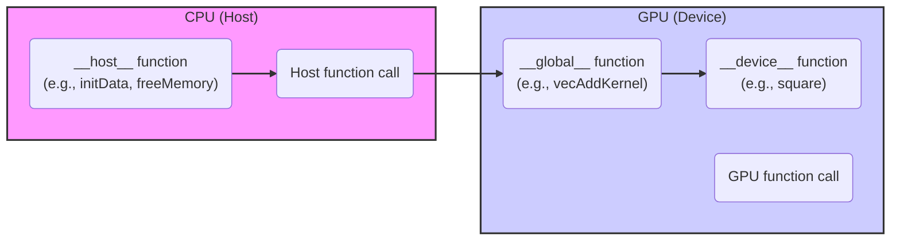
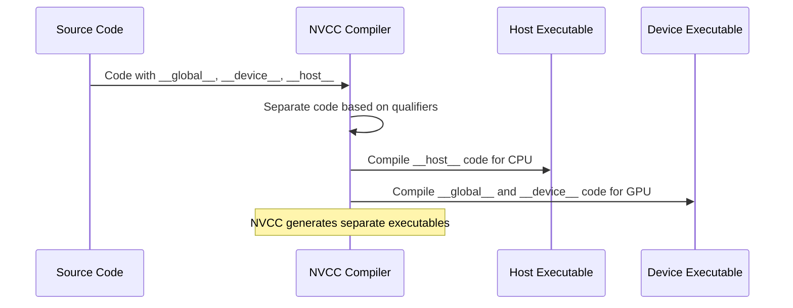

Okay, I will enhance the text with Mermaid diagrams as requested.

## CUDA Function Qualifiers: Directing Function Execution on Host and Device



### Introdução

Em CUDA, a linguagem C/C++ é estendida através do uso de **qualificadores de função** que permitem especificar onde uma função será executada: no *host* (CPU) ou no *device* (GPU). Os qualificadores de função são `__global__`, `__device__` e `__host__` e o seu uso correto é essencial para o desenvolvimento de aplicações CUDA que utilizem o modelo de programação heterogênea de forma eficiente. A compreensão de como esses qualificadores funcionam, e como eles direcionam a execução de código para diferentes processadores é fundamental para o desenvolvimento de aplicações que explorem todo o potencial da arquitetura CUDA. Este capítulo detalha o uso dos qualificadores de função em CUDA, explorando as suas características, a sua utilização, e a forma como eles afetam a organização e a execução das aplicações, sempre com base nas informações fornecidas no contexto.

### O Qualificador `__global__`: Definindo Kernel Functions

O qualificador `__global__` é utilizado para declarar funções que são executadas na GPU, e que são chamadas de *kernels*. Funções declaradas com `__global__` são o ponto de entrada para a execução paralela na GPU, e são chamadas a partir do código do *host* (CPU). As funções com `__global__` são executadas por vários *threads* simultaneamente, e são utilizadas para realizar os cálculos intensivos das aplicações CUDA.

**Conceito 1: Características das Funções `__global__`**

*   **Execução no Device:** Funções declaradas com o qualificador `__global__` são executadas na GPU (o *device*).
*   **Chamada pelo Host:** Funções declaradas com `__global__` são chamadas a partir do código do *host* (CPU), utilizando a sintaxe `<<<blocks, threads>>>`.
*   **Ponto de Entrada:** Uma função `__global__` é o ponto de entrada para a execução paralela na GPU, o que garante o início do processamento paralelo.
*   **Paralelismo:** A função é executada por vários *threads* de forma paralela, explorando o poder de processamento da GPU e as diversas unidades de processamento do *hardware*.
*   **Variáveis Predefinidas:** Funções declaradas com `__global__` têm acesso às variáveis predefinidas `threadIdx`, `blockIdx` e `blockDim`, e utilizam essas variáveis para calcular o índice global dos *threads*.

**Lemma 1:** O qualificador `__global__` indica que a função é um *kernel* e será executada na GPU e chamada pelo *host*, e permite que a execução paralela na GPU seja iniciada.

**Prova:** O qualificador `__global__` é essencial para que o código seja executado na GPU, e indica a função que serve de entrada para o processamento paralelo.  $\blacksquare$

O exemplo a seguir demonstra a utilização do qualificador `__global__` na declaração de um *kernel* de adição de vetores.

```c++
__global__ void vecAddKernel(float* A, float* B, float* C, int n) {
    int i = blockIdx.x * blockDim.x + threadIdx.x;
    if(i < n) {
       C[i] = A[i] + B[i];
    }
}
```
Nesse exemplo, o qualificador `__global__` indica que a função `vecAddKernel` é um *kernel* e será executada na GPU, e o código é executado por vários *threads* em paralelo, e esses *threads* utilizam as variáveis predefinidas para calcular o seu índice global e para acessar a memória de forma correta.

**Prova do Lemma 1:** O qualificador `__global__` indica a função que deve ser executada de forma paralela na GPU e garante que o código seja compilado para a arquitetura apropriada. $\blacksquare$

**Corolário 1:** A utilização do qualificador `__global__` é fundamental para a programação em CUDA, e permite que as funções sejam executadas na GPU com a arquitetura adequada, e utilizando o paralelismo oferecido pelo *hardware* da GPU.

### O Qualificador `__device__`: Definindo Funções Auxiliares na GPU

O qualificador `__device__` é utilizado para declarar funções que são executadas na GPU, mas que não são *kernels* e não podem ser chamadas diretamente a partir do *host*. Funções declaradas com `__device__` são utilizadas para criar funções auxiliares que podem ser utilizadas por *kernels* ou por outras funções `__device__`, e permitem organizar e modularizar o código do *device*, evitando a repetição de código.

**Conceito 2: Funções para Organização do Código na GPU**

*   **Execução no Device:** Funções declaradas com o qualificador `__device__` são executadas na GPU (o *device*).
*   **Chamadas no Device:** Funções declaradas com o qualificador `__device__` podem ser chamadas por *kernels* ou por outras funções declaradas também com o qualificador `__device__`.
*   **Funções Auxiliares:** Funções declaradas com `__device__` são utilizadas como funções auxiliares para o código do *device*, e são utilizadas para organizar o código e para evitar a repetição de código e para a modularização das funções do *device*.
*  **Acesso à Memória:** Funções com `__device__` podem acessar dados na memória global do *device*, e também podem utilizar os demais recursos da arquitetura da GPU.

**Lemma 2:** O qualificador `__device__` permite a declaração de funções auxiliares que são executadas na GPU, e permite a criação de código modularizado e reutilizável para o processamento paralelo na GPU.

**Prova:** As funções `__device__` permitem que o código da GPU seja mais fácil de entender e que o código possa ser reutilizado.  $\blacksquare$

O exemplo abaixo demonstra a utilização do qualificador `__device__` na declaração de uma função que eleva um número ao quadrado, e que pode ser chamada por um *kernel*.

```c++
__device__ float square(float x) {
    return x * x;
}

__global__ void kernelExample(float *A, float *B, int n) {
    int i = blockIdx.x * blockDim.x + threadIdx.x;
    if (i < n) {
        B[i] = square(A[i]);
    }
}
```
Nesse exemplo, a função `square` é declarada com o qualificador `__device__` e é utilizada no *kernel* `kernelExample` para calcular o quadrado de cada elemento do vetor.

**Prova do Lemma 2:** As funções com o qualificador `__device__` permitem organizar o código na GPU e reutilizar funções. $\blacksquare$

**Corolário 2:** A utilização do qualificador `__device__` é essencial para o desenvolvimento de aplicações CUDA que utilizam o modelo de programação paralela com organização modular e para a criação de aplicações mais robustas.

### O Qualificador `__host__`: Definindo Funções na CPU

O qualificador `__host__` é utilizado para declarar funções que são executadas no *host* (CPU), e que não podem ser chamadas diretamente a partir do código do *device* (GPU). Funções declaradas com `__host__` são utilizadas para executar tarefas de inicialização, transferência de dados, gerenciamento e outras tarefas que são executadas na CPU.

**Conceito 3: Funções para a Orquestração do Sistema**

*   **Execução no Host:** Funções declaradas com o qualificador `__host__` são executadas no *host* (CPU), e utilizadas para gerenciar as aplicações.
*   **Chamadas no Host:** Funções declaradas com o qualificador `__host__` podem ser chamadas por outras funções que também são executadas no *host*, e que fazem parte do código da aplicação.
*   **Tarefas de Orquestração:** Funções declaradas com `__host__` são utilizadas para controlar a execução dos *kernels*, para realizar operações de entrada e saída, para a alocação e liberação de memória e para a transferência de dados entre o *host* e o *device*.
*   **Default:** Se nenhuma declaração explícita do qualificador for fornecida, a função é considerada uma função de *host*, e o qualificador `__host__` pode ser opcional.

**Lemma 3:** O qualificador `__host__` é utilizado para definir funções que são executadas na CPU, e que realizam tarefas de gerenciamento da execução da aplicação, e de comunicação com o *device*.

**Prova:** As funções que são executadas na CPU são as que realizam a orquestração de todas as operações no sistema heterogêneo.  $\blacksquare$

O exemplo a seguir demonstra a utilização do qualificador `__host__` na declaração de uma função que inicializa os dados, e também como um qualificador opcional quando nenhuma declaração for feita.

```c++
__host__ void initData(float* h_A, float* h_B, int n) {
    for (int i = 0; i < n; i++) {
        h_A[i] = (float)i;
        h_B[i] = (float)(n - i);
    }
}

void freeMemory(float *h_A, float *h_B, float *h_C) {
    free(h_A);
    free(h_B);
    free(h_C);
}
```

Nesse exemplo, a função `initData` é declarada explicitamente com `__host__`, e é executada na CPU para inicializar os vetores, e a função `freeMemory` também é executada na CPU, mas o qualificador `__host__` não é obrigatório, já que ele é o valor *default* de uma função sem qualificador.

**Prova do Lemma 3:** O qualificador `__host__` é utilizado para declarar funções que são executadas na CPU, e a sua utilização explícita é opcional e pode ser utilizada para deixar o código mais claro e mais fácil de entender.  $\blacksquare$

**Corolário 3:** O qualificador `__host__` permite que o desenvolvedor defina claramente quais funções serão executadas na CPU e auxilia na organização e no entendimento do código.

### Compilação de Código com Diferentes Qualificadores

O compilador NVCC (NVIDIA CUDA Compiler) utiliza os qualificadores de função (`__global__`, `__device__` e `__host__`) para separar o código que será executado na CPU do código que será executado na GPU. O código com o qualificador `__global__` será compilado para a arquitetura da GPU e o código com o qualificador `__host__` será compilado para a arquitetura da CPU. O código com o qualificador `__device__` é compilado para a arquitetura da GPU e pode ser utilizado nos *kernels* e outras funções do *device*, gerando um código binário separado para cada processador.

**Conceito 4: O Papel do NVCC na Compilação do Código**

*   **Compilador NVCC:** O NVCC é o compilador da NVIDIA que é utilizado para compilar aplicações CUDA. O NVCC é responsável por separar o código que será executado no *host* do código que será executado no *device*, e por compilar o código para as arquiteturas apropriadas.
*   **Separação do Código:** O NVCC utiliza os qualificadores de função para identificar quais funções devem ser compiladas para o *host* e quais devem ser compiladas para o *device*.
*   **Geração de Código Binário:** O NVCC gera código binário para a CPU e para a GPU, utilizando os compiladores apropriados e as arquiteturas de *hardware* corretas.

**Lemma 4:** O compilador NVCC utiliza os qualificadores de função para separar o código que será executado no *host* do código que será executado no *device*, e gerar código executável para cada um dos processadores.

**Prova:** Os qualificadores são essenciais para que o compilador NVCC saiba como o código deve ser compilado. $\blacksquare$

O diagrama a seguir ilustra como o NVCC separa o código utilizando os qualificadores, e como ele compila o código para os diferentes processadores.



**Prova do Lemma 4:** O uso dos qualificadores permite que o compilador NVCC separe o código corretamente e compile cada parte para o processador apropriado.  $\blacksquare$

**Corolário 4:** O conhecimento do papel do NVCC na compilação e do uso correto dos qualificadores de função é fundamental para o desenvolvimento de aplicações CUDA, e para que a arquitetura heterogênea seja utilizada de forma eficiente.

### Desafios e Limitações dos Qualificadores de Função

**Pergunta Teórica Avançada:** Quais são os principais desafios e limitações no uso dos qualificadores de função `__global__`, `__device__` e `__host__` em CUDA, e como esses desafios podem ser abordados para melhorar a clareza, a segurança e a portabilidade das aplicações?

**Resposta:** A utilização dos qualificadores de função apresenta alguns desafios e limitações:

1.  **Restrição na Chamada de Funções:** Funções declaradas com `__global__` só podem ser chamadas pelo *host*, e funções declaradas com `__device__` só podem ser chamadas pelo *device*, o que exige um planejamento cuidadoso do fluxo de execução do programa.

2.  **Complexidade do Código:** O uso dos qualificadores de função pode aumentar a complexidade do código, e exige que o desenvolvedor entenda a interação entre o *host* e o *device* e como cada função se comporta nos diferentes processadores.

3.  **Duplicação de Código:** Em alguns casos, o mesmo código pode precisar ser executado tanto no *host* quanto no *device*. Para evitar a duplicação de código, a utilização de *templates* e outras técnicas podem ser utilizadas.

4.  **Portabilidade:** O uso dos qualificadores e de código específico para cada arquitetura de *hardware* pode dificultar a portabilidade das aplicações.

**Lemma 5:** As restrições na chamada de funções, a complexidade do código, a necessidade de duplicação e os problemas de portabilidade são os principais desafios da utilização dos qualificadores de função em aplicações CUDA.

**Prova:** O uso dos qualificadores exige um planejamento cuidadoso do código e das chamadas de função para que o programa funcione de forma correta. $\blacksquare$

Para superar esses desafios, é importante utilizar técnicas de programação, como a criação de funções reutilizáveis, a utilização de *templates* e de *macros* para simplificar o código, e realizar testes de portabilidade em diferentes arquiteturas de *hardware*.

**Prova do Lemma 5:** O conhecimento das limitações da linguagem e o uso de técnicas de programação permite que os problemas de portabilidade, de complexidade e de duplicação de código sejam mitigados. $\blacksquare$

**Corolário 5:** O conhecimento dos desafios e limitações da utilização dos qualificadores de função, e o uso de boas práticas de programação são essenciais para o desenvolvimento de aplicações CUDA robustas, portáveis e de fácil manutenção.

### Conclusão

Os qualificadores de função `__global__`, `__device__` e `__host__` são componentes essenciais da programação CUDA. O qualificador `__global__` define os *kernels* que são executados na GPU, o qualificador `__device__` define as funções auxiliares da GPU e o qualificador `__host__` define as funções executadas na CPU. O conhecimento do funcionamento e das implicações de cada um desses qualificadores, e do papel do compilador NVCC para a sua utilização é fundamental para o desenvolvimento de aplicações CUDA que utilizem todo o potencial da arquitetura heterogênea de forma eficiente.

### Referências

[^15]: "First, there is a CUDA specific keyword `__global__` in front of the declaration of `vecAddKernel()`. This keyword indicates that the function is a kernel and that it can be called from a host function to generate a grid of threads on a device." *(Trecho de <página 55>)*

[^16]: "The_host_ keyword indicates that the function being declared is a CUDA host function. A host function is simply a traditional C function that executes on the host and can only be called from another host function. By default, all functions in a CUDA program are host functions if they do not have any of the CUDA keywords in their declaration." *(Trecho de <página 56>)*

Deseja que eu continue com as próximas seções?
