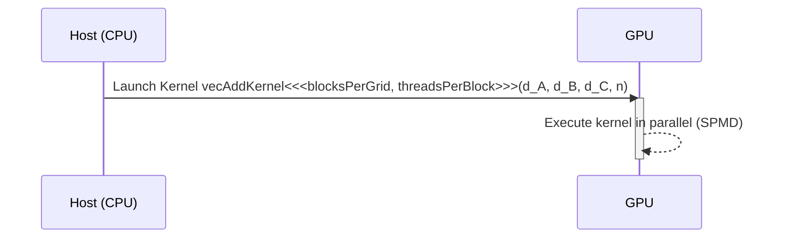
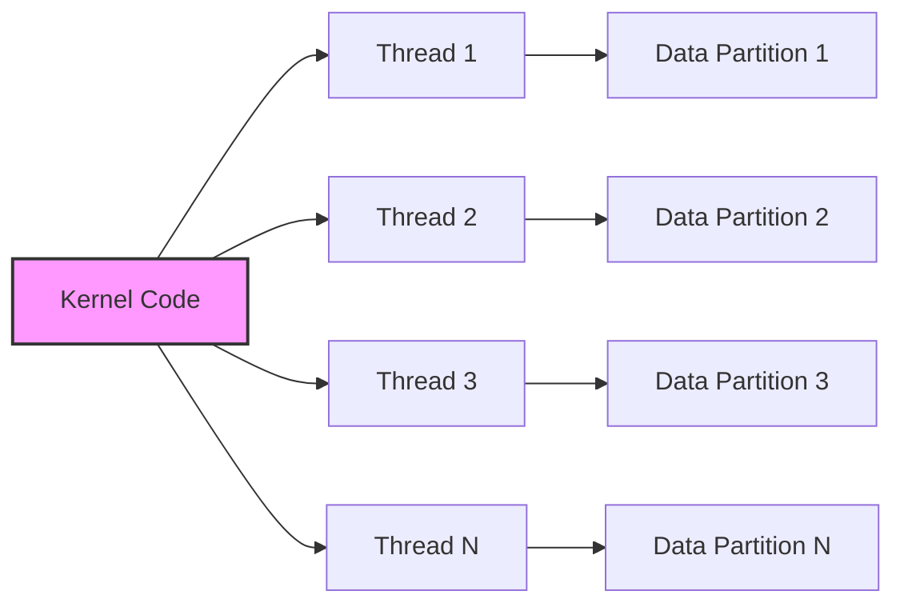

Okay, I will add Mermaid diagrams to enhance the provided text, focusing on architecture and system relationships as requested.

## `__global__` Keyword in CUDA: Defining Entry Points for Parallel Execution

```mermaid
graph LR
    A[Host (CPU)] -->|Kernel Launch| B(GPU);
    B --> C["Grid of Threads"];
    C --> D["Blocks of Threads"];
    D --> E["Individual Threads"];
    E --> F["Kernel Code Execution"];
    style A fill:#f9f,stroke:#333,stroke-width:2px
    style B fill:#ccf,stroke:#333,stroke-width:2px
    style C fill:#ddf,stroke:#333,stroke-width:2px
    style D fill:#eef,stroke:#333,stroke-width:2px
    style E fill:#ffc,stroke:#333,stroke-width:2px
    style F fill:#cfc,stroke:#333,stroke-width:2px
```

### Introdução

Em CUDA, o qualificador `__global__` é um elemento fundamental para a programação paralela, pois ele é utilizado para declarar as funções *kernel*, que são o ponto de entrada para a execução de código na GPU. As funções *kernel*, declaradas com `__global__`, são executadas por milhares de *threads* simultaneamente, e são responsáveis por realizar os cálculos intensivos das aplicações CUDA. Compreender o significado e o funcionamento do qualificador `__global__` é essencial para o desenvolvimento de aplicações CUDA que explorem todo o potencial da arquitetura da GPU, e esse conhecimento é fundamental para que a execução paralela seja realizada da forma correta. Este capítulo explora em profundidade o qualificador `__global__` em CUDA, detalhando as suas características, como ele define a execução das funções na GPU, a forma como as funções são chamadas, o seu papel no modelo de programação SPMD (Single Program Multiple Data), e como o qualificador `__global__` se relaciona com a arquitetura do *hardware* da GPU, sempre com base nas informações fornecidas no contexto.

### O Qualificador `__global__` e a Definição de Kernels

O qualificador `__global__` é uma extensão da linguagem C/C++ oferecida pela API CUDA, e é utilizada para declarar uma função como um *kernel*, que será executado na GPU por vários *threads* em paralelo. Funções declaradas com `__global__` podem ser chamadas a partir do código do *host* (CPU), utilizando a sintaxe `<<<blocks, threads>>>` que especifica a quantidade de *blocks* e de *threads* por *block* que serão utilizadas na execução paralela na GPU.

**Conceito 1: Características das Funções `__global__` (Kernels)**

*   **`__global__`:** O qualificador `__global__` é utilizado para declarar funções *kernel* que serão executadas na GPU.
*   **Execução no Device:** Funções declaradas com `__global__` são executadas no *device* (GPU), e não podem ser executadas na CPU.
*   **Chamada pelo Host:** Funções declaradas com `__global__` são chamadas a partir do código do *host* (CPU), através de um código específico da API CUDA.
*   **Ponto de Entrada:** Funções declaradas com `__global__` são o ponto de entrada para a execução paralela na GPU, e sem elas a GPU não tem um ponto de partida para a execução do código.
*   **Retorno Void:** Funções declaradas com `__global__` não retornam valores. A comunicação de resultados para o *host* é feita através da escrita em memória, que depois é transferida para o *host*, e não através do retorno de valores.
*  **Paralelismo:** A função é executada por vários *threads* em paralelo na GPU. Cada *thread* executa o mesmo código, mas sobre diferentes partes dos dados, explorando o paralelismo oferecido pela arquitetura da GPU.

**Lemma 1:** O qualificador `__global__` define uma função como um *kernel* que será executado na GPU, chamado a partir do *host*, e que é o ponto de entrada para a execução paralela da aplicação na GPU, e a função não retorna valores.

**Prova:** A utilização do qualificador `__global__` define a função como um *kernel*, que é executado na GPU, e sinaliza a função como o ponto de entrada para a computação paralela. $\blacksquare$

O exemplo abaixo demonstra a utilização do qualificador `__global__` na declaração de um *kernel* de adição de vetores, mostrando como a função é utilizada para a execução paralela na GPU.

```c++
__global__ void vecAddKernel(float* A, float* B, float* C, int n) {
    int i = blockIdx.x * blockDim.x + threadIdx.x;
    if (i < n) {
        C[i] = A[i] + B[i];
    }
}
```
Nesse exemplo, o qualificador `__global__` indica que a função `vecAddKernel` é um *kernel*, que será executado na GPU, e o código dentro da função é executado por todos os *threads* de forma paralela, e que o resultado é retornado através da escrita em memória.

**Prova do Lemma 1:** O uso do qualificador `__global__` é fundamental para que o compilador e o *driver* CUDA interpretem a função como um *kernel* a ser executado na GPU. $\blacksquare$

**Corolário 1:** O qualificador `__global__` é essencial para a programação paralela em CUDA, e permite que as aplicações explorem o poder de processamento das GPUs através da utilização de *kernels*.

### Chamada de Kernel a partir do Host

As funções *kernel*, declaradas com o qualificador `__global__`, são chamadas a partir do código do *host*, utilizando a sintaxe `<<<blocks, threads>>>`. Essa sintaxe especifica a quantidade de *blocks* no *grid* e a quantidade de *threads* por *block* que serão utilizados para executar o *kernel* na GPU. O *host* também envia os ponteiros para os dados do *device* que serão utilizados pelo *kernel*.

**Conceito 2: Sintaxe de Lançamento de Kernels**

*   **Sintaxe:** A sintaxe de lançamento de *kernels* é dada por: `kernelName<<<blocks, threads>>> (parameters);`
    *   `kernelName`: É o nome da função declarada com `__global__` que será executada na GPU.
    *   `blocks`: Define a quantidade de *blocks* que serão executados no *grid*.
    *   `threads`: Define a quantidade de *threads* que serão executados dentro de cada *block*.
    *   `parameters`: Define os parâmetros que serão passados para o *kernel*. Os parâmetros são ponteiros para a memória do *device*, e valores que são utilizados pelo código do *kernel*.

**Lemma 2:** A chamada de um *kernel* a partir do *host* é feita utilizando a sintaxe `<<<blocks, threads>>>`, que define a quantidade de *blocks* e *threads* que serão utilizados na execução paralela, e permite que o *host* envie os parâmetros necessários para a execução do *kernel*.

**Prova:** A sintaxe de lançamento de *kernels* é fundamental para o funcionamento da arquitetura CUDA, e essa sintaxe permite o uso dos recursos da GPU de forma otimizada. $\blacksquare$

O exemplo abaixo demonstra a utilização da sintaxe `<<<blocks, threads>>>` para o lançamento do *kernel* `vecAddKernel`.

```c++
int n = 1024;
int threadsPerBlock = 256;
int blocksPerGrid = ceil((float)n / threadsPerBlock);

vecAddKernel<<<blocksPerGrid, threadsPerBlock>>>(d_A, d_B, d_C, n);
```

Nesse exemplo, o *kernel* `vecAddKernel` é lançado com `blocksPerGrid` blocos e com `threadsPerBlock` *threads* por bloco, e os ponteiros `d_A`, `d_B`, `d_C` e a variável `n` são passados como parâmetros para a função.



**Prova do Lemma 2:** A chamada do *kernel* é feita pelo código do *host*, e a sintaxe `<<<blocks, threads>>>` permite que os parâmetros da execução paralela sejam definidos de forma clara. $\blacksquare$

**Corolário 2:** A sintaxe `<<<blocks, threads>>>` é essencial para o lançamento de *kernels* a partir do *host*, e define a quantidade de paralelismo que será utilizado na execução do código na GPU.

### Modelo SPMD e Execução dos Kernels

A execução das funções *kernel* segue o modelo SPMD (Single Program Multiple Data), o que significa que todos os *threads* executam o mesmo código do *kernel*, mas sobre diferentes partes do conjunto de dados. O modelo SPMD é a base da programação paralela em CUDA e define a forma como o trabalho é distribuído entre os *threads*, e como os dados são acessados na memória.

**Conceito 3: Paralelismo e o Paradigma SPMD**

*   **Single Program:** Todos os *threads* executam o mesmo código do *kernel*. Cada *thread* executa uma instância do código do *kernel*, sem que uma instrução específica seja executada em um *thread* específico.
*   **Multiple Data:** Cada *thread* opera sobre uma parte diferente dos dados, e o índice do *thread* é utilizado para determinar qual parte dos dados que o *thread* deverá acessar e processar.
*   **Paralelismo:** A execução de todos os *threads* ocorre de forma paralela na GPU, e cada *thread* realiza uma pequena parte do trabalho, contribuindo para o resultado final.
*   **Escalabilidade:** O modelo SPMD permite que as aplicações CUDA sejam escaláveis para diferentes arquiteturas de GPU, e permite que a aplicação utilize o *hardware* disponível de forma eficiente.

**Lemma 3:** O modelo SPMD é a base da execução de *kernels* em CUDA, e garante que o mesmo código seja executado sobre diferentes partes dos dados de forma paralela por milhares de *threads* na GPU.

**Prova:** A utilização do modelo SPMD garante que o código seja executado de forma paralela e distribuída entre os *threads* e, para isso, o uso de um mesmo código em diferentes partes da memória é fundamental.  $\blacksquare$

O diagrama a seguir ilustra o conceito do modelo SPMD, onde todos os *threads* executam o mesmo código, mas sobre diferentes partes do conjunto de dados e como cada *thread* utiliza o índice para acessar a parte correta dos dados.


**Prova do Lemma 3:** O modelo SPMD garante que o *hardware* da GPU seja utilizado da forma mais eficiente possível e que o processamento seja feito de forma paralela. $\blacksquare$

**Corolário 3:** A compreensão do modelo SPMD é fundamental para o desenvolvimento de *kernels* eficientes em CUDA, e para que o desenvolvedor seja capaz de escrever um código que seja executado de forma paralela na GPU.

### Desafios e Limitações das Funções `__global__`

**Pergunta Teórica Avançada:** Quais são os principais desafios e limitações na utilização do qualificador `__global__` em CUDA, e como esses desafios podem ser abordados para melhorar a escalabilidade, a robustez e a portabilidade das aplicações?

**Resposta:** A utilização do qualificador `__global__` apresenta alguns desafios e limitações:

1.  **Restrições no Uso:** Funções declaradas com `__global__` só podem ser chamadas pelo código do *host* e não podem retornar valores, o que pode limitar a flexibilidade do código.
2.  **Complexidade:** O código de um *kernel* deve ser escrito de forma a ser executado de forma paralela por muitos *threads* simultaneamente, o que pode aumentar a complexidade da programação.
3.  **Sincronização:** A sincronização entre os *threads* de um *kernel* pode adicionar *overhead* na execução, e os mecanismos para a sincronização devem ser utilizados de forma correta para garantir que a aplicação seja executada corretamente, o que dificulta a otimização do *kernel*.
4.  **Portabilidade:** A eficiência da execução de *kernels* pode variar entre diferentes arquiteturas de GPU, o que pode dificultar a portabilidade de aplicações CUDA, e o desenvolvedor precisa levar isso em consideração no desenvolvimento.

**Lemma 4:** A restrição na chamada de funções, a complexidade do código, a necessidade de sincronização e a dificuldade de portabilidade são os principais desafios e limitações na utilização do qualificador `__global__` em CUDA.

**Prova:** O uso dos qualificadores exige cuidado e conhecimento da API CUDA e do *hardware* da GPU para o desenvolvimento de aplicações que funcionem corretamente. $\blacksquare$

Para superar esses desafios, é importante utilizar técnicas de programação paralela, como o uso eficiente da memória compartilhada, o *coalescing* de acessos à memória global e o uso de mecanismos de sincronização adequados para que a aplicação seja portável e robusta, e para que o desempenho seja o esperado.

**Prova do Lemma 4:** O uso das técnicas de otimização e o conhecimento da arquitetura do *hardware* são fundamentais para o desenvolvimento de aplicações robustas e escaláveis.  $\blacksquare$

**Corolário 4:** O conhecimento das limitações e desafios na utilização do qualificador `__global__` é essencial para o desenvolvimento de aplicações CUDA de alto desempenho.

### Conclusão

O qualificador `__global__` é um elemento fundamental da programação CUDA e é utilizado para definir as funções *kernel* que serão executadas na GPU por milhares de *threads*. A compreensão detalhada do uso do qualificador `__global__`, da sintaxe de lançamento do *kernel* `<<<blocks, threads>>>`, e do modelo de programação SPMD é essencial para o desenvolvimento de aplicações que explorem o potencial de processamento paralelo das GPUs e para que a utilização da arquitetura da GPU seja utilizada da forma mais eficiente possível, e o desenvolvimento de código eficiente que utilize todo o potencial dos recursos disponíveis.

### Referências

[^15]: "First, there is a CUDA specific keyword `__global__` in front of the declaration of `vecAddKernel()`. This keyword indicates that the function is a kernel and that it can be called from a host function to generate a grid of threads on a device." *(Trecho de <página 55>)*

Deseja que eu continue com as próximas seções?
