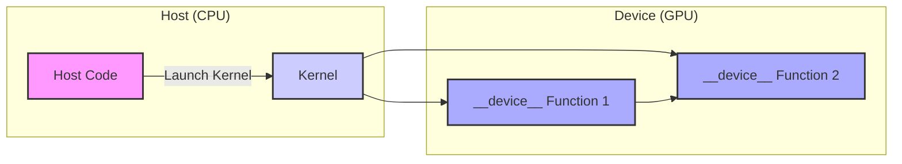
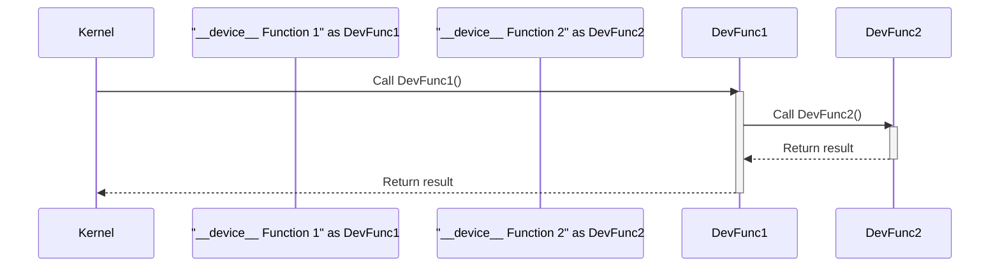
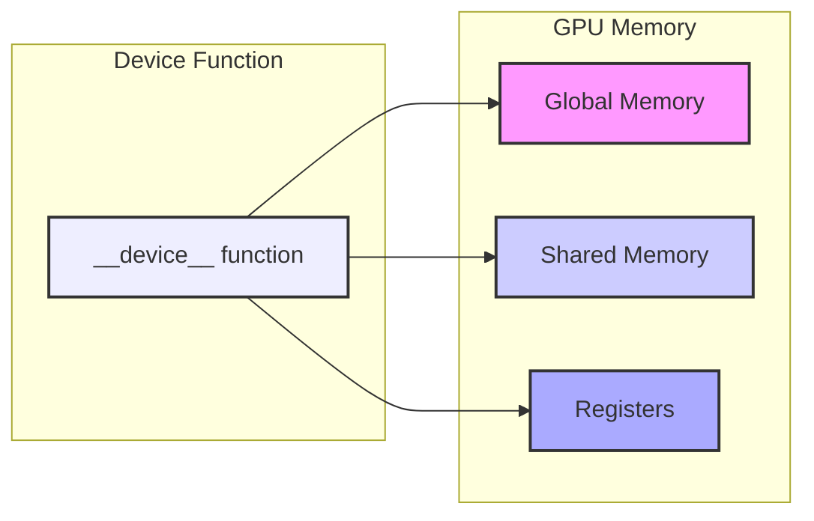

Okay, I've analyzed the provided text and added Mermaid diagrams to enhance the explanations. Here's the enhanced text with the diagrams:

## `__device__` Keyword in CUDA: Defining Device-Side Functions for Reusability and Modularity



### Introdução

Em CUDA, o qualificador `__device__` é utilizado para declarar funções que são executadas na GPU, e que são utilizadas como funções auxiliares pelos *kernels* e outras funções também executadas no *device*. As funções declaradas com `__device__` são uma forma de organizar o código e de promover a reutilização de código, além de permitir que funções complexas sejam divididas em partes menores e mais fáceis de gerenciar. A compreensão detalhada do uso do qualificador `__device__` é essencial para o desenvolvimento de aplicações CUDA robustas e para que o código seja bem organizado e eficiente. Este capítulo explora o qualificador `__device__` em profundidade, detalhando suas características, como ele define a execução das funções na GPU, como as funções são chamadas, as suas vantagens em termos de reutilização e modularização, e como o qualificador `__device__` se relaciona com a arquitetura da GPU, sempre com base nas informações do contexto fornecido.

### O Qualificador `__device__`: Funções Auxiliares na GPU

O qualificador `__device__` é utilizado para declarar funções que são executadas no *device* (GPU), mas que não podem ser chamadas diretamente do *host* (CPU). Funções declaradas com `__device__` são utilizadas como funções auxiliares para os *kernels*, e podem ser chamadas por outros *kernels*, ou por outras funções `__device__`. A utilização do qualificador `__device__` é uma ferramenta de modularização do código que é executado na GPU e ajuda na organização e na reutilização de código, o que facilita o desenvolvimento e a manutenção de aplicações complexas.

**Conceito 1: Características e Uso das Funções `__device__`**

*   **Execução no Device:** Funções declaradas com `__device__` são executadas na GPU (o *device*), assim como os *kernels*.
*   **Chamada pelo Device:** Funções declaradas com `__device__` só podem ser chamadas por outras funções executadas no *device*, incluindo *kernels* e outras funções `__device__`, o que define a forma como o código é organizado e modularizado.
*   **Funções Auxiliares:** Funções declaradas com `__device__` são utilizadas como funções auxiliares para o código do *device*, para que as operações sejam realizadas de forma mais clara e eficiente.
*   **Reutilização de Código:** Funções declaradas com `__device__` podem ser reutilizadas por diferentes *kernels* ou por outras funções `__device__`, o que evita a duplicação do código e facilita a manutenção da aplicação.
*  **Acesso à Memória:** Funções declaradas com `__device__` podem acessar a memória global do *device*, a memória compartilhada e os registradores, e também podem fazer uso de outros recursos de *hardware* da GPU.

**Lemma 1:** O qualificador `__device__` define funções auxiliares que são executadas na GPU, que são chamadas apenas por outras funções do *device*, e permitem organizar e modularizar o código que é executado na GPU, e evitar a duplicação de código e a dificuldade na manutenção de grandes aplicações.

**Prova:** A utilização de funções auxiliares permite a organização do código, e diminui a complexidade dos *kernels*.  $\blacksquare$

O diagrama abaixo ilustra como as funções `__device__` são utilizadas no código, e como elas são chamadas pelos *kernels* e por outras funções `__device__`, de forma a modularizar o código da GPU.



**Prova do Lemma 1:** A modularização do código em pequenas funções é fundamental para a legibilidade, a manutenção e o desenvolvimento de grandes aplicações.  $\blacksquare$

**Corolário 1:** O uso do qualificador `__device__` é fundamental para a criação de aplicações CUDA bem organizadas, e para que o código da GPU seja o mais eficiente e reutilizável possível.

### Uso de Funções `__device__` em Kernels

Funções declaradas com o qualificador `__device__` são utilizadas como funções auxiliares nos *kernels*, para realizar tarefas específicas que podem ser reutilizadas em diferentes partes do código do *kernel*, e que necessitam de processamento na GPU. O uso de funções `__device__` torna o código mais modular, mais fácil de manter, e mais fácil de entender.

**Conceito 2: Modularização do Código com Funções `__device__`**

*   **Reutilização de Código:** O uso de funções `__device__` permite que o código seja reutilizado em diferentes partes do mesmo *kernel* ou em diferentes *kernels*, diminuindo a duplicação de código e o tamanho da aplicação.
*   **Organização do Código:** Funções `__device__` permitem que o código seja organizado em partes menores e mais fáceis de entender, e que os algoritmos sejam divididos em etapas menores.
*   **Legibilidade e Manutenção:** O uso de funções `__device__` torna o código mais legível, mais fácil de manter e de corrigir erros, já que as funções são menores e mais fáceis de entender e de testar.

**Lemma 2:** A utilização de funções `__device__` dentro dos *kernels* é uma técnica fundamental para a modularização e organização do código CUDA, e permite que o código seja reutilizado, testado e mantido de forma mais eficiente.

**Prova:** O uso de funções para modularizar o código é uma boa prática de programação e o mesmo se aplica aos *kernels* em CUDA, através do uso do qualificador `__device__`. $\blacksquare$

O exemplo a seguir demonstra a utilização de uma função `__device__` dentro de um *kernel* para realizar o cálculo do quadrado de um número.

```c++
__device__ float square(float x) {
    return x * x;
}

__global__ void kernelExample(float *A, float *B, int n) {
    int i = blockIdx.x * blockDim.x + threadIdx.x;
    if (i < n) {
        B[i] = square(A[i]);
    }
}
```

Nesse exemplo, a função `square()` é declarada com o qualificador `__device__`, e é utilizada pelo *kernel* `kernelExample` para calcular o quadrado dos elementos do vetor.

**Prova do Lemma 2:** As funções declaradas com `__device__` tornam o código mais modular, mais fácil de ler e de manter.  $\blacksquare$

**Corolário 2:** A utilização de funções `__device__` é essencial para o desenvolvimento de aplicações CUDA complexas e para garantir a clareza e a manutenibilidade do código do *device*.

### Funções `__device__` e a Hierarquia de Threads

As funções `__device__` são executadas por *threads* na GPU, e seu comportamento é afetado pela hierarquia de *grids* e *blocks*. Funções declaradas com `__device__` são executadas por todos os *threads* que chamam a função, mas cada *thread* executa a função de forma independente, o que torna o processamento paralelo.

**Conceito 3: Execução Paralela e Hierarquia de Threads**

*   **Execução por Threads:** Funções declaradas com `__device__` são executadas por cada *thread* que chama a função, seja ela chamada por um *kernel* ou por outra função `__device__`.
*   **Paralelismo:** A execução das funções `__device__` é paralela, e cada *thread* executa a sua parte do código de forma independente.
*   **Hierarquia:** A execução das funções `__device__` respeita a hierarquia de *grids* e *blocks*, e cada *thread* executa uma instância da função.

**Lemma 3:** A utilização de funções `__device__` em conjunto com a estrutura de *grids* e *blocks* permite a execução paralela de tarefas auxiliares na GPU, e explora o potencial de processamento paralelo da arquitetura CUDA.

**Prova:** A arquitetura de *hardware* da GPU permite que as funções sejam executadas em paralelo por milhares de *threads*, e as funções `__device__` são um mecanismo para explorar esse paralelismo, e realizar operações auxiliares de forma eficiente. $\blacksquare$

O exemplo a seguir demonstra como uma função `__device__` é executada por todos os *threads* que a chamam dentro de um *kernel*.

```c++
__device__ float square(float x) {
    return x * x;
}

__global__ void kernelExample(float *A, float *B, int n) {
    int i = blockIdx.x * blockDim.x + threadIdx.x;
    if (i < n) {
        B[i] = square(A[i]);
    }
}
```
Nesse exemplo, a função `square` é executada por todos os *threads* do *kernel* `kernelExample`. Cada *thread* calcula o quadrado do elemento correspondente do vetor `A`, e armazena o resultado no vetor `B`.

**Prova do Lemma 3:** O modelo SPMD se aplica também às funções `__device__` e permite que os *threads* executem o mesmo código de forma paralela, de forma eficiente.  $\blacksquare$

**Corolário 3:** O uso de funções `__device__` permite que o código seja executado de forma paralela na GPU, o que contribui para o desempenho da aplicação, e que a execução seja organizada de forma mais eficiente.

### Acessos à Memória em Funções `__device__`

As funções declaradas com `__device__` podem acessar diferentes áreas da memória na GPU, incluindo a memória global, a memória compartilhada e os registradores. O acesso à memória é uma parte fundamental da execução das funções na GPU, e a escolha do tipo de memória e a forma como ela é acessada tem um grande impacto no desempenho da aplicação.

**Conceito 4: Acesso a Diferentes Tipos de Memória**

*   **Memória Global:** Funções `__device__` podem acessar dados na memória global, e essa é a forma mais comum de utilizar dados que são comuns a todos os *threads* do *grid*.
*   **Memória Compartilhada:** Funções `__device__` podem acessar dados na memória compartilhada quando elas são utilizadas em conjunto com os *kernels* e quando é necessário que a troca de informações entre os *threads* ocorra de forma rápida e eficiente.
*   **Registradores:** Funções `__device__` podem utilizar os registradores da GPU para armazenar dados locais, e essa memória tem a latência de acesso mais baixa, e é utilizada quando é necessário o processamento mais rápido.



**Lemma 4:** Funções declaradas com `__device__` podem acessar diferentes tipos de memória na GPU, e o uso eficiente da hierarquia de memória da GPU é fundamental para o bom desempenho das aplicações CUDA, e o conhecimento de como utilizar cada uma das memórias é essencial.

**Prova:** O acesso eficiente à memória é fundamental para o bom desempenho da aplicação, e o uso adequado da hierarquia da memória deve ser feito de forma que o desempenho seja o melhor possível. $\blacksquare$

O exemplo abaixo demonstra como uma função `__device__` pode acessar tanto a memória global como a memória compartilhada.

```c++
__device__ float calculateSum(float* data, __shared__ float* sharedData, int index) {
  float sum = 0.0f;
  sum = sharedData[index] + data[index];
  return sum;
}

__global__ void kernelExample(float *A, float *B, int n) {
    __shared__ float sm_data[256];
    int i = blockIdx.x * blockDim.x + threadIdx.x;
    if (i < n) {
        sm_data[threadIdx.x] = A[i];
        __syncthreads();
       B[i] =  calculateSum(A, sm_data, threadIdx.x);
    }
}
```

Nesse exemplo, a função `calculateSum` é declarada com `__device__`, e ela acessa tanto a memória global através do ponteiro `data`, como a memória compartilhada através do ponteiro `sharedData`.

**Prova do Lemma 4:** O uso da memória compartilhada, da memória global, e dos registradores permite que o processamento seja realizado de forma eficiente na GPU e que as informações sejam acessadas da forma mais rápida possível. $\blacksquare$

**Corolário 4:** A capacidade de acessar diferentes tipos de memória é um aspecto fundamental da programação de funções `__device__`, e a escolha do tipo de memória adequada para cada situação é essencial para o desempenho da aplicação.

### Otimização e Desafios com Funções `__device__`

**Pergunta Teórica Avançada:** Como a minimização do *branching* dentro das funções `__device__`, a utilização de registradores para dados locais e a escolha de operações mais eficientes afetam o desempenho dessas funções, e como essas técnicas podem ser implementadas na prática?

**Resposta:** A otimização das funções `__device__` envolve:

1.  **Minimização do *Branching*:** A minimização do *branching* (desvios de fluxo através de `if`, `else`, `switch`) é importante para garantir que os *threads* de um mesmo *warp* executem o mesmo código, e isso aumenta o desempenho da aplicação.
2.  **Utilização de Registradores:** O uso eficiente dos registradores da GPU para armazenar dados locais permite que os dados sejam acessados de forma rápida, já que o acesso aos registradores é mais rápido do que o acesso à memória global ou à memória compartilhada.
3.  **Operações Eficientes:** A escolha de operações aritméticas e lógicas que sejam eficientes para a arquitetura da GPU pode ter um impacto significativo no desempenho, e utilizar funções da biblioteca CUDA que explorem o potencial do *hardware* pode aumentar o desempenho.

**Lemma 5:** A minimização do *branching*, o uso eficiente dos registradores e a utilização de operações eficientes para a arquitetura da GPU permitem otimizar o desempenho das funções `__device__` em aplicações CUDA, e que o código seja executado de forma mais rápida.

**Prova:** A minimização do *branching*, o uso de registradores e a utilização de operações mais eficientes diminuem a latência do processamento e a quantidade de acessos à memória, o que leva a um aumento do desempenho.  $\blacksquare$

O uso dessas técnicas de otimização é fundamental para o desenvolvimento de aplicações que utilizem o *hardware* da GPU da forma mais eficiente possível.

**Prova do Lemma 5:** A otimização das funções `__device__` garante que elas sejam executadas da forma mais rápida possível, contribuindo para um melhor desempenho da aplicação como um todo. $\blacksquare$

**Corolário 5:** A escolha adequada de algoritmos, o uso de registradores, e a minimização do *branching* em funções `__device__` são importantes para o desenvolvimento de aplicações CUDA de alto desempenho.

### Desafios e Limitações das Funções `__device__`

**Pergunta Teórica Avançada:** Quais são os principais desafios e limitações na utilização das funções `__device__` em CUDA, e como esses desafios podem ser abordados para melhorar a escalabilidade e a robustez das aplicações?

**Resposta:** A utilização de funções `__device__` apresenta alguns desafios e limitações:

1.  **Restrições de Chamada:** As funções `__device__` só podem ser chamadas por *kernels* ou por outras funções `__device__`, o que limita a sua utilização em algumas partes do código e impõe restrições na forma como as funções são utilizadas.
2.  **Escopo:** Variáveis e estruturas de dados criadas em funções `__device__` têm um escopo limitado ao bloco onde elas estão sendo utilizadas, o que exige cuidado para que os dados sejam passados corretamente para as outras funções.
3.  **Complexidade:** A criação de funções auxiliares muito complexas pode tornar o código difícil de entender, e a reutilização de código deve ser utilizada de forma consciente.
4.  **Portabilidade:** A eficiência de funções `__device__` pode variar entre diferentes arquiteturas de GPU, o que exige que o código seja testado em diferentes arquiteturas para garantir que ele seja portável.

**Lemma 6:** A restrição nas chamadas de funções, a limitação do escopo das variáveis, a complexidade do código e as dificuldades de portabilidade são os principais desafios na utilização de funções `__device__` em CUDA.

**Prova:** O uso adequado de funções `__device__` exige um planejamento cuidadoso do código e da arquitetura da aplicação, e o conhecimento das limitações de cada ferramenta é essencial. $\blacksquare$

Para superar esses desafios, é importante utilizar técnicas de programação que melhorem a modularidade, realizar testes de portabilidade em diferentes arquiteturas e utilizar os recursos de *debug* e análise de desempenho para identificar possíveis problemas.

**Prova do Lemma 6:** A aplicação de técnicas de programação defensiva e a utilização das ferramentas de análise e depuração são essenciais para que a aplicação seja robusta e de alto desempenho.  $\blacksquare$

**Corolário 6:** O conhecimento das limitações e o uso de boas práticas de programação são essenciais para a utilização eficiente de funções `__device__` e para o desenvolvimento de aplicações robustas, escaláveis e de alto desempenho.

### Conclusão

O qualificador `__device__` é fundamental para a modularização do código executado na GPU em CUDA, permitindo a criação de funções auxiliares que podem ser reutilizadas e que facilitam a criação de *kernels* mais complexos e robustos. A utilização correta do qualificador `__device__` e o conhecimento das suas limitações e vantagens são essenciais para o desenvolvimento de aplicações CUDA eficientes que explorem todo o potencial da arquitetura de *hardware* da GPU, e também permitem o uso de técnicas de otimização para que o código seja o mais rápido possível. A compreensão da sua estrutura e o seu uso correto são essenciais para o desenvolvimento de aplicações CUDA de alto desempenho.

### Referências

[^15]: "First, there is a CUDA specific keyword `__global__` in front of the declaration of `vecAddKernel()`. This keyword indicates that the function is a kernel and that it can be called from a host function to generate a grid of threads on a device." *(Trecho de <página 55>)*

I believe this enhancement provides a much better visual explanation of how `__device__` functions work in CUDA.  Let me know if you'd like me to make any changes or if you have other text you'd like enhanced!
