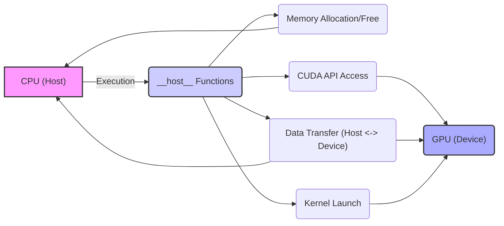
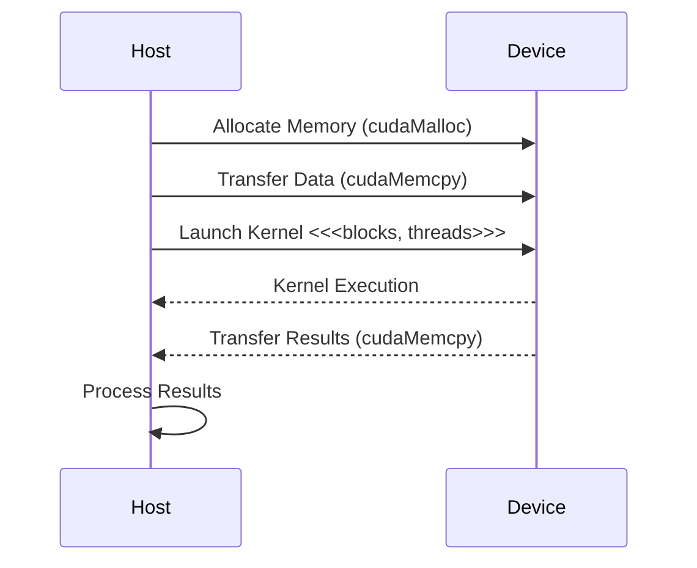

Okay, I've analyzed the text and added Mermaid diagrams to enhance understanding. Here's the enhanced text with diagrams:

## `__host__` Keyword in CUDA: Defining CPU-Side Functionality and Interactions



### Introdução

Em CUDA, o qualificador `__host__` é utilizado para especificar que uma função deve ser executada no *host* (CPU), e que ela não pode ser chamada diretamente a partir do código do *device* (GPU). As funções declaradas com `__host__` são utilizadas para executar tarefas como a inicialização da aplicação, a alocação e liberação de memória, a transferência de dados entre o *host* e o *device*, e para o lançamento dos *kernels*. A utilização do qualificador `__host__` ou a sua ausência (já que ele é o padrão), e a compreensão de como as funções são executadas na CPU, e a sua interação com o código do *device*, são aspectos essenciais para o desenvolvimento de aplicações CUDA que utilizem a arquitetura heterogênea de forma eficiente. Este capítulo explora o qualificador `__host__` em detalhes, detalhando a sua função, as características das funções declaradas com `__host__`, as melhores práticas para o seu uso, e os desafios associados a ele, sempre com base nas informações do contexto fornecido.

### Funções `__host__`: Execução no Lado da CPU

O qualificador `__host__` é uma extensão da linguagem C/C++ oferecida pela API CUDA, que é utilizada para indicar que uma função será executada na CPU, também chamada de *host* na arquitetura CUDA. Funções que não possuem nenhum qualificador, também são implicitamente consideradas como funções `__host__`, o que significa que esse qualificador é opcional para a definição de funções que são executadas na CPU. Funções declaradas com `__host__` são utilizadas para a execução de tarefas que não podem ser executadas na GPU, e para a orquestração da aplicação como um todo.

**Conceito 1: Características das Funções `__host__`**

*   **Execução no Host:** Funções declaradas com o qualificador `__host__` são executadas na CPU (o *host*).
*   **Chamada pelo Host:** Funções declaradas com `__host__` podem ser chamadas por outras funções declaradas com `__host__`, o que define a sua forma de utilização e seu escopo.
*   **Funções de Gerenciamento:** Funções declaradas com `__host__` são utilizadas para realizar tarefas como a alocação e liberação de memória, a transferência de dados entre a CPU e a GPU, o lançamento de *kernels* e a execução de outras operações que não são realizadas na GPU.
*   **Default:** Se nenhuma declaração explícita do qualificador for utilizada na definição da função, a função é considerada uma função `__host__` por padrão.
*   **Acesso à API CUDA:** Funções declaradas com `__host__` têm acesso a todas as funções da API CUDA, e podem ser utilizadas para controlar todos os aspectos da arquitetura CUDA.

**Lemma 1:** O qualificador `__host__` é utilizado para declarar funções que são executadas na CPU, e essas funções realizam as tarefas de gerenciamento da aplicação, e da comunicação com a GPU, e o qualificador é opcional, já que funções sem qualificador são consideradas como `__host__` por padrão.

**Prova:** O qualificador `__host__` define a função como sendo executada na CPU e a ausência do qualificador também tem o mesmo efeito, e a especificação explícita é usada para explicitar o local da execução do código.  $\blacksquare$

O exemplo abaixo demonstra a declaração de funções utilizando o qualificador `__host__` e também de forma implícita, através da ausência de qualificadores na sua definição:

```c++
__host__ void initData(float* h_A, float* h_B, int n) {
    for (int i = 0; i < n; i++) {
        h_A[i] = (float)i;
        h_B[i] = (float)(n - i);
    }
}

void freeMemory(float *h_A, float *h_B, float *h_C) {
    free(h_A);
    free(h_B);
    free(h_C);
}
```
Nesse exemplo, a função `initData()` é declarada explicitamente com o qualificador `__host__`, enquanto a função `freeMemory()` não tem qualificador e, por *default*, também é executada na CPU.

**Prova do Lemma 1:** O qualificador `__host__` indica que a função é executada na CPU, e a ausência do qualificador define o mesmo comportamento. $\blacksquare$

**Corolário 1:** O qualificador `__host__` é essencial para a programação CUDA e permite que funções específicas sejam executadas na CPU para gerenciar as aplicações CUDA, e para que as tarefas de inicialização, liberação e orquestração sejam executadas de forma apropriada no sistema.

### Funções Host e a Orquestração da Execução na GPU

As funções declaradas com `__host__` são responsáveis por orquestrar a execução dos *kernels* na GPU, utilizando as funções da API CUDA para alocação e transferência de memória, para o lançamento de *kernels* e para o gerenciamento dos recursos da GPU. O código do *host* atua como um mestre de cerimônias que controla a execução do sistema heterogêneo e que coordena a execução em cada processador.

**Conceito 2: Host como Orquestrador da Execução**

*   **Alocação de Memória:** Funções `__host__` utilizam funções da API CUDA como `cudaMalloc()` para alocar memória na GPU, e também podem alocar memória na CPU, utilizando funções como `malloc()`.
*   **Transferência de Dados:** Funções `__host__` utilizam funções da API CUDA como `cudaMemcpy()` para transferir dados entre o *host* e o *device*.
*   **Lançamento de Kernels:** Funções `__host__` lançam os *kernels* na GPU utilizando a sintaxe `<<<blocks, threads>>>`.
*   **Gerenciamento de Recursos:** Funções `__host__` gerenciam os recursos do sistema, como os *streams* e os *events*, que são utilizados para o controle da execução paralela na GPU.
*   **Orquestração:** O código de *host* é responsável por orquestrar a execução do *device*, e por garantir que a execução seja feita de forma correta.

**Lemma 2:** As funções `__host__` são as responsáveis pela orquestração de todo o processo de execução das aplicações CUDA, e gerenciam os recursos, a transferência de dados, o lançamento dos *kernels* e a execução paralela na GPU.

**Prova:** As funções do *host* são o ponto central da execução de uma aplicação CUDA e garantem que a execução paralela na GPU seja feita de forma correta. $\blacksquare$



O diagrama a seguir ilustra como as funções `__host__` são utilizadas para orquestrar a execução de um *kernel* na GPU, mostrando como as transferências, o lançamento do *kernel*, e o recebimento dos resultados são feitos pelo código do *host*.

**Prova do Lemma 2:** As funções `__host__` são utilizadas para garantir a execução correta da aplicação, e para controlar todas as etapas de processamento na GPU e na CPU. $\blacksquare$

**Corolário 2:** A utilização de funções `__host__` para a orquestração da execução é fundamental para o desenvolvimento de aplicações CUDA que explorem o máximo potencial de sistemas de computação heterogênea.

### Código Padrão do Host e Qualificador `__host__`

Como mencionado anteriormente, o qualificador `__host__` é opcional na declaração de funções do *host*. Se uma função não possui o qualificador `__global__` e nem o qualificador `__device__`, a função é considerada uma função de *host* por padrão, e terá o mesmo comportamento e as mesmas características de funções declaradas com o qualificador `__host__`.

**Conceito 3: Qualificador Opcional para Funções no Host**

*   **Default:** Funções que não possuem qualificadores explícitos são consideradas como funções de *host* por padrão.
*   **Opcional:** A utilização do qualificador `__host__` é opcional, e pode ser omitida na declaração das funções de *host*.
*   **Clareza do Código:** A utilização do qualificador `__host__` pode aumentar a clareza do código, indicando explicitamente que a função será executada na CPU, e que as operações são realizadas na memória da CPU.
*  **Compatibilidade:** A não utilização de qualificadores nas funções do *host* torna o código mais compatível com outras linguagens de programação que não utilizam o conceito de qualificador.

**Lemma 3:** O qualificador `__host__` é opcional, e funções sem qualificador são consideradas como funções de *host* por *default*, e a sua utilização explicita que a função será executada na CPU.

**Prova:** O compilador CUDA considera funções sem qualificador como funções que serão executadas na CPU, e o qualificador `__host__` explicitada essa informação no código.  $\blacksquare$

O exemplo abaixo demonstra a utilização opcional do qualificador `__host__` na declaração da função `initData`, e como a ausência do qualificador tem o mesmo efeito, como ocorre na função `freeMemory`.

```c++
__host__ void initData(float* h_A, float* h_B, int n) {
    for (int i = 0; i < n; i++) {
        h_A[i] = (float)i;
        h_B[i] = (float)(n - i);
    }
}

void freeMemory(float *h_A, float *h_B, float *h_C) {
    free(h_A);
    free(h_B);
    free(h_C);
}
```
Nesse exemplo, a função `initData` utiliza o qualificador `__host__` explicitamente, enquanto a função `freeMemory` é uma função de *host* por *default*, mesmo sem o uso de nenhum qualificador.

**Prova do Lemma 3:** O qualificador `__host__` é utilizado para explicitar que a função será executada no *host*, mas a ausência do qualificador indica o mesmo comportamento. $\blacksquare$

**Corolário 3:** A utilização opcional do qualificador `__host__` permite que o código seja escrito de forma mais clara e de forma a explicitar onde cada parte do código será executada, facilitando a leitura, a manutenção e o entendimento das aplicações CUDA.

### Desafios e Limitações na Utilização do Qualificador `__host__`

**Pergunta Teórica Avançada:** Quais são os principais desafios e limitações na utilização do qualificador `__host__` em CUDA, e como esses desafios podem ser abordados para melhorar a clareza, a robustez e a portabilidade das aplicações?

**Resposta:** A utilização do qualificador `__host__` apresenta alguns desafios e limitações:

1.  **Complexidade do Código:** A utilização de qualificadores de função e a separação entre o código do *host* e do *device* pode tornar o código mais complexo e mais difícil de entender. O código deve ser planejado de forma clara e organizada para que essa complexidade seja reduzida.

2.  **Duplicação de Código:** Em alguns casos, pode ser necessário ter uma função que seja executada tanto no *host* quanto no *device*. Em casos como esses, pode ser necessário duplicar o código da função, o que torna a manutenção da aplicação mais difícil, e utilizar outros mecanismos como *templates* ou *macros* podem auxiliar neste processo.

3.  **Portabilidade:** O uso de qualificadores específicos do CUDA pode dificultar a portabilidade do código para outras arquiteturas de *hardware*, e a utilização do qualificador `__host__` explicita que a função é utilizada em arquiteturas de CPU e não de GPU.
4.  **Gerenciamento de Memória:** O gerenciamento da memória e a transferência de dados entre o *host* e o *device* exige que o desenvolvedor entenda como a memória é gerenciada em cada um dos processadores, e o uso das ferramentas da API CUDA.

**Lemma 4:** A complexidade do código, a necessidade de duplicação, a dificuldade de portabilidade e o gerenciamento da memória são os principais desafios da utilização do qualificador `__host__` em CUDA, e a utilização adequada das técnicas de programação é fundamental para garantir que a aplicação seja robusta, eficiente e portável.

**Prova:** O uso correto do qualificador `__host__` é essencial para o desenvolvimento de aplicações que funcionem corretamente, e o entendimento de suas limitações é fundamental para o desenvolvimento de código robusto. $\blacksquare$

Para superar esses desafios, é importante utilizar técnicas de programação que aumentem a modularidade do código, que permitam a reutilização de código, que diminuam a complexidade e que garantam a portabilidade da aplicação, além de utilizar bibliotecas e ferramentas que auxiliem no desenvolvimento da aplicação.

**Prova do Lemma 4:** O uso de técnicas de programação para a modularidade e reutilização de código permite que o desenvolvimento seja facilitado e que a aplicação seja mais fácil de manter e de utilizar.  $\blacksquare$

**Corolário 4:** O desenvolvimento de aplicações CUDA que explorem o modelo heterogêneo de forma eficiente exige um conhecimento profundo das limitações da arquitetura e do uso adequado dos qualificadores de função, juntamente com a utilização das ferramentas de otimização.

### Conclusão

O qualificador `__host__` é um componente fundamental da programação CUDA, e é utilizado para definir as funções que serão executadas na CPU, e que têm a função de orquestrar a execução dos *kernels* na GPU. A compreensão detalhada do uso do qualificador `__host__`, e das características das funções que são definidas com esse qualificador, é essencial para o desenvolvimento de aplicações que utilizem o potencial da arquitetura heterogênea de forma eficiente, permitindo que a CPU e a GPU trabalhem em conjunto para o máximo desempenho e a melhor utilização dos recursos do *hardware*. A utilização do qualificador `__host__` de forma adequada permite que o código seja mais eficiente e mais fácil de manter.

### Referências

[^16]: "The_host_ keyword indicates that the function being declared is a CUDA host function. A host function is simply a traditional C function that executes on the host and can only be called from another host function. By default, all functions in a CUDA program are host functions if they do not have any of the CUDA keywords in their declaration." *(Trecho de <página 56>)*

Deseja que eu continue com as próximas seções?
