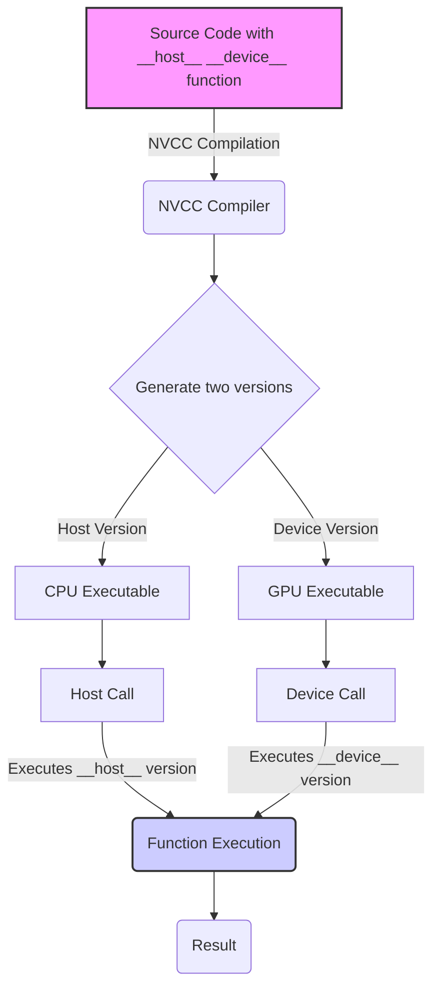
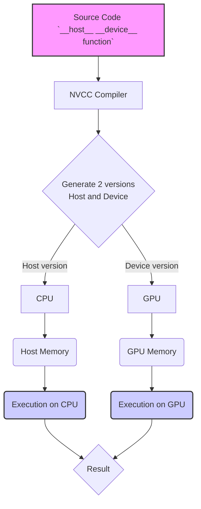
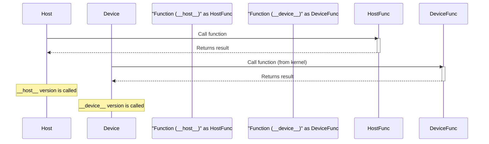

Okay, here's the enhanced text with added Mermaid diagrams:

## Combined `__host__` and `__device__` Qualifiers in CUDA: Enabling Dual Execution



### Introdução

Em CUDA, a utilização combinada dos qualificadores `__host__` e `__device__` em uma mesma função é uma técnica avançada que permite que a mesma função seja executada tanto no *host* (CPU) quanto no *device* (GPU), dependendo do contexto da chamada. O compilador NVCC (NVIDIA CUDA Compiler) é responsável por gerar duas versões distintas da função: uma para execução na CPU, e outra para execução na GPU, o que permite que o mesmo código possa ser reutilizado nos dois processadores. Essa capacidade de utilizar o mesmo código fonte em diferentes processadores diminui a necessidade de duplicação de código e aumenta a flexibilidade e a portabilidade das aplicações. Este capítulo explora em profundidade o uso combinado dos qualificadores `__host__` e `__device__`, detalhando como o NVCC lida com essa situação, como as diferentes versões da função são chamadas e como o uso combinado dos qualificadores afeta o desenvolvimento de aplicações CUDA, sempre com base nas informações fornecidas no contexto.

### O Uso Combinado dos Qualificadores `__host__` e `__device__`

Em CUDA, é possível declarar uma função utilizando os qualificadores `__host__` e `__device__` em conjunto. Essa combinação indica que o compilador NVCC deve gerar duas versões da função: uma que será executada no *host* (CPU) e outra que será executada no *device* (GPU), e o mesmo código fonte é utilizado para gerar as duas versões. Essa técnica é utilizada quando é necessário que o mesmo código seja executado tanto na CPU quanto na GPU, e a sua utilização evita a duplicação de código e facilita a manutenção e o desenvolvimento de aplicações CUDA.

**Conceito 1: Geração de Duas Versões de Uma Função**

*   **`__host__ __device__`:** Quando uma função é declarada com os qualificadores `__host__` e `__device__` simultaneamente, o compilador NVCC gera duas versões da mesma função: uma para o *host* e outra para o *device*.
*   **Execução Condicional:** A escolha de qual versão da função será executada é feita de forma implícita pelo compilador, com base no local de onde a função é chamada.
*   **Reutilização de Código:** O uso combinado de `__host__` e `__device__` permite que o mesmo código fonte seja utilizado em diferentes processadores, o que aumenta a reutilização de código e diminui o esforço de programação e manutenção.
*   **Flexibilidade:** O uso combinado de `__host__` e `__device__` permite que a mesma função seja utilizada em diferentes contextos, e que o programador possa escolher quando e onde o código será executado, de acordo com as necessidades da aplicação.

**Lemma 1:** A declaração de uma função utilizando os qualificadores `__host__` e `__device__` em conjunto indica que o compilador NVCC deve gerar duas versões da função, uma para o *host* e outra para o *device*, e essa capacidade permite o uso do mesmo código em diferentes arquiteturas.

**Prova:** O NVCC compila o código de forma diferente para a CPU e a GPU, utilizando os qualificadores para indicar qual código será usado em cada tipo de processador. $\blacksquare$

The diagram below illustrates how the NVCC compiler uses the `__host__` and `__device__` qualifiers to generate two versions of the same function, showing that each version will be executed on a different processor, with different ways of accessing memory and hardware resources.



**Prova do Lemma 1:** A compilação em duas versões é fundamental para o uso eficiente da arquitetura heterogênea, que é o que a combinação dos qualificadores oferece. $\blacksquare$

**Corolário 1:** O uso combinado dos qualificadores `__host__` e `__device__` é uma técnica avançada da programação CUDA, e permite a reutilização de código e a flexibilidade na execução de tarefas em diferentes processadores.

### Execução da Função com Qualificadores Combinados

Quando uma função é declarada utilizando os qualificadores `__host__` e `__device__` em conjunto, o compilador NVCC gera duas versões da função: uma para o *host* e outra para o *device*. Cada versão da função pode ser chamada apenas pelo código correspondente: a versão `__host__` é chamada pelo código que é executado no *host*, e a versão `__device__` é chamada por um *kernel* ou por outras funções que são executadas no *device*.

**Conceito 2: Chamada de Funções com Qualificadores Combinados**

*   **Versão Host:** A versão da função com o qualificador `__host__` é executada na CPU, e é chamada por outras funções que são executadas na CPU.
*   **Versão Device:** A versão da função com o qualificador `__device__` é executada na GPU, e é chamada por *kernels* ou por outras funções que são executadas na GPU.
*   **Escolha da Versão:** A escolha de qual versão da função será executada é feita de forma implícita pelo compilador NVCC, com base no local de onde a função é chamada. Se a função for chamada no código do *host*, a versão `__host__` será executada, e se a função for chamada em um *kernel* ou outra função `__device__`, a versão `__device__` será executada.
*   **Duplicação Implícita:** A duplicação de código ocorre de forma implícita e controlada pelo compilador, o que garante que o código correto seja executado em cada um dos processadores.

**Lemma 2:** A escolha da versão da função a ser executada, se a do *host* ou a do *device*, é feita de forma automática pelo compilador NVCC com base no local de onde a função é chamada, o que garante a correta execução e o bom funcionamento do código.

**Prova:** O compilador utiliza os qualificadores para escolher a versão da função que será executada em cada processador.  $\blacksquare$

The following diagram illustrates how the two versions of a function declared with the `__host__` and `__device__` qualifiers are used by the host and device to perform the same task, and how each version is used by the appropriate code.



**Prova do Lemma 2:** O compilador NVCC é o responsável pela escolha da versão correta da função, de acordo com o contexto onde ela é chamada. $\blacksquare$

**Corolário 2:** A utilização combinada de `__host__` e `__device__` permite que o mesmo código fonte seja utilizado tanto na CPU quanto na GPU, e que o compilador escolha a versão correta da função para cada situação.

### Utilização da Mesma Função para Diferentes Propósitos

O uso combinado dos qualificadores `__host__` e `__device__` permite que a mesma função seja utilizada para diferentes propósitos em uma aplicação CUDA. Por exemplo, uma função que calcula o tamanho de um vetor, ou que inicializa uma matriz, pode ser utilizada tanto no *host* quanto no *device*, o que evita a duplicação de código e aumenta a reutilização de código.

**Conceito 3: Reutilização e Flexibilidade do Código**

*   **Mesmo Código:** O mesmo código fonte pode ser utilizado para criar funções que são executadas no *host* e no *device*, e isso diminui a necessidade de escrever código diferente para cada processador.
*   **Reutilização:** As funções que são declaradas utilizando a combinação de qualificadores podem ser utilizadas tanto no código do *host* quanto no código do *device*.
*   **Flexibilidade:** A utilização da mesma função em diferentes processadores oferece mais flexibilidade no *design* da aplicação, permitindo que o desenvolvedor escolha onde cada função será executada, de acordo com as suas necessidades.

**Lemma 3:** A utilização combinada de `__host__` e `__device__` permite que a mesma função seja utilizada para diferentes propósitos, tanto no *host* quanto no *device*, o que garante a reutilização e a flexibilidade do código.

**Prova:** O uso da mesma função para a CPU e a GPU permite que a manutenção do código e a reutilização de funções seja feita de forma mais simples e eficiente. $\blacksquare$

O exemplo a seguir ilustra como uma mesma função pode ser utilizada tanto no *host* quanto no *device*:

```c++
__host__ __device__ int calculateSize(int n) {
    return n * sizeof(float);
}

__global__ void kernelExample(float* A, float* B, int n) {
    int size = calculateSize(n);
   // ... use size
    int i = blockIdx.x * blockDim.x + threadIdx.x;
    if (i < n) {
       B[i] = A[i] * 2;
    }
}

int main() {
    int n = 1024;
    int size = calculateSize(n); // Use calculateSize in the host
    // ...
}
```
Nesse exemplo, a função `calculateSize` pode ser utilizada tanto no *host*, no código da função `main`, quanto no *device*, no código do *kernel* `kernelExample`.

**Prova do Lemma 3:** A utilização combinada dos qualificadores permite a reutilização de código, o que diminui o tempo de desenvolvimento e facilita a manutenção da aplicação. $\blacksquare$

**Corolário 3:** O uso combinado dos qualificadores `__host__` e `__device__` permite a reutilização de código, a flexibilidade na arquitetura da aplicação e torna o desenvolvimento de aplicações CUDA mais fácil e eficiente.

### Otimizações e Desafios do Uso Combinado

**Pergunta Teórica Avançada:** Como a utilização de *templates*, a otimização específica para cada arquitetura e o uso de diretivas do compilador afetam o desempenho de funções declaradas com os qualificadores `__host__` e `__device__` em conjunto, e como essas técnicas podem ser implementadas na prática?

**Resposta:** A otimização do uso combinado dos qualificadores `__host__` e `__device__` envolve:

1.  **Templates:** O uso de *templates* C++ pode permitir a criação de funções genéricas que podem ser utilizadas tanto no *host* quanto no *device*, com tipos de dados diferentes, o que aumenta a flexibilidade e a reutilização de código.
2.  **Otimização por Arquitetura:** O compilador NVCC permite a compilação do código de forma otimizada para cada arquitetura de *hardware*. A utilização de opções de compilação específicas para cada arquitetura permite que a aplicação obtenha o máximo desempenho em cada *hardware*.
3.  **Diretivas do Compilador:** A utilização de diretivas do compilador permite que o código seja adaptado para as necessidades específicas de cada situação, e que o compilador gere o código mais apropriado para cada tipo de *hardware*.

**Lemma 4:** A utilização de *templates*, a otimização para cada arquitetura, e o uso de diretivas do compilador permitem que o desempenho de funções declaradas com `__host__` e `__device__` em conjunto seja otimizado, e que o código seja portável para diferentes *hardwares*.

**Prova:** A utilização dessas técnicas garante que o código seja executado da forma mais eficiente possível, tanto na CPU quanto na GPU. $\blacksquare$

A aplicação combinada dessas técnicas permite que a aplicação seja otimizada e que o seu desempenho seja o máximo possível.

**Prova do Lemma 4:** A utilização de *templates*, a otimização para cada arquitetura e o uso de diretivas do compilador permitem a criação de aplicações com melhor desempenho e maior portabilidade. $\blacksquare$

**Corolário 4:** O uso eficiente dessas ferramentas de otimização é essencial para o desenvolvimento de aplicações CUDA de alto desempenho.

### Desafios e Limitações do Uso Combinado

**Pergunta Teórica Avançada:** Quais são os principais desafios e limitações no uso combinado dos qualificadores `__host__` e `__device__` em CUDA, e como esses desafios podem ser abordados para melhorar a escalabilidade e a robustez das aplicações?

**Resposta:** O uso combinado dos qualificadores `__host__` e `__device__` apresenta alguns desafios e limitações:

1.  **Complexidade do Código:** A criação de funções com esses qualificadores combinados pode aumentar a complexidade do código e a dificuldade na sua manutenção.

2.  **Duplicação Implícita:** A duplicação implícita de código pelo compilador pode gerar um aumento no tamanho do código binário, o que pode impactar o desempenho da aplicação, e o código deve ser desenvolvido de forma a minimizar essa duplicação.
3.  **Portabilidade:** O código compilado pode ser dependente das características de uma determinada arquitetura, o que pode limitar a portabilidade da aplicação, e o código deve ser testado em diferentes arquiteturas para garantir que ele funcione corretamente.
4.  **Restrições da API:** Algumas funções da API CUDA não podem ser utilizadas em funções declaradas com `__device__`, o que pode limitar o uso de recursos importantes para o desenvolvimento de aplicações CUDA, e o código deve ser escrito considerando essas limitações.

**Lemma 5:** A complexidade do código, a duplicação implícita do código, os problemas de portabilidade e as restrições da API são os principais desafios e limitações no uso combinado dos qualificadores `__host__` e `__device__` em CUDA.

**Prova:** As limitações são inerentes ao modelo de programação heterogênea, e a utilização das técnicas de otimização e a criação de um código bem planejado são importantes para que as dificuldades sejam minimizadas. $\blacksquare$

Para superar esses desafios, é importante utilizar técnicas de programação que minimizem a complexidade do código, testar o código em diferentes arquiteturas, e conhecer as limitações da API CUDA. A utilização de técnicas de compilação condicional pode ajudar na adaptação do código para diferentes arquiteturas.

**Prova do Lemma 5:** O planejamento cuidadoso do código, a utilização de técnicas de otimização, e o conhecimento das limitações são essenciais para o desenvolvimento de aplicações CUDA robustas e portáveis. $\blacksquare$

**Corolário 5:** O conhecimento das limitações e desafios, e a utilização de técnicas de otimização, permitem que o uso combinado de qualificadores seja feito de forma eficiente e que as aplicações utilizem todo o potencial do sistema heterogêneo.

### Conclusão

O uso combinado dos qualificadores `__host__` e `__device__` permite que a mesma função seja executada tanto na CPU quanto na GPU, e oferece flexibilidade e reutilização de código, o que diminui a complexidade do desenvolvimento e aumenta a portabilidade das aplicações CUDA. A compreensão detalhada de como o compilador NVCC lida com esses qualificadores e como as funções podem ser utilizadas em diferentes contextos é fundamental para o desenvolvimento de aplicações que explorem todo o potencial da arquitetura heterogênea. A utilização cuidadosa das técnicas de otimização é fundamental para que o código seja eficiente e tenha um bom desempenho, tanto na CPU quanto na GPU, e para que a arquitetura seja utilizada da forma mais apropriada.

Deseja que eu continue com as próximas seções?
