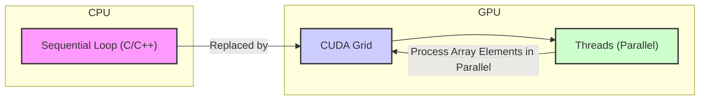
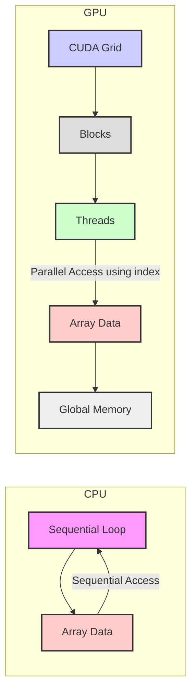
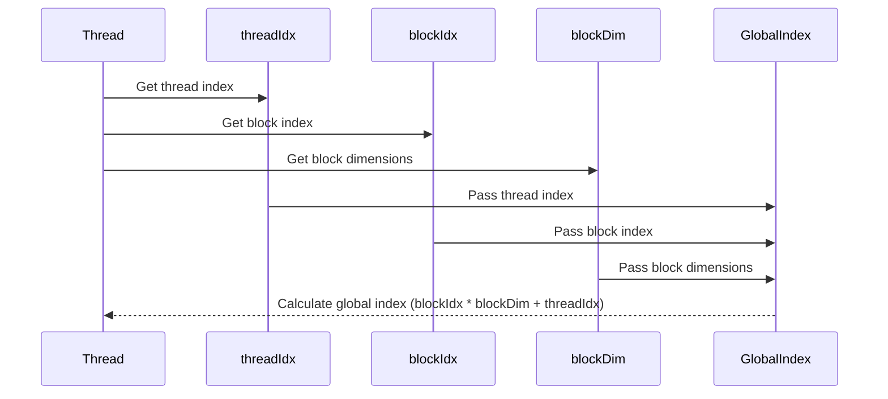
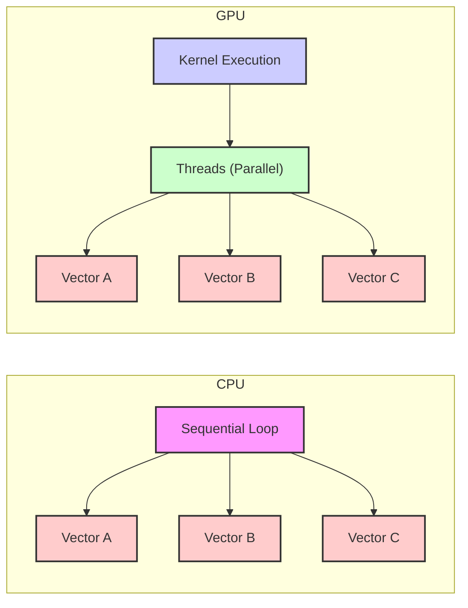

Okay, I understand. Here's the enhanced text with Mermaid diagrams added:

## Implicit Loop Replacement with Thread Grid in CUDA: Parallelizing Iterative Computations



### Introdução

Em CUDA, o modelo de programação paralela se baseia na execução de *kernels* por vários *threads* simultaneamente na GPU. Uma das características mais notáveis desse modelo é a forma como *loops* sequenciais, que são comuns em código C/C++, são substituídos pela execução paralela de *threads*. Ao invés de um *loop* que itera sobre os elementos de um *array*, em CUDA cada *thread* é responsável por processar um ou mais elementos do *array* em paralelo. Essa substituição implícita do *loop* pela estrutura de *threads*, *blocks* e *grids* é essencial para a eficiência das aplicações CUDA, e para que os recursos do *hardware* da GPU sejam utilizados de forma adequada e eficiente. Este capítulo explora em profundidade como a substituição implícita de *loops* é feita em CUDA através da utilização da hierarquia de *threads* e das variáveis predefinidas, e como a sua compreensão é fundamental para o desenvolvimento de aplicações paralelas, sempre com base nas informações fornecidas no contexto.

### Loops Sequenciais e sua Substituição em CUDA

Em código C/C++ tradicional, um *loop* é utilizado para repetir um bloco de código sobre todos os elementos de um *array*, e essa operação é executada de forma sequencial, o que significa que cada iteração do *loop* é executada uma após a outra. Em CUDA, essa execução sequencial é substituída pela execução paralela de *threads*, onde cada *thread* é responsável por executar o código do *loop* para uma parte diferente dos dados, o que permite um grande ganho de desempenho quando a execução ocorre em uma GPU, com diversos processadores.

**Conceito 1: Paradigma Sequencial e Paralelo**

*   **Loop Sequencial:** Em código C/C++ tradicional, um *loop* é utilizado para iterar sobre os elementos de um *array*, realizando uma operação para cada elemento.
*   **Execução Sequencial:** A execução do *loop* é feita de forma sequencial, o que significa que cada iteração do *loop* é executada uma após a outra em um mesmo *thread* de execução, sem a possibilidade de paralelismo.
*   **Execução Paralela:** Em CUDA, essa execução sequencial é substituída pela execução paralela de *threads*, onde cada *thread* é responsável por executar o mesmo código sobre uma parte diferente dos dados.
*   **Modelo SPMD:** A execução paralela em CUDA segue o modelo SPMD (Single Program Multiple Data), onde todos os *threads* executam o mesmo código do *kernel*, mas operam em diferentes partes dos dados.

**Lemma 1:** Em CUDA, a execução de um *loop* é implicitamente substituída pela execução paralela de vários *threads*, que executam o mesmo código sobre diferentes partes do conjunto de dados, e o uso de variáveis predefinidas permite que cada *thread* acesse a parte correta dos dados.

**Prova:** A utilização de *threads* permite o processamento em paralelo de diversas partes dos dados, e o índice global permite que cada *thread* processe a parte correspondente do *array*. $\blacksquare$

O diagrama a seguir ilustra como um *loop* sequencial na CPU é substituído pela execução paralela de *threads* em um *grid* na GPU, e como a combinação das variáveis `threadIdx`, `blockIdx` e `blockDim` permite que cada *thread* acesse a sua parte dos dados de forma independente e paralela.



**Prova do Lemma 1:** A substituição do *loop* sequencial pela execução paralela dos *threads* é a base do desempenho e da escalabilidade das aplicações CUDA. $\blacksquare$

**Corolário 1:** A substituição implícita de *loops* pela execução paralela de *threads* é uma das principais características do modelo de programação CUDA, e permite que o poder de processamento da GPU seja explorado ao máximo.

### Variáveis Predefinidas e o Índice Global do Thread

As variáveis predefinidas `threadIdx`, `blockIdx` e `blockDim` são essenciais para a implementação do modelo SPMD em CUDA e são utilizadas para calcular o índice global de cada *thread*, que é utilizado para mapear os *threads* para os dados, e garantir que o trabalho seja distribuído de forma adequada, e que os dados sejam acessados de forma correta.

**Conceito 2: Cálculo do Índice Global e Mapeamento para os Dados**

*   **`threadIdx`:** A variável `threadIdx` fornece o índice do *thread* dentro do seu *block*.
*   **`blockIdx`:** A variável `blockIdx` fornece o índice do *block* dentro do *grid*.
*   **`blockDim`:** A variável `blockDim` fornece as dimensões do *block*.
*   **Cálculo do Índice Global:** O índice global é calculado combinando as informações de `threadIdx`, `blockIdx` e `blockDim`, e o cálculo é realizado utilizando a fórmula adequada para a dimensionalidade do *grid* (1D, 2D ou 3D).
*   **Mapeamento para os Dados:** O índice global é utilizado para acessar a parte correspondente dos dados na memória global da GPU.

**Lemma 2:** A combinação das variáveis predefinidas `threadIdx`, `blockIdx` e `blockDim` é utilizada para o cálculo do índice global de cada *thread*, e esse índice é utilizado para mapear os *threads* para os dados, e garantir que cada *thread* processe a sua parte dos dados de forma correta.

**Prova:** O cálculo do índice global permite que cada *thread* acesse a sua parte dos dados e realize o processamento de forma independente e paralela, sem conflitos de acesso à memória. $\blacksquare$

O exemplo abaixo demonstra como as variáveis predefinidas são utilizadas para o cálculo do índice global em um *kernel* CUDA.

```c++
__global__ void vecAddKernel(float* A, float* B, float* C, int n) {
    int i = blockIdx.x * blockDim.x + threadIdx.x;
    if (i < n) {
        C[i] = A[i] + B[i];
    }
}
```
Nesse exemplo, o índice global `i` é calculado utilizando as variáveis `threadIdx.x`, `blockIdx.x` e `blockDim.x`, e esse índice é utilizado para acessar a parte correta dos vetores `A`, `B` e `C`, que são armazenados na memória global da GPU.



**Prova do Lemma 2:** O uso das variáveis predefinidas permite a criação do índice global que mapeia os *threads* para a memória, o que garante que o processamento paralelo seja feito de forma correta.  $\blacksquare$

**Corolário 2:** A combinação das variáveis predefinidas para o cálculo do índice global é um mecanismo fundamental para o desenvolvimento de *kernels* CUDA que explorem o potencial da arquitetura paralela da GPU.

### Exemplo de Substituição de um Loop por um Kernel

Para ilustrar a substituição de *loops* sequenciais por *kernels* em CUDA, considere o exemplo de adição de vetores. Em C/C++, essa operação é realizada utilizando um *loop* que itera sobre todos os elementos dos vetores. Em CUDA, a operação é realizada por um *kernel* que é executado por milhares de *threads* na GPU, onde cada *thread* processa um elemento diferente do vetor. O *loop* sequencial é implicitamente substituído pela execução paralela dos *threads*.

**Conceito 3: Exemplo de Adição de Vetores**

*   **Loop Sequencial:** Em C/C++, a adição de vetores é realizada utilizando um *loop*, da seguinte forma:

```c++
void vecAdd(float* A, float* B, float* C, int n) {
    for (int i = 0; i < n; i++) {
        C[i] = A[i] + B[i];
    }
}
```
Nesse exemplo, o *loop* `for` itera sobre todos os elementos dos vetores.

*   **Kernel CUDA:** Em CUDA, a mesma operação é realizada utilizando um *kernel*, da seguinte forma:

```c++
__global__ void vecAddKernel(float* A, float* B, float* C, int n) {
    int i = blockIdx.x * blockDim.x + threadIdx.x;
    if (i < n) {
        C[i] = A[i] + B[i];
    }
}
```
Nesse exemplo, o *loop* é implicitamente substituído pelo cálculo do índice global `i` e pela execução do código por milhares de *threads* em paralelo.

**Lemma 3:** A substituição de *loops* sequenciais por *kernels* em CUDA permite que a execução seja feita de forma paralela na GPU, e essa substituição é feita através do uso de variáveis predefinidas e da estrutura de *threads*, *blocks*, e *grids* que são definidas durante o lançamento do *kernel*.

**Prova:** O uso do *kernel* e da estrutura da GPU permite que o processamento seja feito de forma paralela e mais eficiente.  $\blacksquare$

O diagrama a seguir ilustra como o *loop* sequencial é substituído pela execução paralela do *kernel*, e como cada *thread* executa o mesmo código sobre partes diferentes dos dados, o que é a base do modelo SPMD.


**Prova do Lemma 3:** A substituição do *loop* sequencial pelo processamento paralelo utilizando *kernels* é o que permite que aplicações CUDA sejam executadas de forma eficiente na GPU. $\blacksquare$

**Corolário 3:** A substituição implícita de *loops* por *kernels* em CUDA é fundamental para o desenvolvimento de aplicações que explorem o potencial de processamento paralelo das GPUs.

### Otimizações na Substituição do Loop por um Kernel

**Pergunta Teórica Avançada:** Como a escolha do tamanho do *block*, o uso da memória compartilhada, e a minimização do acesso à memória global afetam a eficiência da substituição de *loops* sequenciais por *kernels* em CUDA, e como essas técnicas podem ser implementadas na prática?

**Resposta:** A otimização da substituição do *loop* por um *kernel* envolve:

1.  **Tamanho do Block:** A escolha do tamanho do *block* deve ser feita considerando a arquitetura da GPU, e para que os *warps* sejam executados de forma eficiente, e que o número de *threads* por *block* seja um múltiplo de 32. A escolha do tamanho adequado também depende das características do problema, do tamanho do *dataset*, e da forma como os dados são acessados.
2.  **Memória Compartilhada:** A utilização da memória compartilhada permite que os *threads* de um mesmo *block* compartilhem dados de forma rápida e eficiente, diminuindo a latência do acesso à memória. Os dados a serem compartilhados precisam ser armazenados nessa memória para diminuir os acessos à memória global.
3.  **Acesso à Memória Global:** O acesso à memória global deve ser *coalesced*, o que significa que os *threads* de um mesmo *warp* devem acessar dados contíguos na memória, para maximizar o *bandwidth* da transferência de dados e diminuir o número de transações com a memória. A redução do número de acessos à memória global é essencial para o bom desempenho da aplicação.

**Lemma 4:** A escolha correta do tamanho do *block*, a utilização eficiente da memória compartilhada e o *coalescing* de acesso à memória global são essenciais para otimizar a substituição do *loop* sequencial pela execução paralela em um *kernel*.

**Prova:** A utilização das técnicas de otimização diminui a latência, diminui o *overhead* das operações, e diminui o tempo de execução da aplicação paralela.  $\blacksquare$

A utilização dessas técnicas permite que a execução do *kernel* seja mais eficiente do que a execução sequencial do *loop*.

**Prova do Lemma 4:** O uso eficiente da memória compartilhada e a otimização dos acessos à memória global permite que o *kernel* seja executado de forma rápida e que o paralelismo seja aproveitado de forma adequada. $\blacksquare$

**Corolário 4:** A utilização correta das técnicas de otimização é fundamental para o desenvolvimento de *kernels* que sejam mais eficientes do que a execução sequencial de um *loop* na CPU, e que explorem o potencial do *hardware* da GPU de forma eficiente.

### Desafios e Limitações na Substituição de Loops

**Pergunta Teórica Avançada:** Quais são os principais desafios e limitações na substituição implícita de *loops* sequenciais por *kernels* CUDA, e como esses desafios podem ser abordados para melhorar a escalabilidade e a robustez das aplicações?

**Resposta:** A substituição de *loops* sequenciais por *kernels* CUDA apresenta alguns desafios e limitações:

1.  **Dependências de Dados:** O modelo SPMD não é ideal para *loops* que apresentam dependências de dados, onde uma iteração depende do resultado das iterações anteriores. O tratamento das dependências deve ser feito através de outras técnicas de programação, e pode aumentar a complexidade do código.
2.  **Branching:** O uso de condicionais dentro dos *kernels*, com comandos como `if` e `switch`, pode causar divergência de fluxo entre os *threads*, o que diminui a eficiência da execução, já que todos os *threads* de um mesmo *warp* devem executar a mesma instrução em cada passo da execução.
3.  **Gerenciamento de Memória:** A alocação e transferência de dados entre o *host* e o *device* podem se tornar um gargalo, especialmente quando os *arrays* são muito grandes. A utilização de técnicas como a transferência assíncrona e memória *pinned* pode diminuir o problema.
4.  **Complexidade da Otimização:** A otimização da execução de um *kernel* pode ser complexa e exigir um conhecimento profundo da arquitetura da GPU, do funcionamento dos *warps*, e das opções do compilador, e para realizar essa otimização, é preciso estudar em detalhes como a execução do código é realizada na GPU.

**Lemma 5:** As dependências de dados, os problemas causados pelo *branching*, a complexidade do gerenciamento de memória, e a dificuldade na otimização do código são os principais desafios e limitações na substituição de *loops* sequenciais por *kernels* em CUDA, e o programador deve levar em consideração esses desafios na criação de aplicações eficientes.

**Prova:** A arquitetura da GPU e o modelo de programação SPMD exigem que o código seja escrito e planejado de forma cuidadosa para evitar problemas e gargalos no desempenho da aplicação.  $\blacksquare$

Para superar esses desafios, é importante utilizar técnicas de programação paralela, como a utilização de algoritmos que não apresentem muitas dependências, a minimização de *branching*, o uso eficiente da memória compartilhada, a utilização de *prefetching* de dados e o uso de técnicas de *overlapping*, o que exige do desenvolvedor um conhecimento profundo da arquitetura e do funcionamento da GPU, e das suas limitações.

**Prova do Lemma 5:** O uso correto das ferramentas e técnicas de programação paralelas permite que a arquitetura da GPU seja utilizada da forma mais adequada, e permite que as limitações sejam mitigadas. $\blacksquare$

**Corolário 5:** O desenvolvimento de aplicações CUDA eficientes e escaláveis exige um conhecimento profundo das limitações e dos desafios da substituição implícita de *loops* por *kernels*, e um planejamento cuidadoso de como o código será escrito para utilizar os recursos do *hardware* da GPU de forma eficiente e segura.

### Conclusão

A substituição implícita de *loops* sequenciais pela execução paralela de *threads* em *kernels* é um conceito fundamental da programação em CUDA. O uso das variáveis predefinidas para o cálculo do índice global, e o conhecimento da arquitetura da GPU e de como os *threads* são executados em *warps* são essenciais para o desenvolvimento de aplicações que utilizem todo o poder de processamento paralelo das GPUs, e que transformem o código sequencial em código paralelo. O planejamento adequado do tamanho dos *blocks* e a utilização eficiente da memória compartilhada são passos fundamentais para o desenvolvimento de aplicações eficientes, e a compreensão de como o processamento paralelo é feito na GPU é essencial para todos os desenvolvedores que desejam criar aplicações CUDA de alto desempenho.

Deseja que eu continue com as próximas seções?
