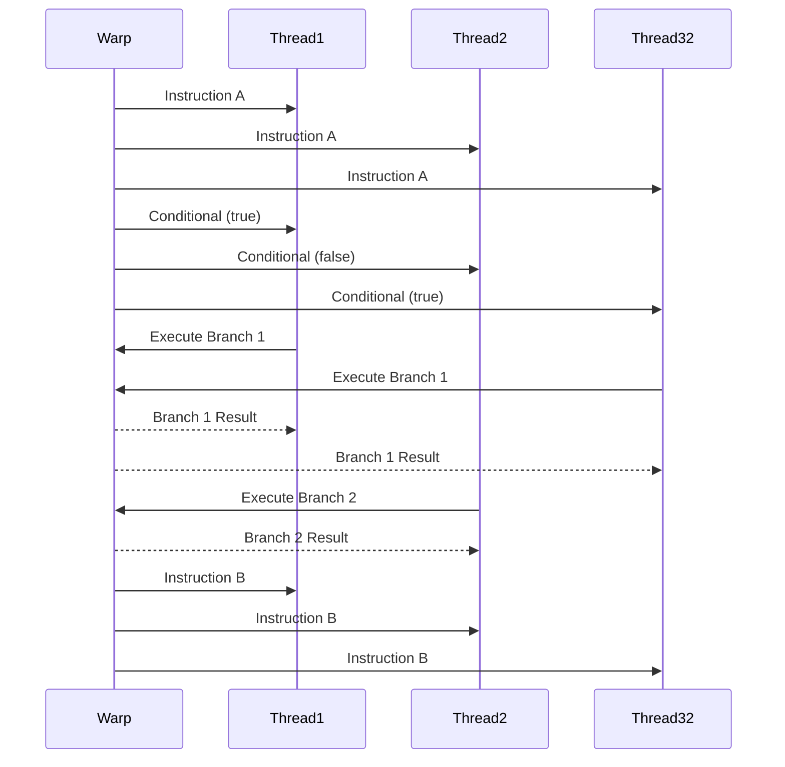
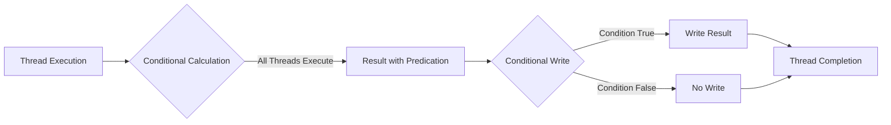

Okay, I will add Mermaid diagrams to the text to enhance the explanations as requested.

## Conditional Execution Within Kernels in CUDA: Managing Thread Divergence and Optimizing Performance

```mermaid
flowchart LR
    A["Kernel Execution"] --> B{Conditional Statement (if, else, switch)};
    B -- "True" --> C["Execution Path 1"];
    B -- "False" --> D["Execution Path 2"];
    C --> E["Thread Completion"];
    D --> E;
    E --> F["Next Instruction"];
    style B fill:#f9f,stroke:#333,stroke-width:2px
```

### Introdução

Em CUDA, a execução condicional dentro de *kernels*, utilizando comandos como `if`, `else` e `switch`, é um mecanismo comum para que os *threads* possam tomar decisões e executar diferentes trechos de código de acordo com condições específicas. No entanto, o uso excessivo de condicionais dentro de *kernels* pode gerar **divergência de *threads***, que ocorre quando os *threads* de um mesmo *warp* seguem caminhos de execução diferentes. A divergência de *threads* é um problema que pode diminuir significativamente a eficiência da execução paralela e, portanto, deve ser minimizada para se obter o máximo desempenho das aplicações CUDA. Este capítulo explora os mecanismos de execução condicional dentro de *kernels* em CUDA, detalhando como eles podem gerar divergência de *threads*, como minimizar essa divergência e quais técnicas podem ser utilizadas para garantir a utilização eficiente dos recursos da GPU, sempre com base nas informações fornecidas no contexto.

### Divergência de Threads: Um Desafio para o Paralelismo

Em CUDA, os *threads* são executados em grupos de 32, chamados de *warps*. Os *threads* de um mesmo *warp* executam as mesmas instruções ao mesmo tempo, seguindo um modelo SIMT (Single Instruction Multiple Thread), que é similar ao modelo SIMD (Single Instruction Multiple Data), mas com algumas particularidades. Quando os *threads* de um mesmo *warp* seguem caminhos de execução diferentes, devido ao uso de condicionais, ocorre a **divergência de *threads***, que diminui o desempenho da execução paralela, e exige que as diferentes partes do código sejam executadas de forma sequencial.

**Conceito 1: Impacto do Branching na Execução do Warp**

*   **Warps:** Um *warp* é um grupo de 32 *threads* que são executados simultaneamente em um mesmo núcleo de processamento da GPU, e a execução dos *warps* é a unidade básica de execução do *hardware* da GPU.
*   **SIMT:** Os *threads* de um mesmo *warp* executam a mesma instrução ao mesmo tempo, o que aumenta a eficiência da execução paralela.
*   **Divergência:** A divergência de *threads* ocorre quando os *threads* de um mesmo *warp* seguem caminhos diferentes de execução devido a comandos condicionais como `if`, `else` e `switch`.
*   **Serialização:** Quando ocorre a divergência de *threads*, a execução dos *threads* do mesmo *warp* é feita de forma serializada, o que diminui o desempenho da execução paralela e aumenta o tempo de execução.

**Lemma 1:** A divergência de *threads* em um *warp* diminui o desempenho da execução paralela em CUDA, pois a arquitetura da GPU é otimizada para a execução SIMT, onde todos os *threads* do *warp* executam o mesmo código ao mesmo tempo.

**Prova:** O *hardware* da GPU é otimizado para a execução de *warps*, e quando ocorre a divergência, os *threads* devem ser executados em sequência, o que diminui o desempenho da aplicação. $\blacksquare$

O diagrama a seguir ilustra como a divergência de *threads* pode ocorrer em um *warp*, e como a execução dos *threads* de um mesmo *warp* passa a ser feita de forma serializada e em partes diferentes do código.



**Prova do Lemma 1:** A divergência de *threads* diminui a eficiência do processamento paralelo, o que aumenta o tempo total de execução da aplicação. $\blacksquare$

**Corolário 1:** A minimização da divergência de *threads* é essencial para o desenvolvimento de aplicações CUDA de alto desempenho, e para que o *hardware* da GPU seja utilizado de forma eficiente.

### O Uso de `if`, `else` e `switch` em Kernels

Em CUDA, os comandos condicionais como `if`, `else` e `switch` podem ser utilizados dentro dos *kernels* para controlar o fluxo de execução dos *threads*. No entanto, é fundamental utilizar esses comandos de forma cuidadosa para evitar que eles causem divergência de *threads* nos *warps*, o que pode diminuir o desempenho das aplicações CUDA. A análise do comportamento do código e o estudo do impacto da utilização de condicionais é essencial para a otimização das aplicações.

**Conceito 2: Execução Condicional e Potencial de Divergência**

*   **`if` e `else`:** Os comandos `if` e `else` permitem executar diferentes blocos de código dependendo do resultado de uma condição. A utilização dessas estruturas no código pode gerar divergência se os *threads* dentro de um mesmo *warp* seguirem diferentes caminhos de execução, e deve ser utilizada com cuidado.
*   **`switch`:** O comando `switch` permite executar diferentes blocos de código dependendo do valor de uma variável. A utilização do comando `switch` também pode gerar divergência de *threads* se os valores da variável forem diferentes dentro de um mesmo *warp*, e o uso de *switch* deve ser feita de forma cuidadosa e planejada.
*   **Divergência:** A divergência de *threads* ocorre quando os *threads* de um mesmo *warp* seguem diferentes caminhos de execução, o que diminui o desempenho do processamento paralelo, e as operações condicionais são a principal causa da divergência de *threads*.

**Lemma 2:** O uso de comandos condicionais como `if`, `else` e `switch` dentro dos *kernels* pode gerar divergência de *threads*, o que diminui o desempenho da aplicação, e o uso dessas estruturas deve ser planejado para minimizar os problemas.

**Prova:** A execução condicional pode gerar caminhos diferentes para os *threads* do mesmo *warp*, e essa execução sequencial gera um *overhead* que diminui o desempenho da aplicação paralela. $\blacksquare$

O exemplo abaixo demonstra a utilização do comando `if` dentro de um *kernel*, e como ele pode gerar divergência entre os *threads*:

```c++
__global__ void kernelExample(float *A, float *B, int n) {
    int i = blockIdx.x * blockDim.x + threadIdx.x;
    if (i < n / 2) {
      B[i] = A[i] * 2;
    } else {
      B[i] = A[i] / 2;
    }
}
```
Nesse exemplo, a utilização do comando `if` faz com que os *threads* que têm um índice menor que `n / 2` executem um bloco de código, e os outros *threads* executem outro bloco, o que causa a divergência de *threads*.

**Prova do Lemma 2:** O uso das estruturas de controle, quando não são utilizadas de forma correta, pode gerar divergência de *threads* e diminuir a eficiência do processamento paralelo. $\blacksquare$

**Corolário 2:** A utilização de estruturas condicionais em *kernels* CUDA deve ser feita de forma cuidadosa, para evitar a divergência dos *threads*, e para que a execução paralela seja eficiente e para que o desempenho seja o máximo possível.

### Técnicas para Minimizar a Divergência de Threads

Para minimizar a divergência de *threads* dentro de *kernels* em CUDA, é importante utilizar técnicas que permitam que os *threads* de um mesmo *warp* sigam o mesmo caminho de execução, ou que o *branching* seja realizado de forma a evitar a divergência, tanto quanto possível. Algumas técnicas para minimizar a divergência são:

1.  **Predicação:** A predicação consiste em realizar os cálculos para todos os *threads*, e o resultado da computação é utilizado ou não, dependendo da condição. A predicação permite que todos os *threads* do *warp* sigam o mesmo caminho de execução.
2.  **Reorganização de Dados:** A reorganização dos dados pode diminuir a necessidade de *branching* e, com isso, diminuir a divergência de *threads*.
3.  **Uso de Funções Auxiliares:** A utilização de funções auxiliares, declaradas com `__device__`, permite que o código de cada *branch* seja executado por apenas alguns *threads* de um mesmo *warp*, que depois combinam os resultados, o que diminui a divergência.

**Conceito 3: Estratégias para Evitar o Branching e a Divergência**

*   **Predicação:** A predicação é a utilização de uma condição para executar ou não um bloco de código. Utilizar a predicação permite que o código seja executado de forma uniforme por todos os *threads* do *warp*, mas apenas os *threads* que satisfazem a condição é que utilizarão o resultado.
*   **Reorganização de Dados:** A organização dos dados de forma que *threads* que executam o mesmo caminho acessem dados contíguos pode diminuir a necessidade do uso de estruturas de controle, e evitar o *branching*.
*   **Funções Auxiliares:** O uso de funções auxiliares declaradas com `__device__` permite que o código seja executado de forma modular, e que os blocos de código que executam operações diferentes sejam executados separadamente por diferentes *warps*, reduzindo a divergência.

**Lemma 3:** A utilização de técnicas de predicação, a reorganização de dados e o uso de funções auxiliares permitem minimizar a divergência de *threads* dentro dos *warps* e melhorar o desempenho da execução paralela na GPU.

**Prova:** A utilização dessas técnicas garante que os *threads* executem o mesmo código ao mesmo tempo, o que evita o *overhead* de divergência e de sincronização.  $\blacksquare$

O exemplo a seguir demonstra como a predicação pode ser utilizada para evitar a divergência no exemplo anterior:

```c++
__global__ void kernelExample(float *A, float *B, int n) {
    int i = blockIdx.x * blockDim.x + threadIdx.x;
    float value = (i < n/2) ? A[i] * 2 : A[i] / 2;
    if (i < n) B[i] = value;
}
```
Nesse exemplo, a operação condicional é utilizada para calcular um valor que é utilizado ou não no restante do código, e a operação é executada por todos os *threads*, evitando a divergência.



**Prova do Lemma 3:** A utilização das técnicas permite que o código seja mais eficiente, que as operações condicionais não causem divergência, e que o paralelismo seja explorado da melhor forma possível. $\blacksquare$

**Corolário 3:** A aplicação das técnicas de otimização de código para minimizar a divergência de *threads* é fundamental para o desenvolvimento de aplicações CUDA de alto desempenho.

### Limitações e Desafios da Execução Condicional

**Pergunta Teórica Avançada:** Quais são os principais desafios e limitações na execução condicional dentro de *kernels* em CUDA, e como esses desafios podem ser abordados para garantir a escalabilidade e a robustez das aplicações?

**Resposta:** A execução condicional dentro de *kernels* apresenta alguns desafios e limitações:

1.  **Divergência de *Threads*:** A divergência de *threads* dentro de *warps* é um problema que pode diminuir a eficiência da execução paralela, e que deve ser minimizado, utilizando as técnicas de otimização descritas anteriormente.
2.  **Complexidade do Código:** A utilização de técnicas para evitar a divergência de *threads* pode aumentar a complexidade do código e dificultar o seu entendimento e manutenção, e exige um planejamento cuidadoso do código e dos algoritmos utilizados.
3.  ***Overhead*:** As operações condicionais podem adicionar um *overhead* ao tempo de execução da aplicação, mesmo quando a divergência é minimizada, o que exige que o programador faça uma análise das vantagens e desvantagens do uso de condicionais e busque técnicas mais eficientes.
4. **Balanceamento de Carga:** O uso de condicionais pode levar a um desbalanceamento de carga entre os *threads*, onde alguns *threads* podem ter mais trabalho do que outros, o que diminui a eficiência da aplicação, e exige que o trabalho seja distribuído de forma mais uniforme entre todos os *threads*.
5. **Portabilidade**: A escolha da forma como os condicionais são utilizados pode afetar a portabilidade, e a aplicação de técnicas que funcionam bem em uma arquitetura pode não funcionar tão bem em outras.

**Lemma 4:** A divergência de *threads*, a complexidade do código, o *overhead* da execução condicional, o desbalanceamento de carga e os problemas de portabilidade são os principais desafios e limitações da execução condicional dentro de *kernels* em CUDA.

**Prova:** As limitações impostas pela arquitetura da GPU e as dificuldades no tratamento das operações condicionais exige um conhecimento aprofundado das técnicas de otimização e das características do *hardware*.  $\blacksquare$

Para superar esses desafios, é fundamental utilizar técnicas de programação paralela, como a utilização de *predication*, a organização adequada dos dados, o uso de funções auxiliares e a utilização de técnicas de *load balancing* dinâmico, para que o código seja o mais eficiente e portável possível.

**Prova do Lemma 4:** A utilização de todas as técnicas de otimização permite que os *kernels* utilizem o *hardware* da forma mais adequada e que os problemas de divergência e desbalanceamento sejam minimizados.  $\blacksquare$

**Corolário 4:** A otimização do uso de operações condicionais é essencial para o desenvolvimento de aplicações CUDA eficientes e robustas e que funcionem de forma adequada em diversas arquiteturas.

### Conclusão

A execução condicional dentro de *kernels* em CUDA é um aspecto importante da programação paralela na GPU, mas também pode ser fonte de problemas, como a divergência de *threads*. A utilização cuidadosa dos comandos `if`, `else` e `switch` e a aplicação de técnicas para minimizar a divergência são essenciais para o desenvolvimento de aplicações CUDA de alto desempenho. O conhecimento dos mecanismos de execução do código e das técnicas de otimização é fundamental para que os desenvolvedores criem aplicações que explorem o máximo potencial da arquitetura da GPU e que sejam robustas e eficientes.

### Referências

[^6]: "Note that SPMD is not the same as SIMD (single instruction, multiple data) [Flynn1972]. In an SPMD system, the parallel processing units execute the same program on multiple parts of the data. However, these processing units do not need to be executing the same instruction at the same time. In an SIMD system, all processing units are executing the same instruction at any instant." *(Trecho de <página 53>)*

Deseja que eu continue com as próximas seções?
