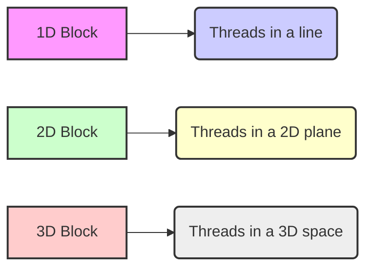
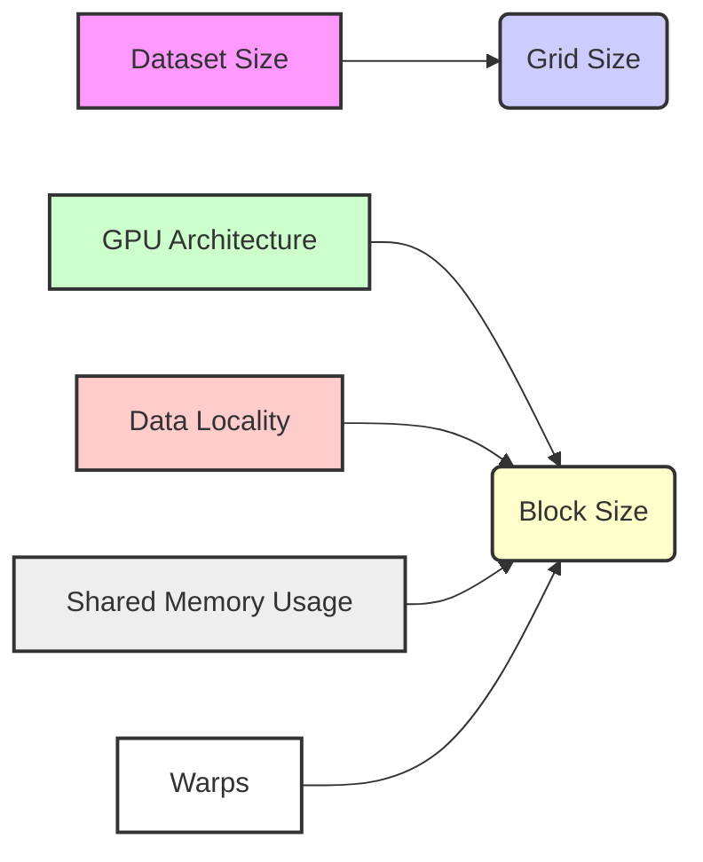

## Kernel Launch Configuration Parameters in CUDA: Tuning Thread Execution for Performance


### Introdução

Em CUDA, o lançamento de um *kernel* é feito através de uma sintaxe específica que inclui a especificação de dois parâmetros fundamentais: o tamanho do *grid* e o tamanho do *block*. Esses parâmetros, que são definidos utilizando a sintaxe `<<<grid, block>>>`, são utilizados para configurar a execução paralela dos *threads* na GPU, e a escolha adequada desses parâmetros é crucial para o desempenho e a escalabilidade das aplicações CUDA. Este capítulo explora em detalhes os parâmetros de configuração de lançamento de *kernels* em CUDA, detalhando como eles são especificados, como eles afetam a organização dos *threads*, como eles influenciam o desempenho da aplicação, e como o conhecimento desses parâmetros é essencial para o desenvolvimento de aplicações otimizadas, sempre com base nas informações fornecidas no contexto.

### Sintaxe do Lançamento e os Parâmetros `grid` e `block`

O lançamento de um *kernel* em CUDA é feito a partir do código do *host*, utilizando uma sintaxe que inclui os símbolos `<<<` e `>>>`, e dois parâmetros: o parâmetro `grid`, que define as dimensões do *grid* e o parâmetro `block`, que define as dimensões do *thread block*. A escolha desses parâmetros afeta diretamente a forma como o *kernel* é executado na GPU e como os *threads* são organizados para a execução paralela.

**Conceito 1: Sintaxe `<<<grid, block>>>`**

*   **Sintaxe:** A sintaxe para o lançamento de *kernels* é dada por: `kernelName<<<grid, block>>>(parameters);` onde `kernelName` é o nome da função *kernel* a ser executada, e `parameters` são os parâmetros que serão passados para o *kernel*.
*   **`grid`:** O parâmetro `grid` define as dimensões do *grid*, que é o conjunto de todos os *thread blocks* que executarão o *kernel*. O parâmetro `grid` pode ser um número inteiro (1D), ou um par de números inteiros (2D) ou uma tupla de três inteiros (3D).
*   **`block`:** O parâmetro `block` especifica as dimensões do *thread block*, e pode ser um número inteiro (1D), um par de números inteiros (2D), ou um conjunto de três números inteiros (3D), e define como os *threads* são agrupados para o processamento.
*   **Hierarquia:** A sintaxe `<<<grid, block>>>` define a hierarquia de execução dos *threads* na GPU, e os parâmetros passados definem a quantidade de blocos no *grid* e o tamanho de cada *block*.

**Lemma 1:** A sintaxe `<<<grid, block>>>` é utilizada para especificar as configurações de lançamento do *kernel* em CUDA e permite ao programador definir as dimensões do *grid*, as dimensões do *block*, e os parâmetros da função que será executada na GPU.

**Prova:** A sintaxe do lançamento define a forma como o *kernel* será executado, e permite que a aplicação utilize o *hardware* da forma mais eficiente. $\blacksquare$

O exemplo a seguir demonstra a utilização da sintaxe `<<<grid, block>>>` para lançar um *kernel* de adição de vetores, e a definição dos parâmetros utilizados para a criação dos *grids* e dos *blocks*.

```c++
int n = 1024;
int threadsPerBlock = 256;
int blocksPerGrid = ceil((float)n / threadsPerBlock);

vecAddKernel<<<blocksPerGrid, threadsPerBlock>>>(d_A, d_B, d_C, n);
```

Nesse exemplo, o *kernel* `vecAddKernel` é lançado com `blocksPerGrid` blocos e `threadsPerBlock` *threads* por bloco. A escolha do número de blocos e *threads* é feita de forma a cobrir todos os dados a serem processados.

**Prova do Lemma 1:** A sintaxe `<<<grid, block>>>` permite que os parâmetros da execução paralela na GPU sejam especificados, e que o código seja executado da forma correta. $\blacksquare$

**Corolário 1:** A sintaxe `<<<grid, block>>>` é fundamental para o lançamento de *kernels* em CUDA, e permite que o desenvolvedor controle o paralelismo, a distribuição do trabalho e o uso dos recursos de *hardware* da GPU.

### Parâmetro `grid`: Definindo as Dimensões do Grid

O parâmetro `grid` especifica a quantidade de *blocks* que serão criados para executar um *kernel*, e também a forma como os *blocks* serão organizados, o que afeta diretamente o paralelismo da aplicação e a forma como os *threads* acessam os dados. O parâmetro `grid` é um tipo de dados `dim3` que permite a definição de *grids* com 1, 2 ou 3 dimensões.

**Conceito 2: Dimensões do Grid e Organização dos Blocks**

*   **Dimensões 1D:** Em um *grid* 1D, o parâmetro `grid` é um número inteiro, que representa o número de *blocks* em uma única dimensão, o que é utilizado para vetores.
*   **Dimensões 2D:** Em um *grid* 2D, o parâmetro `grid` é um par de números inteiros (ou um objeto `dim3` com `x` e `y`), que representam o número de *blocks* nas dimensões x e y, respectivamente, e utilizado para matrizes.
*   **Dimensões 3D:** Em um *grid* 3D, o parâmetro `grid` é um conjunto de três números inteiros (ou um objeto `dim3` com `x`, `y` e `z`), que representam o número de *blocks* nas dimensões x, y e z, respectivamente, e utilizado para estruturas de dados com três dimensões.
*   **Organização:** A escolha das dimensões do *grid* afeta a organização dos *blocks* na GPU, e a forma como os dados são mapeados para os *threads*.


**Lemma 2:** O parâmetro `grid` especifica o número de *blocks* e a sua organização em uma, duas ou três dimensões, e essa escolha tem um grande impacto na forma como o *kernel* é executado, e na utilização dos recursos da GPU.

**Prova:** A escolha da dimensionalidade do *grid* e a organização dos *blocks* permite que o processamento seja mapeado da forma mais eficiente possível para o *hardware* da GPU.  $\blacksquare$

O diagrama a seguir ilustra como o parâmetro `grid` define as dimensões do *grid* para diferentes dimensionalidades, mostrando como os *blocks* são organizados em cada um dos casos (1D, 2D e 3D).

**Prova do Lemma 2:** A configuração do *grid* permite a exploração de diferentes níveis de paralelismo e o uso eficiente dos recursos da GPU. $\blacksquare$

**Corolário 2:** O conhecimento e o uso adequado do parâmetro `grid` são fundamentais para o desenvolvimento de aplicações CUDA escaláveis que exploram todo o potencial de processamento paralelo da GPU.

### Parâmetro `block`: Definindo as Dimensões do Thread Block

O parâmetro `block` especifica o número de *threads* que serão executados em cada *thread block*, e a sua organização dentro do *block*. O parâmetro `block` também é do tipo `dim3`, o que permite que os *blocks* sejam organizados em 1, 2 ou 3 dimensões.

**Conceito 3: Dimensões do Block e a Organização dos Threads**

*   **Dimensões 1D:** Em um *block* 1D, o parâmetro `block` é um número inteiro, que representa o número de *threads* em uma única dimensão.
*   **Dimensões 2D:** Em um *block* 2D, o parâmetro `block` é um par de números inteiros (ou um objeto `dim3` com `x` e `y`), que representam o número de *threads* nas dimensões x e y, respectivamente.
*   **Dimensões 3D:** Em um *block* 3D, o parâmetro `block` é um conjunto de três números inteiros (ou um objeto `dim3` com `x`, `y` e `z`), que representam o número de *threads* nas dimensões x, y e z, respectivamente.
*   **Agrupamento dos Threads:** A escolha das dimensões do *block* afeta o agrupamento dos *threads* e como eles são organizados no *hardware*, e o tamanho do *block* geralmente deve ser um múltiplo de 32.

**Lemma 3:** O parâmetro `block` define a quantidade de *threads* em cada bloco e a sua organização em 1, 2 ou 3 dimensões, e influencia como a memória compartilhada é utilizada.

**Prova:** O parâmetro `block` define a unidade de execução dos *threads* e o conhecimento desse parâmetro é fundamental para a utilização do paralelismo e dos recursos da GPU.  $\blacksquare$

O diagrama a seguir ilustra como o parâmetro `block` define as dimensões do *thread block* em diferentes dimensionalidades, e como a escolha correta do tamanho do *block* influencia na forma como os dados são acessados.

**Prova do Lemma 3:** O uso adequado do parâmetro `block` permite que a aplicação seja executada de forma otimizada e eficiente. $\blacksquare$

**Corolário 3:** A escolha do número de *threads* em cada bloco é essencial para o desempenho da aplicação e para que o *hardware* da GPU seja utilizado da forma mais eficiente possível, com o uso adequado de memória compartilhada e o *coalescing* da memória.

### A Escolha dos Parâmetros `grid` e `block`

A escolha dos valores corretos para os parâmetros `grid` e `block` é uma etapa fundamental para o desenvolvimento de aplicações CUDA de alto desempenho, e a escolha correta depende das características do problema, do tamanho do *dataset*, do tipo de processamento a ser realizado e da arquitetura específica da GPU. Essa escolha deve equilibrar a utilização do paralelismo, o uso da memória compartilhada, e as limitações impostas pelo *hardware*.

**Conceito 4: Fatores que Influenciam a Escolha**

*   **Tamanho do Dataset:** O tamanho do *dataset* a ser processado afeta diretamente o número de *blocks* que serão utilizados, e o número de *blocks* é definido com base no tamanho dos dados e no tamanho dos *blocks*.
*   **Arquitetura da GPU:** As características da arquitetura da GPU, como o número de núcleos, a quantidade de memória compartilhada e o tamanho dos *warps* devem ser consideradas na escolha do tamanho do *block*.
*   **Localidade dos Dados:** A escolha do tamanho do *block* influencia a localidade dos dados, e o tamanho do *block* deve ser ajustado de acordo com a forma como os dados serão acessados pelos *threads* na GPU.
*   **Memória Compartilhada:** A utilização da memória compartilhada é feita dentro de um *block*, e o tamanho do *block* deve ser definido de forma a utilizar a memória compartilhada de forma eficiente, com um número de *threads* por *block* que seja o mais adequado.
*   **Warps:** O tamanho do *block* deve ser um múltiplo de 32 para que os *warps* sejam utilizados de forma eficiente.

**Lemma 4:** A escolha dos parâmetros `grid` e `block` depende de uma análise cuidadosa das características do problema e da arquitetura da GPU, e essa escolha deve balancear o número de *threads* e blocos utilizados, o uso da memória compartilhada, e a exploração do paralelismo da GPU.

**Prova:** A escolha do tamanho dos *blocks* e do *grid* é um problema de otimização, e exige que o código seja testado e adaptado a cada tipo de problema e a cada tipo de *hardware*. $\blacksquare$


O diagrama a seguir ilustra como os parâmetros `grid` e `block` são utilizados para definir a organização dos *threads*, e como a escolha correta desses parâmetros é essencial para o bom desempenho da aplicação.

**Prova do Lemma 4:** O planejamento do tamanho do *grid* e do *block* permite que os recursos da GPU sejam utilizados de forma otimizada e que o desempenho da aplicação seja o melhor possível. $\blacksquare$

**Corolário 4:** A escolha dos parâmetros `grid` e `block` é uma parte fundamental do desenvolvimento de aplicações CUDA, e exige conhecimento da arquitetura do *hardware* e do modelo de programação.

### Desafios e Limitações na Utilização de `<<<grid, block>>>`

**Pergunta Teórica Avançada:** Quais são os principais desafios e limitações na utilização dos parâmetros `grid` e `block` na configuração do lançamento de *kernels* em CUDA, e como esses desafios podem ser abordados para melhorar a escalabilidade e a robustez das aplicações?

**Resposta:** A utilização dos parâmetros `grid` e `block` apresenta alguns desafios e limitações:

1.  **Número de Threads:** O número de *threads* por *block* é limitado pelo *hardware* da GPU, o que impõe um limite para o tamanho do *block*. O número máximo de *threads* pode variar entre as diferentes arquiteturas.
2.  ***Overhead* do Lançamento:** A utilização de um número muito grande de *blocks* pode aumentar o *overhead* do lançamento do *kernel* e diminuir o desempenho da aplicação. É fundamental que a quantidade de *blocks* seja adequada para o problema.
3.  **Balanceamento de Carga:** A escolha inadequada do tamanho do *grid* e do *block* pode gerar desbalanceamento de carga entre os *blocks*, e diminuir o desempenho da aplicação, já que alguns *blocks* terão mais trabalho a ser realizado do que outros, e alguns processadores ficarão ociosos enquanto outros estiverem sobrecarregados.
4.  **Portabilidade:** O tamanho do *grid* e do *block* que é adequado para uma arquitetura de GPU pode não ser o ideal para outras arquiteturas, o que pode dificultar a portabilidade das aplicações, e exige que o código seja testado e otimizado para cada arquitetura utilizada.

**Lemma 5:** A limitação do número de *threads* por *block*, o *overhead* do lançamento de *kernels*, o desbalanceamento de carga e as dificuldades de portabilidade são os principais desafios e limitações na utilização dos parâmetros `grid` e `block` na configuração do lançamento de *kernels* em CUDA.

**Prova:** A escolha incorreta dos parâmetros de lançamento pode gerar problemas no desempenho e na escalabilidade da aplicação e o conhecimento das limitações do *hardware* é fundamental para a utilização adequada das ferramentas. $\blacksquare$

Para superar esses desafios, é importante utilizar técnicas de otimização, realizar testes de desempenho e planejar a arquitetura da aplicação de forma cuidadosa. A utilização de *load balancing* dinâmico e de *templates*, que permitem que o código se adapte às diferentes arquiteturas, são ferramentas úteis para a criação de aplicações robustas.

**Prova do Lemma 5:** A utilização das ferramentas de otimização e o conhecimento das limitações permite que os problemas sejam mitigados e que o desenvolvimento de aplicações robustas seja mais eficiente e fácil. $\blacksquare$

**Corolário 5:** A superação dos desafios e limitações na configuração do lançamento de *kernels* exige um conhecimento profundo da arquitetura CUDA e das características específicas de cada *hardware*, e o uso das melhores técnicas de programação paralela.

### Conclusão

A utilização dos parâmetros `grid` e `block` na sintaxe de lançamento de *kernels* `<<<grid, block>>>` é fundamental para a programação paralela em CUDA. A escolha adequada desses parâmetros é essencial para o bom desempenho e escalabilidade das aplicações CUDA, e exige que o desenvolvedor conheça o problema a ser resolvido, o *hardware* em que a aplicação será executada, e as características da arquitetura da GPU. A compreensão detalhada dos conceitos apresentados neste capítulo é fundamental para o desenvolvimento de aplicações que utilizem todo o poder do processamento paralelo da arquitetura CUDA, e para que o desempenho da aplicação seja o máximo possível.

Deseja que eu continue com as próximas seções?
### Referências

[^17]: "When the host code launches a kernel, it sets the grid and thread block dimensions via execution configuration parameters. This is illustrated in Figure 3.13." *(Trecho de <página 57>)*
