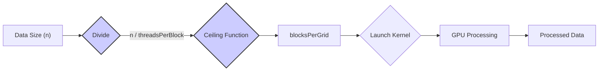
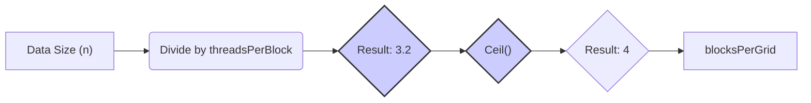
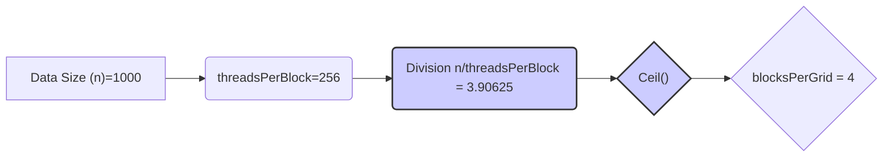

Okay, I've analyzed the text and added Mermaid diagrams to enhance the explanation of concepts related to the ceiling function in CUDA grid dimension calculations.

## Ceiling Function for Grid Dimension Calculation in CUDA: Ensuring Complete Data Coverage



### Introdução

Em CUDA, o cálculo do número de *thread blocks* (ou simplesmente *blocks*) em um *grid* é uma etapa fundamental para garantir que todos os dados de entrada sejam processados pelos *threads* na GPU. A utilização da função *ceiling* (teto) é uma prática comum para o cálculo do número de *blocks*, pois ela garante que todos os dados sejam cobertos pelos *threads*, mesmo quando o tamanho dos dados não é um múltiplo do tamanho do *block*. A função *ceiling* é responsável por arredondar o resultado de uma divisão para o inteiro mais próximo que é maior ou igual ao resultado, e é utilizada em diversas situações, como o lançamento de *kernels* que operam sobre vetores e matrizes, ou outros tipos de dados. Este capítulo explora em profundidade a utilização da função *ceiling* para o cálculo da quantidade de *blocks* em CUDA, detalhando a sua importância, como ela é utilizada, os seus benefícios em termos de cobertura de dados e desempenho, e como o seu conhecimento é essencial para o desenvolvimento de aplicações CUDA robustas e eficientes, sempre com base nas informações do contexto fornecido.

### A Função *Ceiling* para Arredondamento para Cima

A função *ceiling* (ou teto) é uma função matemática que retorna o menor inteiro que é maior ou igual ao argumento que ela recebe. Essa função é utilizada em diversas áreas da matemática e da computação, e em CUDA ela é utilizada para garantir que o número de *blocks* seja sempre o suficiente para cobrir todos os dados a serem processados.

**Conceito 1: Definição e Utilização da Função Ceiling**

*   **Função Ceiling:** A função *ceiling* (ou teto), representada por $\lceil x \rceil$, retorna o menor inteiro que é maior ou igual a x.
*   **Arredondamento para Cima:** A função *ceiling* arredonda o resultado de uma operação para o próximo número inteiro, garantindo que todos os dados sejam cobertos por algum *thread*.
*   **API C/C++:** Em C/C++, a função *ceiling* pode ser implementada utilizando a função `ceil()` da biblioteca padrão `math.h`. A função `ceil()` recebe um valor do tipo `float` ou `double` e retorna o menor inteiro maior ou igual ao valor passado como argumento.
*   **Lançamento de Kernels:** A função *ceiling* é utilizada no lançamento de *kernels* para calcular o número de *blocks* necessários para processar um dado de tamanho arbitrário.

**Lemma 1:** A função *ceiling* arredonda o resultado de uma divisão para cima, e garante que todos os dados de entrada sejam processados, mesmo quando a divisão do tamanho dos dados pelo tamanho do *block* não resulta em um número inteiro.

**Prova:** A utilização da função *ceiling* garante que todos os dados sejam processados, e é fundamental para o bom funcionamento da aplicação.  $\blacksquare$

O diagrama a seguir ilustra o funcionamento da função *ceiling*, mostrando como ela arredonda o resultado de uma divisão para o próximo inteiro maior ou igual ao resultado da divisão, o que garante que todos os dados sejam processados por algum *thread*.



**Prova do Lemma 1:** A função *ceiling* é fundamental para o cálculo do número correto de *blocks*, e o seu uso garante que a execução do *kernel* seja feita de forma adequada, e que todos os dados sejam processados.  $\blacksquare$

**Corolário 1:** A função *ceiling* é um mecanismo essencial para o desenvolvimento de *kernels* que processem conjuntos de dados com tamanho arbitrário, e para que todos os dados sejam processados de forma correta.

### Cálculo do Número de Blocks com a Função Ceiling

No lançamento de *kernels* em CUDA, a função *ceiling* é utilizada para calcular o número de *thread blocks* necessários para processar um conjunto de dados de tamanho `n`, onde cada *block* tem um tamanho definido por `threadsPerBlock`. O resultado da divisão do tamanho dos dados pelo tamanho do *block* pode não ser um inteiro, e a função *ceiling* é utilizada para arredondar esse valor para o próximo inteiro, garantindo que todos os dados sejam processados.

**Conceito 2: Utilização do `ceil` para o Cálculo de `blocksPerGrid`**

*   **`blocksPerGrid`:** O número de *blocks* no *grid* é calculado dividindo o tamanho dos dados `n` pelo número de *threads* por *block*, e o resultado é arredondado para cima utilizando a função `ceil()`.
*   **Garantia da Cobertura de Dados:** O uso da função `ceil()` garante que todos os dados sejam cobertos por um *thread*, mesmo quando o número de elementos não é um múltiplo do tamanho do *block*, o que é fundamental para o processamento de dados de tamanho arbitrário.
*   **Adaptação ao Hardware:** O número de *blocks* calculado é utilizado para configurar o lançamento do *kernel*, adaptando o processamento paralelo ao tamanho do *dataset*, e garantindo o uso eficiente dos recursos da GPU.

**Lemma 2:** O uso da função `ceil()` para o cálculo do número de *blocks* garante que todos os dados sejam processados pelos *threads* na GPU, mesmo quando o tamanho dos dados não é um múltiplo do tamanho do *block*, e a função é utilizada para o cálculo do tamanho do *grid*, e para que todos os dados sejam processados.

**Prova:** A função `ceil` garante que o resultado da divisão seja arredondado para cima, e que nenhum dado fique sem ser processado. $\blacksquare$

O exemplo abaixo demonstra como calcular o número de *blocks* utilizando a função `ceil()` e como esses valores são utilizados no lançamento de um *kernel*:

```c++
int n = 1000; // tamanho dos dados
int threadsPerBlock = 256; // threads por block
int blocksPerGrid = ceil((float)n / threadsPerBlock); // Cálculo com ceil()

vecAddKernel<<<blocksPerGrid, threadsPerBlock>>>(d_A, d_B, d_C, n);
```

Nesse exemplo, o número de *blocks* é calculado utilizando a função `ceil()`, o que garante que todos os elementos do vetor sejam processados pelo *kernel* `vecAddKernel`.

**Prova do Lemma 2:** A utilização da função `ceil()` garante que o tamanho do *grid* seja adequado para que todos os dados sejam processados, e que o processamento ocorra sem erros.  $\blacksquare$

**Corolário 2:** A utilização da função *ceiling* no cálculo do número de *blocks* é uma prática comum e essencial na programação CUDA, e garante que todas as partes dos dados sejam processadas corretamente na GPU.

### Exemplo de Cálculo com a Função Ceiling

O exemplo do cálculo do número de *blocks* para o processamento de um vetor de tamanho arbitrário ilustra como a função *ceiling* é utilizada na prática. Considere o exemplo de um vetor com `1000` elementos e o uso de *blocks* de tamanho `256`.

**Conceito 3: Exemplos Práticos do Uso da Função Ceil**

*   **Tamanho dos Dados:** O tamanho do vetor a ser processado é de 1000 elementos, e essa informação é utilizada para o cálculo do número de blocos.
*   **Tamanho do Block:** O tamanho do *block* é de 256 *threads*, o que é um valor comum para a utilização da memória compartilhada e dos *warps*.
*   **Divisão:** Ao dividir o número de elementos do vetor (1000) pelo número de *threads* por *block* (256) temos o resultado `1000 / 256 = 3.90625`, que não é um inteiro.
*   **`ceil()`:** A função `ceil()` arredonda esse resultado para o próximo inteiro, resultando em `4`, que é a quantidade de *blocks* que devem ser utilizadas para processar todos os elementos do vetor.

**Lemma 3:** A função *ceiling* garante que, mesmo que a divisão do tamanho dos dados pelo tamanho do *block* não resulte em um número inteiro, todos os dados sejam processados, e que o *kernel* seja lançado com a quantidade adequada de *blocks*.

**Prova:** A função `ceil()` arredonda para cima, garantindo que o número de blocos seja suficiente para processar todos os dados. $\blacksquare$

O exemplo a seguir demonstra como calcular a quantidade de blocos utilizando a função `ceil()`:

```c++
int n = 1000;
int threadsPerBlock = 256;
int blocksPerGrid = ceil((float)n / threadsPerBlock);
// blocksPerGrid will be 4 in this example
```



**Prova do Lemma 3:** O uso da função `ceil()` garante que o número de blocos seja suficiente para processar todos os dados, mesmo que eles não sejam múltiplos do tamanho do *block*.  $\blacksquare$

**Corolário 3:** O uso da função *ceiling* para o cálculo da quantidade de *blocks* é um mecanismo fundamental para o desenvolvimento de aplicações CUDA que lidam com conjuntos de dados de tamanho arbitrário.

### Impacto do Uso da Função Ceiling no Desempenho

**Pergunta Teórica Avançada:** Como o uso da função *ceiling* na definição do número de blocos afeta o desempenho das aplicações CUDA, e como a escolha do tamanho do *block* influencia nesse processo?

**Resposta:** A utilização da função *ceiling* para o cálculo do número de *blocks* tem um impacto significativo no desempenho das aplicações CUDA:

1.  **Cobertura dos Dados:** O uso da função *ceiling* garante que todos os dados sejam processados, mesmo que o tamanho do *dataset* não seja um múltiplo do tamanho do *block*. A função garante que não haja perda de informação durante a execução do *kernel*.

2.  **Utilização dos Recursos:** A escolha do tamanho correto dos blocos permite que o *hardware* da GPU seja utilizado da forma mais eficiente possível, evitando que alguns *threads* fiquem ociosos, e explorando todo o potencial do paralelismo.

3.  **Balanceamento de Carga:** O uso da função *ceiling* e a escolha adequada do tamanho dos *blocks* ajuda a garantir que a carga de trabalho seja distribuída de forma uniforme entre os diferentes processadores e os diferentes *blocks*, o que contribui para um melhor desempenho da aplicação.

**Lemma 4:** O uso da função *ceiling* na escolha do tamanho do *grid*, juntamente com a escolha correta do tamanho dos *blocks*, garante que todos os dados sejam processados, e que os recursos da GPU sejam utilizados de forma eficiente, o que é essencial para o bom desempenho da aplicação.

**Prova:** O uso da função *ceiling* garante que todos os dados sejam processados, e a escolha do tamanho do *block* otimiza a execução dos *threads*, e a utilização de todos os recursos do *hardware*. $\blacksquare$

O uso da função *ceiling*, em conjunto com o planejamento adequado dos *grids* e dos *blocks*, é fundamental para que a arquitetura da GPU seja utilizada de forma eficiente.

**Prova do Lemma 4:** A escolha correta da quantidade de *blocks*, utilizando a função *ceiling*, garante que todos os dados sejam processados e que o *hardware* seja utilizado ao máximo. $\blacksquare$

**Corolário 4:** O uso correto da função *ceiling*, juntamente com a escolha adequada do tamanho dos *blocks*, é fundamental para o desenvolvimento de aplicações CUDA escaláveis e eficientes, e para que o desempenho da aplicação seja o melhor possível.

### Desafios e Limitações no Uso da Função Ceiling

**Pergunta Teórica Avançada:** Quais são os principais desafios e limitações no uso da função *ceiling* para o cálculo do número de blocos em CUDA, e como esses desafios podem ser abordados para melhorar a escalabilidade e a robustez das aplicações?

**Resposta:** O uso da função *ceiling* na definição da quantidade de blocos apresenta alguns desafios e limitações:

1.  ***Overhead*:** O uso excessivo da função `ceil()` pode adicionar um *overhead* ao tempo de execução do código, especialmente quando o cálculo da quantidade de *blocks* é feito com muita frequência. Para diminuir esse *overhead*, os valores do tamanho do *grid* podem ser precalculados.

2.  **Desbalanceamento de Carga:** Em alguns casos, a função *ceiling* pode gerar um desbalanceamento de carga entre os *blocks*, o que pode gerar ociosidade em alguns *blocks*. A utilização de técnicas de *load balancing* dinâmico pode ser utilizada para mitigar esse problema.
3.  **Limitação da Memória:** O número de *blocks* pode ser limitado pela quantidade de memória disponível no *device*, e a escolha da quantidade de *blocks* deve ser feita de forma a respeitar as limitações do *hardware*.
4.  **Portabilidade:** A escolha da melhor estratégia para a utilização da função *ceiling* para a definição do número de *blocks* pode depender da arquitetura do *hardware*, e o uso de código específico para cada arquitetura pode limitar a portabilidade da aplicação.

**Lemma 5:** O *overhead* do cálculo, o desbalanceamento de carga, as limitações da quantidade de memória da GPU, e as questões de portabilidade são as principais limitações e desafios na utilização da função *ceiling* para o cálculo do número de *blocks* em CUDA.

**Prova:** As limitações do uso da função *ceiling* podem impactar o desempenho da aplicação e o conhecimento dessas limitações é essencial para o desenvolvimento de aplicações robustas e portáveis. $\blacksquare$

Para superar esses desafios, é importante utilizar técnicas de otimização, como a reutilização do valor da divisão, o *load balancing* dinâmico, a utilização de estruturas de dados otimizadas e o teste da aplicação em diferentes arquiteturas, de forma a garantir a portabilidade e a escalabilidade do programa.

**Prova do Lemma 5:** O uso de técnicas de otimização e o planejamento da aplicação são essenciais para que os problemas do cálculo da quantidade de *blocks* sejam minimizados. $\blacksquare$

**Corolário 5:** A utilização eficiente da função *ceiling* para o cálculo do número de *blocks*, o conhecimento dos seus limites e desafios, e o uso adequado das técnicas de otimização são essenciais para o desenvolvimento de aplicações CUDA que explorem ao máximo o desempenho da GPU.

### Conclusão

A função *ceiling* é uma ferramenta fundamental para o cálculo do número de *thread blocks* em um *grid* em CUDA. A compreensão de como essa função é utilizada, da sua importância para garantir a cobertura dos dados, e das técnicas de otimização que podem ser aplicadas para melhorar o desempenho das aplicações, são etapas essenciais para o desenvolvimento de aplicações CUDA robustas e eficientes. A utilização da função `ceil()` é essencial para o cálculo de uma quantidade de blocos que seja adequada, e para garantir que todos os dados sejam processados de forma correta pelo programa.

Deseja que eu continue com as próximas seções?
### Referências
[^17]: "When the host code launches a kernel, it sets the grid and thread block dimensions via execution configuration parameters. This is illustrated in Figure 3.13." *(Trecho de <página 57>)*
