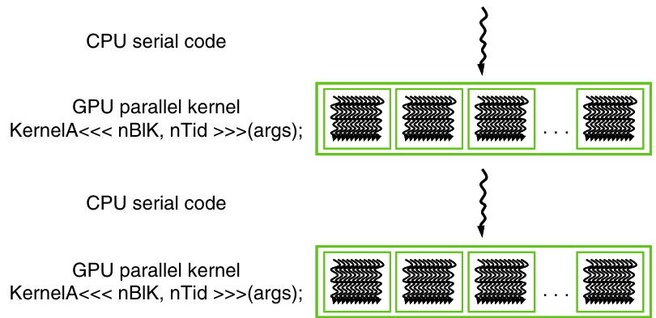

A imagem, referenciada na página 55 do documento, apresenta uma tabela que sumariza os qualificadores CUDA C para declaração de funções (_device_, _global_, _host_). A tabela detalha onde cada tipo de função é executado (device ou host) e de onde pode ser chamado, fornecendo um panorama das restrições e capacidades de cada qualificador. A função qualificada como `__global__` é um kernel, executado no dispositivo, mas chamado do host, enquanto `__device__` é executada e chamada no dispositivo, e `__host__` roda no host.

A imagem ilustra o fluxo de execução de um programa CUDA, alternando entre código serial executado na CPU e kernels paralelos executados na GPU, conforme descrito na seção 3.3 do documento. O kernel GPU 'KernelA<<<nBIK, nTid>>>(args)' é lançado repetidamente a partir do código CPU, indicando a natureza híbrida da computação CUDA, onde tarefas sequenciais e paralelas se alternam para otimizar o desempenho.

This image, Figure 3.5 from page 47, illustrates the outline of a revised `vecAdd()` function in CUDA that offloads computation to a device, specifically a GPU. It shows the three essential steps: Part 1 allocates device memory and copies input vectors A and B from host to device memory, Part 2 launches the kernel for parallel vector addition on the GPU, and Part 3 copies the result vector C from device memory back to host memory and frees device vectors. This highlights the data transfer and kernel execution flow within the CUDA programming model.

A imagem, referenciada como Figura 3.1 na página 43, ilustra o conceito de paralelismo de dados na adição de vetores, um tema central discutido no Capítulo 3 do documento. Ela demonstra como elementos correspondentes de dois vetores de entrada, A e B, são somados em paralelo para gerar um vetor de saída C. Cada operação de adição, representada por um círculo com um sinal de '+', é independente, permitindo a execução simultânea em arquiteturas paralelas como as GPUs da CUDA, um tópico central do capítulo.

This figure, referenced as Figure 3.2 on page 43 of the provided document, provides an overview of the CUDA program compilation process. It illustrates how integrated C programs with CUDA extensions are processed by the NVCC compiler, which separates the code into Host Code and Device Code (PTX). The Host Code is processed by a Host C preprocessor, compiler, and linker, while the Device Code is handled by a Device just-in-time compiler, eventually leading to a heterogeneous computing platform with CPUs and GPUs.

A imagem, encontrada na página 48 do documento, ilustra a arquitetura de memória do CUDA, demonstrando a separação entre a memória do host (CPU) e a memória global do dispositivo (GPU). A imagem destaca a necessidade de transferência explícita de dados entre essas memórias, mostrando setas bidirecionais entre os blocos de memória do host e do dispositivo para representar a cópia de dados. Essa cópia é gerenciada pela API CUDA e é essencial para a execução de kernels em dispositivos CUDA.

The image, found on page 54 and labeled as Figure 3.10, illustrates how threads in a CUDA grid are organized into thread blocks and how each thread combines threadIdx and blockIdx to create a unique global index. It shows blocks 0, 1 and N-1, each with 256 threads indexed from 0 to 255, and provides the formula to calculate the global data index 'i' for accessing elements in device memory.
