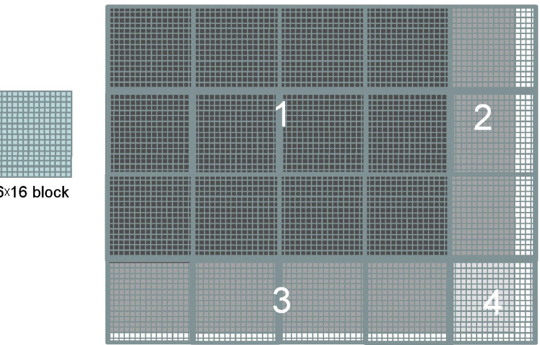
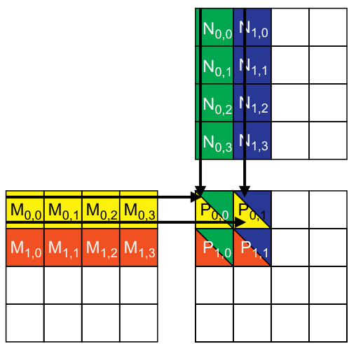
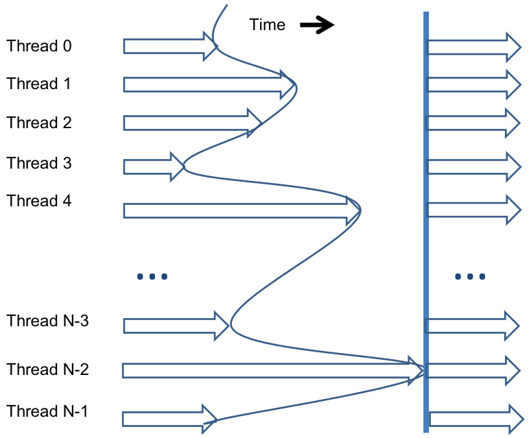
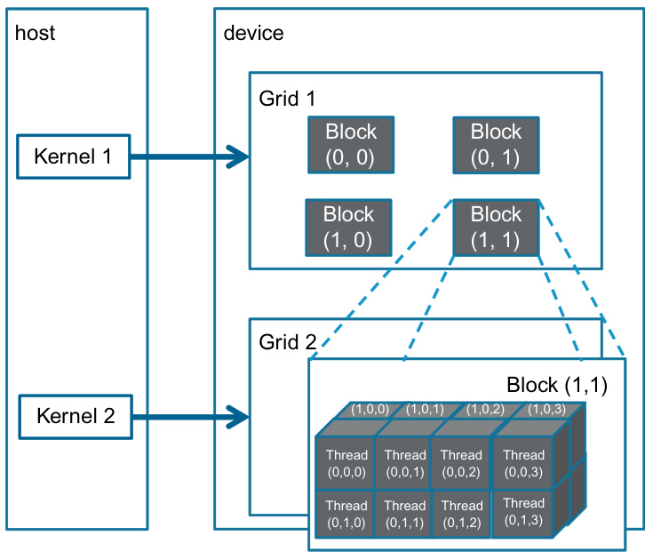
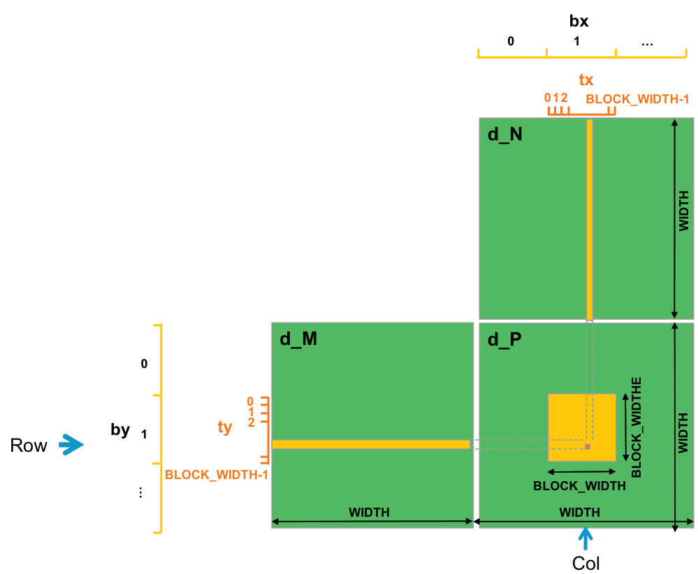
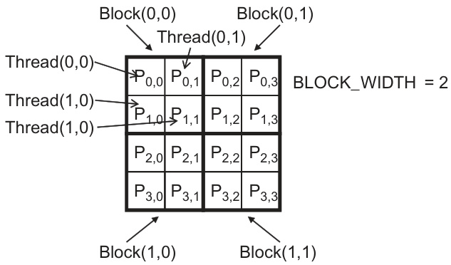
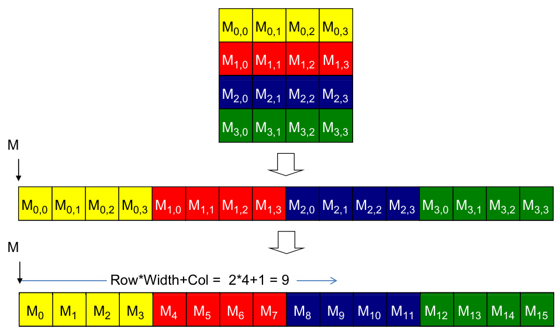
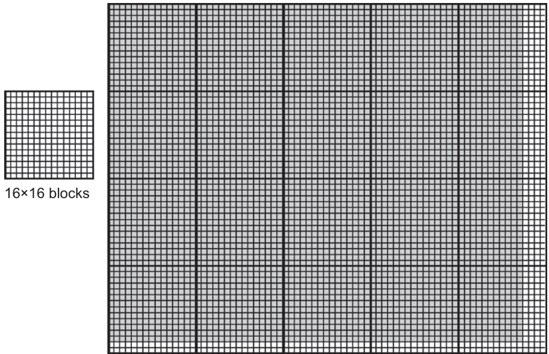

The image illustrates CUDA's 2D thread mapping to a data pattern as discussed in Section 4.2. It visually represents how a 76x62 pixel image is covered by 16x16 thread blocks, highlighting how threads are allocated and managed. The numbered regions (1-4) denote different block execution behaviors, ranging from full pixel processing to partial or no processing due to boundary conditions.  This allocation strategy and the associated conditional logic are critical for efficient parallel processing in CUDA, ensuring that all valid data elements are addressed without exceeding boundaries.

The image illustrates matrix multiplication actions of one thread block, as described in the context of CUDA programming, specifically matrix-matrix multiplication. The matrices d_M, d_N, and d_P are represented as M, N, and P respectively for readability. The diagram visually demonstrates how the input matrices are processed by the thread block to produce the output matrix, aligning with the discussion in Chapter 4 of the document, particularly around page 80 where Figure 4.10 is referenced.

A imagem ilustra o conceito de sincronização de barreira (barrier synchronization) em CUDA, conforme discutido na Seção 4.4, 'Synchronization and Transparent Scalability' (página 81). A imagem mostra N threads em um bloco, onde cada thread atinge a barreira em momentos diferentes. As threads que chegam cedo esperam pelas que chegam mais tarde, garantindo que todas completem uma fase antes de prosseguir. Este mecanismo é fundamental para coordenar atividades paralelas dentro de um bloco em CUDA.

The image illustrates a multidimensional CUDA grid organization as described in Section 4.1, page 67 of the document. It shows a host initiating two kernels which execute on the device. The execution is structured as grids (Grid 1 and Grid 2), which are subdivided into blocks. The image particularly highlights the thread organization within Block(1,1) of Grid 2, displaying the 3D arrangement of threads with their respective coordinates, demonstrating the hierarchy of grids, blocks, and threads in CUDA.

A imagem ilustra a organização da multiplicação de matrizes usando múltiplos blocos, conforme discutido na seção 4.3 do documento. A matriz d_P é dividida em blocos menores, com cada bloco sendo computado por um conjunto de threads. As matrizes d_M e d_N são acessadas em faixas horizontais e verticais, respectivamente, para calcular os elementos de d_P. A imagem detalha os índices tx, ty, bx e by, que representam threadIdx.x, threadIdx.y, blockIdx.x e blockIdx.y respectivamente.

A imagem ilustra a organização de threads e blocos em uma grade CUDA para multiplicação de matrizes, demonstrando como dados são divididos e processados em paralelo. Ela mostra uma matriz dividida em quatro blocos, cada um processado por um conjunto de threads (com BLOCK_WIDTH = 2), indicando o mapeamento de threads para elementos da matriz (P0,0, P0,1, etc.) dentro de cada bloco (Block(0,0), Block(0,1), etc.) conforme descrito na Seção 4.3 do documento. Essa organização hierárquica permite a computação paralela eficiente de elementos da matriz de saída, conforme explorado no exemplo de multiplicação de matrizes discutido no texto.

The image illustrates a row-major layout for a 2D C array as discussed in Chapter 4 of the document. It depicts how a 4x4 matrix 'M' is linearized into a 16-element 1D array. The illustration shows the transformation process from the 2D matrix to the 1D array and includes the formula 'Row*Width+Col = 2*4+1 = 9' to calculate the index for a specific element, such as M2,1, which corresponds to M9 in the linearized array. This concept is important for understanding how CUDA C handles dynamically allocated multidimensional arrays, as mentioned in the document's discussion on mapping threads to multidimensional data and accessing memory spaces efficiently.

The image, labeled as Figure 4.2 on page 68 of the document, illustrates the mapping of CUDA threads to a 2D array of pixels, specifically for processing an image of 76x62 pixels. The diagram depicts how the grid is divided into blocks, where each block contains 16x16 threads. The heavy lines represent the block boundaries, and the gray area indicates the threads that cover the image's pixels. This illustrates the hierarchical structure of threads in CUDA and how they're used to process data in parallel.
