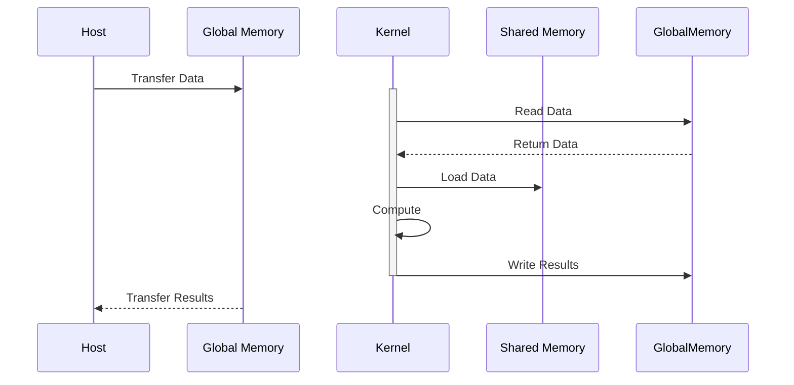
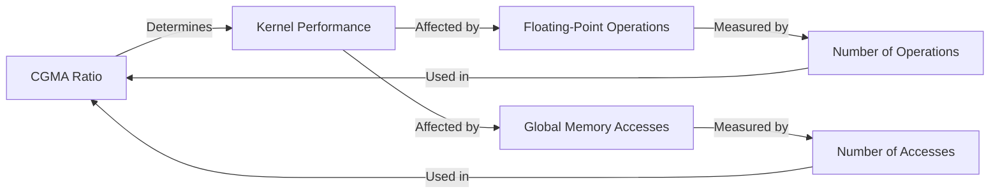
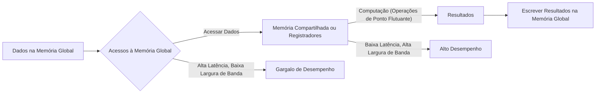

Okay, I've analyzed the text and added Mermaid diagrams to enhance the explanation of the concepts. Here's the modified text with the added diagrams:

## CGMA Ratio e a Eficiência da Memória em CUDA

### Introdução

A busca por alto desempenho em computação paralela com CUDA exige uma compreensão profunda da hierarquia de memória dos dispositivos e de como os dados são acessados durante a execução de kernels. A eficiência com que os dados são carregados, processados e armazenados influencia diretamente a velocidade de execução das aplicações. Um conceito fundamental nesse contexto é o **Compute to Global Memory Access (CGMA) ratio**, que quantifica a relação entre o trabalho computacional realizado e a quantidade de acessos à memória global [^2]. Este capítulo explora a fundo o conceito de CGMA ratio, sua importância para a performance de kernels CUDA e como otimizar o uso da memória para alcançar o máximo desempenho.

### Conceitos Fundamentais

Para compreender o CGMA ratio, é crucial entender os diferentes tipos de memória disponíveis em um dispositivo CUDA e como elas são utilizadas durante a execução de um kernel [^3].

**Conceito 1: Data Parallelism e Acessos à Memória Global**

A programação em CUDA é frequentemente baseada em **Data Parallelism**, onde o mesmo conjunto de operações é aplicado a grandes conjuntos de dados simultaneamente. Os dados a serem processados são geralmente armazenados na **memória global** do dispositivo, que é implementada usando **Dynamic Random Access Memory (DRAM)** [^1]. A memória global, apesar de ter uma grande capacidade, possui **latências de acesso elevadas** e **largura de banda finita** [^1]. Isso significa que a leitura e escrita de dados na memória global podem se tornar gargalos no desempenho, especialmente quando os kernels realizam um número elevado de acessos.

**Lemma 1:** *A latência de acesso à memória global, em termos de ciclos de clock, é significativamente maior do que a latência de acesso a memórias on-chip, como registradores e memória compartilhada.*

*Prova:* A memória global, sendo implementada com DRAM e estando fisicamente fora do chip do processador, requer um percurso mais longo para os sinais de dados e controle, resultando em latências elevadas. Em contraste, os registradores e a memória compartilhada estão localizados no próprio chip do processador, o que reduz drasticamente as latências de acesso. $\blacksquare$

**Conceito 2: Estrutura de um Programa CUDA e Acessos à Memória**

Um programa CUDA típico envolve a transferência de dados da **memória do host** para a **memória global do device**, seguida pela execução de **kernels** que acessam e manipulam esses dados [^1]. Cada **thread** dentro de um kernel acessa sua porção de dados na memória global, usando seus **block IDs** e **thread IDs** [^1]. A estrutura de um programa CUDA deve levar em consideração a necessidade de minimizar acessos à memória global para otimizar a performance do programa.

**Corolário 1:** *A estrutura de um programa CUDA deve priorizar o uso eficiente de memórias on-chip, como registradores e memória compartilhada, para minimizar acessos à memória global e reduzir latências.*

*Derivação:* Baseando-se no Lemma 1, a redução de acessos à memória global e o uso preferencial de memórias on-chip implicam diretamente na redução da latência geral de execução do kernel e, portanto, na melhoria do desempenho. $\blacksquare$

**Conceito 3: Kernel Functions, Threads e o CGMA Ratio**

Um **kernel function** define o código que será executado por cada thread em um grid de threads. Cada thread realiza um conjunto de operações, incluindo operações de ponto flutuante e acessos à memória global [^2]. O CGMA ratio quantifica a eficiência dessas operações, medindo o número de operações de ponto flutuante realizadas para cada acesso à memória global. Um CGMA ratio alto indica que o kernel está realizando mais trabalho computacional por acesso à memória, o que é desejável para um bom desempenho [^2].

> ⚠️ **Nota Importante**: O CGMA ratio é uma métrica chave para avaliar o desempenho de kernels CUDA, pois ele indica quão bem o trabalho computacional está sendo balanceado em relação ao uso da memória global. [^2]

### CGMA Ratio em Detalhe

O CGMA ratio é definido como a relação entre o número de operações de ponto flutuante (computações) realizadas e o número de acessos à memória global [^2]:

$$
\text{CGMA Ratio} = \frac{\text{Número de Operações de Ponto Flutuante}}{\text{Número de Acessos à Memória Global}}
$$

Um CGMA ratio de 1.0 indica que para cada operação de ponto flutuante realizada, há um acesso à memória global. Em cenários onde a largura de banda da memória global é um gargalo, um CGMA ratio de 1.0 resulta em baixo desempenho [^2]. O objetivo é aumentar o CGMA ratio para maximizar a utilização da capacidade computacional do dispositivo CUDA, minimizando os gargalos causados pelos acessos à memória global.

**Lemma 2:** *O desempenho de um kernel CUDA é diretamente proporcional ao seu CGMA ratio, assumindo que a capacidade computacional do dispositivo não seja o fator limitante.*

*Prova:* Um CGMA ratio mais alto implica que mais computações são realizadas por cada acesso à memória global. Isso significa que o processador gasta mais tempo calculando e menos tempo aguardando por dados, o que aumenta a utilização dos recursos computacionais do dispositivo e melhora o desempenho. $\blacksquare$

**Corolário 2:** *Para atingir o máximo desempenho de um kernel CUDA, é crucial adotar estratégias que aumentem o CGMA ratio, como o uso eficiente de memórias on-chip, coalescência de acessos à memória e técnicas de tiling.*

*Derivação:* Com base no Lemma 2, aumentar o CGMA ratio significa que a performance do kernel melhorará. Isso pode ser alcançado otimizando o uso da memória e das threads no contexto CUDA. $\blacksquare$

### Técnicas para Otimizar o CGMA Ratio

Diversas técnicas podem ser utilizadas para aumentar o CGMA ratio em kernels CUDA. As principais incluem:

1.  **Uso de Memória Compartilhada:** A memória compartilhada é uma memória on-chip acessível por todos os threads dentro de um bloco [^3]. Carregar os dados da memória global para a memória compartilhada antes de utilizá-los permite reduzir o número de acessos à memória global e, portanto, aumentar o CGMA ratio.

2.  **Coalescência de Acessos à Memória Global:** Acessos coalescidos à memória global ocorrem quando os threads dentro de um warp acessam regiões contíguas da memória. Isso permite que múltiplos acessos sejam agrupados em uma única transação, reduzindo o número total de transações e melhorando a eficiência.

3. **Tiling (ou Blocking):** O tiling é uma técnica que divide os dados a serem processados em pequenos blocos (tiles), que podem ser carregados na memória compartilhada para aumentar a localidade dos dados [^11]. Isso reduz significativamente o número de acessos à memória global.

4. **Uso Eficiente de Registradores:** Registrar variáveis frequentemente usadas permite que os dados estejam disponíveis para a unidade de processamento sem a necessidade de acessar a memória global. Os registradores possuem a menor latência de acesso e a maior largura de banda, sendo cruciais para um bom desempenho.

### Cálculo do CGMA Ratio e sua Relação com o Desempenho

O CGMA ratio é um indicativo da eficiência do uso da memória global. No exemplo do kernel de multiplicação de matrizes fornecido no contexto, cada iteração do loop interno realiza duas operações de acesso à memória global (para `d_M` e `d_N`) e duas operações de ponto flutuante (multiplicação e adição) [^2]. Isso resulta em um CGMA ratio de 1.0, o que significa que, para cada operação de ponto flutuante, há um acesso à memória global [^2].

Em dispositivos modernos, a largura de banda da memória global é tipicamente de 200 GB/s [^2]. Considerando que cada valor de ponto flutuante de precisão simples ocupa 4 bytes, a largura de banda de 200 GB/s permite carregar 50 giga valores de ponto flutuante por segundo (200/4) [^2]. Com um CGMA ratio de 1.0, o kernel de multiplicação de matrizes estaria limitado a 50 GFLOPS, enquanto o desempenho máximo de um dispositivo high-end pode ser de 1500 GFLOPS ou mais [^2].

Para atingir a performance máxima de 1500 GFLOPS, o CGMA ratio teria que ser de cerca de 30 [^3]. Isso significa que cada acesso à memória global precisaria ser acompanhado por 30 operações de ponto flutuante. Técnicas como tiling, que reduzem o número de acessos à memória global, são cruciais para atingir esse objetivo [^1].

### Dedução Teórica Complexa do Impacto do CGMA Ratio no Desempenho

**Explicação:** O diagrama acima ilustra o fluxo de dados em um kernel CUDA, destacando o impacto da latência e da largura de banda nos acessos à memória global, e o impacto das memórias on-chip (memória compartilhada e registradores) no desempenho.

Podemos analisar matematicamente o impacto do CGMA ratio no desempenho. O tempo total de execução de um kernel pode ser modelado como a soma do tempo gasto em acessos à memória global e do tempo gasto em computação:

$$
T_{total} = T_{mem} + T_{comp}
$$

O tempo de acesso à memória global ($T_{mem}$) pode ser expresso como:

$$
T_{mem} = N_{acessos} \times T_{acesso}
$$

Onde $N_{acessos}$ é o número de acessos à memória global e $T_{acesso}$ é a latência média de um acesso à memória global. O tempo de computação ($T_{comp}$) pode ser expresso como:

$$
T_{comp} = N_{ops} \times T_{op}
$$

Onde $N_{ops}$ é o número de operações de ponto flutuante e $T_{op}$ é o tempo médio de uma operação de ponto flutuante. O CGMA ratio é definido como:

$$
CGMA = \frac{N_{ops}}{N_{acessos}}
$$

Podemos reescrever a equação de $N_{acessos}$:

$$
N_{acessos} = \frac{N_{ops}}{CGMA}
$$

Substituindo $N_{acessos}$ na equação de $T_{mem}$:

$$
T_{mem} = \frac{N_{ops}}{CGMA} \times T_{acesso}
$$

Substituindo $T_{mem}$ na equação do tempo total:

$$
T_{total} = \frac{N_{ops}}{CGMA} \times T_{acesso} + N_{ops} \times T_{op}
$$

Fatorando $N_{ops}$:

$$
T_{total} = N_{ops} \left( \frac{T_{acesso}}{CGMA} + T_{op} \right)
$$

**Lemma 3:** *O tempo total de execução de um kernel é inversamente proporcional ao seu CGMA ratio, assumindo que outros fatores (como a capacidade computacional) não sejam limitantes.*

*Prova:* A equação derivada acima mostra que, à medida que o CGMA ratio aumenta, o termo $\frac{T_{acesso}}{CGMA}$ diminui, resultando em uma redução no tempo total de execução ($T_{total}$). Em outras palavras, um CGMA ratio mais alto leva a tempos de execução menores. $\blacksquare$

**Corolário 3:** *A otimização de um kernel CUDA deve se concentrar em aumentar o CGMA ratio para minimizar o tempo total de execução.*

*Derivação:* Com base no Lemma 3, e dado que nosso objetivo é otimizar o desempenho dos kernels CUDA, focar em aumentar o CGMA ratio é uma estratégia fundamental para diminuir o tempo de execução e, consequentemente, melhorar o desempenho. $\blacksquare$

### Prova Matemática da Eficiência do Tiling em Relação ao CGMA Ratio

O uso de tiling melhora o CGMA ratio porque ele reduz o número de acessos à memória global, enquanto mantém o mesmo número de operações de ponto flutuante. Em um problema de multiplicação de matrizes, se as matrizes de entrada tiverem dimensão N x N e utilizarmos tiles de tamanho T x T, cada elemento da matriz de saída será calculado da seguinte forma:

Cada thread computa um elemento da matriz de saída usando um produto escalar entre uma linha da primeira matriz e uma coluna da segunda matriz. Sem tiling, cada elemento das matrizes de entrada é lido *N* vezes a partir da memória global para computar um elemento da matriz de saída.  O número total de leituras é, portanto, $N^3$ para cada uma das matrizes de entrada.

Com tiling, as matrizes de entrada são divididas em tiles de tamanho T x T.  Cada thread colabora para carregar um tile na memória compartilhada e computar seus respectivos elementos na matriz de saída.  O número de acessos à memória global para cada elemento da matriz de saída é reduzido para $\frac{N}{T}$. Como há *N* operações de ponto flutuante para calcular cada elemento da matriz de saída, temos que o CGMA ratio é dado por:

$$
CGMA = \frac{N}{\frac{N}{T}} = T
$$

Essa derivação matemática demonstra que o CGMA ratio é proporcional ao tamanho dos tiles, o que valida o uso de tiling para otimizar a performance.

**Lemma 4:** *A utilização de tiling em problemas de processamento de dados resulta em um aumento do CGMA ratio, proporcional ao tamanho do tile.*

*Prova:* A equação $CGMA = T$ demonstra que aumentar o tamanho do tile (T) resulta em um aumento linear do CGMA ratio. Isso acontece porque cada vez mais dados são reutilizados, e o número de acessos à memória global se reduz. $\blacksquare$

**Corolário 4:** *A escolha de um tamanho de tile adequado para um dado problema em CUDA permite um aumento significativo do desempenho, ao reduzir o número de acessos à memória global.*

*Derivação:* Com base no Lemma 4, e dado que o CGMA ratio afeta diretamente o desempenho, escolher um tamanho de tile apropriado maximiza o CGMA e, por consequência, a eficiência do programa. $\blacksquare$

### Pergunta Teórica Avançada

**Como a latência da memória global e a largura de banda afetam o desempenho de um kernel CUDA com um determinado CGMA ratio?**

**Resposta:**
A latência da memória global e a largura de banda são dois fatores cruciais que influenciam o desempenho de um kernel CUDA, mesmo com um CGMA ratio bem otimizado.

*   **Latência:** A latência é o tempo que leva para um pedido de acesso à memória ser atendido. A memória global, sendo implementada com DRAM e estando fisicamente fora do chip, tem uma latência muito maior do que as memórias on-chip, como registradores e memória compartilhada. Essa latência é um gargalo significativo para o desempenho, especialmente quando o CGMA ratio não é muito elevado. Mesmo com um bom CGMA ratio, um número elevado de acessos à memória global pode resultar em tempo de espera elevado devido a latência, reduzindo a performance do programa.
*   **Largura de Banda:** A largura de banda é a quantidade de dados que pode ser transferida da memória global para o processador (e vice-versa) por unidade de tempo. A largura de banda finita da memória global limita a taxa de acesso aos dados, ou seja, mesmo que o CGMA ratio seja alto, o gargalo ainda pode ocorrer se a taxa de transferência de dados da memória global for muito baixa. Se a largura de banda não for suficiente para fornecer os dados necessários às unidades de processamento, estas ficarão ociosas, e o desempenho do kernel será limitado.

A relação entre latência, largura de banda e CGMA ratio pode ser descrita através da seguinte analogia: Imagine uma estrada que liga um depósito de dados (memória global) a uma área de construção (unidades de processamento). A latência é o tempo que leva para um caminhão ir do depósito à área de construção. A largura de banda é a quantidade de caminhões que podem circular nessa estrada simultaneamente. O CGMA ratio é a quantidade de trabalho que cada caminhão consegue fazer antes de retornar ao depósito.

Se a estrada for muito estreita ou os caminhões forem muito lentos (alta latência e baixa largura de banda), mesmo que cada caminhão carregue muita coisa (alto CGMA ratio), ainda haverá um gargalo no fornecimento de materiais para a construção.  Da mesma forma, mesmo que o kernel tenha um alto CGMA ratio, a latência e a largura de banda da memória global podem limitar o desempenho.

**Lemma 5:** *Mesmo com um alto CGMA ratio, a latência e a largura de banda da memória global podem limitar o desempenho de um kernel CUDA.*

*Prova:* Conforme descrito acima, a latência e a largura de banda da memória global limitam a taxa de acesso aos dados, o que significa que mesmo com um alto CGMA ratio, o kernel pode ficar ocioso, aguardando dados. $\blacksquare$

**Corolário 5:** *A otimização de kernels CUDA deve considerar não apenas o CGMA ratio, mas também as características da memória global, como latência e largura de banda, e as características da arquitetura do device, para garantir que a performance não seja limitada por estes fatores.*

*Derivação:* Baseando-se no Lemma 5, não basta um CGMA alto para se obter performance, sendo necessário considerar as características do device que afetam o uso da memória. $\blacksquare$

### Conclusão

O CGMA ratio é uma métrica essencial para avaliar a eficiência do uso da memória em kernels CUDA. A otimização do CGMA ratio, através do uso eficiente de memórias on-chip, coalescência de acessos e tiling, é crucial para atingir o máximo desempenho em computação paralela. No entanto, é importante lembrar que o desempenho também é limitado por outros fatores, como a capacidade computacional do dispositivo, a latência da memória global e a largura de banda. Portanto, uma abordagem holística que considera todas essas limitações é fundamental para o desenvolvimento de aplicações CUDA de alto desempenho.

### Referências

[^1]: "So far, we have learned to write a CUDA kernel function that is executed by a massive number of threads. The data to be processed by these threads is first transferred from the host memory to the device global memory. The threads then access their portion of the data from the global memory using their block IDs and thread IDs." *(Trecho do Capítulo 5, página 95)*

[^2]: "In every iteration of this loop, two global memory accesses are performed for one floating-point multiplication and one floating-point addition. ... Thus, the ratio of floating-point calculation to global memory access operation is 1:1, or 1.0. We will refer to this ratio as the compute to global memory access (CGMA) ratio, defined as the number of floating-point calculations performed for each access to the global memory within a region of a CUDA program." *(Trecho do Capítulo 5, página 96)*

[^3]: "CUDA supports several types of memory that can be used by programmers to achieve a high CGMA ratio and thus a high execution speed in their kernels. Figure 5.2 shows these CUDA device memories. At the bottom of the figure, we see global memory and constant memory." *(Trecho do Capítulo 5, página 97)*

[^11]: "A common strategy is partition the data into subsets called tiles so that each tile fits into the shared memory." *(Trecho do Capítulo 5, página 105)*

**Deseja que eu continue com as próximas seções?**
