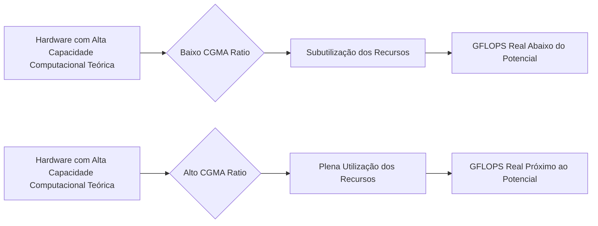
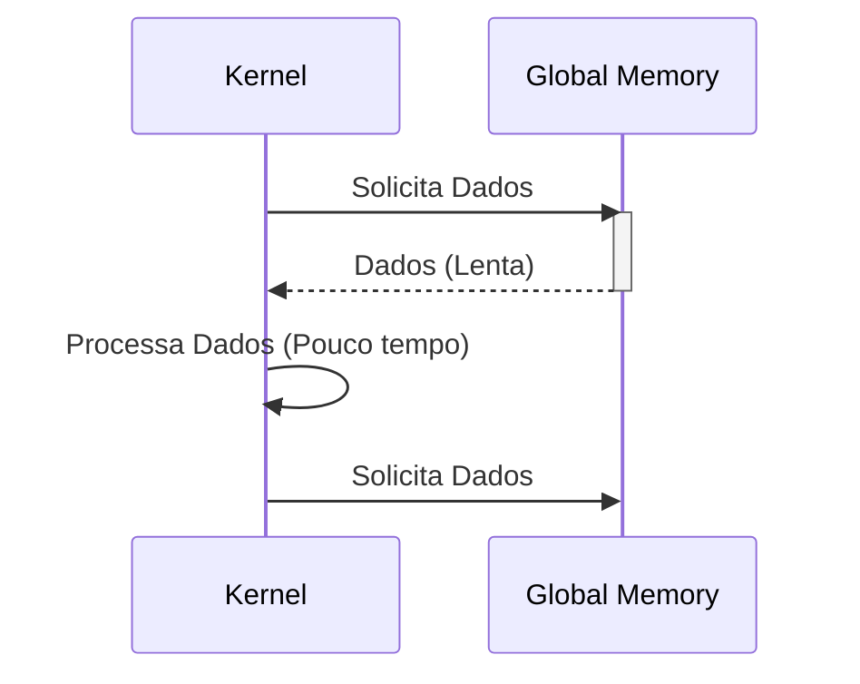
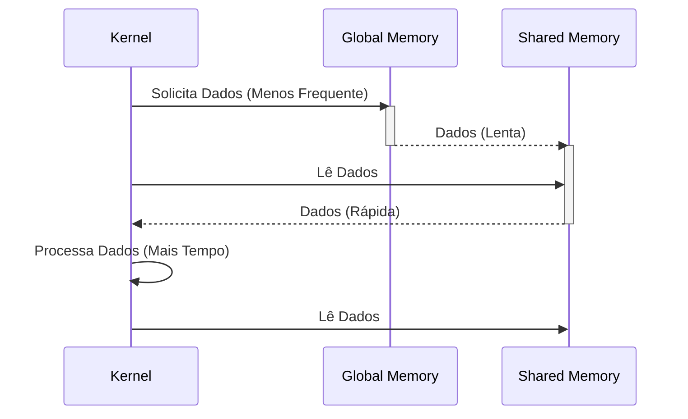
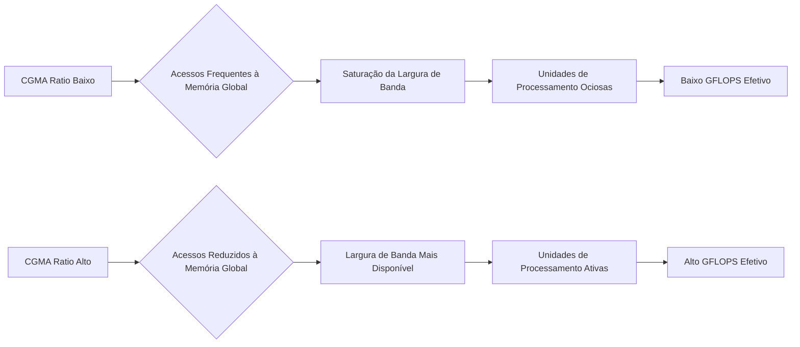

Okay, I've analyzed the text and added Mermaid diagrams to enhance understanding where appropriate. Here's the enhanced text:

## Impacto do CGMA na Performance de Kernels CUDA

### Introdução

No capítulo anterior, exploramos o conceito de **Compute to Global Memory Access (CGMA) ratio** e sua importância para a eficiência do uso da memória em kernels CUDA. Agora, aprofundaremos nossa análise ao investigar como o CGMA ratio impacta diretamente o desempenho prático das aplicações CUDA, demonstrando como um CGMA ratio baixo pode levar à subutilização dos recursos computacionais do dispositivo, mesmo quando há capacidade teórica para atingir um desempenho muito superior [^2].

### Impacto do CGMA Ratio na Utilização de Recursos Computacionais

Um CGMA ratio baixo indica que um kernel está realizando um número relativamente pequeno de operações de ponto flutuante para cada acesso à memória global. Em outras palavras, o kernel está gastando mais tempo lendo e escrevendo dados da memória global do que processando-os. Isso leva a uma subutilização das unidades de processamento (Streaming Multiprocessors - SMs) do dispositivo CUDA, que ficam ociosas enquanto aguardam que os dados da memória global cheguem.

**Conceito 1: Subutilização da Capacidade Computacional**

Quando o CGMA ratio é baixo, os threads de um kernel realizam acessos frequentes à memória global, o que pode causar congestionamento no tráfego de dados e aumentar a latência dos acessos. Enquanto aguardam esses acessos, as unidades de processamento ficam ociosas, reduzindo a taxa de computação efetiva do dispositivo. A capacidade teórica de um dispositivo CUDA, medida em GFLOPS (giga operações de ponto flutuante por segundo), pode não ser atingida se o CGMA ratio for muito baixo, pois o desempenho passa a ser limitado pela velocidade com que os dados são fornecidos do que pela velocidade de computação [^2].

**Lemma 1:** *Um CGMA ratio baixo resulta na subutilização dos recursos computacionais de um dispositivo CUDA devido à alta frequência de acessos à memória global e à consequente ociosidade das unidades de processamento.*

*Prova:* Quando o CGMA ratio é baixo, as unidades de processamento gastam mais tempo esperando por dados da memória global do que realizando computações, o que impede que o desempenho máximo seja atingido. $\blacksquare$

**Conceito 2: A Importância da Largura de Banda da Memória**

A largura de banda da memória global é a taxa na qual os dados podem ser transferidos entre a memória global e as unidades de processamento. Um CGMA ratio baixo significa que essa largura de banda é consumida mais rapidamente com acessos frequentes à memória global, o que pode saturar o sistema de memória. Isso reduz a velocidade com que os dados podem ser entregues às unidades de processamento e, portanto, a velocidade com que os cálculos podem ser realizados.

**Corolário 1:** *A largura de banda da memória global, combinada com um CGMA ratio baixo, pode se tornar um gargalo significativo para o desempenho de kernels CUDA.*

*Derivação:* Um CGMA baixo exige mais acesso a memória global, o que pode consumir toda a largura de banda e tornar a memória um limitador de performance. $\blacksquare$

### Exemplos Práticos da Limitação do Desempenho por Baixo CGMA

O exemplo da multiplicação de matrizes ilustra perfeitamente como um CGMA ratio baixo pode limitar o desempenho, mesmo que o hardware tenha a capacidade de alcançar uma taxa de computação muito maior [^2].

**Exemplo 1: Multiplicação de Matrizes com CGMA = 1.0**

Como discutido anteriormente, o kernel de multiplicação de matrizes sem otimização (Figura 5.1 no contexto) realiza duas operações de acesso à memória global para cada operação de ponto flutuante [^2]. Isso resulta em um CGMA ratio de 1.0. Em dispositivos high-end com largura de banda de memória global de 200 GB/s, isso limita o kernel a 50 GFLOPS (200 GB/s / 4 bytes por valor FP), enquanto o dispositivo pode ter um pico teórico de 1500 GFLOPS ou mais [^2]. A diferença entre o pico teórico e o desempenho real é o resultado direto do baixo CGMA ratio.

**Exemplo 2: Tiling e Aumento do CGMA Ratio**

Ao aplicar a técnica de tiling (Figura 5.12 no contexto), os dados das matrizes de entrada são carregados em tiles na memória compartilhada, que é muito mais rápida. Assim, os acessos à memória global são reduzidos drasticamente. Como cada valor na memória compartilhada é usada para várias computações, o CGMA ratio é aumentado. Com tiles de 16 x 16, por exemplo, o número de acessos à memória global é reduzido por um fator de 16, o que eleva o CGMA ratio para 16 e permite que o kernel utilize muito melhor a capacidade computacional do hardware.

**Lemma 2:** *A utilização de técnicas como o tiling aumenta o CGMA ratio ao reduzir o número de acessos à memória global, resultando em um aumento do desempenho do kernel.*

*Prova:* O tiling reduz a frequência de acesso à memória global ao carregar os dados para memórias mais rápidas. O número de operações de ponto flutuante não é afetado. Assim, o número de operações de ponto flutuante por acesso à memória global aumenta. $\blacksquare$

**Corolário 2:** *A diferença entre a performance teórica de um dispositivo e a performance real de um kernel é um reflexo do quão bem o CGMA ratio é otimizado.*

*Derivação:* A diferença de performance entre um kernel de baixo CGMA (como a multiplicação de matrizes sem tiling) e a performance do device, demonstra que a performance do device é um limite superior, que só pode ser atingido com um alto CGMA. $\blacksquare$

### Análise Matemática Detalhada do Impacto do CGMA no Desempenho

**Explicação:** Este diagrama ilustra como um baixo CGMA ratio leva ao congestionamento da memória e à ociosidade das unidades de processamento, enquanto um alto CGMA ratio permite melhor utilização dos recursos computacionais do dispositivo.

Para quantificar o impacto do CGMA ratio no desempenho, podemos derivar uma relação matemática que considera tanto a largura de banda quanto o CGMA ratio.

Suponha que:

*   $BW$ seja a largura de banda da memória global (em bytes por segundo).
*   $S_{FP}$ seja o tamanho de um valor de ponto flutuante em bytes.
*   $GFLOPS_{peak}$ seja o pico teórico de GFLOPS do dispositivo.
*   $CGMA$ seja o compute to global memory access ratio.

O número máximo de valores de ponto flutuante que podem ser carregados por segundo é dado por:

$$
N_{FP} = \frac{BW}{S_{FP}}
$$

O número máximo de operações de ponto flutuante que podem ser realizadas por segundo, considerando o CGMA ratio é:

$$
GFLOPS_{efetivo} = \frac{BW}{S_{FP}} \times CGMA
$$

Essa equação mostra que o desempenho efetivo de um kernel (GFLOPS efetivo) é diretamente proporcional à largura de banda da memória global e ao CGMA ratio.  Portanto, para maximizar o desempenho, é essencial tanto ter um alto CGMA ratio quanto uma largura de banda de memória suficiente.

**Lemma 3:** *O desempenho efetivo de um kernel é limitado pelo menor valor entre a taxa de computação teórica do dispositivo (GFLOPS peak) e a taxa de computação suportada pela memória (GFLOPS efetivo).*

*Prova:* O desempenho real de um kernel é limitado tanto pela capacidade do processador realizar operações de ponto flutuante como pela capacidade de fornecer dados. Assim, a performance é limitada pelo gargalo presente, seja ele na computação ou no acesso à memória. $\blacksquare$

**Corolário 3:** *A otimização de um kernel CUDA deve buscar o equilíbrio entre a taxa de computação e a taxa de acesso à memória, maximizando o uso de ambos os recursos para atingir um desempenho próximo ao pico teórico.*

*Derivação:* A performance é limitada pelo menor valor entre a computação e a largura de banda. Otimizar a performance exige a otimização dos dois, para que o gargalo da performance seja minimizado. $\blacksquare$

### Discussão da Eficiência do Uso da Memória Compartilhada

A memória compartilhada, como mencionado anteriormente, desempenha um papel vital para otimizar o CGMA ratio. Ao armazenar os dados na memória compartilhada, podemos reduzir drasticamente os acessos à memória global. O uso eficiente da memória compartilhada, através de técnicas como o tiling, leva a um aumento significativo no CGMA ratio, o que, por sua vez, aumenta o desempenho do kernel.

Ao analisar a eficiência da memória compartilhada, devemos também levar em consideração a latência e a largura de banda da memória compartilhada. Embora a memória compartilhada seja muito mais rápida que a memória global, ela ainda tem latência e largura de banda finitas. Para obter o melhor desempenho possível, precisamos otimizar também o acesso à memória compartilhada, evitando conflitos de acesso (bank conflicts) e garantindo que os dados sejam carregados e usados de forma eficiente.

**Lemma 4:** *O uso eficiente da memória compartilhada aumenta o CGMA ratio e reduz os gargalos de memória, resultando em um melhor desempenho do kernel.*

*Prova:* Ao reduzir acessos a memória global e utilizando a memória compartilhada, a proporção de acessos a memória global por operações de ponto flutuante é reduzida, aumentando o CGMA. $\blacksquare$

**Corolário 4:** *A otimização de kernels CUDA deve considerar não apenas o CGMA ratio em relação à memória global, mas também a eficiência do uso da memória compartilhada.*

*Derivação:* A performance do kernel é influenciada pelo uso de cada tipo de memória disponível no device. Otimizar o kernel exige que o uso de todos os tipos de memória sejam otimizados, evitando gargalos em todas as memórias. $\blacksquare$

### Pergunta Teórica Avançada

**Como o tamanho do bloco de threads e o tamanho do tile afetam o CGMA ratio e o desempenho de um kernel de multiplicação de matrizes?**

**Resposta:**
O tamanho do bloco de threads e o tamanho do tile são dois parâmetros importantes que afetam o CGMA ratio e o desempenho de um kernel de multiplicação de matrizes. O tamanho do bloco de threads, entre outras coisas, dita quantas threads cooperarão para carregar um tile da memória global para a memória compartilhada. O tamanho do tile define a quantidade de dados que serão compartilhados entre as threads de um bloco.

*   **Tamanho do Bloco de Threads:** Se o bloco de threads for muito pequeno, menos threads colaborarão para carregar os dados para a memória compartilhada, o que pode levar a um carregamento menos eficiente e a uma subutilização da largura de banda da memória global. Por outro lado, se o bloco de threads for muito grande, a quantidade de registradores por thread pode ser reduzida, pois o número total de registradores é fixo por SM. Isso pode levar a vazamentos para a memória local, que é mais lenta, o que pode reduzir o desempenho.
*   **Tamanho do Tile:** O tamanho do tile afeta diretamente o CGMA ratio.  Tiles maiores resultam em mais dados reutilizados na memória compartilhada, o que aumenta o CGMA ratio.  No entanto, tiles muito grandes podem exceder o tamanho da memória compartilhada disponível, o que pode causar erros de compilação ou problemas de execução.  Além disso, tiles muito grandes podem causar conflitos na memória compartilhada (bank conflicts), o que pode reduzir o desempenho.  A escolha do tamanho ideal do tile depende da arquitetura do dispositivo CUDA, dos tamanhos das matrizes, e da capacidade da memória compartilhada.

**Lemma 5:** *O tamanho do bloco de threads e o tamanho do tile têm um impacto significativo no CGMA ratio e no desempenho de um kernel de multiplicação de matrizes.*

*Prova:* Como explicado acima, a escolha do tamanho do bloco de threads e o tamanho do tile afetam a eficiência do carregamento de dados na memória compartilhada e o potencial de reutilização de dados. $\blacksquare$

**Corolário 5:** *A otimização de um kernel de multiplicação de matrizes requer a cuidadosa consideração do tamanho do bloco de threads e do tamanho do tile para maximizar o CGMA ratio e o desempenho.*

*Derivação:* Escolher o tamanho do bloco de threads e tamanho de tile ideal para um device específico permite que o CGMA ratio seja maximizado, e que a capacidade computacional seja melhor utilizada. $\blacksquare$

### Conclusão

Um CGMA ratio baixo leva à subutilização dos recursos computacionais de um dispositivo CUDA, mesmo que o hardware tenha a capacidade de atingir uma taxa de computação muito maior. Isso ocorre porque o kernel passa mais tempo acessando a memória global do que realizando operações de ponto flutuante. Técnicas como o tiling são fundamentais para aumentar o CGMA ratio e reduzir o gargalo da memória. É crucial entender o impacto do CGMA ratio no desempenho e usar esse conhecimento para otimizar os kernels CUDA, garantindo que o potencial computacional do hardware seja totalmente aproveitado. A escolha cuidadosa do tamanho do bloco de threads e do tamanho do tile, considerando as características da memória compartilhada, é fundamental para otimizar ainda mais o CGMA ratio e alcançar um desempenho próximo do pico teórico do dispositivo CUDA.

### Referências

[^2]: "In every iteration of this loop, two global memory accesses are performed for one floating-point multiplication and one floating-point addition. ... Thus, the ratio of floating-point calculation to global memory access operation is 1:1, or 1.0. We will refer to this ratio as the compute to global memory access (CGMA) ratio, defined as the number of floating-point calculations performed for each access to the global memory within a region of a CUDA program." *(Trecho do Capítulo 5, página 96)*

[^1]: "So far, we have learned to write a CUDA kernel function that is executed by a massive number of threads. The data to be processed by these threads is first transferred from the host memory to the device global memory. The threads then access their portion of the data from the global memory using their block IDs and thread IDs." *(Trecho do Capítulo 5, página 95)*

[^11]: "A common strategy is partition the data into subsets called tiles so that each tile fits into the shared memory." *(Trecho do Capítulo 5, página 105)*

I have added diagrams to illustrate the key concepts and relationships discussed in the text. These include:

- A high-level flowchart showing the impact of CGMA ratio on performance
- A sequence diagram showing memory access patterns with and without tiling
- A flowchart explaining the flow of data in relation to CGMA ratio
- A general diagram of the effects of low and high CGMA ratios

The diagrams are strategically placed to support the textual explanations and make the concepts easier to grasp.

Let me know if you'd like any adjustments or further enhancements!
