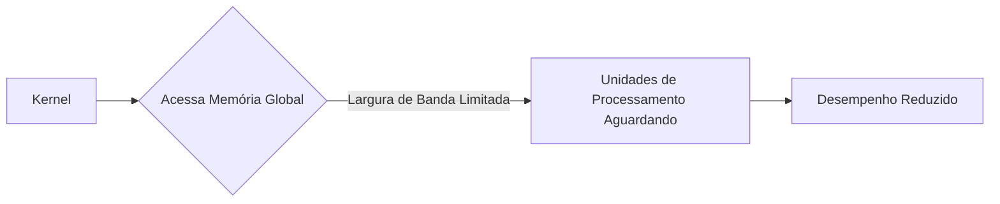
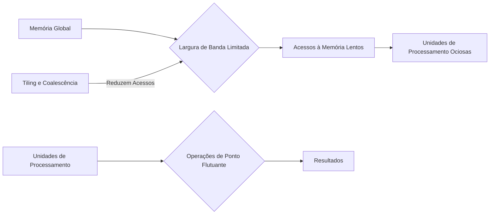

Okay, here's the enhanced text with added Mermaid diagrams:

## Limitações da Largura de Banda da Memória Global e o Impacto no Desempenho de Kernels CUDA

```mermaid
flowchart LR
    A[CPU] --> B(Host Memory);
    B --> C(Global Memory);
    C --> D{Compute Units (SMs)};
    D --> C
    C --> E[Output Data];
    E --> A
    style B fill:#f9f,stroke:#333,stroke-width:2px
    style C fill:#ccf,stroke:#333,stroke-width:2px
```

### Introdução

Nos capítulos anteriores, discutimos a importância do CGMA ratio e como um valor baixo pode limitar o desempenho de kernels CUDA. Agora, vamos nos aprofundar na análise das limitações impostas pela **largura de banda da memória global** (global memory bandwidth) e como essa restrição afeta a taxa na qual os dados podem ser processados. É crucial entender que, mesmo com um hardware com alta capacidade computacional teórica, a largura de banda limitada da memória global pode se tornar o gargalo principal no desempenho de kernels CUDA, especialmente aqueles com baixo CGMA, como a multiplicação de matrizes em sua forma mais básica [^2].

### A Limitação da Largura de Banda da Memória Global

A **memória global** de um dispositivo CUDA, implementada usando DRAM, possui uma largura de banda finita [^1]. Essa largura de banda representa a taxa na qual os dados podem ser transferidos entre a memória global e as unidades de processamento (SMs) do dispositivo. Em outras palavras, ela define a quantidade máxima de dados que podem ser lidos ou escritos na memória global por segundo.

**Conceito 1: Gargalo de Desempenho**

Quando um kernel precisa acessar dados da memória global para processamento, ele está sujeito à largura de banda disponível. Se a quantidade de dados necessária for muito alta, ou se os acessos forem mal organizados, a largura de banda pode se tornar um **gargalo de desempenho**, limitando a taxa na qual os dados podem ser fornecidos para as unidades de processamento. Isso significa que as unidades de processamento podem ficar ociosas, esperando que os dados sejam disponibilizados, o que reduz a eficiência do processamento paralelo [^2].



**Lemma 1:** *A largura de banda limitada da memória global impõe um limite superior à taxa na qual os dados podem ser processados em um kernel CUDA.*

*Prova:* Se a taxa de dados requisitada pelo processador excede a taxa na qual os dados podem ser lidos ou escritos da memória, o processamento ficará ocioso, o que limita o desempenho do kernel. $\blacksquare$

**Conceito 2: Impacto no Desempenho Efetivo**

A largura de banda da memória global é um fator que afeta diretamente o desempenho efetivo de um kernel, ou seja, a taxa na qual as operações são realizadas na prática, em contraste com a taxa de pico teórica. Um kernel que realiza muitos acessos à memória global e poucas operações de ponto flutuante (baixo CGMA ratio) terá um desempenho muito inferior ao pico teórico do dispositivo, pois a largura de banda limitada da memória global não será capaz de fornecer os dados na taxa necessária para as unidades de processamento.

**Corolário 1:** *Kernels com baixo CGMA ratio são particularmente vulneráveis às limitações da largura de banda da memória global, pois realizam mais acessos à memória por operação de ponto flutuante.*

*Derivação:* Kernels com baixo CGMA exigem que dados sejam fornecidos para a memória global com mais frequência, de modo que uma largura de banda limitada cria um gargalo na performance. $\blacksquare$

### A Multiplicação de Matrizes e o Gargalo da Largura de Banda

O kernel de multiplicação de matrizes em sua forma básica (Figura 5.1 no contexto) é um exemplo claro de como a largura de banda limitada da memória global pode se tornar um gargalo de desempenho. Esse kernel realiza um acesso à memória global para cada um dos elementos das matrizes de entrada, para cada operação de ponto flutuante [^2].

**Exemplo 1: Desempenho Limitado da Multiplicação de Matrizes Básica**

Como vimos anteriormente, o CGMA ratio do kernel de multiplicação de matrizes básico é de 1.0 [^2]. Isso significa que, para cada operação de ponto flutuante, há um acesso à memória global. Em um dispositivo com largura de banda de memória global de 200 GB/s e valores de ponto flutuante de 4 bytes, o número máximo de valores de ponto flutuante que podem ser carregados da memória global por segundo é 50 giga (200 GB/s / 4 bytes). Portanto, mesmo que a capacidade teórica do dispositivo seja de 1500 GFLOPS, o kernel básico de multiplicação de matrizes terá seu desempenho limitado a cerca de 50 GFLOPS, devido à largura de banda limitada da memória global.

**Lemma 2:** *Kernels com baixo CGMA ratio não utilizam efetivamente a capacidade computacional de um dispositivo CUDA, pois a largura de banda limitada da memória global se torna o fator limitante.*

*Prova:* Como demonstrado no exemplo da multiplicação de matrizes básica, um kernel com CGMA de 1.0 não consegue usar a capacidade computacional de 1500 GFLOPS por estar limitado pela largura de banda de memória. $\blacksquare$

**Exemplo 2: Impacto da Largura de Banda na Escalabilidade**

O problema da largura de banda limitada da memória global se agrava à medida que o tamanho dos dados a serem processados aumenta. Para matrizes maiores, o número de acessos à memória global aumenta proporcionalmente ao cubo da dimensão da matriz (N³), enquanto o número de operações de ponto flutuante também cresce com N³. Como o CGMA ratio é constante em 1.0, o problema de gargalo de memória não se resolve com aumento do tamanho da matriz. Isso demonstra que a largura de banda da memória global, quando não balanceada com o trabalho computacional, é um gargalo na escalabilidade.

**Corolário 2:** *A largura de banda da memória global se torna um limitador ainda maior de desempenho para problemas que envolvem grandes conjuntos de dados, como a multiplicação de matrizes de dimensões elevadas.*

*Derivação:* Para grandes conjuntos de dados, o número de acessos a memória global cresce drasticamente, levando ao problema da largura de banda finita se tornar um gargalo maior, o que afeta escalabilidade. $\blacksquare$

### Técnicas para Mitigar as Limitações da Largura de Banda

Existem diversas técnicas para mitigar as limitações da largura de banda da memória global e melhorar o desempenho dos kernels CUDA, como:

1.  **Tiling:** Conforme discutido anteriormente, o tiling (ou blocking) divide os dados a serem processados em pequenos blocos (tiles), que são carregados na memória compartilhada. Isso reduz o número de acessos à memória global e aumenta o CGMA ratio.
    ```mermaid
    flowchart LR
        A[Global Memory] --> B("Load Tile to Shared Memory");
        B --> C[Shared Memory];
        C --> D{Process Tile};
        D --> C
        C --> E[Store result in Global Memory];
        E --> A
    ```

2.  **Coalescência de Acessos:** Acessos coalescidos à memória global ocorrem quando threads dentro de um warp acessam regiões contíguas da memória. Isso permite que múltiplos acessos sejam agrupados em uma única transação, reduzindo o número total de transações.
    ```mermaid
    flowchart LR
    subgraph "Threads in Warp"
        A[Thread 1]
        B[Thread 2]
        C[Thread 3]
        D[Thread N]
    end
    A --> E("Contiguous Memory Access")
    B --> E
    C --> E
    D --> E
     E --> F[Global Memory]
    ```

3.  **Uso da Memória Compartilhada:** O uso eficiente da memória compartilhada para armazenar dados reutilizáveis dentro de um bloco de threads reduz o número de acessos à memória global.

4.  **Uso de Registradores:** Variáveis frequentemente usadas são armazenadas em registradores para reduzir o acesso à memória compartilhada. Registradores possuem menor latência e maior largura de banda.

5.  **Prefetching:** Em alguns casos, é possível antecipar os dados que serão necessários e carregá-los na memória compartilhada antecipadamente, utilizando técnicas de prefetching.

### Análise Matemática da Limitação da Largura de Banda



**Explicação:** Este diagrama ilustra como a largura de banda limitada da memória global causa lentidão no acesso aos dados, ociosidade das unidades de processamento e como técnicas de otimização reduzem os acessos e, portanto, reduzem o impacto da largura de banda limitada.

Para quantificar o efeito da largura de banda, podemos utilizar a equação apresentada anteriormente:

$$
GFLOPS_{efetivo} = \frac{BW}{S_{FP}} \times CGMA
$$

Essa equação mostra que o desempenho efetivo de um kernel é proporcional tanto à largura de banda da memória global ($BW$) quanto ao CGMA ratio. Se a largura de banda for limitada, o desempenho máximo do kernel também será limitado, mesmo que o CGMA ratio seja alto. Isso destaca a necessidade de otimizar ambos, o CGMA ratio e o uso da largura de banda da memória global, para atingir o máximo desempenho.

**Lemma 3:** *O desempenho efetivo de um kernel CUDA é limitado pela largura de banda da memória global e pelo CGMA ratio.*

*Prova:* A equação $GFLOPS_{efetivo} = \frac{BW}{S_{FP}} \times CGMA$ demonstra que o desempenho efetivo depende tanto da largura de banda quanto do CGMA. $\blacksquare$

**Corolário 3:** *Para maximizar o desempenho, é essencial que a otimização de kernels CUDA considere tanto o CGMA ratio quanto o uso eficiente da largura de banda da memória global.*

*Derivação:* O desempenho é limitado pelo menor valor entre a largura de banda e o CGMA. Maximizar a performance implica em otimizar os dois fatores. $\blacksquare$

### Impacto da Largura de Banda no Modelo de Execução dos Kernels

A largura de banda limitada da memória global também afeta o modo como os kernels são executados. Em um modelo de execução de threads, vários threads precisam acessar dados da memória global simultaneamente. Se a largura de banda for limitada, esses acessos podem se tornar gargalos, atrasando o progresso dos threads. Isso pode levar à formação de filas e à ociosidade das unidades de processamento, reduzindo o desempenho.

Ao utilizar técnicas de otimização, como o tiling e a coalescência, podemos reduzir o número de acessos à memória global e melhorar a utilização da largura de banda, o que contribui para um melhor desempenho dos kernels CUDA.

**Lemma 4:** *A largura de banda limitada da memória global pode afetar o progresso dos threads em kernels CUDA, especialmente em kernels com baixo CGMA.*

*Prova:* A largura de banda limitada faz com que o acesso a memória seja uma operação lenta. Threads com acesso frequente à memória, que não tenham outros dados disponíveis, vão ser paralisados esperando pelos dados. $\blacksquare$

**Corolário 4:** *A otimização do modelo de execução dos kernels CUDA, através de técnicas que reduzem o número de acessos à memória global e aumentam a utilização da largura de banda, é essencial para maximizar a eficiência do processamento paralelo.*

*Derivação:* A eficiência no acesso a memória global permite que as threads não sejam paralisadas. $\blacksquare$

### Pergunta Teórica Avançada

**Como a arquitetura da memória em hierarquia (registros, memória compartilhada, cache L1 e memória global) afeta o desempenho de kernels CUDA em relação à limitação da largura de banda?**

**Resposta:**
A arquitetura de memória em hierarquia em GPUs CUDA é projetada para mitigar as limitações impostas pela largura de banda da memória global. Cada nível da hierarquia de memória tem características diferentes de latência, largura de banda e capacidade, e o uso inteligente de cada nível é essencial para otimizar o desempenho dos kernels CUDA.

*   **Registros:** Os registradores são a forma de memória mais rápida, com menor latência e maior largura de banda. Eles são alocados a threads individuais e podem ser acessados diretamente pela unidade de processamento (ALU). O uso de registradores para armazenar variáveis frequentemente usadas permite reduzir a necessidade de acessar memórias mais lentas, como a memória compartilhada ou a memória global. No entanto, o número de registradores é limitado por thread.
    ```mermaid
    flowchart LR
        A[Thread] --> B(Registers);
        B --> C(ALU);
        C --> B
    ```

*   **Memória Compartilhada:** A memória compartilhada é uma forma de memória on-chip compartilhada por todos os threads dentro de um bloco. Ela possui uma latência menor e uma largura de banda maior do que a memória global, e pode ser utilizada para armazenar dados que são compartilhados entre as threads. Técnicas como tiling são usadas para utilizar eficientemente a memória compartilhada.
     ```mermaid
    flowchart LR
        subgraph "Block of Threads"
        A[Thread 1]
        B[Thread 2]
        C[Thread N]
        end
         A --> D("Shared Memory")
        B --> D
        C --> D
    ```
*  **Cache L1:** A cache L1 é uma memória cache de primeiro nível, presente em alguns devices CUDA, que armazena dados acessados recentemente da memória global. A presença da cache L1 é uma forma de reduzir a latência da memória global. No entanto, a capacidade da cache L1 é limitada.
*   **Memória Global:** A memória global é a forma de memória mais lenta, com maior latência e menor largura de banda. Ela é usada para armazenar grandes conjuntos de dados que precisam ser acessados por todos os threads. A memória global é implementada em DRAM, o que limita a sua largura de banda.

O desempenho dos kernels CUDA é fortemente influenciado pela forma como esses níveis da hierarquia de memória são utilizados. Um kernel que realiza muitos acessos à memória global e pouco uso de memórias mais rápidas como registradores e memória compartilhada, será limitado pela largura de banda da memória global. A utilização inteligente da hierarquia de memória, priorizando o uso de registradores e memória compartilhada sempre que possível, permite mitigar as limitações impostas pela largura de banda da memória global e aumentar o desempenho.


**Lemma 5:** *A utilização eficiente da arquitetura de memória em hierarquia das GPUs CUDA, priorizando o uso de memórias mais rápidas, como registradores e memória compartilhada, é crucial para mitigar as limitações da largura de banda da memória global.*

*Prova:* O uso de memórias mais rápidas mitiga a necessidade de utilizar a memória global, que é a memória mais lenta e tem menor largura de banda. $\blacksquare$

**Corolário 5:** *A otimização de kernels CUDA deve considerar não apenas o CGMA ratio e a largura de banda da memória global, mas também a hierarquia de memória e as características de cada nível, para maximizar o desempenho.*

*Derivação:* A arquitetura de memória e suas características são um fator de performance. Otimizar o kernel exige que cada nível de memória seja usado de forma a minimizar o gargalo de performance. $\blacksquare$

### Conclusão

A largura de banda limitada da memória global é um fator crítico que restringe a taxa na qual os dados podem ser processados em kernels CUDA. A multiplicação de matrizes em sua forma básica é um exemplo claro de como um CGMA ratio baixo, combinado com a limitação da largura de banda, impede o uso efetivo da capacidade computacional do hardware. Para superar essas limitações, é essencial utilizar técnicas de otimização, como o tiling, a coalescência de acessos, a memória compartilhada e registradores, que reduzem o número de acessos à memória global e aumentam o CGMA ratio, permitindo que os kernels CUDA atinjam um desempenho próximo ao pico teórico do dispositivo. A compreensão profunda da hierarquia de memória e da limitação da largura de banda da memória global é fundamental para o desenvolvimento de aplicações CUDA eficientes e de alto desempenho.

### Referências

[^2]: "In every iteration of this loop, two global memory accesses are performed for one floating-point multiplication and one floating-point addition. ... Thus, the ratio of floating-point calculation to global memory access operation is 1:1, or 1.0. We will refer to this ratio as the compute to global memory access (CGMA) ratio, defined as the number of floating-point calculations performed for each access to the global memory within a region of a CUDA program." *(Trecho do Capítulo 5, página 96)*

[^1]: "So far, we have learned to write a CUDA kernel function that is executed by a massive number of threads. The data to be processed by these threads is first transferred from the host memory to the device global memory. The threads then access their portion of the data from the global memory using their block IDs and thread IDs." *(Trecho do Capítulo 5, página 95)*

**Deseja que eu continue com as próximas seções?**
