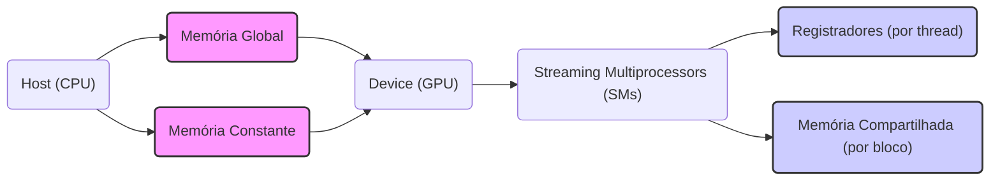

Okay, I've analyzed the text and added Mermaid diagrams to enhance the explanation of CUDA memory hierarchy. Here's the enhanced text:

## A Hierarquia de Memória CUDA: Uma Visão Detalhada



### Introdução

A arquitetura de memória de um dispositivo CUDA é um componente crucial para o desempenho de kernels. Em vez de uma única memória, CUDA oferece uma **hierarquia de memórias**, cada uma com características distintas de escopo, tempo de vida, latência, largura de banda e acessibilidade [^3]. Essa hierarquia permite aos programadores otimizar o uso da memória para diferentes tipos de dados e padrões de acesso, maximizando o desempenho das aplicações CUDA. Este capítulo explora em detalhes os diferentes tipos de memória CUDA, como ilustrado na Figura 5.2 do contexto, incluindo a memória global, memória constante, registradores e memória compartilhada, e como suas características afetam o desempenho dos kernels.

### Visão Geral da Hierarquia de Memória CUDA

Conforme ilustrado na Figura 5.2 do contexto, a hierarquia de memória CUDA é composta por diferentes tipos de memória, cada um com um papel específico na execução de kernels [^3]. Essas memórias podem ser divididas em dois grupos principais: memórias on-chip (registros e memória compartilhada) e memórias off-chip (memória global e memória constante).

**Conceito 1: Memórias On-Chip**

As **memórias on-chip** (registros e memória compartilhada) estão localizadas no mesmo chip das unidades de processamento (SMs). Isso proporciona latências de acesso muito baixas e largura de banda muito alta, o que as torna ideais para armazenar dados que são frequentemente utilizados pelas threads de um kernel [^3].

**Lemma 1:** *As memórias on-chip (registros e memória compartilhada) possuem latência de acesso significativamente menor e largura de banda significativamente maior do que as memórias off-chip (memória global e memória constante).*

*Prova:* As memórias on-chip estão localizadas no mesmo chip do processador, o que reduz drasticamente o tempo de acesso aos dados. $\blacksquare$

**Conceito 2: Memórias Off-Chip**

As **memórias off-chip** (memória global e memória constante) estão localizadas fora do chip das unidades de processamento. Elas possuem latências de acesso maiores e largura de banda menor do que as memórias on-chip. No entanto, elas oferecem maior capacidade de armazenamento e são acessíveis por todos os threads de todos os blocos [^3].

**Corolário 1:** *O uso eficiente da hierarquia de memória CUDA envolve a escolha do tipo de memória apropriado para cada tipo de dado e padrão de acesso, priorizando o uso de memórias on-chip sempre que possível para reduzir a latência e aumentar a largura de banda.*

*Derivação:* Baseando-se no Lemma 1, é preferível usar memórias on-chip para dados que necessitem de baixa latência e alta largura de banda, reservando memórias off-chip para dados que não necessitam das mesmas exigências. $\blacksquare$

### Tipos de Memória CUDA em Detalhe

A seguir, vamos analisar cada tipo de memória CUDA individualmente, discutindo suas características, escopo, tempo de vida e acessibilidade.

**1. Memória Global**

A **memória global** é a principal forma de memória utilizada para armazenar grandes conjuntos de dados que serão processados por kernels CUDA [^1].

*   **Escopo:** A memória global tem escopo per-grid, o que significa que ela é acessível por todos os threads de todos os blocos do grid.
*   **Tempo de Vida:** O tempo de vida da memória global é o mesmo da aplicação. Os dados armazenados na memória global persistem durante toda a execução da aplicação, a menos que sejam explicitamente desalocados.
*   **Latência:** A memória global possui alta latência de acesso, pois ela é implementada usando DRAM e está localizada fora do chip das unidades de processamento.
*   **Largura de Banda:** A memória global tem largura de banda limitada em comparação com as memórias on-chip.
*   **Acessibilidade:** A memória global pode ser lida e escrita tanto pelo host (CPU) quanto pelo device (GPU), usando chamadas API CUDA.

**2. Memória Constante**

A **memória constante** é um tipo de memória utilizada para armazenar dados que são lidos com frequência pelos threads de um kernel, mas que não são modificados durante a execução do kernel [^3].

*   **Escopo:** A memória constante também tem escopo per-grid, ou seja, todos os threads de todos os blocos têm acesso à mesma cópia dos dados na memória constante.
*   **Tempo de Vida:** O tempo de vida da memória constante também é o mesmo da aplicação, ou seja, os dados persistem durante toda a execução da aplicação.
*   **Latência:** A memória constante possui baixa latência para leituras, especialmente quando todos os threads acessam a mesma localização da memória simultaneamente. Isso é possível porque a memória constante é cacheada para um acesso rápido.
*   **Largura de Banda:** A memória constante oferece largura de banda alta para leituras, especialmente quando as threads acessam a mesma localização.
*   **Acessibilidade:** A memória constante pode ser escrita apenas pelo host e é acessível como read-only para as threads do device.

**3. Registradores**

Os **registradores** são a forma de memória mais rápida e mais próxima das unidades de processamento [^3]. Eles são utilizados para armazenar dados temporários que são usados frequentemente dentro de uma thread.

*   **Escopo:** Os registradores têm escopo per-thread, o que significa que cada thread tem sua própria cópia dos registradores.
*   **Tempo de Vida:** O tempo de vida dos registradores é o mesmo da thread. Os dados armazenados em registradores persistem apenas durante a execução da thread.
*   **Latência:** Os registradores possuem a menor latência de acesso de todas as memórias CUDA.
*   **Largura de Banda:** Os registradores oferecem a maior largura de banda.
*   **Acessibilidade:** Os registradores são acessíveis apenas pela thread que os possui, de forma exclusiva.

**4. Memória Compartilhada**

A **memória compartilhada** é uma forma de memória on-chip que pode ser usada por todos os threads dentro de um mesmo bloco [^3]. Ela é utilizada para compartilhar dados entre threads de um mesmo bloco.

*   **Escopo:** A memória compartilhada tem escopo per-block, o que significa que ela é acessível apenas pelos threads do bloco.
*   **Tempo de Vida:** O tempo de vida da memória compartilhada é o mesmo do kernel. Os dados são válidos durante a execução do kernel e são perdidos quando o kernel termina.
*   **Latência:** A memória compartilhada possui baixa latência de acesso.
*   **Largura de Banda:** A memória compartilhada oferece alta largura de banda.
*   **Acessibilidade:** A memória compartilhada pode ser lida e escrita por todos os threads do bloco.

> ⚠️ **Nota Importante**: A escolha adequada do tipo de memória para cada tipo de dado e padrão de acesso é fundamental para o desempenho de kernels CUDA. Usar memórias on-chip como registradores e memória compartilhada sempre que possível e evitar ao máximo o acesso a memória global, é crucial para um alto desempenho. [^3]

### Visualização da Hierarquia de Memória

A Figura 5.2 do contexto apresenta um diagrama que visualiza a hierarquia de memória CUDA, mostrando como os diferentes tipos de memória são organizados e acessados. Os registradores são privados de cada thread; a memória compartilhada é acessível por cada thread dentro de um bloco, enquanto que a memória global e a memória constante são acessíveis por todas as threads, do grid.

### Diagrama Detalhado da Hierarquia de Memória

```mermaid
graph LR
    A[Host (CPU)] --> B(Memória Global);
    A --> C(Memória Constante);
    B --> D[Cache L1];
    C --> D;
    D --> E(Streaming Multiprocessors - SMs);
     E --> F[Registradores (por Thread)];
     E --> G[Memória Compartilhada (por Bloco)];
    F --> H(Unidades de Processamento);
    G --> H;
```

**Explicação:** Este diagrama representa a hierarquia de memória CUDA, desde o host até as unidades de processamento, mostrando o fluxo de dados entre a memória global, a memória constante, a cache L1, os registradores e a memória compartilhada, todos conectados aos Streaming Multiprocessors (SMs) do device CUDA.

### Escopo e Tempo de Vida das Variáveis

A tabela 5.1 do contexto resume as características de escopo e tempo de vida das variáveis declaradas em CUDA, dependendo de seus qualificadores de tipo [^4].

*   Variáveis automáticas (declaradas sem qualificador) dentro de funções kernel ou device são armazenadas em registradores e têm escopo per-thread e tempo de vida dentro da função kernel.
*   Variáveis automáticas tipo array são armazenadas na memória local e tem escopo per-thread e tempo de vida dentro da função kernel.
*   Variáveis declaradas com o qualificador `__shared__` são armazenadas em memória compartilhada, com escopo per-block e tempo de vida dentro da execução do kernel.
*  Variáveis declaradas com o qualificador `__device__` (sem `__shared__` ou `__constant__`) são armazenadas na memória global com escopo per-grid e tempo de vida durante toda a aplicação.
*   Variáveis declaradas com o qualificador `__constant__` são armazenadas em memória constante com escopo per-grid e tempo de vida durante toda a aplicação.

**Lemma 2:** *O escopo e o tempo de vida de uma variável em CUDA são determinados pelos qualificadores de tipo utilizados na sua declaração.*

*Prova:* A tabela 5.1 do contexto define explicitamente o escopo e tempo de vida de cada tipo de variável, de acordo com seu qualificador. $\blacksquare$

**Corolário 2:** *A escolha dos qualificadores de tipo corretos é fundamental para garantir que as variáveis sejam acessadas corretamente e que seus valores persistam apenas pelo tempo necessário.*

*Derivação:* A escolha de qualificadores errados pode levar a erros de acesso a memória ou a variáveis sendo inválidas durante o tempo em que são necessárias. $\blacksquare$

### Análise Matemática da Hierarquia de Memória

A eficiência de um kernel CUDA é fortemente influenciada pela forma como ele utiliza os diferentes níveis da hierarquia de memória. Podemos analisar matematicamente o impacto de cada tipo de memória no desempenho de um kernel:

Suponha que:

*   $T_{reg}$ seja o tempo de acesso a um registrador.
*   $T_{shared}$ seja o tempo de acesso à memória compartilhada.
*   $T_{global}$ seja o tempo de acesso à memória global.
*   $N_{reg}$ seja o número de acessos a registradores.
*   $N_{shared}$ seja o número de acessos à memória compartilhada.
*   $N_{global}$ seja o número de acessos à memória global.

O tempo total gasto com acesso à memória pode ser estimado como:

$$
T_{mem} = N_{reg} \times T_{reg} + N_{shared} \times T_{shared} + N_{global} \times T_{global}
$$

Como $T_{reg} < T_{shared} < T_{global}$, a equação mostra que o tempo de acesso a memória total é minimizado quando o número de acessos a registradores e memória compartilhada é maximizado, e o número de acessos a memória global é minimizado.

**Lemma 3:** *O tempo total gasto com acesso à memória em um kernel CUDA é minimizado quando o número de acessos à memória global é reduzido e o número de acessos a registradores e memória compartilhada é maximizado.*

*Prova:* A equação $T_{mem} = N_{reg} \times T_{reg} + N_{shared} \times T_{shared} + N_{global} \times T_{global}$ e a relação $T_{reg} < T_{shared} < T_{global}$ demonstram que o tempo de acesso a memória é minimizado quando a quantidade de acesso a registradores e memória compartilhada, que são as memórias mais rápidas, é maximizado e o acesso a memória global, que é a memória mais lenta, é minimizado. $\blacksquare$

**Corolário 3:** *A otimização de kernels CUDA deve se concentrar na redução do número de acessos à memória global, priorizando o uso de memórias mais rápidas como registradores e memória compartilhada.*

*Derivação:* A redução do tempo gasto em acesso a memória é fundamental para o desempenho do kernel. O tempo gasto em acesso a memória é minimizado priorizando as memórias mais rápidas e reduzindo o acesso a memória mais lenta (memória global). $\blacksquare$

### Pergunta Teórica Avançada

**Como a escolha do tamanho do bloco de threads e o uso da memória compartilhada influenciam a latência de acesso à memória em um kernel CUDA, considerando bank conflicts e coalescência?**

**Resposta:**
A escolha do tamanho do bloco de threads e o uso eficiente da memória compartilhada são cruciais para otimizar a latência de acesso à memória em um kernel CUDA. Dois conceitos que afetam significativamente a latência são os *bank conflicts* e a coalescência de acesso:

*   **Tamanho do Bloco de Threads:** O tamanho do bloco de threads determina o número de threads que compartilharão a mesma memória compartilhada. Se o tamanho do bloco for muito pequeno, a memória compartilhada pode não ser utilizada de forma eficiente, pois haverá menos oportunidades para o compartilhamento de dados entre as threads. Se o tamanho do bloco for muito grande, o número de registradores por thread pode ser reduzido, levando a um *spilling* para a memória local, mais lenta, o que reduz a performance do kernel. A escolha do tamanho do bloco deve considerar o trade-off entre a utilização eficiente da memória compartilhada, a minimização do spilling, e outras variáveis da arquitetura do dispositivo.

*   **Bank Conflicts:** A memória compartilhada é organizada em *banks* de memória. Se threads de um mesmo warp tentarem acessar o mesmo *bank* simultaneamente, ocorrerá um *bank conflict*, o que leva a uma serialização desses acessos, aumentando a latência. A escolha correta do layout dos dados na memória compartilhada e do padrão de acesso das threads pode reduzir drasticamente os conflitos de acesso, levando a um acesso mais eficiente à memória.
   ```mermaid
   graph LR
    A[Shared Memory Banks] --> B("Threads in Warp");
    B -- "Multiple threads access same bank" --> C[Bank Conflict];
    B -- "Threads access different banks" --> D[No Bank Conflict];
    style C fill:#fcc,stroke:#333,stroke-width:2px
    style D fill:#cfc,stroke:#333,stroke-width:2px
   ```

*   **Coalescência de Acessos:** A coalescência de acessos à memória compartilhada ocorre quando os threads de um warp acessam regiões contíguas da memória compartilhada. Se os acessos forem coalescidos, eles podem ser combinados em uma única transação de memória, o que reduz a latência. A coalescência é importante tanto na memória compartilhada como na memória global. O uso de memória compartilhada para coalescer acessos é muito importante.
    ```mermaid
    graph LR
        A[Threads in Warp] --> B("Coalesced Access");
        B -- "Access contiguous memory locations" --> C[Single Memory Transaction];
        A --> D("Non-Coalesced Access");
        D -- "Access non-contiguous memory locations" --> E[Multiple Memory Transactions];
        style C fill:#cfc,stroke:#333,stroke-width:2px
        style E fill:#fcc,stroke:#333,stroke-width:2px
    ```
**Lemma 4:** *A latência de acesso à memória em um kernel CUDA é influenciada pela escolha do tamanho do bloco de threads e pelo padrão de acesso à memória compartilhada, especialmente devido a bank conflicts e coalescência de acessos.*

*Prova:* Os acessos a memória em uma arquitetura paralela podem gerar gargalos quando várias threads acessam a mesma região de memória, por isso é importante entender como otimizar o acesso a memória. $\blacksquare$

**Corolário 4:** *A otimização do acesso à memória em kernels CUDA exige a cuidadosa consideração do tamanho do bloco de threads, do padrão de acesso e do layout dos dados na memória compartilhada, para evitar bank conflicts e promover a coalescência de acessos.*

*Derivação:* A performance do kernel é diretamente influenciada pela latência de acesso a memória. Minimizar a latência significa maximizar a performance, de modo que a escolha adequada do tamanho do bloco de threads e o acesso otimizado a memória compartilhada são fundamentais. $\blacksquare$

### Conclusão

A hierarquia de memória CUDA oferece diferentes tipos de memória, cada um com características distintas de escopo, tempo de vida, latência, largura de banda e acessibilidade. A escolha adequada do tipo de memória para cada tipo de dado e padrão de acesso é crucial para o desempenho de kernels CUDA. Priorizar o uso de memórias on-chip, como registradores e memória compartilhada, sempre que possível e evitar o acesso a memória global, minimizando *bank conflicts* e garantindo *coalescência*, são fatores chave para otimizar o desempenho das aplicações CUDA. A compreensão profunda da hierarquia de memória CUDA é fundamental para o desenvolvimento de aplicações eficientes e de alto desempenho.

### Referências

[^3]: "CUDA supports several types of memory that can be used by programmers to achieve a high CGMA ratio and thus a high execution speed in their kernels. Figure 5.2 shows these CUDA device memories. At the bottom of the figure, we see global memory and constant memory. These types of memory can be written (W) and read (R) by the host by calling API functions." *(Trecho do Capítulo 5, página 97)*

[^1]: "So far, we have learned to write a CUDA kernel function that is executed by a massive number of threads. The data to be processed by these threads is first transferred from the host memory to the device global memory. The threads then access their portion of the data from the global memory using their block IDs and thread IDs." *(Trecho do Capítulo 5, página 95)*

[^4]: "Table 5.1 presents the CUDA syntax for declaring program variables into the various types of device memory. Each such declaration also gives its declared CUDA variable a scope and lifetime." *(Trecho do Capítulo 5, página 102)*

**Deseja que eu continue com as próximas seções?**
