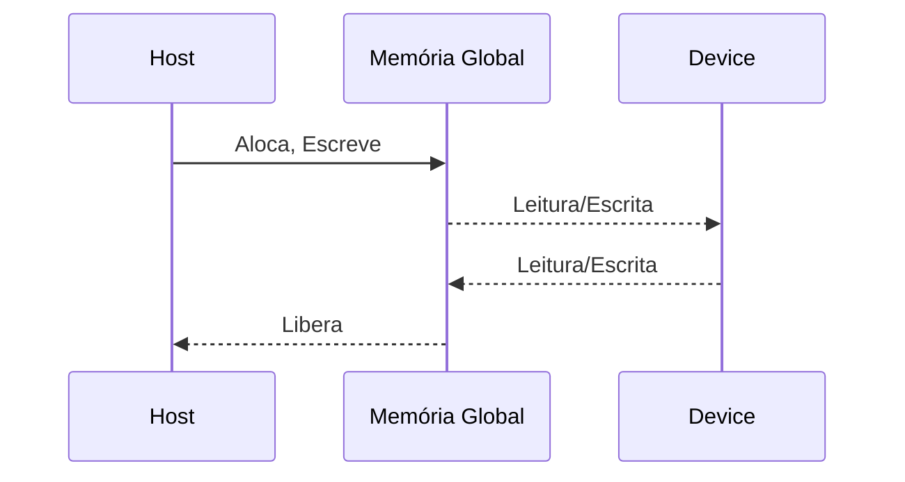
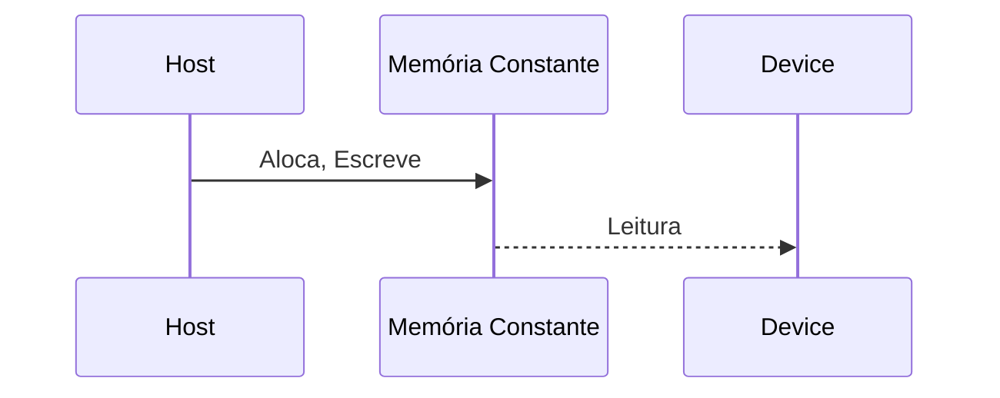

Okay, I've analyzed the text and added Mermaid diagrams to enhance understanding. Here's the enhanced version:

## Memória Global e Memória Constante em CUDA: Características e Utilização

```mermaid
graph LR
    A[Host (CPU)] <--> B(Memória Global)
    A --> C(Memória Constante)
    B --> D[Device (GPU)]
    C --> D
    style A fill:#f9f,stroke:#333,stroke-width:2px
    style D fill:#ccf,stroke:#333,stroke-width:2px
    linkStyle 0,1,2,3 stroke-width:2px
```

### Introdução

No contexto da hierarquia de memória CUDA, a **memória global** e a **memória constante** representam as principais formas de memória acessíveis tanto pelo host (CPU) quanto pelo device (GPU). Embora ambas sejam acessíveis pelo host, elas possuem características distintas que as tornam adequadas para diferentes propósitos. A compreensão dessas diferenças é crucial para o desenvolvimento de aplicações CUDA eficientes. Este capítulo se aprofunda nas particularidades da memória global e da memória constante, explorando suas características, acessibilidade, latência, largura de banda e casos de uso mais apropriados.

### Acessibilidade Host e Device

Uma das características distintivas da memória global e da memória constante em CUDA é sua acessibilidade tanto pelo host (CPU) quanto pelo device (GPU). Isso significa que o host pode escrever dados nessas memórias e que o device pode ler e, no caso da memória global, escrever dados nelas [^3]. Essa acessibilidade permite que dados sejam transferidos entre o host e o device, permitindo que o host prepare os dados para processamento pelo device e que o device envie os resultados de volta para o host.

**Conceito 1: Acessibilidade da Memória Global**

A **memória global** é a principal forma de memória para troca de dados entre host e device. O host pode alocar memória global, escrever dados nela e liberar essa memória. Os kernels CUDA executados no device podem ler e escrever dados na memória global [^1]. Essa capacidade de leitura e escrita bidirecional torna a memória global uma forma de memória flexível para a manipulação de grandes conjuntos de dados.



**Lemma 1:** *A memória global CUDA é acessível tanto pelo host quanto pelo device, permitindo a transferência de dados em ambas as direções.*

*Prova:* O host pode alocar, escrever e liberar memória global, e o device pode ler e escrever nesta memória. $\blacksquare$

**Conceito 2: Acessibilidade da Memória Constante**

A **memória constante** é utilizada para armazenar dados que são lidos com frequência pelos kernels, mas que não são modificados durante a execução do kernel. O host pode alocar a memória constante, escrever dados nela, e o device pode ler esses dados. No entanto, o device não pode escrever na memória constante, ela é read-only para o device [^3].



**Corolário 1:** *A memória constante é acessível pelo host para escrita e pelo device para leitura, tornando-a ideal para dados que não são modificados durante a execução do kernel.*

*Derivação:* Como a memória constante não é modificada durante a execução do kernel, ela pode ser otimizada para leitura, com latência e largura de banda otimizadas. $\blacksquare$

### Latência e Largura de Banda: Principais Diferenças

Embora ambas sejam acessíveis tanto pelo host quanto pelo device, a memória global e a memória constante possuem características distintas em termos de latência e largura de banda, que afetam o desempenho do kernel.

**1. Latência da Memória Global**

A **latência da memória global** é tipicamente alta, pois ela está localizada fora do chip das unidades de processamento (off-chip) e é implementada usando DRAM [^1]. Isso significa que leva um tempo considerável para um acesso à memória global ser atendido. Essa alta latência pode se tornar um gargalo no desempenho dos kernels, especialmente quando os acessos à memória global são frequentes e não otimizados.

**2. Largura de Banda da Memória Global**

A **largura de banda da memória global** é a taxa na qual os dados podem ser transferidos entre a memória global e as unidades de processamento. Embora seja alta, essa largura de banda é limitada e pode ser facilmente saturada quando um kernel realiza muitos acessos à memória global.

**3. Latência da Memória Constante**

A **latência da memória constante** é baixa, especialmente quando todos os threads acessam a mesma localização da memória simultaneamente [^3]. Isso ocorre porque a memória constante utiliza um cache para acesso rápido. Em outras palavras, quando todos os threads leem o mesmo dado, esse dado estará no cache, e o acesso será rápido.

**4. Largura de Banda da Memória Constante**

A **largura de banda da memória constante** é alta para leituras, especialmente quando os acessos à memória são feitos de maneira coalescida, ou seja, quando todos os threads acessam a mesma região da memória [^3]. A memória constante é otimizada para esses casos de acesso.

> ⚠️ **Nota Importante**: A memória global é mais adequada para dados que precisam ser lidos e escritos pelo device, enquanto a memória constante é mais adequada para dados read-only que são acessados por todas as threads. [^3]

### Casos de Uso da Memória Global

A memória global é a forma de memória mais versátil em CUDA e é usada para diversos propósitos:

*   **Dados de Entrada e Saída:** A memória global é utilizada para armazenar os dados de entrada que serão processados pelos kernels, bem como os resultados que serão enviados de volta para o host.
*   **Grandes Conjuntos de Dados:** A memória global é utilizada para armazenar grandes conjuntos de dados que não cabem nas memórias on-chip (registradores e memória compartilhada).
*   **Comunicação entre Kernels:** Variáveis globais podem ser utilizadas para comunicar dados entre diferentes execuções de um kernel.
*   **Dados Dinâmicos:** A memória global pode armazenar dados que são criados ou modificados durante a execução dos kernels.

### Casos de Uso da Memória Constante

A memória constante é utilizada para armazenar dados que são lidos com frequência pelos kernels, mas que não são modificados durante a execução do kernel:

*   **Tabelas de Consulta:** Tabelas de consulta que são utilizadas por todas as threads de um kernel.
*   **Parâmetros de Configuração:** Parâmetros de configuração que são utilizados por todos os threads do kernel.
*   **Constantes Matemáticas:** Constantes matemáticas como pi e euler.
*   **Pesos em Redes Neurais:** Pesos de uma rede neural que são lidos por todos os neurons, mas não são modificados durante o processamento.
*   **Texturas e Lookup Tables:** Dados que são acessados como texturas ou lookup tables.

### Diagrama Detalhado da Memória Global e Constante

```mermaid
graph LR
    A[Host (CPU)] --> B(Memória Global)
    A --> C(Memória Constante)
    B -- "Leitura/Escrita" --> D[Device (GPU)]
    C -- "Escrita" --> A
    C -- "Leitura" --> D
    D --> E(Cache da Memória Constante)
    E --> D
    style A fill:#f9f,stroke:#333,stroke-width:2px
    style D fill:#ccf,stroke:#333,stroke-width:2px
    linkStyle 0,1,2,3,4,5,6 stroke-width:2px
```

**Explicação:** Este diagrama ilustra o fluxo de dados entre o host e o device para as memórias global e constante. A memória global permite leitura e escrita bidirecional entre host e device, enquanto que a memória constante é escrita pelo host e lida pelo device. O cache da memória constante acelera o acesso aos dados por múltiplas threads.

### Análise Matemática da Memória Global e Constante

Podemos comparar matematicamente o impacto da latência e largura de banda da memória global e constante no desempenho de kernels CUDA.

Suponha que:

*   $T_{global}$ seja a latência de acesso à memória global.
*   $BW_{global}$ seja a largura de banda da memória global.
*   $T_{constant}$ seja a latência de acesso à memória constante (sem cache).
*   $T_{constantCache}$ seja a latência de acesso à memória constante com cache.
*   $BW_{constant}$ seja a largura de banda da memória constante.
*   $N_{global}$ seja o número de acessos à memória global.
*    $N_{constant}$ seja o número de acessos à memória constante (sem cache).
*    $N_{constantCache}$ seja o número de acessos à memória constante com cache.
*   $S_{data}$ seja o tamanho dos dados em bytes.

O tempo total gasto com acesso à memória global é dado por:

$$
T_{globalAccess} = N_{global} \times T_{global} + \frac{N_{global} \times S_{data}}{BW_{global}}
$$

Onde  $N_{global} \times T_{global}$ representa o tempo de latência e $\frac{N_{global} \times S_{data}}{BW_{global}}$ o tempo de transmissão dos dados considerando a largura de banda.

O tempo total gasto com acesso à memória constante sem cache é dado por:

$$
T_{constantAccess} = N_{constant} \times T_{constant} + \frac{N_{constant} \times S_{data}}{BW_{constant}}
$$

O tempo total gasto com acesso à memória constante com cache é dado por:

$$
T_{constantCacheAccess} = N_{constantCache} \times T_{constantCache}
$$

Como $T_{constantCache} < T_{constant} < T_{global}$ e, geralmente, $BW_{constant} > BW_{global}$, temos que a memória constante com cache tem o potencial de ter um acesso mais eficiente que a memória global e a memória constante sem cache.

**Lemma 2:** *A memória constante com cache tem potencial para um acesso mais rápido que a memória global e a memória constante sem cache.*

*Prova:* Baseado nas relações $T_{constantCache} < T_{constant} < T_{global}$ e $BW_{constant} > BW_{global}$, o tempo de acesso será menor. $\blacksquare$

**Corolário 2:** *Kernels que acessam os mesmos dados com frequência se beneficiarão do uso da memória constante, especialmente quando todos os threads do warp acessarem o mesmo dado simultaneamente.*

*Derivação:* A memória constante com cache é otimizada para esses casos de acesso. $\blacksquare$

### Implicações no Desenvolvimento de Kernels

O conhecimento das diferenças entre a memória global e a memória constante é fundamental para o desenvolvimento de kernels CUDA eficientes:

*   **Dados de Entrada:** Se um kernel precisa acessar um grande conjunto de dados que será modificado, a memória global deve ser utilizada. A otimização deve ser feita através de acesso coalescido e pelo uso de memória compartilhada.
*   **Dados Read-Only:** Se o kernel precisa acessar dados read-only que serão utilizados por todas as threads, a memória constante deve ser utilizada. Se a mesma localização for utilizada por várias threads, o uso do cache da memória constante aumentará a eficiência.
*   **Dados Pequenos:** Dados pequenos e frequentes podem ser armazenados em registradores, se possível, para minimizar a necessidade de acesso a outras formas de memória.

### Pergunta Teórica Avançada

**Como a arquitetura de cache da memória constante afeta o desempenho de kernels CUDA que acessam diferentes tipos de dados (valores constantes, tabelas de consulta, dados de textura) armazenados na memória constante?**

**Resposta:**
A arquitetura de cache da memória constante em dispositivos CUDA é um componente crucial para otimizar o acesso aos dados que são lidos com frequência pelos kernels, mas não modificados. A arquitetura de cache da memória constante não se comporta da mesma forma para diferentes tipos de dados:

*   **Valores Constantes:** Se todos os threads de um warp acessam a mesma constante na memória constante, esse acesso é muito rápido, pois o valor é carregado na cache e disponibilizado rapidamente para todos os threads.

*   **Tabelas de Consulta (Lookup Tables):** As tabelas de consulta são geralmente de tamanho pequeno e podem ser carregadas na memória constante e depois no cache. Se os threads acessarem uma pequena porção da tabela em cada execução, a tabela permanecerá no cache, o que acelera os acessos posteriores. Se as threads acessarem diferentes partes da tabela, o cache pode ser ineficiente, pois partes do cache terão que ser recarregadas. A coalescência dos acessos para que os threads acessem dados na mesma região da tabela pode ajudar a aumentar a eficiência da cache.

*   **Dados de Textura:** O hardware CUDA oferece um mecanismo especializado para o acesso aos dados de textura, com um cache otimizado para acessos bidimensionais com interpolação. Se os dados forem acessados como texturas, o uso da cache associado a texturas é geralmente mais eficiente do que acessar os dados diretamente como variáveis da memória constante.

```mermaid
graph LR
    A[Memória Constante] --> B(Cache para Valor Constante)
    A --> C(Cache para Lookup Tables)
    A --> D(Cache para Texturas)
    B --> E[Threads (Warp) - Mesmo valor]
    C --> F[Threads (Warp) - Pequena região]
    D --> G[Threads (Warp) - Acesso 2D]
    style A fill:#ccf,stroke:#333,stroke-width:2px
    style B,C,D fill:#ddf,stroke:#333,stroke-width:1px
    linkStyle 0,1,2,3,4,5 stroke-width:1px
```

**Lemma 3:** *A arquitetura de cache da memória constante CUDA é otimizada para diferentes tipos de acesso, e a forma como os dados são acessados (valor constante, tabela de lookup, dados de textura) tem um impacto direto no desempenho.*

*Prova:* Cada caso de uso explora o cache de forma diferente. $\blacksquare$

**Corolário 3:** *A escolha correta do formato dos dados (valor, tabela, textura) e da forma de acesso à memória constante é essencial para maximizar o benefício da arquitetura de cache e otimizar o desempenho de kernels CUDA.*

*Derivação:* Se o kernel usar a forma de acesso otimizada para o tipo de dado, o uso do cache será mais eficiente e a performance será melhor. $\blacksquare$

### Conclusão

A memória global e a memória constante são duas formas importantes de memória acessíveis tanto pelo host quanto pelo device em CUDA. A memória global é utilizada para grandes conjuntos de dados que são lidos e escritos pelo device, enquanto a memória constante é utilizada para dados read-only. A memória constante oferece latência de acesso e largura de banda melhoradas quando acessada corretamente. A escolha entre a memória global e a memória constante depende do tipo de dados e da forma como eles são utilizados pelo kernel. O conhecimento das características e limitações de cada tipo de memória é fundamental para o desenvolvimento de aplicações CUDA eficientes e de alto desempenho.

### Referências

[^3]: "CUDA supports several types of memory that can be used by programmers to achieve a high CGMA ratio and thus a high execution speed in their kernels. Figure 5.2 shows these CUDA device memories. At the bottom of the figure, we see global memory and constant memory. These types of memory can be written (W) and read (R) by the host by calling API functions." *(Trecho do Capítulo 5, página 97)*

[^1]: "So far, we have learned to write a CUDA kernel function that is executed by a massive number of threads. The data to be processed by these threads is first transferred from the host memory to the device global memory. The threads then access their portion of the data from the global memory using their block IDs and thread IDs." *(Trecho do Capítulo 5, página 95)*

**Deseja que eu continue com as próximas seções?**
