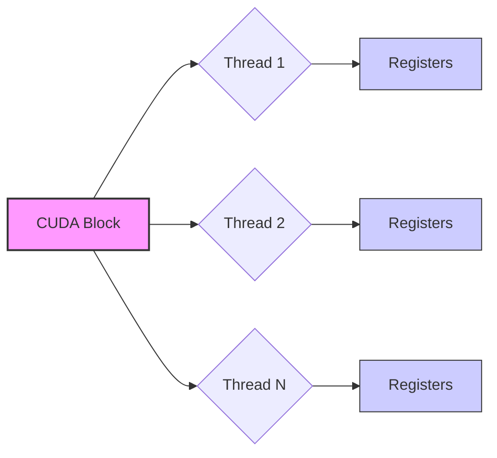
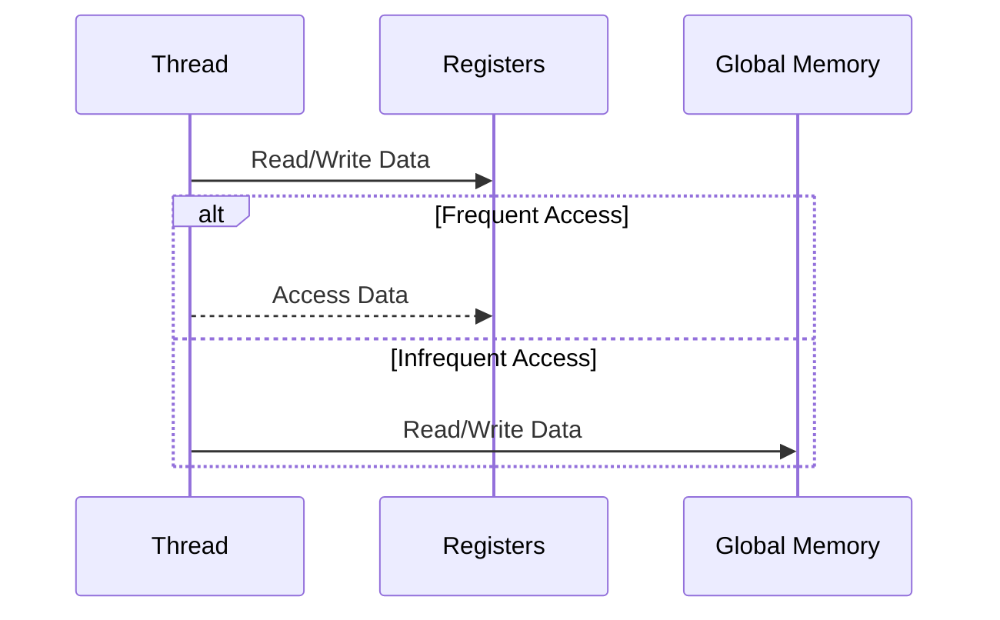

Okay, I've analyzed the text and added Mermaid diagrams where they would be most beneficial to understanding the concepts. Here's the enhanced text with the diagrams:

## Registradores em CUDA: Memória Local de Alta Performance por Thread



### Introdução

Na hierarquia de memória CUDA, os **registradores** ocupam um lugar especial como a forma de memória mais rápida e mais próxima das unidades de processamento (ALUs). São utilizados para armazenar dados temporários que são usados frequentemente dentro de uma thread. Este capítulo explora em profundidade os registradores em CUDA, suas características de alta velocidade e baixa latência, sua natureza local e privada por thread, e seu papel fundamental na otimização do desempenho de kernels CUDA ao minimizar o acesso à memória global.

### Registradores: Memória Local de Alta Velocidade

Os registradores são um tipo de memória on-chip, ou seja, localizados no mesmo chip das unidades de processamento. Isso confere aos registradores características de **alta velocidade** e **baixa latência**, tornando-os ideais para armazenar dados que são acessados frequentemente por uma thread durante a execução de um kernel.

**Conceito 1: Alta Velocidade e Baixa Latência**

A alta velocidade e a baixa latência dos registradores significam que os dados armazenados neles podem ser acessados e manipulados de forma muito rápida, sem a necessidade de aguardar por longos tempos de acesso à memória [^3]. Isso permite que as unidades de processamento trabalhem de forma mais eficiente, realizando operações de ponto flutuante sem interrupções por acessos lentos à memória.

**Lemma 1:** *Os registradores em CUDA possuem a menor latência de acesso e a maior largura de banda de todas as formas de memória disponíveis, devido à sua proximidade física às unidades de processamento.*

*Prova:* Os registradores estão localizados diretamente na unidade de processamento, o que minimiza o tempo necessário para acessar a informação e maximiza a largura de banda, pois a informação não precisa ser transferida a longas distâncias. $\blacksquare$

**Conceito 2: Memória Local e Privada por Thread**

Os registradores em CUDA são considerados **memória local**, pois são alocados a threads individuais. Cada thread tem acesso exclusivo a seus próprios registradores, ou seja, o conteúdo dos registradores de uma thread não é visível para outras threads [^3]. Essa característica **privada** e **não compartilhada** dos registradores garante que não haja conflitos de acesso, pois cada thread acessa apenas sua própria área de memória.

**Corolário 1:** *A natureza local e privada dos registradores em CUDA evita conflitos de acesso e garante a exclusividade do uso dos recursos por cada thread, permitindo alto desempenho no contexto do processamento paralelo.*

*Derivação:* A natureza local dos registradores faz com que cada thread seja independente e evite *bank conflicts*, comuns em outras memórias como a memória compartilhada. $\blacksquare$

### Uso Típico de Registradores em Kernels CUDA

Os registradores são normalmente utilizados para armazenar variáveis que são usadas com frequência dentro de uma thread durante a execução de um kernel. Essas variáveis podem incluir:

*   **Índices de Loop:** Variáveis de contagem de loops internos.
*   **Variáveis Temporárias:** Resultados intermediários de cálculos.
*   **Dados de Entrada:** Cópias de dados lidos da memória global ou compartilhada, que serão usados localmente para processamento.
*   **Resultados de Cálculos:** Resultados de cálculos que serão utilizados em operações posteriores.
*   **Ponteiros e Endereços:** Variáveis que armazenam ponteiros ou endereços de memória.

### Minimizando o Acesso à Memória Global

Um dos objetivos principais do uso de registradores é minimizar o número de acessos à **memória global**, que é muito mais lenta e tem largura de banda limitada [^1]. Ao armazenar os dados mais usados em registradores, as threads podem evitar a necessidade de acessar repetidamente a memória global, o que aumenta o desempenho do kernel e reduz o gargalo de memória.

**Conceito 3: Redução do Acesso à Memória Global**

O uso de registradores minimiza a necessidade de acessar a memória global, que é a forma mais lenta de memória do device CUDA. Ao armazenar os dados que uma thread utiliza frequentemente em registradores, a necessidade de acessar memória global é minimizada.



**Lemma 2:** *O uso adequado de registradores minimiza o número de acessos à memória global, reduzindo a latência e aumentando a eficiência do kernel.*

*Prova:* Ao evitar acessos à memória global, que tem maior latência, o kernel utiliza memória de menor latência, e portanto, o kernel é mais eficiente. $\blacksquare$

**Corolário 2:** *A otimização de kernels CUDA deve priorizar o uso de registradores para variáveis de acesso frequente, buscando reduzir ao máximo o número de acessos à memória global e assim aumentar o CGMA ratio.*

*Derivação:* A redução do acesso a memória global e aumento do uso de registradores aumenta a taxa de computação por acesso a memória, que é o conceito do CGMA ratio. $\blacksquare$

### Limitações dos Registradores

Apesar de suas vantagens, os registradores também possuem limitações importantes:

*   **Capacidade Limitada:** O número de registradores disponível para cada thread é limitado. Se uma thread tentar usar mais registradores do que o disponível, o compilador pode ter que usar memória local (spilling), que é muito mais lenta.
*   **Escopo por Thread:** Os registradores são privados por thread, de modo que não podem ser usados para compartilhar dados entre threads.
*   **Tempo de Vida:** Os registradores são válidos apenas durante o tempo de vida da thread. Quando uma thread termina, o conteúdo de seus registradores é perdido.

### Impacto da Compilação na Alocação de Registradores

O compilador CUDA tem um papel crucial na alocação de registradores para as variáveis de um kernel. O compilador tenta usar registradores para as variáveis de acesso frequente, sempre que possível. No entanto, se o kernel utilizar mais registradores do que o disponível, o compilador pode precisar fazer o que é chamado de **spilling**, que significa armazenar os valores dessas variáveis na memória local (e não nos registradores), que é muito mais lenta. O *spilling* reduz a performance do kernel.

**Conceito 4: Compilador e Spilling**

O compilador CUDA tenta alocar registradores para todas as variáveis de acesso frequente, mas se não houver registradores suficientes, utiliza uma região de memória mais lenta chamada memória local, através do processo chamado *spilling*.

```mermaid
graph LR
    A[CUDA Kernel] --> B{Compiler};
    B --> C{Registers};
    B --> D{Local Memory};
    C --> E[Fast Access];
    D --> F[Slow Access (Spilling)];
    B -- "Register Allocation" --> C;
     B -- "Spilling" --> D;
```

**Lemma 3:** *O uso excessivo de registradores pode levar ao spilling, que transfere dados para a memória local, reduzindo o desempenho do kernel.*

*Prova:* A memória local, que é usada no *spilling*, possui uma latência muito maior do que os registradores, o que limita a performance do programa. $\blacksquare$

**Corolário 3:** *A otimização de kernels CUDA deve considerar a capacidade limitada de registradores e evitar o uso excessivo, de forma a evitar o *spilling* e a perda de performance associada.*

*Derivação:* A otimização do kernel deve considerar que existem recursos finitos e que o uso excessivo de alguns recursos (registradores) pode afetar a performance de outros recursos, como a memória local. $\blacksquare$

### Diagrama Detalhado dos Registradores em um SM

```mermaid
graph LR
    A[Streaming Multiprocessor (SM)] --> B{Warp 1};
    A --> C{Warp 2};
    B --> D[Thread 1 Registers];
    B --> E[Thread 2 Registers];
    B --> F[Thread 32 Registers];
    C --> G[Thread 1 Registers];
     C --> H[Thread 2 Registers];
    C --> I[Thread 32 Registers];
    style A fill:#f9f,stroke:#333,stroke-width:2px
    style D fill:#ccf,stroke:#333,stroke-width:1px
    style E fill:#ccf,stroke:#333,stroke-width:1px
    style F fill:#ccf,stroke:#333,stroke-width:1px
        style G fill:#ccf,stroke:#333,stroke-width:1px
    style H fill:#ccf,stroke:#333,stroke-width:1px
        style I fill:#ccf,stroke:#333,stroke-width:1px
```

**Explicação:** O diagrama ilustra a alocação de registradores para cada thread dentro de um Streaming Multiprocessor (SM). Cada warp, composto por 32 threads, tem registradores alocados para suas threads.

### Análise Matemática do Uso de Registradores

Para analisar o impacto do uso de registradores no desempenho, podemos considerar a seguinte modelagem:

Suponha que:

*   $T_{reg}$ seja o tempo de acesso a um registrador.
*   $T_{global}$ seja o tempo de acesso à memória global.
*   $N_{reg}$ seja o número de acessos a registradores.
*   $N_{global}$ seja o número de acessos à memória global.

O tempo total gasto com acesso à memória pode ser modelado como:

$$
T_{mem} = N_{reg} \times T_{reg} + N_{global} \times T_{global}
$$

Como $T_{reg} << T_{global}$, a equação demonstra que a minimização de $N_{global}$ e a maximização de $N_{reg}$ leva a uma minimização do tempo gasto com acesso à memória e, portanto, a uma melhora na performance do kernel.

**Lemma 4:** *O tempo gasto com acesso à memória em kernels CUDA é minimizado ao priorizar o uso de registradores, devido à sua baixa latência, em detrimento do uso da memória global, com sua alta latência.*

*Prova:* A relação $T_{reg} << T_{global}$ na equação $T_{mem} = N_{reg} \times T_{reg} + N_{global} \times T_{global}$ demonstra que minimizar $N_{global}$ (acesso a memória global) e maximizar $N_{reg}$ (acesso a registradores) leva a uma minimização de $T_{mem}$. $\blacksquare$

**Corolário 4:** *Kernels CUDA devem priorizar o uso de registradores para variáveis de uso frequente, buscando reduzir ao máximo o acesso a memória global para melhorar a performance.*

*Derivação:* A minimização de $T_{mem}$ leva a um aumento de performance. O uso adequado de registradores é uma forma de minimizar $T_{mem}$. $\blacksquare$

### Pergunta Teórica Avançada

**Como o número de registradores por thread afeta a ocupação dos Streaming Multiprocessors (SMs) e o paralelismo de um kernel CUDA, e qual o impacto dessa relação na latência e largura de banda?**

**Resposta:**
O número de registradores por thread é um fator crucial que influencia diretamente a ocupação dos Streaming Multiprocessors (SMs), o paralelismo e, por consequência, o desempenho de um kernel CUDA.

*   **Ocupação do SM:** A ocupação do SM (SM occupancy) refere-se à porcentagem da capacidade máxima do SM que está sendo utilizada por threads ativas. O número de threads ativas em um SM é limitado pela quantidade de registradores disponíveis para as threads, além de outras limitações de hardware como memória compartilhada. Se cada thread utilizar muitos registradores, o número de threads ativas por SM será menor, o que leva a uma baixa ocupação. Uma baixa ocupação pode reduzir a capacidade do escalonador do hardware de esconder a latência do acesso a memória e reduzir a performance.
*   **Paralelismo:** O paralelismo em CUDA é obtido através da execução simultânea de múltiplas threads. A redução da ocupação do SM devido a um uso excessivo de registradores também reduz o paralelismo, pois menos threads estão em execução por SM. Isso pode limitar a capacidade do kernel de explorar o paralelismo do dispositivo.
*   **Latência:** O uso excessivo de registradores pode levar ao spilling, onde algumas variáveis são movidas para a memória local, que é mais lenta. Isso pode aumentar a latência de acesso aos dados, reduzindo o desempenho geral do kernel.
*   **Largura de Banda:** Embora os registradores ofereçam largura de banda extremamente alta, a redução do paralelismo devido a um uso excessivo dos registradores pode levar a uma subutilização da largura de banda da memória global, pois menos threads estarão ativas, executando computação.

**Lemma 5:** *O número de registradores por thread afeta diretamente a ocupação dos Streaming Multiprocessors (SMs) e o paralelismo, com impacto na latência e largura de banda.*

*Prova:* Cada fator explicado acima depende do número de registradores por thread e afeta diretamente a performance do kernel. $\blacksquare$

**Corolário 5:** *A otimização de kernels CUDA deve buscar um equilíbrio entre o uso de registradores, a ocupação do SM, o paralelismo e o desempenho, evitando o uso excessivo de registradores para manter uma ocupação adequada do SM e reduzir o risco de spilling.*

*Derivação:* A performance ideal do kernel é encontrada quando todos os recursos são utilizados corretamente, incluindo a alocação de registradores. $\blacksquare$

### Conclusão

Os registradores em CUDA são um tipo de memória local de alta performance, de baixa latência e com alta largura de banda, alocada privativamente a cada thread. O uso adequado de registradores é essencial para o desenvolvimento de kernels CUDA eficientes, permitindo minimizar o acesso à memória global, aumentar o CGMA ratio e maximizar o desempenho. O número de registradores é um recurso limitado, o uso excessivo de registradores pode causar *spilling* e diminuir a performance. O otimizador de kernels deve encontrar um equilíbrio entre o uso de registradores e a utilização de outros recursos.

### Referências

[^3]: "CUDA supports several types of memory that can be used by programmers to achieve a high CGMA ratio and thus a high execution speed in their kernels. Figure 5.2 shows these CUDA device memories. At the bottom of the figure, we see global memory and constant memory. These types of memory can be written (W) and read (R) by the host by calling API functions." *(Trecho do Capítulo 5, página 97)*

[^1]: "So far, we have learned to write a CUDA kernel function that is executed by a massive number of threads. The data to be processed by these threads is first transferred from the host memory to the device global memory. The threads then access their portion of the data from the global memory using their block IDs and thread IDs." *(Trecho do Capítulo 5, página 95)*

**Deseja que eu continue com as próximas seções?**
