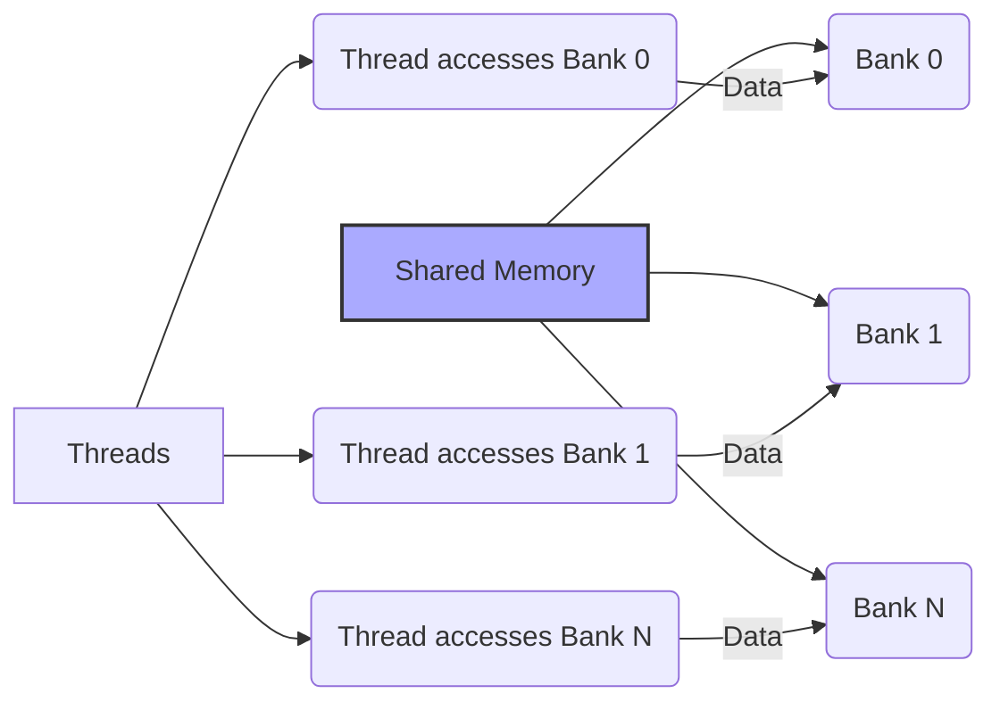
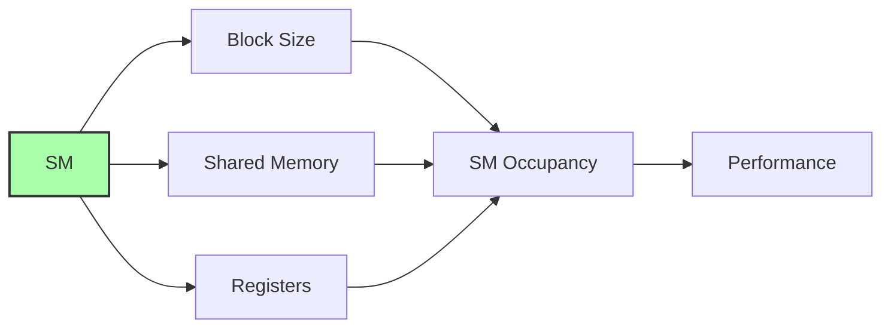

Okay, I've analyzed the text and added Mermaid diagrams where I believe they would be most beneficial for understanding the concepts. Here's the enhanced text:

## Memória Compartilhada em CUDA: Troca de Dados Eficiente e de Alta Performance por Bloco


### Introdução

A **memória compartilhada** em CUDA é um tipo de memória on-chip acessível por todas as threads de um mesmo bloco. Ela representa um recurso fundamental para o desenvolvimento de aplicações CUDA eficientes, oferecendo alta largura de banda e baixa latência para a troca de dados entre threads dentro de um bloco. Este capítulo explora em detalhes a memória compartilhada em CUDA, sua natureza on-chip, seu escopo por bloco, seu papel como memória *scratchpad* não cacheada e seu uso para troca eficiente de dados entre threads.

### Memória Compartilhada: Um Recurso On-Chip por Bloco

A memória compartilhada é um tipo de memória que reside no mesmo chip das unidades de processamento (Streaming Multiprocessors - SMs), o que a caracteriza como **on-chip**. Essa proximidade física às unidades de processamento confere à memória compartilhada características de alta largura de banda e baixa latência, sendo ideal para armazenar dados que são compartilhados entre as threads de um mesmo bloco.

**Conceito 1: Natureza On-Chip**

A natureza on-chip da memória compartilhada é o fator principal que lhe confere alta velocidade de acesso e baixa latência. O fato de estar localizada no mesmo chip do processador reduz significativamente o tempo necessário para acessar os dados e aumenta a largura de banda da comunicação com o processador.

**Lemma 1:** *A memória compartilhada em CUDA possui latência de acesso significativamente menor e largura de banda significativamente maior do que a memória global, devido à sua localização on-chip.*

*Prova:* A localização on-chip elimina a necessidade de transferências de dados para fora do chip, reduzindo a latência e aumentando a largura de banda. $\blacksquare$

**Conceito 2: Escopo por Bloco**

O **escopo da memória compartilhada** é per-block. Isso significa que cada bloco de threads tem sua própria cópia de memória compartilhada, acessível somente pelas threads daquele bloco. O conteúdo da memória compartilhada não é visível ou acessível por threads de outros blocos. Essa característica de escopo per-block permite que as threads colaborem e compartilhem dados sem conflitos ou interferências de outras threads de outros blocos.
```mermaid
graph LR
    A[Streaming Multiprocessor (SM)] --> B[Block 1]
    A --> C[Block 2]
    B --> D["Shared Memory for Block 1"]
    C --> E["Shared Memory for Block 2"]
    F["Threads in Block 1"] --> D
    G["Threads in Block 2"] --> E
    style B fill:#ccf,stroke:#333,stroke-width:1px
    style C fill:#cff,stroke:#333,stroke-width:1px
```

**Corolário 1:** *O escopo per-block da memória compartilhada permite que as threads de um bloco colaborem e compartilhem dados de forma eficiente, sem a necessidade de comunicação através da memória global.*

*Derivação:* O escopo per-block garante que o compartilhamento de dados não interfira com a execução de outros blocos. $\blacksquare$

### Memória Scratchpad e Compartilhamento Eficiente

A memória compartilhada é uma forma de **memória scratchpad** (ou *scratchpad memory*). Ao contrário de memórias *cache*, que armazenam dados recentemente utilizados, a memória compartilhada é gerenciada explicitamente pelo programador. Os dados devem ser explicitamente carregados na memória compartilhada antes de serem utilizados e devem ser removidos quando não são mais necessários. Essa natureza *scratchpad* permite que o programador controle de forma precisa como os dados são armazenados e compartilhados, otimizando o desempenho de kernels CUDA.

**Conceito 3: Memória Scratchpad**

A memória compartilhada é uma forma de memória *scratchpad*, o que significa que ela não funciona como uma cache, e que os dados precisam ser carregados e removidos explicitamente pelo programador. Essa natureza permite que o programador tenha controle preciso do que é armazenado e o momento da transferência, possibilitando uma maior eficiência.

**Lemma 2:** *A memória compartilhada em CUDA é uma memória scratchpad gerenciada explicitamente pelo programador, o que permite maior flexibilidade e controle na gestão dos dados.*

*Prova:* A memória compartilhada é gerenciada pelo programador, e não automaticamente pelo sistema, como acontece no caso de cache. $\blacksquare$

**Conceito 4: Compartilhamento de Dados entre Threads**

A memória compartilhada é projetada para o **compartilhamento eficiente de dados entre as threads** de um bloco. Ao utilizar a memória compartilhada para armazenar dados que são usados por várias threads, podemos reduzir a necessidade de acessar a memória global repetidamente, o que aumenta o desempenho do kernel, uma vez que o acesso à memória compartilhada é mais rápido.

**Corolário 2:** *A memória compartilhada possibilita uma troca de dados eficiente e de baixa latência entre as threads de um mesmo bloco, reduzindo acessos à memória global e melhorando a performance.*

*Derivação:* O compartilhamento de dados pela memória compartilhada aumenta a taxa de computação por acesso a memória, que é o conceito do CGMA ratio. $\blacksquare$

### Memória Compartilhada e Acesso Simultâneo

Uma característica importante da memória compartilhada é que ela é projetada para permitir que **todos os threads de um SM acessem a memória compartilhada simultaneamente**, de forma paralela, aproveitando a natureza SIMT (Single Instruction Multiple Threads) da arquitetura CUDA [^7]. No entanto, para que esse acesso seja realmente paralelo, é necessário evitar **conflitos de *bank***, que ocorrem quando várias threads tentam acessar o mesmo *bank* de memória simultaneamente, o que pode serializar o acesso e degradar o desempenho. A distribuição dos dados na memória compartilhada deve ser planejada de forma a evitar esses conflitos.

**Conceito 5: Acesso Simultâneo e Conflitos de Bank**

A memória compartilhada permite que todos os processadores de um SM acessem a memória simultaneamente, mas a ocorrência de *bank conflicts* durante o acesso pode reduzir a performance.
```mermaid
graph LR
    A[Shared Memory] --> B[Bank 0];
    A --> C[Bank 1];
    A --> D[Bank N];
    E["Thread 1"] --> B;
    F["Thread 2"] --> C;
    G["Thread 3"] --> B;
    style G fill:#f99,stroke:#333,stroke-width:1px
    
    linkStyle 5,6 stroke:#f00,stroke-width:2px
```

**Lemma 3:** *O acesso simultâneo à memória compartilhada por threads de um mesmo bloco é eficiente, desde que os *bank conflicts* sejam evitados através de um planejamento cuidadoso do acesso à memória.*

*Prova:* Os acessos a memória compartilhada podem ser feitos de forma paralela, a não ser que ocorra um *bank conflict*, que irá serializar alguns acessos. $\blacksquare$

**Corolário 3:** *A otimização de kernels CUDA que utilizam memória compartilhada deve incluir um planejamento cuidadoso do layout dos dados na memória e do padrão de acesso das threads para evitar bank conflicts e maximizar o desempenho.*

*Derivação:* Otimizar o kernel exige reduzir a ocorrência de *bank conflicts*, o que significa um planejamento cuidadoso de como as threads acessam a memória compartilhada. $\blacksquare$

### Uso Típico da Memória Compartilhada

A memória compartilhada é utilizada em diversas aplicações CUDA para otimizar o desempenho:

*   **Tiling:** Os dados são carregados da memória global em *tiles* (blocos) menores na memória compartilhada, o que permite uma reutilização eficiente e reduz a necessidade de acessar a memória global repetidamente.
*   **Reduções:** A memória compartilhada pode ser utilizada para realizar reduções eficientes, onde os resultados parciais são calculados pelas threads de um bloco e depois combinados em um resultado final.
*   **Operações de Matriz:** A memória compartilhada é frequentemente utilizada para operações com matrizes, pois os elementos de linhas e colunas podem ser carregados na memória compartilhada para uso pelas threads que acessam dados próximos na matriz.
*   **Filtragem de Imagem:** Os pixels vizinhos podem ser carregados na memória compartilhada para reduzir a necessidade de acessar a memória global para cada pixel individual.
*   **Algoritmos de Busca:** A memória compartilhada pode ser usada para compartilhar resultados parciais, ou dados que são relevantes para a busca.
*   **Processamento de Textos:** Os caracteres de uma frase podem ser carregados na memória compartilhada para processamento pelas threads.

### Diagrama Detalhado da Memória Compartilhada


**Explicação:** Este diagrama mostra a arquitetura da memória compartilhada, organizada em *banks*. As threads de um bloco acessam os *banks*, e o planejamento do acesso minimiza os *bank conflicts*.

### Análise Matemática do Desempenho da Memória Compartilhada

Para analisar matematicamente o impacto da memória compartilhada no desempenho de kernels CUDA, podemos considerar o seguinte modelo:

Suponha que:

*   $T_{shared}$ seja a latência de acesso à memória compartilhada.
*   $T_{global}$ seja a latência de acesso à memória global.
*   $N_{shared}$ seja o número de acessos à memória compartilhada.
*   $N_{global}$ seja o número de acessos à memória global.

O tempo total gasto com acesso à memória pode ser modelado como:

$$
T_{mem} = N_{shared} \times T_{shared} + N_{global} \times T_{global}
$$

Como $T_{shared} << T_{global}$, a equação demonstra que minimizar $N_{global}$ e maximizar $N_{shared}$ leva a uma minimização do tempo total gasto com acesso à memória.

**Lemma 4:** *O uso da memória compartilhada reduz o tempo de acesso à memória, uma vez que o tempo de acesso à memória compartilhada é muito menor do que o tempo de acesso à memória global.*

*Prova:* A relação $T_{shared} << T_{global}$ demonstra que reduzir acessos a memória global e utilizar memória compartilhada reduz o tempo de acesso a memória. $\blacksquare$

**Corolário 4:** *Kernels CUDA que exploram a memória compartilhada de maneira eficiente reduzem o tempo de acesso a memória, com um consequente aumento na performance.*

*Derivação:* A otimização do acesso a memória é fundamental para a performance. O uso adequado de memória compartilhada reduz o tempo de acesso a memória e aumenta a performance. $\blacksquare$

### Pergunta Teórica Avançada

**Como o tamanho do bloco de threads e a quantidade de memória compartilhada disponível por bloco afetam o desempenho de kernels CUDA, considerando o impacto da ocupação do SM e o trade-off entre o uso de registradores e memória compartilhada?**

**Resposta:**

O tamanho do bloco de threads e a quantidade de memória compartilhada disponível por bloco são dois fatores cruciais que afetam o desempenho de kernels CUDA. Eles têm um impacto direto na ocupação do Streaming Multiprocessor (SM) e no equilíbrio entre o uso de registradores e memória compartilhada.


*   **Tamanho do Bloco de Threads:** Um tamanho de bloco de threads muito pequeno pode subutilizar o paralelismo do SM e não explorar totalmente o potencial da memória compartilhada. Um tamanho de bloco de threads muito grande pode causar uma pressão excessiva sobre os registradores, resultando em *spilling* e o uso da memória local, que é mais lenta. Existe um tamanho ótimo do bloco de threads que maximiza o paralelismo sem sobrecarregar o uso de registradores.

*   **Quantidade de Memória Compartilhada:** A quantidade de memória compartilhada disponível por bloco é limitada pelo hardware. Um kernel que usa mais memória compartilhada do que o disponível reduz o número de blocos ativos por SM, reduzindo a ocupação e o paralelismo. Uma quantidade insuficiente de memória compartilhada também pode limitar a eficácia de técnicas como o tiling.

*  **Ocupação do SM:** O número de blocos e threads ativas por SM é limitado. Usar muitos registradores pode reduzir o número de threads ativas, e usar muita memória compartilhada pode reduzir o número de blocos ativos. A melhor ocupação do SM é encontrada com um bom equilíbrio entre uso de registradores, memória compartilhada e o tamanho do bloco de threads.

*   **Trade-off Registradores vs Memória Compartilhada:** O uso de registradores reduz a latência de acesso, mas cada registrador adicional reduz o número de threads ativas por SM. O uso de memória compartilhada permite um alto desempenho, mas aumenta a demanda por recursos da memória. O equilíbrio entre uso de registradores e memória compartilhada é importante para a obtenção da melhor performance.

**Lemma 5:** *O tamanho do bloco de threads e a quantidade de memória compartilhada disponível por bloco afetam diretamente a ocupação do SM e o desempenho dos kernels CUDA, com trade-offs entre o uso de registradores e memória compartilhada.*

*Prova:* Cada fator explicado acima tem um impacto significativo na performance do kernel. $\blacksquare$

**Corolário 5:** *A otimização de kernels CUDA deve considerar cuidadosamente o tamanho do bloco de threads e a quantidade de memória compartilhada, bem como o impacto na ocupação do SM e o trade-off entre o uso de registradores e memória compartilhada, para atingir a melhor performance.*

*Derivação:* O tamanho do bloco de threads, o uso de memória compartilhada, e o equilíbrio entre os dois, afetam a ocupação do SM. A melhor performance é atingida quando todos os recursos são utilizados corretamente. $\blacksquare$

### Conclusão

A memória compartilhada em CUDA é um recurso on-chip por bloco que oferece alta largura de banda e baixa latência para a troca eficiente de dados entre threads de um mesmo bloco. Sua natureza *scratchpad*, combinada com o acesso simultâneo de todos os processadores de um SM, a torna uma ferramenta poderosa para a otimização do desempenho de kernels CUDA. A escolha adequada do tamanho do bloco de threads, da quantidade de memória compartilhada utilizada e o controle dos *bank conflicts* são passos importantes para otimizar o uso da memória compartilhada. O entendimento das características e limitações da memória compartilhada é fundamental para o desenvolvimento de aplicações CUDA eficientes e de alto desempenho.

### Referências

[^3]: "CUDA supports several types of memory that can be used by programmers to achieve a high CGMA ratio and thus a high execution speed in their kernels. Figure 5.2 shows these CUDA device memories. At the bottom of the figure, we see global memory and constant memory. These types of memory can be written (W) and read (R) by the host by calling API functions." *(Trecho do Capítulo 5, página 97)*

[^7]:  "Figure 5.4, a CUDA device SM typically employs multiple processing units, referred to as SPs in Figure 4.14, to allow multiple threads to make simultaneous progress (see “Processing Units and Threads" sidebar)." *(Trecho do Capítulo 5, página 101)*

**Deseja que eu continue com as próximas seções?**
