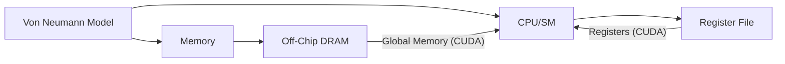
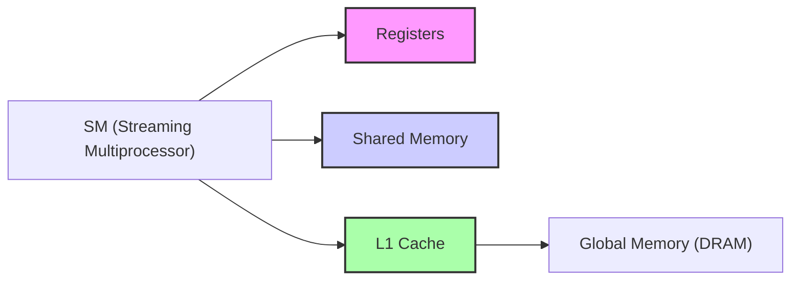
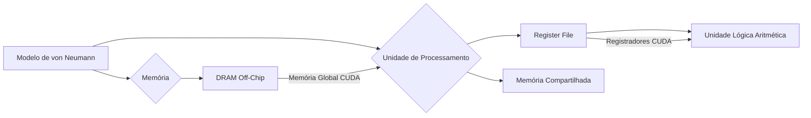

Okay, I've analyzed the text and added Mermaid diagrams to enhance the explanations, focusing on architecture and system relationships. Here's the enhanced text:

## Mapeamento da Memória CUDA no Modelo de von Neumann: Uma Análise Detalhada

### Introdução

O modelo de **von Neumann** é uma arquitetura fundamental para a maioria dos computadores modernos, incluindo GPUs. Compreender como a hierarquia de memória CUDA se mapeia nesse modelo é essencial para entender as características de desempenho de diferentes tipos de memória. Este capítulo explora o mapeamento das memórias CUDA para o modelo de von Neumann, demonstrando como a memória global corresponde à DRAM off-chip e os registradores ao *register file*. Essa análise também explica por que os acessos a registradores são muito mais rápidos do que os acessos à memória global, devido à natureza on-chip dos registradores.

### O Modelo de von Neumann: Uma Base para a Arquitetura CUDA

O modelo de **von Neumann** descreve a arquitetura de um computador como um sistema com uma unidade central de processamento (CPU), uma unidade de controle, memória para armazenar tanto dados quanto instruções e um sistema de entrada/saída (I/O) [^3]. Em GPUs, esse modelo é adaptado para o processamento paralelo, com múltiplas unidades de processamento (Streaming Multiprocessors - SMs) trabalhando simultaneamente.

**Conceito 1: Componentes do Modelo de von Neumann**

O modelo de von Neumann é composto por:

*   **Unidade Central de Processamento (CPU)**: Responsável por executar as instruções do programa. Em GPUs, essa função é exercida pelos SMs.
*   **Unidade de Controle:** Responsável por controlar o fluxo de execução das instruções.
*   **Memória:** Armazena tanto os dados quanto as instruções do programa.
*   **Sistema de Entrada/Saída (I/O):** Permite a comunicação entre o computador e o mundo externo.

**Lemma 1:** *O modelo de von Neumann é a arquitetura subjacente para a maioria dos computadores modernos, incluindo as GPUs.*

*Prova:* O modelo de von Neumann foi desenvolvido como base para a construção dos computadores digitais, sendo adaptado para os diferentes tipos de processadores como CPUs e GPUs. $\blacksquare$

### Mapeamento da Memória CUDA no Modelo de von Neumann

A hierarquia de memória CUDA se mapeia no modelo de von Neumann da seguinte forma:

**1. Memória Global e DRAM Off-Chip**

A **memória global** em CUDA corresponde à **memória DRAM off-chip** no modelo de von Neumann. Essa memória é implementada usando DRAM e está localizada fora do chip das unidades de processamento. A memória global é usada para armazenar os dados que serão processados pelos kernels CUDA e para a comunicação entre o host e o device.

**Conceito 2: Memória Global como DRAM Off-Chip**

A memória global em CUDA é fisicamente a mesma DRAM, localizada fora do chip, correspondendo à memória principal do modelo de von Neumann.

**Corolário 1:** *A memória global CUDA se mapeia diretamente na memória off-chip do modelo de von Neumann, compartilhando as mesmas características de alta latência, largura de banda limitada e alta capacidade.*

*Derivação:* Ambas as memórias são implementadas usando DRAM e estão localizadas fora do processador. $\blacksquare$

**2. Registradores e Register File**

Os **registradores** em CUDA correspondem ao **register file** (arquivo de registradores) no modelo de von Neumann. O *register file* é uma pequena região de memória on-chip localizada dentro das unidades de processamento e utilizada para armazenar dados que são utilizados com frequência durante a execução de instruções.

**Conceito 3: Registradores como Register File**

Os registradores em CUDA, que são on-chip, correspondem ao register file, que também é on-chip, no modelo de von Neumann.

**Lemma 2:** *Os registradores em CUDA se mapeiam no register file do modelo de von Neumann, compartilhando as características de baixa latência, alta largura de banda e acesso rápido.*

*Prova:* Ambas as memórias são on-chip e usadas para operações temporárias de dados nas unidades de processamento. $\blacksquare$

### Memória Compartilhada e Cache no Modelo de von Neumann

A **memória compartilhada** não tem um mapeamento direto com um componente específico do modelo de von Neumann. Ela pode ser vista como uma forma de memória *scratchpad* ou como uma pequena cache on-chip gerenciada pelo programador [^7]. Em alguns devices CUDA, um **cache L1** está presente para acelerar o acesso à memória global. A presença de cache L1 aumenta a complexidade do mapeamento com o modelo de von Neumann. A memória compartilhada e a memória cache L1 em devices CUDA modernos, são otimizações adicionais na arquitetura de von Neumann para aumentar a eficiência de acesso à memória.

### Latência e Largura de Banda: A Diferença entre Memória On-Chip e Off-Chip

A diferença de desempenho entre o acesso a registradores e o acesso à memória global se explica pela sua natureza on-chip e off-chip, respectivamente.

*   **Registradores On-Chip:** Os registradores estão localizados dentro do chip das unidades de processamento. O acesso a essa memória é muito rápido, pois os dados não precisam ser transferidos para fora do chip, o que resulta em baixa latência e alta largura de banda.

*   **Memória Global Off-Chip:** A memória global está localizada fora do chip das unidades de processamento, no sistema de memória DRAM. O acesso a essa memória é mais lento, pois os dados precisam ser transferidos para fora do chip e vice-versa, o que resulta em alta latência e largura de banda limitada.

**Conceito 4: Natureza On-Chip dos Registradores**

O fato dos registradores serem *on-chip*, ou seja, localizados dentro do mesmo chip da unidade de processamento, é o fator que causa o baixo tempo de acesso.

**Lemma 3:** *A natureza on-chip dos registradores e do register file explica por que o acesso a registradores é muito mais rápido do que o acesso à memória global, que é off-chip.*

*Prova:* O acesso à informação dentro de um chip é mais rápido do que o acesso à informação fora do chip devido ao tempo necessário para a transmissão da informação. $\blacksquare$

**Corolário 2:** *A latência de acesso a memória global, sendo ela off-chip, é inerentemente maior que a latência de acesso aos registradores, sendo eles on-chip.*

*Derivação:* Dados os requisitos para o acesso a informação fora do chip, é inerente que a latência será maior. $\blacksquare$

### Diagrama Detalhado do Mapeamento de Memória CUDA no Modelo de von Neumann

**Explicação:** Este diagrama mostra como a memória global e os registradores se mapeiam nos componentes do modelo de von Neumann. A memória global se mapeia com a memória DRAM off-chip, e os registradores se mapeam com o register file da unidade de processamento. A memória compartilhada é uma otimização do hardware, funcionando como uma *scratchpad memory*.

### Implicações no Desempenho de Kernels CUDA

O mapeamento da memória CUDA no modelo de von Neumann tem implicações diretas no desempenho de kernels CUDA. A diferença de latência entre o acesso a registradores e o acesso à memória global é um fator importante a ser considerado na otimização de kernels. A minimização dos acessos à memória global e a maximização do uso de registradores são estratégias chave para alcançar um bom desempenho. O uso eficiente da memória compartilhada, para dados que são utilizados por múltiplas threads do mesmo bloco, também é fundamental.

**Conceito 5: Otimização com Base no Mapeamento**

A otimização de kernels CUDA exige que o desenvolvedor entenda o mapeamento da hierarquia de memória no modelo de von Neumann, de forma que a utilização de cada forma de memória possa ser planejada corretamente.

**Lemma 4:** *O mapeamento das memórias CUDA no modelo de von Neumann explica as diferenças de desempenho entre os diferentes tipos de memória, e essa compreensão é essencial para otimizar kernels CUDA.*

*Prova:* O mapeamento demonstra o motivo da diferença de performance entre os diferentes tipos de memória. $\blacksquare$

**Corolário 3:** *A otimização de kernels CUDA deve considerar as características de latência e largura de banda de cada tipo de memória, priorizando o uso de memórias on-chip (registradores e memória compartilhada) sempre que possível para evitar acessos à memória global (off-chip).*

*Derivação:* A performance é otimizada quando a menor quantidade de tempo é gasta acessando a memória. $\blacksquare$

### Análise Matemática do Modelo de von Neumann e a Memória CUDA

Podemos expressar matematicamente o impacto da latência de acesso à memória no desempenho de acordo com o modelo de von Neumann.

Suponha que:

*   $T_{fetch}$ seja o tempo de busca da instrução (do memory para o IR).
*   $T_{decode}$ seja o tempo de decodificação da instrução.
*   $T_{regAcc}$ seja o tempo de acesso ao register file.
*   $T_{globalAcc}$ seja o tempo de acesso à memória global (DRAM).
*   $T_{alu}$ seja o tempo de execução da unidade lógica aritmética.

O tempo total de execução de uma instrução pode ser modelado como:

$$
T_{instruction} = T_{fetch} + T_{decode} + T_{regAcc} + T_{alu}
$$

Se uma instrução necessitar de um acesso a memória, o tempo de acesso a register file é trocado pelo acesso a memória global:

$$
T_{instructionMem} = T_{fetch} + T_{decode} + T_{globalAcc} + T_{alu}
$$

Como $T_{regAcc} << T_{globalAcc}$, a equação demonstra que o acesso a registradores é mais rápido do que o acesso a memória global.

**Lemma 5:** *A diferença de latência entre acessos on-chip e off-chip se manifesta diretamente no tempo de execução de instruções no modelo de von Neumann.*

*Prova:* A relação $T_{regAcc} << T_{globalAcc}$ demonstra que a latência do acesso a memória global é muito maior que a latência de acesso ao register file. $\blacksquare$

**Corolário 4:** *Kernels CUDA que utilizam um grande número de acessos à memória global terão uma performance inferior a kernels que utilizam registradores sempre que possível.*

*Derivação:* A performance do kernel é determinada pelo tempo total de execução das instruções. A redução do tempo de acesso a memória é fundamental. $\blacksquare$

### Pergunta Teórica Avançada

**Como o conceito de "stored-program" do modelo de von Neumann se manifesta na arquitetura CUDA e como isso afeta a execução de kernels e o acesso à memória?**

**Resposta:**

O modelo de "stored-program", que é fundamental para o modelo de von Neumann, significa que tanto os dados quanto as instruções do programa são armazenados na mesma memória e podem ser acessados de forma intercambiável. Na arquitetura CUDA, esse conceito se manifesta da seguinte forma:

*   **Instruções do Kernel:** As instruções do kernel são armazenadas na memória do device (geralmente na memória global ou em uma memória especial de instruções). Essas instruções são acessadas pela unidade de controle dos SMs, que as decodifica e executa.
*  **Dados do Kernel:** Os dados que serão processados pelo kernel também são armazenados na memória do device (geralmente na memória global ou na memória constante), sendo acessados e manipulados pelas threads do kernel.
*   **Busca de Instruções:** Cada SM tem seu próprio *program counter* (PC) que controla o fluxo das instruções. O SM utiliza o PC para buscar as próximas instruções a serem executadas, da mesma forma que em um modelo de von Neumann tradicional. O uso do mesmo modelo permite a otimização e adaptação de arquiteturas de processamento diferentes.
* **Acesso à Memória para Instruções e Dados:** A arquitetura CUDA permite que as instruções e os dados sejam acessados da mesma memória, permitindo a implementação do modelo de "stored-program".

O conceito de "stored-program" também implica que as instruções podem ser modificadas ou geradas durante a execução do programa, mas na prática, isso não é comum e não se aplica aos casos gerais de kernels CUDA.

**Lemma 6:** *O conceito de "stored-program" do modelo de von Neumann se manifesta na arquitetura CUDA, onde tanto as instruções quanto os dados são armazenados na memória do device e acessados de forma intercambiável, permitindo flexibilidade e reutilização de código.*

*Prova:* O design da arquitetura CUDA permite o uso do conceito de "stored-program". $\blacksquare$

**Corolário 5:** *A arquitetura "stored-program" de CUDA oferece flexibilidade no desenvolvimento de kernels, mas também impõe a necessidade de um planejamento cuidadoso da gestão da memória e do acesso a dados e instruções, para evitar gargalos de desempenho.*

*Derivação:* Embora o modelo de "stored-program" oferece flexibilidade, é preciso considerar os gargalos de memória para otimizar a performance. $\blacksquare$

### Conclusão

O mapeamento da hierarquia de memória CUDA no modelo de von Neumann revela a base arquitetural das GPUs e ajuda a entender o comportamento dos diferentes tipos de memória. A memória global corresponde à DRAM off-chip, enquanto os registradores correspondem ao *register file*, explicando por que o acesso a registradores é muito mais rápido do que o acesso à memória global. A compreensão desse mapeamento é essencial para o desenvolvimento de kernels CUDA eficientes e de alto desempenho.

### Referências

[^3]: "In his seminal 1945 report, John von Neumann described a model for building electronic computers that is based on the design of the pioneering EDVAC computer. This model, now commonly referred to as the von Neumann model, has been the foundational blueprint for virtually all modern computers." *(Trecho do Capítulo 5, página 97)*

[^1]: "So far, we have learned to write a CUDA kernel function that is executed by a massive number of threads. The data to be processed by these threads is first transferred from the host memory to the device global memory. The threads then access their portion of the data from the global memory using their block IDs and thread IDs." *(Trecho do Capítulo 5, página 95)*

[^7]:  "Figure 5.4 shows shared memory and registers in a CUDA device. Although both are on-chip memories, they differ significantly in functionality and cost of access. Shared memory is designed as part of the memory space that resides on the processor chip (see Section 4.2)." *(Trecho do Capítulo 5, página 101)*
