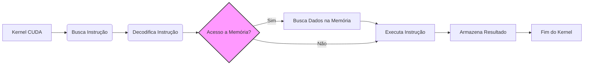
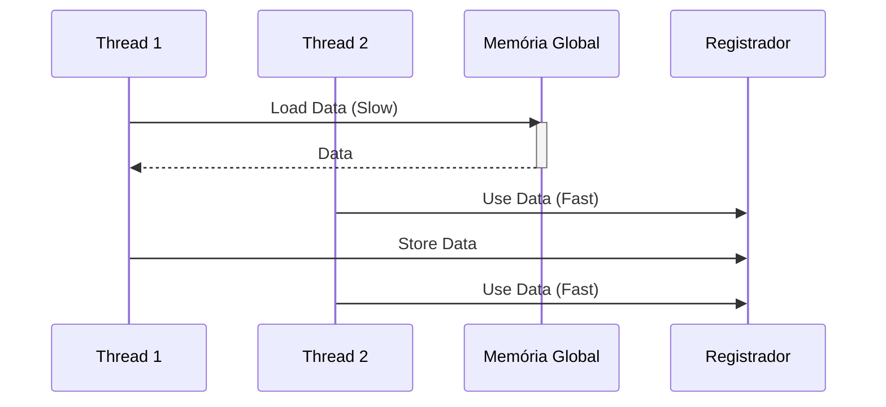

Okay, I will add Mermaid diagrams to enhance the text as requested.

## Execução de Instruções e Acesso à Memória em CUDA: Impacto no Tempo de Execução

### Introdução

O tempo de execução de um programa, especialmente em contextos de computação paralela como CUDA, é diretamente afetado pela forma como as instruções são executadas e como os dados são acessados da memória. Este capítulo explora a intrincada relação entre a **execução de instruções** e o **acesso à memória** em kernels CUDA, com foco no impacto desses processos no tempo de execução do programa. Em particular, será enfatizado como os acessos a registradores são preferidos, já que eles evitam instruções adicionais ao fornecer diretamente os dados necessários para a Unidade Lógica Aritmética (ALU), reduzindo o tempo total de execução.

### A Relação entre Execução de Instruções e Acesso à Memória

A execução de um programa em um computador, seja ele uma CPU ou GPU, envolve uma série de etapas: busca da instrução, decodificação da instrução, busca dos dados necessários para a execução da instrução, execução da instrução na ALU e armazenamento do resultado. O tempo gasto em cada uma dessas etapas contribui para o tempo total de execução do programa. O acesso à memória, especialmente em arquiteturas com hierarquias de memória complexas como CUDA, é um fator crítico que pode influenciar significativamente o tempo de execução.

**Conceito 1: Etapas da Execução de Instruções**

A execução de uma instrução envolve as seguintes etapas:

1.  **Busca (Fetch):** A instrução é buscada da memória.
2.  **Decodificação:** A instrução é decodificada para determinar a operação a ser realizada e os operandos envolvidos.
3.  **Busca de Operandos:** Os operandos (dados) necessários para a execução da instrução são buscados na memória ou em registradores.
4.  **Execução:** A operação é realizada na ALU.
5.  **Armazenamento do Resultado:** O resultado da operação é armazenado na memória ou em registradores.

**Lemma 1:** *O tempo de execução de um programa é diretamente influenciado pelo tempo gasto em cada etapa da execução de instruções, incluindo a busca, decodificação, busca de operandos, execução na ALU e armazenamento do resultado.*

*Prova:* O tempo total de execução do programa é a soma de todos os tempos gastos em cada etapa, por cada instrução. $\blacksquare$

**Conceito 2: Impacto do Acesso à Memória no Tempo de Execução**

O acesso à memória, especialmente à memória global, é uma etapa que pode ser muito demorada, devido à sua alta latência e largura de banda limitada. O tempo gasto para buscar os operandos na memória global aumenta o tempo total de execução do programa.

**Corolário 1:** *O tempo gasto com o acesso à memória, especialmente à memória global, é um fator crítico que pode aumentar significativamente o tempo de execução de um programa.*

*Derivação:* A memória global, que possui maior latência, adiciona mais tempo na execução de instruções quando é necessário buscar dados nela. $\blacksquare$

### Preferência por Acessos a Registradores

Em CUDA, assim como em outras arquiteturas, os acessos a registradores são preferidos em comparação com os acessos à memória global. A razão principal para essa preferência reside no fato de que os registradores são um tipo de memória on-chip, muito rápida e com baixa latência, o que permite que os dados necessários para a execução de uma instrução estejam disponíveis de forma mais rápida e eficiente. Além disso, o acesso a registradores evita a necessidade de instruções adicionais de *load* que são necessárias para buscar dados na memória global.

**Conceito 3: Acesso Direto da ALU a Registradores**

Quando um operando está em um registrador, a ALU pode acessar esse dado diretamente, sem a necessidade de executar uma instrução de carregamento (load) que envolveria um acesso à memória [^6]. Isso diminui o tempo de acesso ao dado necessário para a operação.

**Lemma 2:** *O acesso a registradores é mais rápido e eficiente do que o acesso à memória global, pois os registradores fornecem diretamente os dados necessários para a ALU, evitando a necessidade de instruções adicionais.*

*Prova:* A proximidade entre a ALU e os registradores e a ausência da necessidade de instruções adicionais para leitura dos registradores resulta em maior eficiência no acesso aos dados. $\blacksquare$

**Conceito 4: Redução do Número de Instruções**

Ao utilizar registradores, evitamos a necessidade de instruções adicionais de carregamento (load), o que reduz o número total de instruções que precisam ser executadas e, portanto, diminui o tempo de execução do programa. Cada instrução de *load* tem um custo, que é eliminado ao usar registradores.

**Corolário 2:** *A utilização de registradores para dados de acesso frequente reduz o número total de instruções que precisam ser executadas, melhorando a eficiência do programa.*

*Derivação:* A redução do número de instruções se traduz diretamente em redução do tempo de execução, já que cada instrução tem um custo. $\blacksquare$

### A Importância da Localidade de Dados

A localidade dos dados se refere ao quão próximos estão os dados utilizados em um programa em termos de tempo e espaço. Dados que são acessados repetidamente e que estão próximos no espaço de memória são considerados locais. O uso de registradores ajuda a melhorar a localidade dos dados, pois os dados utilizados com frequência são armazenados localmente nos registradores de uma thread, próximos às unidades de processamento que precisam deles.

**Conceito 5: Localidade de Dados e Registradores**

A proximidade dos registradores aos dados da thread melhora a localidade de dados, permitindo o acesso a dados locais sem a necessidade de buscar informações da memória.

**Lemma 3:** *A utilização de registradores promove a localidade dos dados, reduzindo a necessidade de acessar dados em memórias mais lentas.*

*Prova:* A proximidade dos dados com a unidade de processamento reduz o tempo de acesso. $\blacksquare$

### Instruções de Carga (Load) e o Acesso à Memória Global

Quando um operando não está em um registrador, o processador precisa executar uma instrução de carregamento (*load*) para buscá-lo da memória. Essa instrução de carregamento envolve as seguintes etapas:

1.  **Cálculo do Endereço:** O endereço de memória onde o operando está localizado é calculado.
2.  **Acesso à Memória:** A memória é acessada utilizando o endereço calculado.
3.  **Transferência de Dados:** Os dados são transferidos da memória para um registrador.
4.  **Execução da Instrução Original:** Uma vez que o dado esteja em um registrador, a instrução original pode ser executada.

Essas etapas adicionais aumentam significativamente o tempo necessário para executar a instrução original. A instrução de carregamento (*load*) é, por si só, uma instrução adicional, aumentando o número total de instruções. O objetivo de qualquer otimização é reduzir o número de instruções de *load*, utilizando a memória mais rápida, os registradores.

**Conceito 6: Impacto das Instruções Load**

A instrução *load* envolve etapas adicionais, além de necessitar de um acesso a uma memória mais lenta, o que aumenta o tempo necessário para a execução da instrução original.

**Lemma 4:** *A execução de instruções de carga (*load*) para buscar dados da memória global adiciona etapas extras e latência à execução de instruções, aumentando o tempo de execução de um kernel.*

*Prova:* As etapas de cálculo do endereço, acesso à memória e transferência de dados para um registrador adicionam tempo à execução da instrução original. $\blacksquare$

**Corolário 3:** *A otimização de kernels CUDA deve minimizar o uso de instruções de carga (*load*) através da alocação de dados em registradores e do uso da memória compartilhada, buscando reduzir acessos a memórias mais lentas.*

*Derivação:* A redução do tempo de acesso aos dados é fundamental para otimizar a performance. Minimizar as instruções de carga ajuda a reduzir o tempo de acesso aos dados. $\blacksquare$

### Diagrama Detalhado da Execução de Instruções e Acesso à Memória

**Explicação:** Este diagrama mostra o fluxo de execução de instruções com e sem acesso à memória. O acesso a registradores é mais rápido e eficiente.

### Análise Matemática do Impacto do Acesso à Memória

Podemos expressar matematicamente o impacto do acesso à memória no tempo de execução da seguinte forma:

Suponha que:

*   $T_{reg}$ seja o tempo de acesso a um registrador.
*   $T_{global}$ seja o tempo de acesso à memória global.
*   $T_{load}$ seja o tempo gasto na execução de uma instrução de carga.
*   $N_{reg}$ seja o número de acessos a registradores.
*    $N_{load}$ seja o número de instruções de *load* necessárias para o acesso a memória global.

O tempo total gasto com acesso à memória pode ser modelado como:

$$
T_{mem} = N_{reg} \times T_{reg} + N_{load} \times (T_{load} + T_{global})
$$

Esta equação mostra que o tempo de acesso a memória é reduzido quando minimizamos o número de instruções *load* e maximizamos o uso de registradores, pois $T_{reg}$ é muito menor que $T_{load} + T_{global}$.

**Lemma 5:** *O tempo gasto com acesso à memória é minimizado quando se reduz o número de instruções de *load* e maximiza-se o uso de registradores.*

*Prova:* A equação  $T_{mem} = N_{reg} \times T_{reg} + N_{load} \times (T_{load} + T_{global})$ demonstra que a redução de $N_{load}$ e o aumento de $N_{reg}$ leva a um menor tempo de acesso, pois $T_{reg} << (T_{load} + T_{global})$. $\blacksquare$

**Corolário 4:** *A otimização de kernels CUDA deve priorizar o uso de registradores para variáveis de uso frequente e o uso de memória compartilhada, evitando instruções de carga sempre que possível.*

*Derivação:* O uso adequado de registradores e memória compartilhada minimiza o uso de instruções de carga e, portanto, o tempo de execução. $\blacksquare$

### Pergunta Teórica Avançada

**Como as técnicas de otimização, como *instruction scheduling* (escalonamento de instruções) e *prefetching*, podem ser utilizadas para mitigar o impacto da latência da memória global no tempo de execução de kernels CUDA, considerando a arquitetura SIMT?**

**Resposta:**

O *instruction scheduling* e o *prefetching* são duas técnicas de otimização que podem ser utilizadas para mitigar o impacto da latência da memória global no tempo de execução de kernels CUDA, levando em consideração a arquitetura SIMT (Single Instruction Multiple Threads) das GPUs:

*  ***Instruction Scheduling* (Escalonamento de Instruções):** A execução de uma instrução em um warp depende da disponibilidade dos dados necessários. Se uma thread de um warp necessitar de dados que não estão disponíveis, outras threads do warp também terão que esperar. O compilador CUDA tenta fazer o *instruction scheduling*, ou seja, organizar as instruções para reduzir ao máximo a ocorrência de *stall* (paralisação da execução) causados por latência do acesso a memória. O *instruction scheduling* procura organizar a execução das instruções de tal forma que o uso de registradores possa ser maximizado, e a necessidade de esperar por operações lentas de acesso a memória seja minimizada.
*   ***Prefetching*:** O *prefetching* é uma técnica onde dados que serão necessários futuramente são carregados na memória local (registrador, memória compartilhada ou cache) antes do momento em que eles serão efetivamente usados. Ao carregar dados antecipadamente, o tempo de espera por estes dados quando eles são efetivamente necessários é reduzido. O compilador CUDA pode usar o prefetching automaticamente, mas o programador pode usar construções de código explícitas para fazer o prefetching, como utilizar a memória compartilhada como memória *scratchpad*.

Na arquitetura SIMT, todos os threads de um warp executam a mesma instrução ao mesmo tempo. O *instruction scheduling* procura executar as instruções de forma que todas as threads de um warp possam executar o máximo possível sem *stall*, e o *prefetching* procura fazer com que todos os dados estejam disponíveis quando eles forem requisitados por alguma thread.

**Explicação:** Este diagrama mostra como o prefetching usando registradores melhora a latência da memória global, em uma situação com duas threads.

**Lemma 6:** *O *instruction scheduling* e o *prefetching* são duas técnicas que reduzem a latência do acesso a memória através da redução do tempo de espera por dados.*

*Prova:* O *instruction scheduling* procura maximizar o tempo de utilização dos processadores, e o *prefetching* procura minimizar o tempo de espera por dados, portanto, ambos reduzem o tempo gasto em espera de dados. $\blacksquare$

**Corolário 5:** *O uso de técnicas de otimização, como *instruction scheduling* e *prefetching*, contribui para aumentar a eficiência da execução de kernels CUDA e mitigar o impacto da latência da memória global.*

*Derivação:* Reduzir a latência do acesso a memória aumenta a performance do kernel. $\blacksquare$

### Conclusão

A execução de instruções e o acesso à memória são processos intrinsecamente ligados que afetam diretamente o tempo de execução de kernels CUDA. A preferência por acessos a registradores, devido à sua alta velocidade e baixa latência, e a minimização do uso de instruções *load* para acessar dados da memória global, são passos importantes na otimização de kernels CUDA. A utilização de técnicas como *instruction scheduling* e *prefetching*, ajuda a organizar o fluxo das instruções de tal maneira que a latência da memória global seja o menos limitadora possível da performance. Compreender a relação entre a execução de instruções e o acesso à memória é essencial para o desenvolvimento de aplicações CUDA eficientes e de alto desempenho.

### Referências

[^6]: "Arithmetic instructions in most modern processors have “built-in" register operands. For example, a typical floating addition instruction is of the form fadd r1, r2, r3 where r2 and r3 are the register numbers that specify the location in the register file where the input operand values can be found. The location for storing the floating-point addition result value is specified by r1." *(Trecho do Capítulo 5, página 99)*

[^1]: "So far, we have learned to write a CUDA kernel function that is executed by a massive number of threads. The data to be processed by these threads is first transferred from the host memory to the device global memory. The threads then access their portion of the data from the global memory using their block IDs and thread IDs." *(Trecho do Capítulo 5, página 95)*

**Deseja que eu continue com as próximas seções?**
