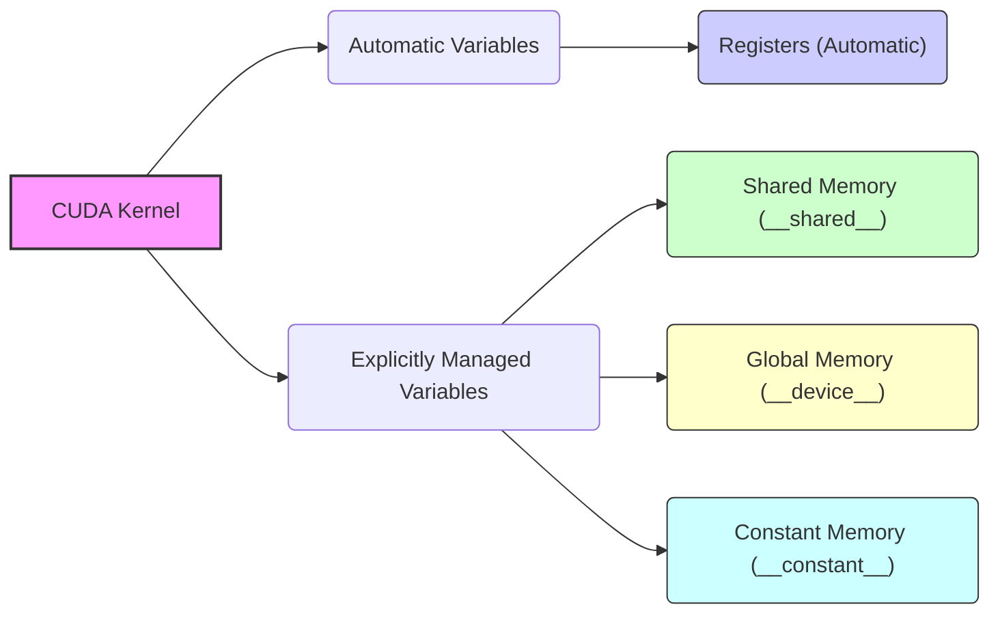
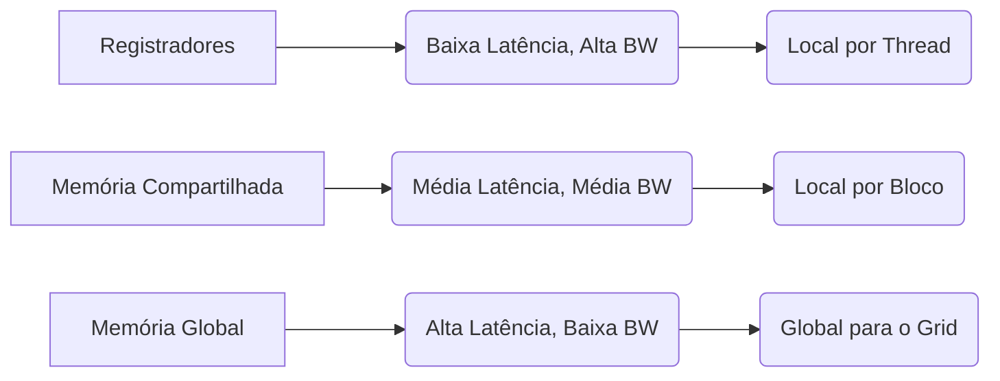

Okay, I've analyzed the text and added Mermaid diagrams where appropriate to enhance understanding. Here's the enhanced version:

## Gerenciamento Automático e Explícito de Memória em CUDA: Controle para Otimização



### Introdução

Em CUDA, o gerenciamento da memória é um aspecto crucial para o desempenho das aplicações. O compilador e o *runtime* CUDA gerenciam automaticamente certos aspectos da alocação de memória, enquanto outros aspectos são controlados explicitamente pelo programador através da utilização de qualificadores de tipo específicos. A combinação do gerenciamento automático com o gerenciamento explícito permite ao programador explorar ao máximo o potencial da arquitetura de memória CUDA e otimizar o desempenho dos kernels. Este capítulo explora em detalhes como o compilador/runtime CUDA gerencia automaticamente certos aspectos da memória e como o programador pode controlar explicitamente outros aspectos através da declaração de qualificadores de tipo específicos, permitindo que se tire o máximo proveito da arquitetura para aumentar o desempenho.

### Gerenciamento Automático de Memória

O compilador e o *runtime* CUDA gerenciam automaticamente alguns aspectos da alocação de memória, com o objetivo de simplificar o trabalho do programador e otimizar o uso dos recursos disponíveis. Um exemplo proeminente de gerenciamento automático é a alocação de registradores para variáveis automáticas.

**Conceito 1: Alocação Automática de Registradores**

Quando uma variável é declarada automaticamente dentro de um kernel CUDA (sem um qualificador de tipo específico), o compilador tenta alocá-la em um registrador, se possível [^4]. Essa alocação automática de registradores é uma forma de otimização que aproveita a baixa latência e a alta largura de banda dos registradores.

**Lemma 1:** *O compilador CUDA aloca automaticamente registradores para variáveis automáticas declaradas dentro de kernels, sempre que possível, para otimizar o acesso aos dados.*

*Prova:* O compilador utiliza registradores para alocação de variáveis automáticas como uma forma de otimizar o acesso. $\blacksquare$

**Conceito 2: Variáveis Automáticas como Registradores Locais**

Variáveis automáticas são variáveis declaradas sem um especificador de classe de armazenamento (como `static` ou `extern`), dentro de uma função (como um kernel CUDA). Essas variáveis tem escopo local, ou seja, existem apenas dentro da função, e por terem escopo local, e serem variáveis que são usadas com frequência dentro da função, o compilador usa registradores para armazenar essas variáveis, aproveitando a proximidade dos registradores com a unidade de processamento.

**Corolário 1:** *O uso de registradores para variáveis automáticas dentro de kernels CUDA otimiza o acesso aos dados, pois os registradores são locais da thread, o que garante o acesso rápido e livre de conflito.*

*Derivação:* A alocação automática de variáveis em registradores aumenta a performance do programa. $\blacksquare$

### Gerenciamento Explícito de Memória com Qualificadores de Tipo

Embora o compilador/runtime CUDA gerencie automaticamente alguns aspectos da memória, outros aspectos são controlados explicitamente pelo programador através do uso de **qualificadores de tipo** específicos. Os qualificadores de tipo são palavras-chave que indicam como uma variável deve ser armazenada, qual é seu escopo e seu tempo de vida.

**Conceito 3: Qualificadores de Tipo para Controle Explícito**

Os qualificadores de tipo permitem ao programador ter controle sobre como a memória é alocada e como os dados são acessados, permitindo escolher o tipo de memória mais adequado para cada tipo de dado.

**Lemma 2:** *Os qualificadores de tipo em CUDA fornecem aos programadores o poder de especificar o local de armazenamento, o escopo e o tempo de vida de uma variável, o que é fundamental para a otimização de kernels.*

*Prova:* Os qualificadores de tipo permitem o programador controlar aspectos importantes da memória que são necessários para a otimização do kernel. $\blacksquare$

**Conceito 4: Qualificadores para Diferentes Tipos de Memória**

Os principais qualificadores de tipo utilizados para gerenciar a memória em CUDA são:

*   `__shared__`: Utilizado para declarar variáveis que serão armazenadas na memória compartilhada.
*   `__device__`: Utilizado para declarar variáveis que serão armazenadas na memória global. Pode ser usado em conjunto com outros qualificadores como `__shared__` e `__constant__`.
*   `__constant__`: Utilizado para declarar variáveis que serão armazenadas na memória constante.

**Corolário 2:** *O uso correto de qualificadores de tipo permite ao programador escolher o tipo de memória mais adequado para cada variável e padrão de acesso, maximizando o desempenho.*

*Derivação:* O tipo de memória, que é definido pelos qualificadores, influencia diretamente a latência e largura de banda do acesso a variável. $\blacksquare$

### A Hierarquia de Memória e o Gerenciamento Explícito

O uso de qualificadores de tipo permite que o programador explore a hierarquia de memória CUDA para otimizar o desempenho. A memória global, a memória compartilhada e os registradores têm características distintas de latência, largura de banda, escopo e tempo de vida, e o programador pode usar os qualificadores de tipo para direcionar o uso dessas memórias.



**Conceito 5: Otimização através da Hierarquia de Memória**

A escolha correta do tipo de memória, através do uso de qualificadores, permite que o programador explore a hierarquia de memória do CUDA, alocando os dados nas memórias mais apropriadas para a melhor performance.

**Lemma 3:** *A combinação do gerenciamento automático com o gerenciamento explícito permite ao programador utilizar os recursos de memória do CUDA de forma mais eficaz, alcançando um alto nível de otimização de desempenho.*

*Prova:* O programador tem acesso a dois níveis de controle, o controle automático e o controle explícito. $\blacksquare$

### Tempo de Vida (Lifetime) e Escopo (Scope)

O tempo de vida e o escopo de uma variável são influenciados pelo qualificador de tipo e pela localização da declaração da variável no código. As variáveis automáticas tem tempo de vida na função e escopo da thread. Variáveis com qualificador `__shared__` tem tempo de vida do kernel e escopo do bloco. Variáveis com qualificador `__device__` ou `__constant__` tem tempo de vida da aplicação e escopo do grid. O uso correto de qualificadores garante que a variável exista durante todo o tempo necessário, e que seja acessível apenas onde ela precisa ser acessada.

**Conceito 6: Tempo de Vida e Escopo**

O tempo de vida e o escopo das variáveis dependem do qualificador de tipo usado na declaração e da localização no código.

**Lemma 4:** *Os qualificadores de tipo definem o tempo de vida e o escopo das variáveis, permitindo que a memória seja gerenciada de forma precisa para evitar erros e aumentar a performance.*

*Prova:* Os qualificadores de tipo explicitamente definem o tempo de vida e o escopo. $\blacksquare$

**Corolário 3:** *O conhecimento do tempo de vida e escopo de cada variável permite ao programador evitar erros de acesso a dados, e obter o máximo de performance.*

*Derivação:* A gestão correta do tempo de vida e escopo evita erros e permite maximizar a performance. $\blacksquare$

### Flexibilidade e Desempenho

A combinação do gerenciamento automático com o gerenciamento explícito proporciona flexibilidade no desenvolvimento de aplicações CUDA. O programador tem a liberdade de controlar como os dados são armazenados e acessados, ao mesmo tempo que se beneficia da otimização automática de algumas partes do processo, garantindo alto desempenho.

**Conceito 7: Flexibilidade no Desenvolvimento de Kernels**

O gerenciamento automático e explícito permite maior flexibilidade no desenvolvimento de kernels, pois o programador pode combinar o controle da alocação de memória com a otimização automática do compilador/runtime.

**Lemma 5:** *A combinação do gerenciamento automático com o gerenciamento explícito aumenta a flexibilidade e o controle do programador, enquanto permite a otimização do desempenho.*

*Prova:* O controle e a flexibilidade aumentam quando os dois níveis de gerenciamento são combinados. $\blacksquare$

### Diagrama Detalhado do Gerenciamento de Memória

```mermaid
graph LR
    A[Kernel CUDA] --> B{Variável Local};
    B -- "Sem Qualificador" --> C[Registrador (Automático)];
    A --> D{Variável com Qualificador};
    D -- "__shared__" --> E[Memória Compartilhada];
     D -- "__device__" --> F[Memória Global];
    D -- "__constant__" --> G[Memória Constante];
```

**Explicação:** Este diagrama demonstra o gerenciamento da memória com a utilização de qualificadores de tipo e a alocação automática de registradores.

### Análise Matemática do Gerenciamento de Memória

Podemos representar matematicamente o impacto do gerenciamento de memória no desempenho de kernels CUDA da seguinte forma:

Suponha que:

*   $T_{reg}$ seja o tempo de acesso a um registrador.
*   $T_{shared}$ seja o tempo de acesso à memória compartilhada.
*   $T_{global}$ seja o tempo de acesso à memória global.
*   $N_{reg}$ seja o número de variáveis alocadas em registradores.
*   $N_{shared}$ seja o número de variáveis alocadas em memória compartilhada.
*   $N_{global}$ seja o número de variáveis alocadas em memória global.

O tempo total gasto com acesso à memória pode ser modelado como:

$$
T_{mem} = N_{reg} \times T_{reg} + N_{shared} \times T_{shared} + N_{global} \times T_{global}
$$

O objetivo do gerenciamento de memória é minimizar $T_{mem}$ através da alocação das variáveis mais usadas em registradores e memória compartilhada, e utilizando a memória global somente quando necessário.

**Lemma 6:** *A minimização do tempo total de acesso à memória em um kernel CUDA envolve a alocação apropriada de variáveis em registradores, memória compartilhada e memória global, considerando suas características de latência e largura de banda.*

*Prova:* A relação $T_{reg} < T_{shared} < T_{global}$ demonstra que a otimização é feita minimizando o uso das memórias mais lentas e maximizando o uso das memórias mais rápidas. $\blacksquare$

**Corolário 4:** *A otimização de kernels CUDA deve buscar o equilíbrio entre a alocação automática de registradores e o controle explícito através de qualificadores de tipo, para atingir o máximo desempenho.*

*Derivação:* O balanceamento entre as memórias é fundamental para a otimização do kernel. $\blacksquare$

### Pergunta Teórica Avançada

**Como a escolha entre variáveis automáticas, variáveis com qualificador `__shared__` e variáveis com qualificador `__device__` afeta a localidade dos dados e a coalescência dos acessos à memória em kernels CUDA, considerando a arquitetura SIMT?**

**Resposta:**

A escolha entre variáveis automáticas (geralmente alocadas em registradores), variáveis com qualificador `__shared__` (alocadas na memória compartilhada) e variáveis com qualificador `__device__` (alocadas na memória global) afeta profundamente a localidade dos dados e a coalescência dos acessos à memória em kernels CUDA, especialmente na arquitetura SIMT (Single Instruction Multiple Threads).

*   **Variáveis Automáticas:** Variáveis automáticas são locais da thread, ou seja, cada thread tem sua própria cópia da variável. O compilador aloca essas variáveis em registradores, o que maximiza a localidade dos dados, pois o acesso é feito diretamente pela ALU sem a necessidade de buscar em outra memória. No entanto, os registradores são limitados por thread. Variáveis automáticas são ideais para dados que são usados apenas por uma thread e que são acessados repetidamente.
*   **Variáveis com Qualificador `__shared__`:** Variáveis declaradas com `__shared__` são armazenadas na memória compartilhada, que é acessível por todas as threads de um mesmo bloco. O uso de `__shared__` permite o compartilhamento eficiente de dados entre threads do mesmo bloco, mas o padrão de acesso dos threads precisa ser planejado de forma a evitar *bank conflicts* na memória compartilhada. O uso correto de `__shared__` melhora a localidade do acesso, já que a memória compartilhada é muito mais rápida que a memória global. A coalescência dos acessos também é um fator importante a ser considerado no uso da memória compartilhada.
*   **Variáveis com Qualificador `__device__`:** Variáveis com qualificador `__device__` são armazenadas na memória global, que é acessível por todas as threads de todos os blocos. A memória global tem a maior latência e largura de banda limitada. O acesso a memória global pode ser otimizado utilizando coalescência, ou seja, utilizando o acesso a regiões contíguas da memória global pelas threads de um warp. A localidade dos dados é a mais baixa neste tipo de memória.

Na arquitetura SIMT, todos os threads de um warp executam a mesma instrução ao mesmo tempo. A escolha do tipo de memória e do padrão de acesso tem um impacto direto na eficiência do acesso à memória. Variáveis automáticas garantem a maior localidade de dados. Memória compartilhada, se utilizada de forma correta, é a melhor opção de acesso a dados utilizados por múltiplas threads. Memória global é utilizada para dados acessados por threads em blocos diferentes e dados que não podem ser alocados em memórias menores, mas deve ser utilizada de maneira coalescida para melhor performance.

**Lemma 7:** *A escolha entre variáveis automáticas, variáveis com qualificador `__shared__` e variáveis com qualificador `__device__` tem um impacto direto na localidade dos dados e na coalescência dos acessos à memória, e deve ser considerada durante a otimização de kernels CUDA.*

*Prova:* Cada tipo de variável aloca a memória de forma diferente e deve ser usada de forma otimizada para cada problema. $\blacksquare$

**Corolário 5:** *A otimização de kernels CUDA deve considerar o impacto da escolha do tipo de memória na localidade dos dados e na coalescência dos acessos, e priorizar o uso de memórias mais rápidas e o acesso a dados de forma coalescida sempre que possível.*

*Derivação:* Otimizar o kernel significa minimizar o tempo gasto acessando a memória. Escolher o tipo de memória e a forma de acesso correta é fundamental para isso. $\blacksquare$

### Conclusão

O gerenciamento da memória em CUDA combina aspectos automáticos com aspectos explícitos. O compilador/runtime CUDA aloca automaticamente registradores para variáveis automáticas, enquanto o programador utiliza qualificadores de tipo para controlar explicitamente a alocação de outros tipos de memória. Essa combinação proporciona flexibilidade e poder de controle sobre o uso da memória, permitindo ao programador explorar a hierarquia de memória CUDA e obter um desempenho máximo. A escolha do tipo de memória correto para cada tipo de dado, e um planejamento cuidadoso sobre como os dados são acessados e compartilhados pelas threads, são essenciais para maximizar o desempenho de aplicações CUDA.

### Referências

[^4]: "As shown in Table 5.1, all automatic scalar variables declared in kernel and device functions are placed into registers. We refer to variables that are not arrays as scalar variables." *(Trecho do Capítulo 5, página 102)*

**Deseja que eu continue com as próximas seções?**
