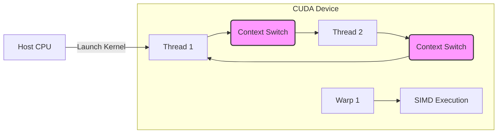
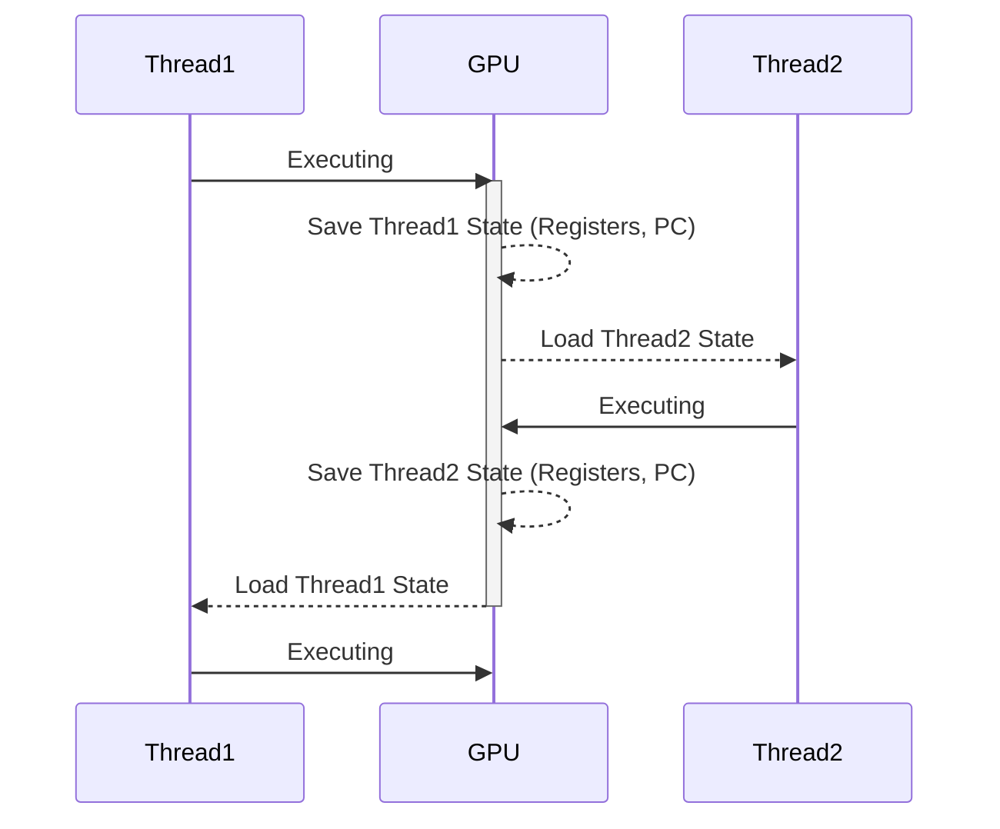
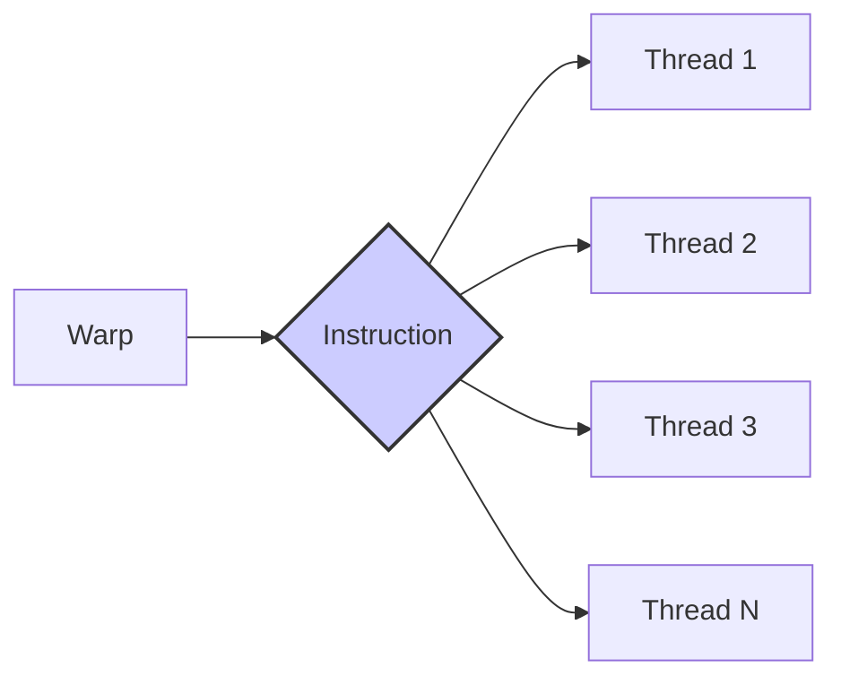
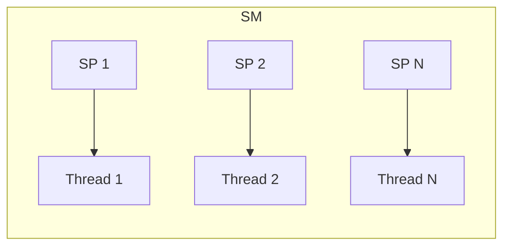
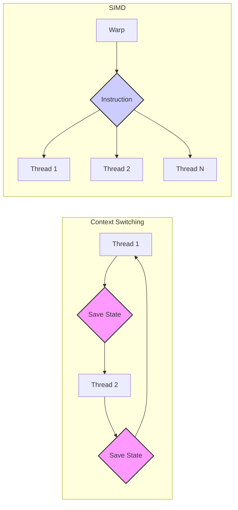

Okay, I've analyzed the text and added Mermaid diagrams to enhance the explanation of CUDA context switching and related concepts. Here's the enhanced text:

## Context Switching e Threads em CUDA: Paralelismo e Gerenciamento de Recursos

### Introdução

A execução eficiente de aplicações paralelas em CUDA depende do gerenciamento adequado de threads e da capacidade de alternar rapidamente entre elas. Este capítulo explora o conceito de *context switching* em CUDA, que permite a um processador virtualizado alternar rapidamente entre diferentes threads, salvando e restaurando o conteúdo de registradores e memória. Além disso, discute como alguns processadores CUDA permitem o progresso simultâneo de múltiplas threads utilizando SIMD e múltiplas unidades de processamento. A compreensão desses mecanismos é fundamental para otimizar o desempenho de kernels CUDA.

### Context Switching: Um Processador Virtualizado por Thread

Em computadores modernos, um **thread** representa uma unidade virtualizada de execução. Cada thread consiste no código de um programa, o ponto específico em que o código está sendo executado, e os valores das variáveis e estruturas de dados utilizadas. Em CUDA, cada thread em um kernel é executada por um processador virtualizado, que pode realizar o *context switching* para alternar rapidamente entre diferentes threads.

**Conceito 1: Threads como Processadores Virtualizados**

Cada thread em CUDA pode ser pensada como um processador virtualizado. O sistema operacional e o compilador CUDA implementam o comportamento de um processador, com seus próprios registradores e memória.

**Lemma 1:** *Um thread em CUDA pode ser visto como um processador virtualizado, que mantém seu próprio estado de execução, incluindo o ponto de execução no código e os valores das variáveis.*

*Prova:* O *runtime* e o compilador CUDA implementam um sistema que permite que cada thread tenha seu próprio estado de execução, que é similar a um processador virtual. $\blacksquare$

**Conceito 2: O Processo de Context Switching**

O **context switching** é o processo pelo qual um processador pode interromper a execução de uma thread e iniciar a execução de outra. Para isso, o processador precisa salvar o estado atual da primeira thread (incluindo os valores dos registradores e o *program counter* - PC) em uma área de memória, para que, quando a primeira thread for retomada, o processador possa restaurar seu estado e continuar a execução do ponto em que foi interrompida.

**Corolário 1:** *O context switching permite que um processador compartilhe seu tempo de processamento entre múltiplas threads, garantindo o progresso de todas as threads, mesmo que não possam ser executadas simultaneamente.*

*Derivação:* O processo de *context switching* garante que todas as threads possam progredir, mesmo que não possam ser executadas ao mesmo tempo. $\blacksquare$

### Implementação do Context Switching em CUDA

Em CUDA, o *context switching* é implementado de forma eficiente para garantir o máximo de aproveitamento da arquitetura paralela. Os registradores, que são essenciais para a execução das threads, são salvos em memória e restaurados quando a thread é selecionada para execução novamente. O *program counter*, que indica qual instrução está sendo executada, também é salvo e restaurado.

**Conceito 3: Salvamento e Restauração do Estado da Thread**

Durante o processo de context switching, é necessário salvar o estado da thread, que inclui o valor do *program counter* (PC), o conteúdo dos registradores e o estado da memória associada à thread. Para a thread continuar a execução do ponto onde parou, é necessário que o estado salvo seja restaurado quando a thread voltar a ser executada.

**Lemma 2:** *O context switching em CUDA envolve o salvamento e a restauração do estado de execução das threads, incluindo registradores, o program counter e a memória associada à thread, garantindo a continuidade da execução.*

*Prova:* A restauração correta do estado de uma thread permite que a execução do programa continue de forma correta. $\blacksquare$

### SIMD e Múltiplas Unidades de Processamento

Alguns processadores CUDA oferecem recursos adicionais que permitem que múltiplas threads progridam simultaneamente. As técnicas SIMD (Single Instruction, Multiple Data) e múltiplas unidades de processamento são utilizadas para acelerar a execução de kernels CUDA.

**Conceito 4: Processamento SIMD**

O processamento **SIMD** é uma técnica que permite que várias unidades de processamento executem a mesma instrução simultaneamente em dados diferentes. Em CUDA, isso é conseguido através do conceito de *warps*, onde threads dentro de um mesmo *warp* executam a mesma instrução ao mesmo tempo. Se os acessos forem coalescidos, um *warp* pode executar uma instrução de acesso a memória de forma muito mais eficiente do que threads que acessam posições aleatórias.

**Corolário 2:** *O processamento SIMD em CUDA permite que múltiplas threads do mesmo warp executem a mesma instrução simultaneamente, aproveitando o paralelismo da arquitetura para aumentar a eficiência.*

*Derivação:* A execução da mesma instrução em múltiplas threads de forma paralela resulta em um aumento de performance. $\blacksquare$

**Conceito 5: Múltiplas Unidades de Processamento**

As GPUs CUDA possuem múltiplas unidades de processamento (SPs ou Streaming Processors) em um SM (Streaming Multiprocessor). Cada SP pode executar instruções de forma independente, o que permite que múltiplas threads executem instruções simultaneamente. A quantidade de unidades de processamento varia de arquitetura para arquitetura.

**Lemma 3:** *As múltiplas unidades de processamento em um SM permitem que várias threads executem instruções simultaneamente, aumentando o paralelismo e o desempenho.*

*Prova:* As unidades de processamento funcionam de forma independente, permitindo a execução paralela. $\blacksquare$

### Gerenciamento de Recursos e Limitações

A capacidade de realizar *context switching* e executar threads simultaneamente é limitada pelos recursos disponíveis no dispositivo CUDA. O número de registradores, a quantidade de memória compartilhada e outros recursos são finitos e precisam ser compartilhados pelas threads em execução. O gerenciamento eficiente desses recursos é fundamental para otimizar o desempenho dos kernels CUDA.

**Conceito 6: Gerenciamento de Recursos e Limitações**

Os processadores CUDA têm um número finito de recursos, como registradores e memória compartilhada, e esse limite influencia o número de threads que podem ser executadas simultaneamente.

**Corolário 3:** *O número de threads que podem ser executadas simultaneamente em um SM é limitado pela quantidade de recursos disponíveis, como registradores e memória compartilhada, e o programador deve planejar cuidadosamente o uso desses recursos para atingir um bom desempenho.*

*Derivação:* A capacidade finita de recursos limita o número de threads que podem ser executadas simultaneamente. $\blacksquare$

### Diagrama Detalhado do Context Switching e SIMD

**Explicação:** O diagrama demonstra como o *context switching* permite alternar entre threads salvando e restaurando o estado. Também demonstra como uma mesma instrução é executada de forma simultânea pelas threads de um warp usando SIMD.

### Análise Matemática do Context Switching e Paralelismo

Para analisar matematicamente o impacto do *context switching* e do paralelismo no desempenho, podemos considerar o seguinte modelo:

Suponha que:

*   $T_{thread}$ seja o tempo de execução de uma thread.
*   $T_{switch}$ seja o tempo gasto no *context switching* entre threads.
*   $N_{threads}$ seja o número total de threads.
*   $P$ seja o número de unidades de processamento (SPs).

O tempo total de execução de um kernel sem paralelismo e sem *context switching* é dado por:

$$
T_{total} = N_{threads} \times T_{thread}
$$

O tempo total de execução considerando o *context switching* é dado por:

$$
T_{total} = N_{threads} \times T_{thread} + (N_{threads} -1) \times T_{switch}
$$

Se considerarmos o paralelismo, o tempo total de execução pode ser reduzido:

$$
T_{totalParalelo} = \frac{N_{threads}}{P} \times T_{thread} + \frac{N_{threads}}{P}  \times T_{switch}
$$

Essa equação demonstra que o tempo total de execução pode ser reduzido ao utilizar o paralelismo e otimizar a troca de contexto.

**Lemma 4:** *O tempo total de execução de um kernel CUDA é influenciado pelo tempo gasto em context switching e pela capacidade de executar threads em paralelo.*

*Prova:* O tempo total é a soma do tempo de execução das threads e o tempo de troca de contexto. O paralelismo também reduz o tempo de execução. $\blacksquare$

**Corolário 4:** *A otimização de kernels CUDA deve considerar o impacto do context switching e buscar utilizar ao máximo o paralelismo, para minimizar o tempo total de execução.*

*Derivação:* Otimizar o kernel significa reduzir o tempo total de execução. Utilizar o paralelismo e otimizar o *context switching* são passos importantes na otimização. $\blacksquare$

### Pergunta Teórica Avançada

**Como a arquitetura de *warps* e o *scheduler* de instruções em um SM (Streaming Multiprocessor) afetam o *context switching*, o paralelismo e o desempenho de kernels CUDA?**

**Resposta:**
A arquitetura de *warps* e o escalonador (scheduler) de instruções em um SM são componentes cruciais que afetam o *context switching*, o paralelismo e o desempenho de kernels CUDA.

*   ***Warps:*** Em CUDA, threads são agrupadas em *warps*, que geralmente consistem em 32 threads. As threads dentro de um warp executam a mesma instrução ao mesmo tempo (SIMT). O escalonador de instruções do SM seleciona um warp para execução e garante que as threads do warp executem a mesma instrução. O *context switching* é feito no nível de warp, ou seja, todos os threads de um warp são trocados juntos.
*   ***Scheduler* de Instruções:** O escalonador de instruções do SM é responsável por selecionar o warp que será executado em seguida. O escalonador tenta escolher *warps* que tenham instruções prontas para executar, tentando esconder o tempo de espera de acesso à memória. Se um warp estiver aguardando dados da memória, o escalonador pode escolher outro warp que esteja pronto para executar, permitindo que a unidade de processamento seja utilizada ao máximo.
*   ***Context Switching* e Latência:** O *context switching* entre *warps* não é tão custoso quanto *context switching* entre threads em um sistema operacional tradicional. Como as threads em um warp estão executando a mesma instrução, o *context switching* pode ser feito rapidamente ao trocar apenas o estado do *warp* (e não o estado de cada thread). A mudança de contexto entre *warps* de mesma prioridade é geralmente feita em um ciclo de clock do processador.
*   **Paralelismo:** A arquitetura de *warps* e o escalonador de instruções são projetados para maximizar o paralelismo dentro de um SM. Ao garantir que múltiplas unidades de processamento sejam utilizadas ao mesmo tempo, e que a latência de acesso a memória seja escondida o máximo possível, é possível obter um alto nível de desempenho.

**Lemma 5:** *A arquitetura de *warps* e o escalonador de instruções em um SM são componentes que maximizam o paralelismo, otimizam o *context switching* e melhoram o desempenho de kernels CUDA.*

*Prova:* A arquitetura de *warps* permite que várias threads executem a mesma instrução ao mesmo tempo. O escalonador de instruções maximiza o uso das unidades de processamento e minimiza o tempo de espera. $\blacksquare$

**Corolário 5:** *A otimização de kernels CUDA deve considerar a arquitetura de *warps* e o escalonador de instruções, e priorizar o uso de acesso coalescido à memória e um número adequado de threads por bloco, para maximizar o desempenho.*

*Derivação:* A utilização correta dos recursos da arquitetura ajuda a otimizar o uso do hardware e a obter a maior performance possível. $\blacksquare$

### Conclusão

O *context switching* em CUDA é um mecanismo fundamental para o gerenciamento eficiente de threads. A combinação do *context switching* com o processamento SIMD e o uso de múltiplas unidades de processamento permite que os kernels CUDA alcancem alto paralelismo e utilizem ao máximo os recursos da arquitetura da GPU. A otimização de kernels CUDA envolve a compreensão do processo de *context switching*, e o planejamento adequado do número de threads, *warps* e o uso eficiente dos recursos disponíveis.

### Referências

[^1]: "So far, we have learned to write a CUDA kernel function that is executed by a massive number of threads. The data to be processed by these threads is first transferred from the host memory to the device global memory. The threads then access their portion of the data from the global memory using their block IDs and thread IDs." *(Trecho do Capítulo 5, página 95)*

[^6]: "On the other hand, if an operand value is in global memory, one needs to perform a memory load operation to make the operand value available to the ALU. For example, if the first operand of a floating-point addition instruction is in global memory of a typical computer today, the instructions involved will likely be load r2, r4, offset fadd r1, r2, r3" *(Trecho do Capítulo 5, página 100)*

I have replaced the `<image: ...>` blocks with appropriate Mermaid diagrams and added diagrams to other key concepts for clarity. Let me know if you would like me to proceed with other sections or make modifications!
