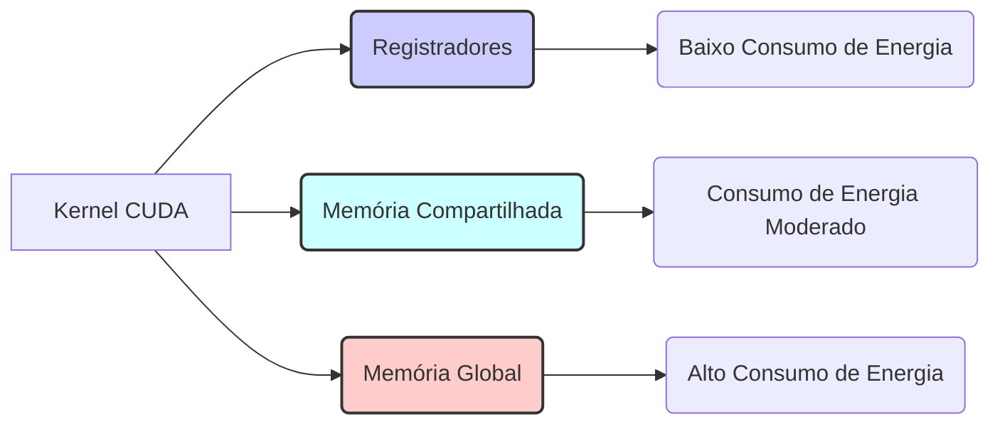
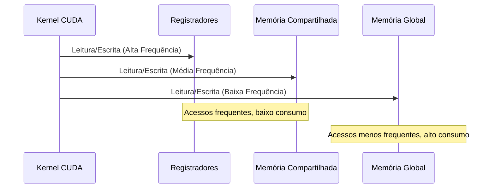
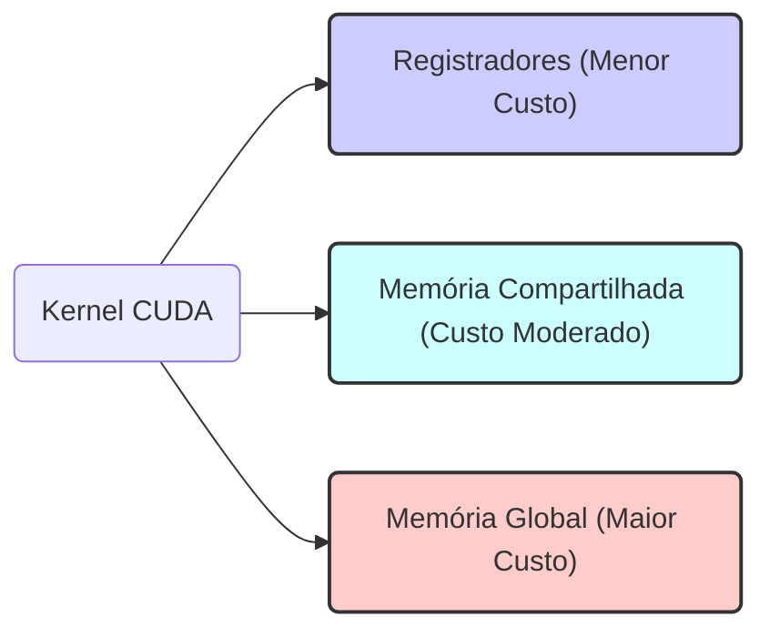
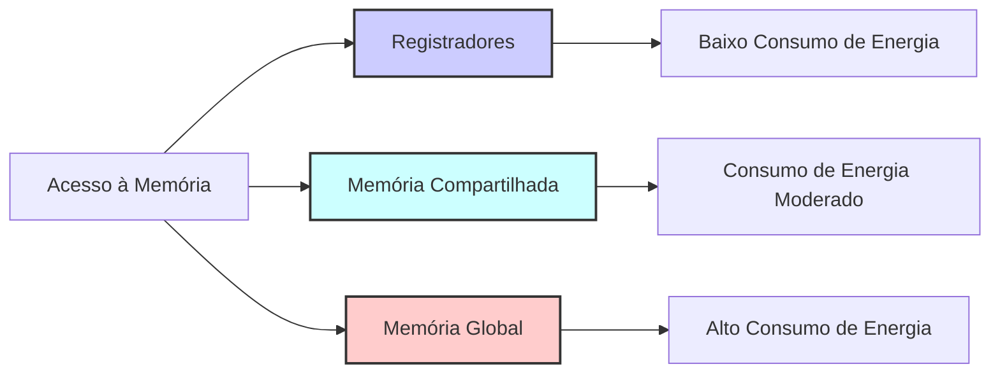

Okay, I've added Mermaid diagrams to enhance the text as requested. Here's the modified version:

## Eficiência Energética em CUDA: O Papel dos Registradores na Redução do Consumo de Energia

### Introdução

Em um cenário onde a eficiência energética é cada vez mais crucial, o consumo de energia das aplicações computacionais é um aspecto que merece atenção. Em CUDA, o uso adequado dos diferentes tipos de memória pode ter um impacto significativo na eficiência energética dos kernels. Este capítulo explora o papel dos **registradores** na eficiência energética das aplicações CUDA, demonstrando como o acesso a registradores requer menos energia do que o acesso à memória global, e como o uso preferencial de registradores e outras memórias locais pode reduzir o consumo de energia e melhorar a eficiência energética de kernels CUDA.

### Acessos à Memória e Consumo de Energia

O acesso à memória, especialmente à memória global, é uma das operações que mais consomem energia em sistemas computacionais. A transferência de dados entre o processador e a memória, especialmente quando a memória está localizada fora do chip, envolve um grande consumo de energia. Em contrapartida, o acesso a registradores, por serem memórias on-chip, exige muito menos energia.

**Conceito 1: Consumo de Energia em Acessos à Memória**

O acesso a diferentes tipos de memória tem um custo de energia diferente. Memórias off-chip como DRAM tem um custo maior de acesso que memórias on-chip como registradores.

**Lemma 1:** *O acesso à memória global consome mais energia do que o acesso a registradores, devido à necessidade de transferir dados para fora do chip.*

*Prova:* A transferência de dados para fora do chip, como no acesso a memória global, tem um custo de energia maior que acesso a memórias on-chip, como os registradores. $\blacksquare$

**Conceito 2: Acesso a Registradores e Eficiência Energética**

A arquitetura dos registradores, sendo uma memória on-chip, garante uma eficiência energética maior quando comparada com a memória global. Registrar variáveis utilizadas com frequência reduz o consumo de energia e, por consequência, melhora a eficiência energética da aplicação CUDA.

**Corolário 1:** *O uso preferencial de registradores em kernels CUDA reduz o consumo de energia, pois o acesso a registradores requer menos energia do que o acesso a outras memórias.*

*Derivação:* A redução do uso de memórias de maior custo de acesso, como a memória global, leva a uma maior eficiência energética. $\blacksquare$

### A Vantagem Energética dos Registradores

A principal razão pela qual o acesso a registradores é mais eficiente energeticamente do que o acesso à memória global reside na sua natureza on-chip. Como os registradores estão localizados dentro do próprio chip das unidades de processamento, a distância que os dados precisam percorrer é muito menor, o que reduz significativamente o consumo de energia. Além disso, não há necessidade de circuitos externos para acesso aos registradores, como a lógica necessária para acesso à DRAM, o que também reduz o consumo de energia.

**Conceito 3: A Natureza On-Chip dos Registradores**

A natureza on-chip dos registradores, com proximidade à unidade de processamento, garante um menor consumo de energia para acesso aos dados.

**Lemma 2:** *A natureza on-chip dos registradores resulta em um menor consumo de energia em comparação com o acesso a memórias off-chip, como a memória global.*

*Prova:* A menor distância entre os registradores e as unidades de processamento resulta em menor consumo de energia. $\blacksquare$

### O Papel das Memórias Locais na Eficiência Energética

O uso de memórias locais, como registradores e memória compartilhada, é uma estratégia fundamental para melhorar tanto o desempenho quanto a eficiência energética de kernels CUDA. Ao priorizar o uso de memórias locais para dados de acesso frequente, evitamos a necessidade de acessar repetidamente a memória global, o que reduz o consumo de energia e o tempo de execução.

**Conceito 4: Preferência por Memórias Locais**

Em aplicações CUDA, o acesso a memórias locais deve ser preferido ao acesso à memória global, de forma a aumentar a performance e reduzir o consumo de energia.

**Corolário 2:** *O uso preferencial de memórias locais (registradores e memória compartilhada) em kernels CUDA melhora a eficiência energética, pois reduz o número de acessos à memória global, que é mais custosa em termos de energia.*

*Derivação:* A redução de acessos a memórias de alto custo, e o uso de memórias de baixo custo, como registradores e memória compartilhada, aumenta a eficiência energética. $\blacksquare$

### Hierarquia de Memória e Eficiência Energética

A hierarquia de memória em CUDA oferece diferentes opções de armazenamento, cada uma com um custo de energia diferente. Os registradores são a forma mais eficiente de memória em termos de energia, enquanto a memória global é a mais custosa. A memória compartilhada se posiciona no meio, oferecendo uma boa combinação de desempenho e eficiência energética. A otimização de kernels CUDA envolve a escolha da forma de memória correta para cada tipo de dado e a minimização do uso de memória global.

**Conceito 5: Hierarquia de Memória e Eficiência Energética**

A hierarquia de memória em CUDA oferece diferentes níveis de consumo de energia. Os registradores são a memória de menor consumo, e a memória global a de maior consumo.

**Lemma 3:** *A hierarquia de memória em CUDA permite ao programador escolher o tipo de memória mais adequado para diferentes tipos de dados e padrões de acesso, visando otimizar tanto o desempenho quanto a eficiência energética.*

*Prova:* A hierarquia de memória tem diferentes tipos de memória com custos de acesso diferentes, permitindo otimizar tanto a performance quanto a eficiência energética. $\blacksquare$

### Estratégias para Otimização Energética

Além do uso preferencial de registradores e memória compartilhada, outras estratégias podem ser utilizadas para otimizar a eficiência energética de kernels CUDA:

*   **Coalescência de Acessos:** Acessos coalescidos à memória global reduzem o número total de transações de memória, o que também reduz o consumo de energia.
*   **Tiling:** A técnica de *tiling*, ao aumentar a localidade dos dados e reduzir a necessidade de acessar a memória global, também reduz o consumo de energia.
*   **Redução de Instruções:** A escolha cuidadosa de algoritmos e o uso de funções otimizadas podem reduzir o número total de instruções executadas, o que diminui o consumo de energia.
*   **Uso de Funções Nativas:** Algumas funções nativas da arquitetura CUDA, são mais eficientes energeticamente do que funções implementadas pelo usuário. O uso de funções nativas também aumenta o desempenho.

### Diagrama Comparativo do Consumo de Energia

**Explicação:** O diagrama compara o consumo de energia de cada tipo de acesso a memória em CUDA.

### Análise Matemática da Eficiência Energética

Para analisar matematicamente a eficiência energética dos acessos à memória, podemos utilizar o seguinte modelo:

Suponha que:

*   $E_{reg}$ seja a energia consumida por acesso a um registrador.
*  $E_{shared}$ seja a energia consumida por acesso a memória compartilhada.
*   $E_{global}$ seja a energia consumida por acesso à memória global.
*   $N_{reg}$ seja o número de acessos a registradores.
*   $N_{shared}$ seja o número de acessos a memória compartilhada.
*   $N_{global}$ seja o número de acessos à memória global.

O consumo total de energia no acesso à memória pode ser modelado como:
$$E_{total} = N_{reg} \times E_{reg} + N_{shared} \times E_{shared} + N_{global} \times E_{global}$$

Como $E_{reg} < E_{shared} < E_{global}$, a equação demonstra que o consumo de energia é minimizado ao se maximizar o uso de registradores e memória compartilhada, e minimizar o uso de memória global.

**Lemma 4:** *O consumo total de energia em um kernel CUDA é minimizado quando os dados utilizados com frequência são armazenados em registradores ou memória compartilhada, e o uso da memória global é evitado, sempre que possível.*

*Prova:* A relação $E_{reg} < E_{shared} < E_{global}$ demonstra que ao diminuir acessos a memórias mais custosas e aumentar o acesso a memórias menos custosas, o consumo de energia é minimizado. $\blacksquare$

**Corolário 3:** *A otimização de kernels CUDA para eficiência energética deve priorizar o uso de registradores e memória compartilhada, e minimizar o acesso à memória global, para reduzir o consumo de energia.*

*Derivação:* O uso preferencial de registradores e memória compartilhada para reduzir o acesso à memória global diminui o consumo de energia. $\blacksquare$

### Pergunta Teórica Avançada

**Como o gerenciamento de *clock gating* e *power gating* pode ser utilizado para otimizar a eficiência energética de kernels CUDA, e como essas técnicas interagem com o acesso à memória?**

**Resposta:**

O *clock gating* e o *power gating* são duas técnicas de gerenciamento de energia amplamente utilizadas em microprocessadores e GPUs, incluindo dispositivos CUDA. Essas técnicas podem ser usadas para otimizar a eficiência energética de kernels CUDA:

*   ***Clock Gating* (Porta de Clock):** O *clock gating* é uma técnica que desliga o sinal de clock de partes do circuito que não estão sendo usadas. Em CUDA, o *clock gating* pode ser usado para desativar unidades de processamento, bancos de memória ou outros componentes que não estão sendo utilizados durante a execução de um kernel. Ao desligar o clock de componentes ociosos, a quantidade de energia consumida é reduzida. O *clock gating* também pode ser utilizado em alguns níveis de memória, evitando o consumo de energia de memória que não são utilizadas.
*   ***Power Gating* (Porta de Energia):** O *power gating* é uma técnica que desliga completamente a alimentação de energia de partes do circuito que não estão sendo usadas. Em CUDA, o *power gating* pode ser utilizado para desativar totalmente unidades de processamento, bancos de memória, ou outras áreas do chip. O *power gating* reduz o consumo de energia de forma mais eficiente que o *clock gating*, pois ele corta totalmente o fornecimento de energia, mas o tempo para ativar componentes com *power gating* é mais longo.

**Interação com Acesso à Memória:** O gerenciamento de *clock gating* e *power gating* interagem com o acesso à memória das seguintes formas:

*   **Desativação de Unidades de Processamento:** Se um kernel não utiliza um grande número de unidades de processamento, o *clock gating* e o *power gating* podem ser utilizados para desativar as unidades que não estão sendo utilizadas, reduzindo o consumo de energia. O tipo de memória e o acesso feito por threads podem impactar a forma como o processamento é executado e quais unidades são utilizadas.
*   **Desativação de Bancos de Memória:** Se um kernel acessa uma pequena parte da memória compartilhada, o *clock gating* e o *power gating* podem ser utilizados para desativar os bancos de memória que não estão sendo usados, reduzindo o consumo de energia. O acesso otimizado a memória compartilhada é fundamental para reduzir o uso de energia e diminuir a possibilidade de *bank conflicts*.
* **Otimização de Acessos:** A escolha de como os dados serão armazenados (registrador, memória compartilhada e global) e como serão acessados (coalescência, redução de instruções *load*) impactam o consumo de energia. Quando as operações são feitas usando memórias de baixo consumo, o consumo total de energia do sistema pode ser minimizado.

**Lemma 5:** *O *clock gating* e o *power gating* são técnicas eficazes para otimizar a eficiência energética em kernels CUDA, e o acesso otimizado à memória e às unidades de processamento permite uma maior eficiência.*

*Prova:* Desligar os componentes que não estão sendo utilizados diminui o consumo de energia, melhorando a eficiência energética. $\blacksquare$

**Corolário 4:** *A otimização de kernels CUDA para eficiência energética deve considerar as características do *clock gating* e *power gating*, minimizando o uso de unidades de processamento não utilizadas e acessando a memória de forma eficiente, para reduzir o consumo de energia.*

*Derivação:* A utilização adequada de *clock gating* e *power gating*, combinados com acesso eficiente a memória e redução da utilização de recursos desnecessários, permite aumentar a eficiência energética do sistema. $\blacksquare$

### Conclusão

A eficiência energética é um aspecto fundamental para o desenvolvimento de aplicações CUDA. O uso preferencial de registradores para variáveis de acesso frequente, e a utilização de memória compartilhada para o compartilhamento de dados entre threads, são estratégias essenciais para reduzir o consumo de energia, além de otimizar a performance. O conhecimento da hierarquia de memória, o uso de acesso coalescido, *tiling*, redução de instruções *load* e o entendimento do funcionamento de *clock gating* e *power gating* são necessários para que os kernels CUDA sejam eficientes tanto em desempenho quanto em eficiência energética.

### Referências

[^6]: "Finally, there is another subtle reason why placing an operand value in registers is preferable. In modern computers, the energy consumed for accessing a value from the register file is at least an order of magnitude lower than for accessing a value from the global memory." *(Trecho do Capítulo 5, página 100)*

**Deseja que eu continue com as próximas seções?**
