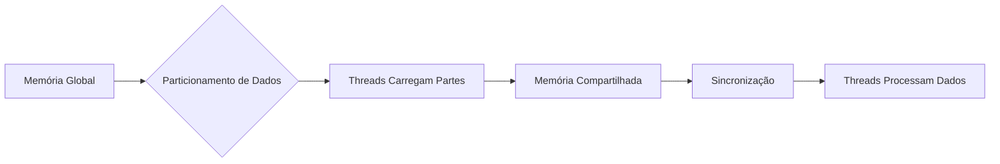
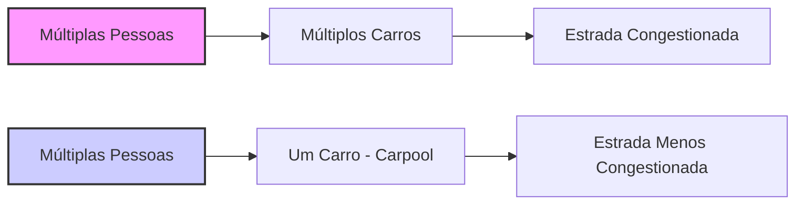
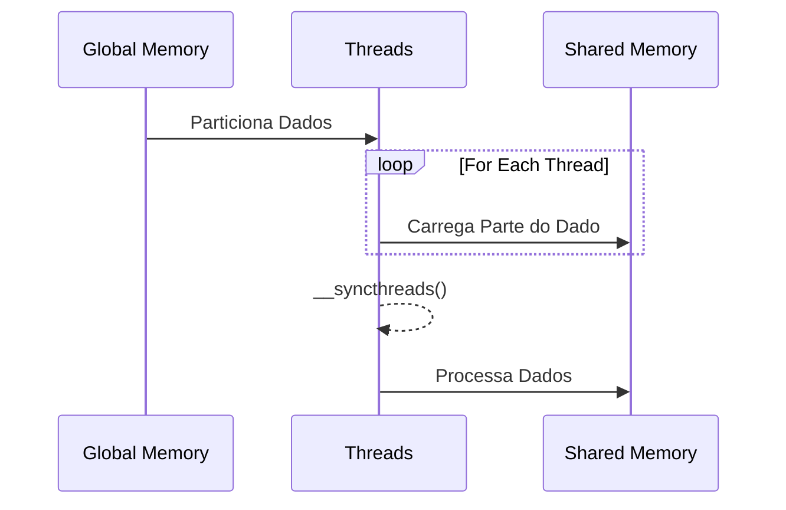

Okay, I've analyzed the provided text and added Mermaid diagrams to enhance understanding, especially around the concepts of collaborative loading and the flow of data.

## Carregamento Colaborativo de Dados em CUDA: Compartilhando o Trabalho para Otimizar o Acesso à Memória

### Introdução

Em kernels CUDA, o acesso eficiente à memória é essencial para alcançar alto desempenho. Uma técnica importante para otimizar esse acesso é o **carregamento colaborativo de dados**, em que várias threads de um bloco trabalham em conjunto para carregar um subconjunto (ou *tile*) de dados da memória global para a memória compartilhada antes de realizar as computações. Essa abordagem, que pode ser comparada ao *carpooling* para o compartilhamento de veículos, permite que os dados sejam carregados uma única vez e utilizados por todas as threads, reduzindo a quantidade total de acessos à memória global. Este capítulo explora em detalhes o carregamento colaborativo de dados em CUDA, como as threads compartilham o trabalho de carregar dados para a memória compartilhada e como essa abordagem otimiza o acesso aos dados, da mesma forma que o *carpooling* otimiza o compartilhamento de veículos.

### O Conceito de Carregamento Colaborativo

O carregamento colaborativo de dados em CUDA é uma técnica em que as threads de um mesmo bloco cooperam para carregar um *tile* de dados da memória global para a memória compartilhada. Em vez de cada thread carregar sua parte individual de dados da memória global, todas as threads trabalham em conjunto, cada uma carregando uma pequena porção dos dados, até que todo o *tile* esteja na memória compartilhada. O carregamento colaborativo é fundamental na estratégia de *tiling*.

**Conceito 1: Cooperação entre Threads para o Carregamento de Dados**

No carregamento colaborativo de dados, as threads de um mesmo bloco trabalham de forma conjunta para o carregamento dos dados na memória compartilhada.

**Lemma 1:** *No carregamento colaborativo de dados em CUDA, as threads de um mesmo bloco cooperam para carregar um tile de dados na memória compartilhada, de forma que nenhum thread tenha que acessar sozinho a memória global para todos os dados do tile.*

*Prova:* Todas as threads do bloco compartilham o trabalho de carregar os dados. $\blacksquare$

**Conceito 2: Dados Carregados uma Única Vez**

Com o carregamento colaborativo, os dados necessários para a computação são carregados na memória compartilhada uma única vez, sendo compartilhados por todas as threads que precisam desses dados, o que reduz o número total de acessos à memória global.

**Corolário 1:** *O carregamento colaborativo permite que os dados sejam carregados da memória global para a memória compartilhada uma única vez, reduzindo acessos a memória global, e que sejam usados por múltiplas threads.*

*Derivação:* O carregamento colaborativo reduz acessos repetitivos a memória global. $\blacksquare$

### Analogia com o Carpooling

A estratégia do carregamento colaborativo de dados em CUDA pode ser comparada ao *carpooling* no transporte de pessoas. Assim como o *carpooling* permite que um grupo de pessoas compartilhe o mesmo veículo para reduzir o número de carros na estrada, o carregamento colaborativo permite que as threads compartilhem o esforço de carregar dados na memória compartilhada, reduzindo o número de acessos à memória global. A analogia com *carpooling* explica como os acessos repetidos são eliminados pelo compartilhamento de um recurso comum.

**Conceito 3: Carregamento Colaborativo como Carpooling de Dados**

O carregamento colaborativo de dados em CUDA pode ser comparado ao *carpooling*, onde o esforço do transporte é compartilhado.

**Lemma 2:** *O carregamento colaborativo de dados é análogo ao carpooling, pois permite que um grupo de threads compartilhe o trabalho de carregamento de dados, reduzindo acessos a memória global, assim como um carpool reduz o número de carros na estrada.*

*Prova:* O *carpooling* e o carregamento colaborativo são ambas formas de compartilhamento de um recurso que reduzem acessos repetidos. $\blacksquare$

### O Processo de Carregamento Colaborativo

O processo de carregamento colaborativo envolve as seguintes etapas:

1.  **Particionamento dos Dados:** Os dados a serem carregados na memória compartilhada (o *tile*) são particionados entre as threads do bloco.
2.  **Carregamento por Threads:** Cada thread carrega sua porção de dados da memória global para a memória compartilhada. O carregamento pode ser feito utilizando os índices da thread (`threadIdx.x`, `threadIdx.y`), e os índices do bloco (`blockIdx.x`, `blockIdx.y`).
3.  **Sincronização:** Após o carregamento, as threads são sincronizadas, utilizando a função `__syncthreads()`, para garantir que todos os dados estejam carregados na memória compartilhada antes de iniciar o processamento.
4.  **Processamento:** As threads do bloco acessam os dados na memória compartilhada para realizar as computações necessárias.

**Conceito 4: Etapas do Carregamento Colaborativo**

O carregamento colaborativo segue uma ordem específica para que a memória compartilhada seja preenchida corretamente.

**Corolário 2:** *O carregamento colaborativo de dados envolve uma sequência de etapas coordenadas para garantir que todos os dados necessários sejam carregados corretamente na memória compartilhada antes de serem utilizados nas computações.*

*Derivação:* O processo do carregamento colaborativo exige uma ordem para que o carregamento de dados ocorra de forma correta. $\blacksquare$

### Sincronização entre Threads: Garantindo a Coerência dos Dados

A sincronização entre as threads é crucial durante o carregamento colaborativo de dados. A função `__syncthreads()` garante que todas as threads do bloco tenham concluído o carregamento dos dados para a memória compartilhada antes de iniciar o processamento. Sem essa sincronização, algumas threads podem tentar acessar dados que ainda não foram carregados, o que causaria resultados incorretos e inconsistentes.

**Conceito 5: A Importância da Sincronização**

A sincronização é utilizada para garantir que todas as threads completem o carregamento dos dados antes de que as computações comecem.

**Lemma 3:** *A sincronização entre as threads, utilizando `__syncthreads()`, é essencial para garantir que todos os dados sejam carregados na memória compartilhada antes de serem utilizados para processamento.*

*Prova:* A sincronização garante que nenhuma thread acesse a memória compartilhada antes que ela seja completamente preenchida pelos outros threads. $\blacksquare$

### Otimização com Carregamento Colaborativo

O carregamento colaborativo de dados otimiza a execução de kernels CUDA das seguintes formas:

*   **Redução de Acessos à Memória Global:** Minimiza o número de acessos à memória global, que é mais lenta, utilizando a memória compartilhada que é mais rápida.
*   **Aumento do CGMA Ratio:** Aumenta o CGMA ratio ao reduzir o número de acessos à memória global por operação de ponto flutuante.
*   **Reutilização de Dados:** Permite a reutilização eficiente dos dados na memória compartilhada, minimizando a necessidade de acessar a memória global repetidamente.
*   **Paralelismo:** O carregamento dos dados em memória compartilhada por múltiplos threads é feito de forma paralela.

### Diagrama Detalhado do Carregamento Colaborativo

**Explicação:** O diagrama mostra o carregamento colaborativo de dados na memória compartilhada, e como a barreira de sincronização impede o acesso aos dados antes que todos tenham sido carregados.

### Análise Matemática do Impacto do Carregamento Colaborativo

Para analisar matematicamente o impacto do carregamento colaborativo no número de acessos à memória global, podemos considerar o seguinte modelo:

Suponha que:

*   $N$ seja o tamanho total dos dados a serem carregados.
*   $P$ seja o número de threads que colaboram no carregamento.

Sem carregamento colaborativo, cada thread carregaria todos os $N$ dados da memória global, de forma que o número total de acessos à memória global seria:

$$
A_{global\_sem} = N \times P
$$

Com carregamento colaborativo, as threads compartilham o trabalho de carregar os $N$ dados, de forma que o número total de acessos à memória global é:

$$
A_{global\_com} = N
$$

O fator de redução no número de acessos à memória global é dado por:

$$
\frac{A_{global\_sem}}{A_{global\_com}} = \frac{N \times P}{N} = P
$$

Essa análise demonstra que, através do carregamento colaborativo, o número de acessos à memória global é reduzido em um fator igual ao número de threads que colaboram no carregamento.

**Lemma 4:** *O carregamento colaborativo de dados reduz o número de acessos à memória global em um fator igual ao número de threads que colaboram no carregamento, conforme demonstrado pela análise matemática.*

*Prova:* A relação $\frac{A_{global\_sem}}{A_{global\_com}} = P$ demonstra que o carregamento colaborativo reduz acessos a memória global por um fator igual ao número de threads que colaboram no carregamento. $\blacksquare$

**Corolário 3:** *Kernels CUDA que utilizam o carregamento colaborativo de dados são mais eficientes no uso da memória, e tendem a ter uma melhor performance.*

*Derivação:* Ao reduzir o número de acessos a memória global, a performance do kernel aumenta. $\blacksquare$

### Pergunta Teórica Avançada

**Como o *stride* de acesso à memória global e o alinhamento dos dados na memória afetam o desempenho do carregamento colaborativo em um kernel CUDA?**

**Resposta:**
O *stride* de acesso à memória global e o alinhamento dos dados na memória são dois fatores cruciais que afetam o desempenho do carregamento colaborativo em um kernel CUDA.

*   ***Stride* de Acesso:** O *stride* se refere à distância entre os elementos de memória acessados consecutivamente por uma thread. Se as threads de um warp acessarem dados com um *stride* não contíguo, a coalescência dos acessos à memória global não ocorrerá, e múltiplas transações de memória serão necessárias, o que degrada a performance. Por outro lado, se as threads de um warp acessarem dados contíguos na memória global (ou seja, com *stride* 1), a coalescência de acesso ocorrerá, e o acesso à memória global será mais eficiente. Em um carregamento colaborativo, o programador deve ter o cuidado de escolher o padrão de carregamento de forma que os acessos sejam feitos de forma coalescida.
*   **Alinhamento dos Dados:** O alinhamento dos dados na memória também tem um impacto no desempenho do carregamento colaborativo. Se os dados acessados por um warp não estiverem alinhados com o tamanho das transações de memória, transações adicionais podem ser necessárias para buscar os dados, o que reduz a performance. Para acesso coalescido, o endereço do primeiro acesso deve estar alinhado ao tamanho do acesso.

**Otimização do Carregamento Colaborativo:** Para otimizar o carregamento colaborativo, o programador deve:

*   **Utilizar Acessos Coalescidos:** O padrão de carregamento deve ser escolhido de forma que as threads de um mesmo *warp* acessem dados contíguos na memória global. Isso é conseguido quando os *strides* são unitários.
*   **Garantir o Alinhamento:** O layout dos dados na memória global deve ser projetado para garantir que os acessos pelas threads estejam alinhados com o tamanho das transações da memória.
*  **Utilizar o Mesmo Padrão de Acesso para Todos os Warps:** É importante que as threads em todos os *warps* tenham o mesmo padrão de acesso a memória, para que o escalonador do dispositivo CUDA possa planejar as operações de acesso a memória de forma eficiente.

**Lemma 5:** *O stride de acesso à memória global e o alinhamento dos dados afetam diretamente a coalescência dos acessos à memória, com impacto no desempenho do carregamento colaborativo.*

*Prova:* O acesso não coalescido requer múltiplas transações, o que degrada a performance. $\blacksquare$

**Corolário 4:** *A otimização do carregamento colaborativo de dados exige a escolha adequada do padrão de acesso, para garantir a coalescência dos acessos, e o alinhamento correto dos dados na memória global, para minimizar o número de transações e aumentar o desempenho.*

*Derivação:* Otimizar o acesso a memória significa reduzir o número de transações e aumentar a largura de banda efetiva. $\blacksquare$

### Conclusão

O carregamento colaborativo de dados é uma técnica poderosa para otimizar o acesso à memória em kernels CUDA. Ao compartilhar o trabalho de carregar dados da memória global para a memória compartilhada, as threads de um bloco reduzem o número total de acessos à memória global e aumentam o CGMA ratio, o que aumenta a eficiência da aplicação. Assim como no *carpooling*, o compartilhamento do trabalho leva a uma maior eficiência. O planejamento adequado do padrão de acesso e do alinhamento dos dados é fundamental para garantir a eficiência do carregamento colaborativo e minimizar o impacto da latência da memória global.

### Referências

[^11]: "Figure 5.6 shows the global memory accesses done by all threads in blocko.0. The threads are listed in the vertical direction, with time of access increasing to the right in the horizontal direction. Note that each thread accesses four elements of M and four elements of N during its execution. Among the four threads highlighted, there is a significant overlap in terms of the M and N elements they access." *(Trecho do Capítulo 5, página 106)*

**Deseja que eu continue com as próximas seções?**
