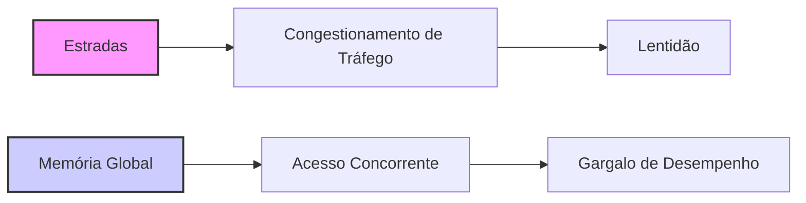
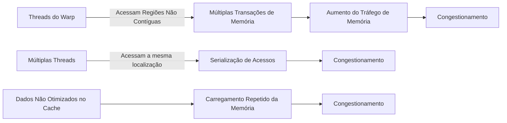
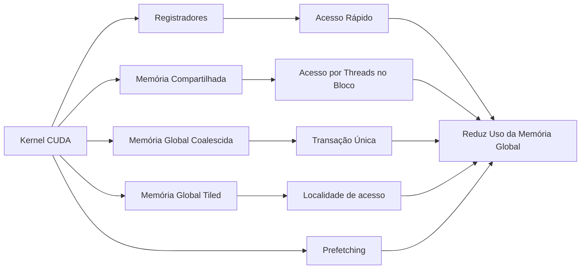
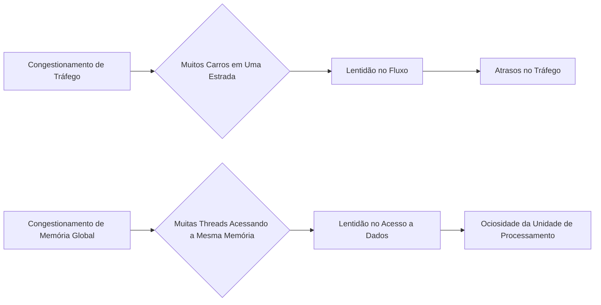
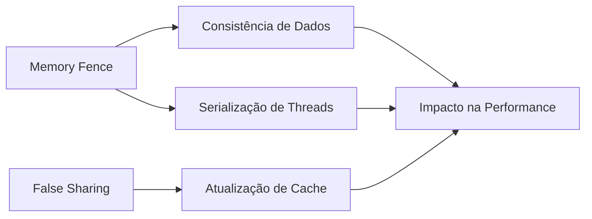

Okay, I've analyzed the text and added Mermaid diagrams where appropriate to enhance the explanation. Here's the enhanced text with the diagrams:

## Analogia com Congestionamento de Tráfego: O Impacto do Acesso Concorrente à Memória Global em CUDA

### Introdução

A otimização de kernels CUDA envolve não apenas o uso eficiente dos recursos computacionais, mas também o gerenciamento adequado do acesso à memória. Uma analogia útil para entender os problemas de acesso à memória em CUDA é a comparação com o **congestionamento de tráfego** em estradas. Assim como o congestionamento de tráfego ocorre quando muitos carros tentam usar a mesma via simultaneamente, o congestionamento de acesso à memória ocorre quando muitas threads tentam acessar simultaneamente as mesmas localizações na memória global. Este capítulo explora essa analogia em detalhes, destacando as ineficiências que ocorrem quando muitas threads acessam simultaneamente a mesma região da memória global e como a **localidade de memória** pode ajudar a resolver esse problema, otimizando a execução de kernels CUDA.

### Congestionamento de Tráfego e Acesso à Memória Global

A analogia com o congestionamento de tráfego é uma forma intuitiva de entender o que acontece quando muitas threads tentam acessar a memória global simultaneamente. Assim como uma estrada congestionada reduz o fluxo de veículos, o congestionamento no acesso à memória global reduz a velocidade com que os dados são fornecidos às unidades de processamento, o que reduz o desempenho do kernel.

**Conceito 1: Congestionamento no Acesso à Memória Global**

O congestionamento no acesso à memória global ocorre quando várias threads tentam acessar a mesma região da memória ao mesmo tempo, o que leva a filas de espera e a uma redução no desempenho do kernel.

**Lemma 1:** *O congestionamento no acesso à memória global ocorre quando várias threads acessam a mesma localização simultaneamente, reduzindo a eficiência do acesso aos dados.*

*Prova:* A tentativa de múltiplos acessos simultâneos a mesma região de memória causa o congestionamento. $\blacksquare$

**Conceito 2: Analogia com o Congestionamento de Tráfego**

Assim como o congestionamento de tráfego em estradas impede o fluxo de veículos, o congestionamento no acesso à memória global impede que os dados sejam fornecidos rapidamente às unidades de processamento.

**Corolário 1:** *O congestionamento no acesso à memória global, assim como o congestionamento de tráfego, gera gargalos que reduzem o desempenho das aplicações em CUDA.*

*Derivação:* Ambas as formas de congestionamento causam atrasos e a redução de performance. $\blacksquare$

### Causas do Congestionamento de Acesso à Memória

O congestionamento no acesso à memória global pode ocorrer por diversas razões:

*   **Acessos Não Coalescidos:** Quando as threads de um mesmo warp acessam regiões não contíguas da memória global, múltiplas transações de memória são necessárias, o que aumenta o tráfego na via de acesso à memória global e leva ao congestionamento.
*   **Acesso Concorrente à Mesma Localização:** Quando várias threads tentam acessar a mesma localização específica da memória global, o controlador de memória é forçado a serializar os acessos, o que cria um ponto de congestionamento e aumenta a latência.
*   **Uso Ineficiente do Cache:** Quando os dados acessados por um kernel não são colocados de forma eficiente no cache da memória global, é necessário carregar os dados repetidamente na memória global, o que leva ao congestionamento.

### Impacto do Congestionamento no Desempenho

O congestionamento no acesso à memória global tem um impacto direto no desempenho de kernels CUDA. Quando a memória global se torna um gargalo, as unidades de processamento ficam ociosas, esperando que os dados sejam fornecidos, o que reduz a utilização do hardware e a eficiência da aplicação. A quantidade de instruções realizadas por segundo é diminuída quando as unidades de processamento ficam ociosas.

**Conceito 3: Impacto do Congestionamento na Performance**

O congestionamento de acessos a memória global diminui a performance dos kernels CUDA.

**Lemma 2:** *O congestionamento no acesso à memória global impede que as unidades de processamento trabalhem de forma eficiente, pois elas precisam esperar que a memória global entregue os dados necessários, reduzindo o desempenho do kernel.*

*Prova:* A ociosidade da unidade de processamento causada pela espera por dados diminui a performance. $\blacksquare$

### A Solução da Localidade de Dados

Assim como a localidade de tráfego pode ser melhorada através da criação de rotas mais diretas e do compartilhamento de veículos (carpooling), a localidade de acesso à memória pode ser melhorada através de técnicas de programação em CUDA, que reduzem a dependência de acesso à memória global e aumentam o uso de registradores e memória compartilhada. A localidade de dados, ou seja, manter os dados necessários próximos às unidades de processamento, é fundamental para resolver o problema do congestionamento no acesso à memória global.

**Conceito 4: Localidade de Dados e Resolução de Congestionamento**

A localidade de dados, ou seja, garantir que as informações que precisam ser acessadas pelo kernel estejam próximas à unidade de processamento, é fundamental para reduzir o congestionamento de memória.

**Corolário 2:** *O congestionamento no acesso à memória global pode ser resolvido através da otimização do acesso à memória e do uso de memórias locais, como registradores e memória compartilhada, além da utilização de técnicas de coalescência para otimizar o uso da largura de banda.*

*Derivação:* O uso de memórias locais e o acesso coalescido a memória global minimizam o número de acessos a memória, reduzindo o congestionamento. $\blacksquare$

### Técnicas para Melhorar a Localidade de Dados

Diversas técnicas podem ser utilizadas para melhorar a localidade de dados e reduzir o congestionamento no acesso à memória global em CUDA:

*   **Uso de Registradores:** Armazenar variáveis de uso frequente em registradores, que são memórias locais de acesso rápido, reduz a necessidade de acessar a memória global.
*   **Uso de Memória Compartilhada:** Carregar dados da memória global para a memória compartilhada, que é acessível por todas as threads dentro de um bloco, reduz a necessidade de acessar a memória global repetidamente.
*   **Coalescência de Acessos:** Garantir que as threads de um warp acessem regiões contíguas da memória global permite que os acessos sejam agrupados em uma única transação de memória, reduzindo o número de acessos à memória.
*   **Tiling:** Dividir os dados em *tiles* menores e processar cada tile utilizando a memória compartilhada aumenta a localidade de acesso e reduz a necessidade de acessar a memória global.
*   **Prefetching:** Carregar dados que serão necessários futuramente na memória compartilhada, antes que eles sejam realmente necessários, reduz o tempo de espera quando a thread precisar dos dados.

### Diagrama do Congestionamento de Tráfego e Acesso à Memória

**Explicação:** O diagrama demonstra como o congestionamento de tráfego e o congestionamento de acesso a memória se equivalem.

### Análise Matemática do Impacto da Localidade de Dados

Podemos expressar matematicamente o impacto da localidade de dados no tempo de acesso à memória da seguinte forma:

Suponha que:

*   $T_{global}$ seja a latência de acesso à memória global.
*   $T_{local}$ seja a latência de acesso a uma memória local (registrador, memória compartilhada).
*   $N_{global}$ seja o número de acessos à memória global.
*   $N_{local}$ seja o número de acessos à memória local.

O tempo total gasto com acesso à memória pode ser modelado como:

$$
T_{mem} = N_{global} \times T_{global} + N_{local} \times T_{local}
$$

Como $T_{local} << T_{global}$, a equação demonstra que o tempo de acesso a memória é minimizado quando o número de acessos à memória global é minimizado, através de técnicas de melhoria da localidade de dados.

**Lemma 4:** *A localidade de dados reduz o tempo total de acesso à memória, ao minimizar a quantidade de acessos à memória global, e aumentar o uso de memórias locais.*

*Prova:* A relação $T_{local} << T_{global}$ demonstra que ao minimizar o acesso a memória global e aumentar acessos a memórias locais, o tempo total de acesso a memória é diminuído. $\blacksquare$

**Corolário 3:** *A otimização de kernels CUDA para reduzir o congestionamento de acesso a memória global requer o aumento da localidade de dados, através de técnicas de uso de registradores, memória compartilhada e coalescência de acessos.*

*Derivação:* O aumento da localidade de dados minimiza o uso da memória global e consequentemente o tempo total gasto no acesso a memória. $\blacksquare$

### Pergunta Teórica Avançada

**Como o uso de *memory fences* (barreiras de memória) afeta o desempenho de kernels CUDA, especialmente em relação à garantia de consistência de dados e à possibilidade de *false sharing* em acesso à memória compartilhada?**

**Resposta:**

As *memory fences* (barreiras de memória), como a função `__threadfence()`, são mecanismos de sincronização que garantem a consistência dos dados, forçando que todos os acessos à memória realizados pelas threads antes da barreira sejam concluídos antes que qualquer acesso posterior seja iniciado. Embora garantam a consistência, elas podem afetar o desempenho de kernels CUDA, especialmente em relação ao acesso à memória compartilhada e à possibilidade de *false sharing*.

*   **Consistência de Dados:** As *memory fences* garantem que todos os acessos à memória sejam completados na ordem correta e que os dados sejam consistentes entre todas as threads, evitando problemas de condições de corrida (*race conditions*). Quando a ordem em que os dados devem ser acessados é relevante, o uso de *memory fences* é fundamental.

*   ***False Sharing*:** O *false sharing* ocorre quando múltiplas threads acessam dados que estão em bancos de memória diferentes na memória compartilhada, mas compartilham o mesmo bloco de *cache* ou a mesma linha de cache. Mesmo que os dados não sejam compartilhados entre os threads, a coerência de cache força a atualização da linha, o que pode degradar a performance devido a necessidade de atualização do cache. O *false sharing* pode ocorrer em memória compartilhada mesmo quando as threads não acessam exatamente a mesma região da memória.

*   **Impacto no Desempenho:** O uso de *memory fences* pode afetar o desempenho ao introduzir serialização na execução das threads. A função `__threadfence()` força as threads a esperar que todas as operações de memória anteriores à barreira sejam concluídas antes de executar as operações posteriores. Se os dados já estão na memória correta, a *memory fence* pode causar um atraso na execução das instruções. No entanto, sem a *memory fence*, o resultado pode ser incorreto.

**Otimização do Uso de *Memory Fences*:** Para otimizar o uso de *memory fences*, o programador deve:

*   **Utilizar quando Necessário:** Usar *memory fences* apenas quando a consistência dos dados exige.
*   **Minimizar o Escopo:** Utilizar *memory fences* apenas para as operações em que a consistência é necessária, evitando usar barreiras globais que serializam toda a execução do kernel.
*   **Evitar False Sharing:** Organizar os dados na memória compartilhada para que o *false sharing* seja evitado, para diminuir a necessidade do uso de *memory fences*.

**Lemma 5:** *O uso de memory fences, embora garanta a consistência dos dados, pode afetar o desempenho de kernels CUDA ao introduzir serialização, e deve ser utilizado de forma otimizada, para garantir consistência sem grandes perdas de performance.*

*Prova:* O uso de *memory fences* força o sistema a um comportamento mais conservador, o que garante a consistência dos dados, mas reduz o paralelismo, pois impõe que certas operações sejam feitas de forma serial. $\blacksquare$

**Corolário 4:** *A otimização de kernels CUDA em relação a memória compartilhada e a necessidade de garantia de consistência de dados exige um planejamento cuidadoso da utilização de *memory fences*, evitando o uso desnecessário, e organizando os dados na memória compartilhada para minimizar o impacto do *false sharing*.*

*Derivação:* A utilização adequada de *memory fences* garante a consistência dos dados e minimiza os efeitos colaterais, como perda de desempenho. $\blacksquare$

### Conclusão

A analogia com o congestionamento de tráfego ajuda a entender o impacto do acesso concorrente à memória global em kernels CUDA. Assim como o congestionamento de tráfego reduz o fluxo de veículos, o congestionamento de acesso à memória reduz a velocidade com que os dados são fornecidos às unidades de processamento. A localidade de dados, alcançada através de técnicas como o uso de registradores, memória compartilhada, acesso coalescido e *tiling*, é fundamental para resolver o problema do congestionamento de acesso à memória. A compreensão das causas do congestionamento e a implementação de estratégias para melhorar a localidade são essenciais para o desenvolvimento de aplicações CUDA eficientes e de alto desempenho.

### Referências

[^11]: "Traffic congestion obviously does not only arise in computing. Most of us have experienced traffic congestion in highway systems, as illustrated in Figure 5.7. The root cause of highway traffic congestion is that there are too many cars all squeezing through a road that is designed for a much smaller number of vehicles." *(Trecho do Capítulo 5, página 106)*

**Deseja que eu continue com as próximas seções?**
