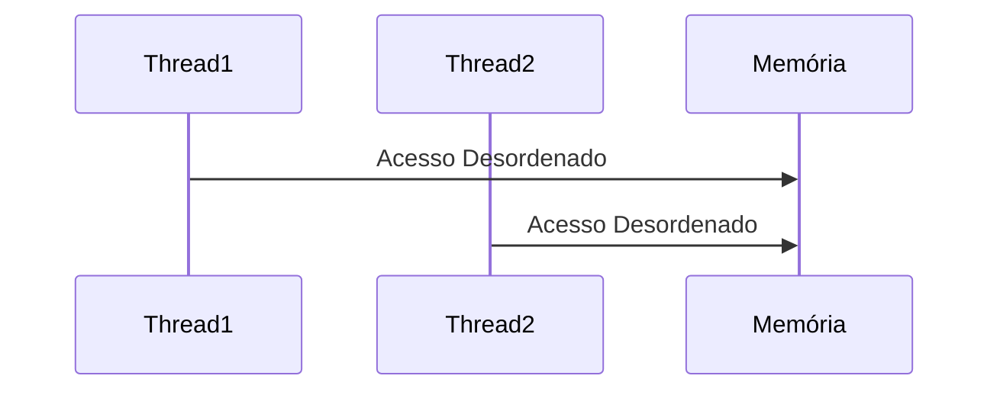
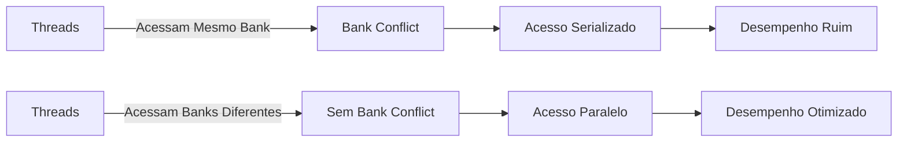

Okay, I've analyzed the provided text and added Mermaid diagrams to enhance understanding where appropriate. Here's the enhanced text with the diagrams:

## Sincronização de Acesso à Memória: A Necessidade de Programação de Threads Coordenada em CUDA

### Introdução

Em kernels CUDA, o acesso eficiente à memória depende não apenas do uso de memórias locais e técnicas de coalescência, mas também da **sincronização do acesso à memória** pelas threads. A analogia com o "carpooling" continua a ser útil para entender esse conceito. Assim como um grupo de pessoas em um *carpool* precisa de uma programação similar para compartilhar um veículo, as threads que acessam a memória de forma colaborativa precisam de uma programação de execução similar para combinar seus acessos à memória em uma única requisição DRAM. Este capítulo explora a necessidade de sincronização no acesso à memória em CUDA, como as threads em um "carpool" precisam de uma programação similar para combinar seus acessos, como nem todas as programações são adequadas para o *carpooling* e a importância da localidade de memória para reduzir o tráfego na memória global.

### A Necessidade de Sincronização no Carregamento Colaborativo

O carregamento colaborativo de dados em CUDA, onde threads de um mesmo bloco trabalham em conjunto para carregar dados para memória compartilhada, exige que os acessos à memória sejam feitos de forma sincronizada. Quando threads tentam acessar a memória global de forma descoordenada, múltiplos acessos individuais são feitos, o que gera congestionamento e degrada o desempenho. Por outro lado, se os acessos forem feitos de forma sincronizada e coordenada, eles podem ser combinados em uma única requisição DRAM, o que otimiza o acesso à memória.

**Conceito 1: Acesso à Memória e Sincronização**

O acesso à memória em CUDA deve ser feito de forma sincronizada para otimizar o uso da largura de banda da memória e reduzir o congestionamento.

**Lemma 1:** *Threads que fazem parte de um mesmo grupo de carregamento colaborativo, e que são utilizadas para fazer acesso coalescido a memória, devem ter uma programação de execução similar para que seus acessos à memória sejam combinados em um único acesso DRAM.*

*Prova:* A sincronização do acesso a memória, com o uso de técnicas como coalescência, permite que um único acesso seja feito, e a informação seja utilizada por diversas threads. $\blacksquare$

**Conceito 2: Analogia com o Carpooling e a Sincronização**

A necessidade de sincronização entre as threads é análoga à necessidade de sincronização em um *carpool*. Se as pessoas em um *carpool* não tiverem uma programação similar, eles não poderão compartilhar o mesmo veículo. Da mesma forma, se as threads não tiverem uma programação de execução similar, seus acessos à memória não podem ser combinados em um único acesso.

**Corolário 1:** *A sincronização de acesso a memória é análoga a coordenação de horários em um *carpool*, sendo necessária para combinar vários acessos a memória em um único acesso a memória.*

*Derivação:* A sincronização e coordenação são necessárias em ambos os casos, tanto para os membros de um *carpool*, quanto para as threads em um bloco. $\blacksquare$

### Programação de Execução Similar para o Carregamento Colaborativo

As threads que fazem parte de um grupo de carregamento colaborativo devem ter uma programação de execução similar para que seus acessos à memória possam ser combinados. Se as threads acessam a memória em momentos muito diferentes, seus acessos não podem ser agrupados em uma única requisição DRAM. É necessário que todas as threads estejam "prontas" para acessar a memória no mesmo momento.

**Conceito 3: Programação Similar para Colaboração**

As threads que colaboram em um acesso a memória devem ter uma programação de execução similar, para que a otimização possa ocorrer.

**Lemma 2:** *Para que o carregamento colaborativo seja efetivo, as threads que carregam os dados devem ter uma programação de execução similar, de forma que seus acessos à memória ocorram em momentos próximos.*

*Prova:* Se os acessos a memória não forem feitos ao mesmo tempo, a otimização por agrupamento não será possível. $\blacksquare$

**Conceito 4: Ineficiência de Programações Desordenadas**

Se a execução das threads ocorrerem de forma muito diferente, o ganho da colaboração se perde. Por exemplo, se uma thread carrega um dado para a memória compartilhada e outra thread, do mesmo bloco, usa o mesmo dado, mas ela só começar a executar muito tempo depois, o dado será carregado na memória compartilhada, mas não será usado durante um tempo, o que pode levar a sua substituição por outras informações, perdendo assim o ganho da utilização da memória compartilhada.

**Corolário 2:** *Nem todas as programações de execução são adequadas para o carregamento colaborativo, e programações que não priorizam a localidade dos dados podem reduzir o desempenho do kernel.*

*Derivação:* A programação das threads afeta o uso da memória, um planejamento incorreto pode levar a ineficiência da utilização da memória. $\blacksquare$

### A Importância da Localidade de Memória

A localidade de memória é fundamental para garantir que o carregamento colaborativo seja efetivo. Threads que acessam dados próximos na memória global têm mais chances de ter seus acessos combinados em uma única requisição DRAM. Ao contrário, threads que acessam dados em locais muito distantes da memória global não se beneficiam do carregamento colaborativo. A localidade é maximizada quando o acesso a memória é feito de forma coalescida.

**Conceito 5: Localidade de Dados e Eficiência da Memória**

A localidade de dados, ou seja, agrupar os acessos a memória a regiões contíguas, é fundamental para a eficiência da arquitetura de memória.

**Lemma 3:** *A localidade de memória é essencial para garantir que os acessos às threads que colaboram no carregamento de dados sejam próximos, permitindo que seus acessos possam ser agrupados em uma única transação de memória.*

*Prova:* O agrupamento de acessos próximos em memória permite a coalescência e diminui a quantidade de transações a memória. $\blacksquare$

### Padrões de Acesso e Estratégias de Agrupamento

O padrão de acesso à memória pelas threads de um bloco influencia diretamente o sucesso do carregamento colaborativo. O programador deve escolher o padrão de acesso cuidadosamente para garantir que as threads acessem dados próximos e que seus acessos possam ser combinados, e que os dados que precisam ser compartilhados sejam carregados na memória compartilhada para a reutilização pelas múltiplas threads.

**Conceito 6: Planejamento do Padrão de Acesso à Memória**

O padrão de acesso a memória deve ser planejado de forma a garantir que as threads acessem dados próximos e que seus acessos possam ser combinados.

**Corolário 3:** *A escolha adequada do padrão de acesso à memória é fundamental para otimizar o desempenho de kernels CUDA que utilizam carregamento colaborativo de dados, e que garantam a localidade dos acessos.*

*Derivação:* O padrão de acesso à memória tem um impacto significativo na performance de kernels CUDA. $\blacksquare$

### Diagrama da Sincronização do Acesso à Memória

**Explicação:** O diagrama mostra a importância do acesso sincronizado, que permite combinar acessos a memória, utilizando coalescência, e o impacto negativo de acessos descoordenados.

### Análise Matemática da Sincronização de Acesso à Memória

Podemos expressar matematicamente o impacto da sincronização no acesso à memória no tempo de execução da seguinte forma:

Suponha que:

*   $T_{accessSingle}$ seja o tempo de acesso individual a memória global.
*   $T_{accessCoalesced}$ seja o tempo de acesso coalescido a memória global.
*   $N$ seja o número de threads que acessam um mesmo conjunto de dados.

O tempo de acesso à memória global sem coalescência e sem sincronização é:
$$T_{mem\_sem} = N \times T_{accessSingle}$$

Com o uso de coalescência e sincronização, o acesso a memória pode ser feito de forma mais eficiente, com tempo:

$$T_{mem\_com} = T_{accessCoalesced}$$

Onde $T_{accessCoalesced} < T_{accessSingle}$.

A diferença no tempo total de execução é dada por:

$$ \Delta T = T_{mem\_sem} - T_{mem\_com} = N \times T_{accessSingle} - T_{accessCoalesced}$$

Essa equação demonstra que a sincronização de acesso a memória e a coalescência reduzem o tempo total de acesso a memória, melhorando a performance.

**Lemma 4:** *A sincronização de acesso a memória, combinada com o acesso coalescido, reduz o tempo total de acesso à memória, quando comparado a acessos não sincronizados e não coalescidos.*

*Prova:* A relação $T_{accessCoalesced} < T_{accessSingle}$ demonstra que a coalescência diminui o tempo total de acesso a memória. $\blacksquare$

**Corolário 4:** *Kernels CUDA que utilizam carregamento colaborativo de dados, com sincronização e coalescência de acessos, obtêm maior performance e eficiência no uso da memória.*

*Derivação:* A redução do tempo total de acesso à memória permite um ganho de performance. $\blacksquare$

### Pergunta Teórica Avançada

**Como as características da arquitetura de memória compartilhada (como *bank conflicts*) interagem com o carregamento colaborativo de dados e a necessidade de sincronização, e como o programador pode mitigar esses conflitos para obter a máxima eficiência?**

**Resposta:**
A arquitetura da memória compartilhada, especialmente os *banks* de memória e a possibilidade de *bank conflicts*, interagem de forma complexa com o carregamento colaborativo de dados e a necessidade de sincronização.

*   ***Bank Conflicts:*** A memória compartilhada é dividida em *banks*, que permitem acessos simultâneos. No entanto, se várias threads de um mesmo *warp* acessam o mesmo *bank*, um *bank conflict* ocorre, e o acesso à memória é serializado, o que degrada o desempenho. O *bank conflict* ocorre mesmo em casos que as threads estão acessando endereços diferentes, se esses endereços estiverem mapeados para o mesmo *bank*.

*   **Carregamento Colaborativo e *Bank Conflicts*:** O carregamento colaborativo, quando mal implementado, pode levar a *bank conflicts*. Se o carregamento não for planejado corretamente, as threads podem ser mapeadas no mesmo banco de memória, o que causa um *bank conflict* durante o carregamento. Para evitar esse problema, é fundamental planejar o padrão de acesso das threads e o layout dos dados, de forma que o acesso aos bancos seja o mais uniforme possível.
*   **Sincronização e *Bank Conflicts*:** A sincronização utilizando a função `__syncthreads()` garante que todas as threads tenham concluído o carregamento antes do processamento. No entanto, mesmo que as threads estejam sincronizadas, o uso inadequado da memória compartilhada pode gerar *bank conflicts*. A sincronização não resolve os conflitos de acesso gerados por acessos ao mesmo *bank* por diferentes threads de um *warp*.

**Estratégias para Mitigar *Bank Conflicts*:**

*   **Acesso Deslocado:** Uma forma de evitar *bank conflicts* é utilizar um deslocamento no acesso à memória. Por exemplo, se o acesso é feito em linhas, e os dados estiverem alocados em colunas, um acesso deslocado em uma posição da coluna é suficiente para evitar o conflito de *bank*.
*   **Padding:** Adicionar colunas extras a matrizes (padding) pode evitar que threads de um mesmo warp acessem o mesmo banco.
*  **Layout de Dados Otimizado:** O programador deve planejar o layout dos dados na memória compartilhada, fazendo com que os dados que precisam ser acessados ao mesmo tempo pelas threads do warp, estejam em bancos de memória diferentes.

**Lemma 5:** *A ocorrência de bank conflicts, no uso da memória compartilhada, reduz a eficiência do carregamento colaborativo, e a otimização do uso da memória compartilhada, incluindo a distribuição adequada dos dados para evitar bank conflicts, é fundamental para um bom desempenho.*

*Prova:* O *bank conflict* serializa o acesso a memória, o que impede a execução paralela das threads. $\blacksquare$

**Corolário 5:** *Kernels CUDA que utilizam carregamento colaborativo de dados e memória compartilhada devem ser cuidadosamente planejados para evitar bank conflicts, utilizando técnicas como padding, acesso deslocado e o planejamento adequado do layout dos dados na memória.*

*Derivação:* A minimização da ocorrência de *bank conflicts* garante o acesso eficiente a memória e consequentemente a performance do kernel. $\blacksquare$

### Conclusão

A sincronização do acesso à memória é essencial para garantir a eficiência do carregamento colaborativo de dados em CUDA. Assim como um grupo de pessoas em um *carpool* precisa ter uma programação similar, as threads que colaboram para carregar dados na memória compartilhada precisam de uma programação de execução similar, para otimizar o acesso aos dados, o uso da memória compartilhada, e minimizar o uso da memória global. O planejamento adequado do acesso à memória e o entendimento dos conceitos de coalescência e *bank conflicts* são fundamentais para o desenvolvimento de aplicações CUDA eficientes e de alto desempenho.

### Referências

[^11]: "Tiled algorithms are very similar to carpooling arrangements. We can think of data values accessed by each thread as commuters and DRAM requested as vehicles. When the rate of DRAM requests exceeds the provisioned bandwidth of the DRAM system, traffic congestion arises and the arithmetic units become idle. If multiple threads access data from the same DRAM location, they can form a "carpool” and combine their accesses into one DRAM request." *(Trecho do Capítulo 5, página 108)*

**Deseja que eu continue com as próximas seções?**
