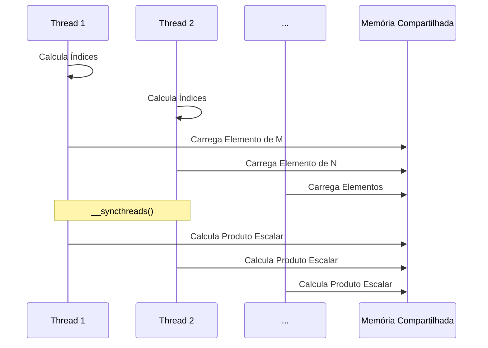

Okay, I've analyzed the text and added Mermaid diagrams to enhance the explanation of the matrix multiplication with tiling. Here's the enhanced text:

## Implementação da Multiplicação de Matrizes com Tiling: Carregamento Colaborativo e Cálculo do Produto Escalar


### Introdução

A implementação da multiplicação de matrizes com a estratégia de *tiling* em CUDA representa um exemplo prático de como as threads colaboram para otimizar o acesso à memória global, usando a memória compartilhada e a sincronização. Este capítulo explora em detalhes como as threads carregam colaborativamente *tiles* das matrizes M e N na memória compartilhada antes de realizar o cálculo do produto escalar, evidenciando a importância da sincronização e do uso eficiente da memória compartilhada para maximizar o desempenho de kernels CUDA.

### Carregamento Colaborativo de Tiles em Memória Compartilhada

Na multiplicação de matrizes com *tiling*, as matrizes de entrada (M e N) são divididas em *tiles* menores que podem ser armazenados na memória compartilhada. As threads de um bloco trabalham de forma colaborativa para carregar os *tiles* de M e N na memória compartilhada antes de iniciar o cálculo do produto escalar, como ilustrado na Figura 5.11 do contexto. Esse processo de carregamento colaborativo é fundamental para reduzir o número de acessos à memória global.

**Conceito 1: Carregamento Colaborativo de Tiles**

As threads de um bloco carregam os *tiles* das matrizes de entrada para memória compartilhada de forma colaborativa, para que nenhuma thread acesse todos os dados da memória global sozinha.

**Lemma 1:** *No carregamento colaborativo de *tiles*, as threads de um bloco trabalham em conjunto para carregar *tiles* das matrizes M e N na memória compartilhada antes de realizar o cálculo do produto escalar, evitando acessos repetidos à memória global.*

*Prova:* As threads de um mesmo bloco dividem o trabalho de carregar os *tiles* na memória compartilhada. $\blacksquare$

**Conceito 2: Redução de Acessos à Memória Global**

O objetivo principal do carregamento colaborativo de *tiles* é reduzir a quantidade de acessos à memória global, que é mais lenta. Ao carregar os *tiles* na memória compartilhada, as threads podem acessar os dados localmente, sem precisar acessar a memória global para cada operação de ponto flutuante.

**Corolário 1:** *O carregamento colaborativo de *tiles* reduz o número de acessos à memória global e aumenta a reutilização dos dados em memória compartilhada.*

*Derivação:* O carregamento colaborativo possibilita que múltiplas threads utilizem os dados carregados, reduzindo a necessidade de acessos a memória global. $\blacksquare$

### Processo de Carregamento e Sincronização

O processo de carregamento colaborativo de *tiles* envolve as seguintes etapas:

1.  **Cálculo dos Índices:** Cada thread calcula os índices dos elementos de M e N que precisa carregar para a memória compartilhada, com base em seu `threadIdx` e `blockIdx`.
2.  **Carregamento de Elementos:** Cada thread carrega sua porção de elementos de M e N da memória global para a memória compartilhada.
3.  **Sincronização:** Uma barreira de sincronização ( `__syncthreads()`) é utilizada para garantir que todas as threads do bloco tenham concluído o carregamento dos *tiles* para a memória compartilhada antes de iniciar o cálculo do produto escalar.



**Conceito 3: Passos do Carregamento Colaborativo**

O carregamento colaborativo envolve os passos de cálculo dos índices, carregamento dos elementos e sincronização das threads.

**Lemma 2:** *O carregamento colaborativo envolve a divisão dos dados em subsets, o carregamento dos dados por múltiplas threads e a sincronização entre as threads para garantir que todos os dados estejam carregados na memória compartilhada antes de serem processados.*

*Prova:* O carregamento colaborativo envolve a sincronização para que nenhum dado seja utilizado sem que ele tenha sido previamente carregado corretamente. $\blacksquare$

**Conceito 4: Sincronização com `__syncthreads()`**

A função `__syncthreads()` é fundamental para garantir que o processo de carregamento colaborativo ocorra corretamente. Ela garante que nenhuma thread inicie o processamento do *tile* antes que todas as threads do bloco tenham completado o carregamento.

**Corolário 2:** *A função `__syncthreads()` é usada para garantir que todas as threads tenham terminado de carregar os dados da memória global para a memória compartilhada antes de prosseguirem para o cálculo do produto escalar.*

*Derivação:* O uso da função `__syncthreads()` impede o acesso a memória compartilhada antes que todos os dados tenham sido carregados. $\blacksquare$

### Cálculo do Produto Escalar com Dados da Memória Compartilhada

Após o carregamento dos *tiles* na memória compartilhada, as threads podem iniciar o cálculo do produto escalar, usando os dados que foram carregados colaborativamente. Como os dados já estão na memória compartilhada, as threads podem acessar esses dados localmente, sem precisar acessar a memória global a cada passo do cálculo. Isso melhora muito a eficiência do kernel.

**Conceito 5: Produto Escalar com Dados da Memória Compartilhada**

O produto escalar das matrizes é feito utilizando os dados carregados de forma colaborativa na memória compartilhada.

**Lemma 3:** *Após o carregamento colaborativo de *tiles* para memória compartilhada, cada thread realiza o cálculo do produto escalar com os dados presentes na memória compartilhada, sem a necessidade de acessar a memória global.*

*Prova:* O carregamento dos dados para a memória compartilhada possibilita o acesso aos dados de forma local. $\blacksquare$

### O Ciclo de Carregamento e Cálculo

O ciclo de carregamento e cálculo da multiplicação de matrizes com *tiling* se repete em etapas:

1.  As threads de um bloco carregam um *tile* de M e um *tile* de N na memória compartilhada.
2.  As threads são sincronizadas para garantir que os dados estejam disponíveis.
3.  As threads calculam uma parte do produto escalar usando os dados na memória compartilhada.
4.  O ciclo se repete para o próximo *tile*.

A repetição desse ciclo garante que todos os elementos da matriz resultante sejam calculados, utilizando o máximo possível os dados carregados na memória compartilhada.

**Conceito 6: Ciclo de Carregamento e Cálculo**

A multiplicação de matrizes com *tiling* é um processo repetitivo que envolve o carregamento dos *tiles*, a sincronização, e a computação dos produtos escalares com dados da memória compartilhada.

**Corolário 3:** *O ciclo de carregamento e cálculo é fundamental para a implementação eficiente da multiplicação de matrizes com tiling, e explora ao máximo a localidade dos dados.*

*Derivação:* O uso da memória compartilhada e a reutilização dos dados carregados através da repetição do ciclo garantem um bom desempenho. $\blacksquare$

### Implementação em Código

O código de um kernel de multiplicação de matrizes com *tiling* (Figura 5.12 do contexto) demonstra como a alocação de memória compartilhada é feita e como as threads colaboram para carregar os *tiles*. As linhas 9 e 10 de Figura 5.12 ilustram o carregamento colaborativo, e a linha 11 ilustra a sincronização utilizando `__syncthreads()`. A linha 13 exemplifica como as threads podem acessar os dados da memória compartilhada e realizar o produto escalar.

### Diagrama Detalhado do Carregamento Colaborativo na Multiplicação de Matrizes

```mermaid
graph LR
    A[Threads do Bloco] --> B{Calcula Índices};
    B --> C[Thread 1 Carrega Elemento M para Memória Compartilhada];
    B --> D[Thread 2 Carrega Elemento N para Memória Compartilhada];
    C --> E[Barreira de Sincronização __syncthreads()];
    D --> E;
    E --> F[Todas Threads Calculam Produto Escalar];
     F --> G[Repete o Ciclo para o Próximo Tile];
```

**Explicação:** O diagrama mostra como threads carregam dados em memória compartilhada, e como a sincronização garante que os dados carregados possam ser utilizados na etapa de computação.

### Análise Matemática da Multiplicação de Matrizes com Tiling

Para analisar matematicamente o impacto do *tiling* na multiplicação de matrizes, podemos considerar o seguinte modelo:

Suponha que:

*   $N$ seja a dimensão das matrizes de entrada (matrizes quadradas N x N).
*  $T$ seja a dimensão dos *tiles* (tiles T x T).

O número de elementos em cada matriz é dado por:

$$ N^2$$

Para calcular um elemento na matriz de saída, são feitas $N$ multiplicações, o que significa que o número total de operações de ponto flutuante para cada matriz é:
$$N^3$$

Com o uso de *tiling*, o número de acessos a memória global para cada matriz é reduzido de $N^3$ para $\frac{N^3}{T}$. Portanto, o número de acessos a memória global para ambas as matrizes é:
$$2\frac{N^3}{T}$$

O CGMA ratio é dado pela relação entre operações de ponto flutuante e acessos a memória global, que passa a ser:

$$CGMA = \frac{N^3}{2\frac{N^3}{T}} = \frac{T}{2}$$

Com esse modelo podemos ver que o CGMA aumenta com o tamanho do *tile*.

**Lemma 4:** *A utilização de *tiling* na multiplicação de matrizes reduz o número de acessos à memória global, aumentando o CGMA ratio, e levando a uma melhor utilização dos recursos do hardware.*

*Prova:* O CGMA aumenta em função do tamanho do *tile*, e a redução de acessos a memória global aumenta a performance do kernel. $\blacksquare$

**Corolário 4:** *Kernels CUDA que implementam a multiplicação de matrizes com *tiling* tendem a ter melhor desempenho, pois utilizam melhor a hierarquia de memória e maximizam o uso do hardware.*

*Derivação:* A estratégia de *tiling* aumenta a performance do kernel por reduzir o tempo gasto no acesso a memória global, e maximizando o uso da memória compartilhada. $\blacksquare$

### Pergunta Teórica Avançada

**Como a escolha do tamanho do *tile* na multiplicação de matrizes interage com a capacidade da memória compartilhada, a ocupação do SM e a possibilidade de ocorrência de *bank conflicts*, e como o programador pode balancear esses fatores para obter a melhor performance?**

**Resposta:**

A escolha do tamanho do *tile* na multiplicação de matrizes é um fator crucial que interage de forma complexa com a capacidade da memória compartilhada, a ocupação do SM e a ocorrência de *bank conflicts*, e o programador deve cuidadosamente balancear esses fatores para obter o melhor desempenho.

*   **Capacidade da Memória Compartilhada:** A quantidade de memória compartilhada disponível por bloco é limitada. O tamanho do *tile* afeta diretamente a quantidade de memória compartilhada que precisa ser alocada para cada bloco. Se o *tile* for muito grande, a memória compartilhada pode ser insuficiente, o que limita o número de blocos que podem ser executados simultaneamente no mesmo SM, reduzindo a ocupação do SM.

*   **Ocupação do SM:** O número de blocos que podem ser executados simultaneamente em um SM é limitado pela quantidade de memória compartilhada, registradores e outras características do dispositivo. O tamanho do *tile* afeta o uso de memória compartilhada, o que afeta a ocupação do SM e, por consequência, o desempenho. Se o *tile* é muito grande, o número de blocos por SM é reduzido, o que degrada o paralelismo do kernel e reduz o desempenho.
*   ***Bank Conflicts*:** O tamanho do *tile* e a organização dos dados na memória compartilhada também afetam a possibilidade de *bank conflicts*. Para que o acesso à memória compartilhada seja eficiente, os dados devem ser alocados e acessados de forma que o uso dos *banks* de memória seja balanceado. Se o *tile* não for planejado corretamente, os acessos a memória compartilhada pode levar a *bank conflicts*, o que diminui a performance.

**Estratégias de Balanceamento:**

*   **Escolher um Tamanho Adequado do Tile:** O tamanho do *tile* deve ser escolhido de forma que ele caiba na memória compartilhada disponível, mas que também possibilite uma boa ocupação do SM.
*   **Analisar o Padrão de Acesso:** O padrão de acesso à memória compartilhada deve ser planejado para evitar *bank conflicts*. A utilização de *padding* na matriz, a transposição dos dados, ou o uso de acessos deslocados pode auxiliar na redução de *bank conflicts*.
*   **Balancear o Uso de Registradores:** Utilizar registradores para dados de uso frequente, mas que não são compartilhados, pode diminuir a pressão sobre a memória compartilhada e aumentar a ocupação do SM.

**Lemma 6:** *A escolha do tamanho ideal do tile na multiplicação de matrizes depende de uma análise cuidadosa da capacidade da memória compartilhada, da ocupação do SM e da possibilidade de ocorrência de bank conflicts, sendo necessário encontrar um equilíbrio para otimizar o desempenho.*

*Prova:* O tamanho do *tile* tem impacto direto sobre a memória compartilhada, a ocupação do SM e a ocorrência de *bank conflicts*. $\blacksquare$

**Corolário 5:** *Kernels CUDA que implementam a multiplicação de matrizes com tiling devem ser cuidadosamente planejados de forma a maximizar o uso da memória compartilhada, reduzir bank conflicts, maximizar a ocupação do SM, e escolher o tamanho de tile correto, para obter a melhor performance.*

*Derivação:* A escolha correta do tamanho do *tile* é um fator de otimização da performance do kernel. $\blacksquare$

### Conclusão

A implementação da multiplicação de matrizes com *tiling* demonstra como as threads podem trabalhar de forma colaborativa para carregar dados da memória global para a memória compartilhada, o que resulta em redução do número de acessos à memória global e aumento do CGMA ratio. O planejamento da sincronização e do acesso a memória compartilhada é fundamental para maximizar a eficiência da aplicação. A escolha cuidadosa do tamanho do *tile*, considerando a capacidade da memória compartilhada, a ocupação do SM e a possibilidade de *bank conflicts*, é fundamental para obter o máximo desempenho.

### Referências

[^11]: "Figure 5.11 shows a small example of matrix multiplication. It corresponds to the kernel function in Figure 5.1. For brevity, we abbreviate d_P[y*Width + x], d_M[y*Width + x], and d_N[y*Width + x] into Py,x, My,x, and Ny,x, respectively. This example assumes that we use four 2×2 blocks to compute the P matrix. Figure 5.5 highlights the computation done by the four threads of block(0,0)." *(Trecho do Capítulo 5, página 105)*

**Deseja que eu continue com as próximas seções?**
