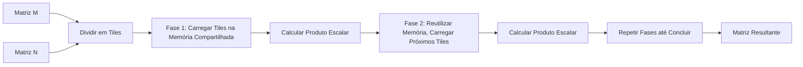
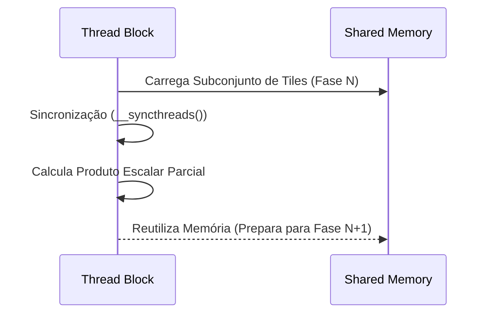

Okay, I've analyzed the text and added Mermaid diagrams to enhance the explanation of the phased matrix multiplication approach. Here's the enhanced text with the diagrams:

## Abordagem Faseada da Multiplicação de Matrizes com Tiling: Reutilização Eficiente da Memória Compartilhada



### Introdução

A implementação da multiplicação de matrizes com *tiling* em CUDA pode ser ainda mais otimizada através de uma **abordagem faseada**. Essa abordagem divide o processo de multiplicação em diferentes fases, em que as mesmas variáveis da memória compartilhada são reutilizadas para o carregamento de diferentes *tiles* de dados. Esta técnica permite um uso mais eficiente dos recursos limitados da memória compartilhada. Este capítulo explora em detalhes a abordagem faseada da multiplicação de matrizes com *tiling*, como o kernel é dividido em fases, como as mesmas variáveis da memória compartilhada são reutilizadas em múltiplas fases para o carregamento de diferentes *tiles*, e como essa reutilização otimiza o uso da memória compartilhada.

### Divisão do Kernel em Fases

Na abordagem faseada da multiplicação de matrizes com *tiling*, o kernel é dividido em diferentes fases. Em cada fase, as threads de um bloco carregam um subconjunto dos *tiles* das matrizes M e N na memória compartilhada, realizam o produto escalar com os dados carregados e repetem esse processo para o próximo subconjunto de *tiles*. Essa abordagem permite que as mesmas variáveis da memória compartilhada sejam reutilizadas em múltiplas fases.

**Conceito 1: Divisão do Kernel em Fases**

O kernel de multiplicação de matrizes é dividido em fases, de forma que em cada fase, o kernel executa um mesmo grupo de operações sobre um conjunto diferente de dados.

**Lemma 1:** *A abordagem faseada divide o kernel de multiplicação de matrizes com *tiling* em diferentes fases, em que cada fase realiza o carregamento de um subconjunto de *tiles* e o cálculo do produto escalar com esses dados.*

*Prova:* A abordagem faseada consiste na execução do kernel em fases. $\blacksquare$

**Conceito 2: Reutilização das Variáveis da Memória Compartilhada**

Em cada fase, as mesmas variáveis da memória compartilhada são utilizadas para armazenar os diferentes subconjuntos de *tiles*. Ou seja, a mesma região de memória compartilhada é utilizada para armazenar dados diferentes em cada fase.

**Corolário 1:** *A abordagem faseada permite que as mesmas variáveis da memória compartilhada sejam reutilizadas em diferentes fases, permitindo que um kernel processe grandes conjuntos de dados, mesmo com a limitação da memória compartilhada.*

*Derivação:* A reutilização da memória compartilhada possibilita a execução do kernel mesmo quando a quantidade de dados excede a capacidade da memória compartilhada. $\blacksquare$

### As Fases de Carregamento e Cálculo

Cada fase na multiplicação de matrizes com *tiling* envolve as seguintes operações:

1.  **Carregamento de Subconjuntos:** As threads carregam um subconjunto dos *tiles* das matrizes M e N na memória compartilhada. Esse carregamento é feito colaborativamente, conforme descrito em capítulos anteriores.
2.  **Sincronização:** Uma barreira de sincronização ( `__syncthreads()`) garante que todas as threads do bloco tenham concluído o carregamento dos dados.
3.  **Cálculo do Produto Escalar:** As threads calculam uma porção do produto escalar usando os dados carregados na memória compartilhada.
4.  **Reutilização das Variáveis:** As mesmas variáveis da memória compartilhada são reutilizadas na fase seguinte, com os novos subconjuntos de *tiles*.

**Conceito 3: Passos da Abordagem Faseada**

A abordagem faseada envolve o carregamento de subconjuntos de *tiles*, a sincronização, o cálculo do produto escalar, e a reutilização das variáveis na próxima fase.

**Lemma 2:** *A abordagem faseada envolve a repetição de um ciclo de carregamento de dados na memória compartilhada, sincronização, cálculo do produto escalar, e reutilização das mesmas regiões da memória para a fase seguinte.*

*Prova:* A repetição das etapas garante que todo o conjunto de dados seja processado. $\blacksquare$



### Reutilização da Memória Compartilhada

A reutilização das mesmas variáveis da memória compartilhada em múltiplas fases permite que o kernel processe grandes matrizes mesmo com a limitação de capacidade da memória compartilhada. Em cada fase, novos subconjuntos de *tiles* sobrescrevem os dados anteriores na memória compartilhada, o que permite que o espaço de memória seja utilizado de forma mais eficiente.

**Conceito 4: Otimização do Uso da Memória Compartilhada**

A reutilização das variáveis da memória compartilhada permite que a capacidade limitada da memória compartilhada seja utilizada para o processamento de grandes conjuntos de dados.

**Corolário 2:** *A reutilização das mesmas variáveis de memória compartilhada em múltiplas fases permite um uso mais eficiente da memória compartilhada e reduz a necessidade de memória compartilhada, o que também reduz o tempo de espera por dados a serem acessados de outras memórias.*

*Derivação:* A reutilização das variáveis faz com que a mesma região de memória possa ser utilizada para armazenar dados diferentes em momentos diferentes, o que aumenta a eficiência da utilização da memória. $\blacksquare$

### Exemplo Prático: Multiplicação de Matrizes com Abordagem Faseada

Para exemplificar como funciona a abordagem faseada, considere a Figura 5.11 do contexto. Na Fase 1, os *tiles* M0,0, M0,1, M1,0, e M1,1 das matrizes M e N0,0, N0,1, N1,0, e N1,1 da matriz N, são carregados na memória compartilhada. Em seguida, as threads realizam parte do cálculo do produto escalar usando os dados da memória compartilhada. Na Fase 2, as mesmas regiões da memória compartilhada são reutilizadas para carregar outros *tiles* de M e N (N2,0, N2,1, N3,0, e N3,1), e a computação do produto escalar continua, utilizando esses novos dados. Este ciclo repete-se até que todas as regiões das matrizes M e N tenham sido usadas para o cálculo da matriz produto.

### Diagrama Detalhado da Abordagem Faseada

```mermaid
graph LR
  A[Fase 1] --> B{Carrega Tile M na Memória Compartilhada};
   A --> C{Carrega Tile N na Memória Compartilhada};
   B --> D[Sincronização (__syncthreads())];
   C --> D;
   D --> E[Cálculo Parcial do Produto Escalar];
    E --> F[Fim da Fase 1];
F--> G[Fase 2]
 G-->H{Carrega Tile M na Memória Compartilhada (Reutilizando)};
  G --> I{Carrega Tile N na Memória Compartilhada (Reutilizando)};
   H --> J[Sincronização (__syncthreads())];
   I --> J;
   J --> K[Cálculo Parcial do Produto Escalar];
    K --> L[Fim da Fase 2]
    L--> M[Continua até completar o processamento]
```

**Explicação:** O diagrama detalha o fluxo de execução de um kernel de multiplicação de matrizes utilizando *tiling* e divisão por fases, com a reutilização das mesmas regiões de memória.

### Análise Matemática da Eficiência da Abordagem Faseada

Podemos analisar matematicamente a eficiência da abordagem faseada considerando o uso da memória compartilhada.

Suponha que:

*  $S$ seja o tamanho total da memória compartilhada disponível.
*  $T$ seja o tamanho de um tile (T x T).
* $N$ seja a dimensão da matriz.
* $F$ seja o número de fases.

Sem a abordagem faseada, cada bloco necessitaria de uma quantidade de memória compartilhada igual a:

$$ S_{tile} = 2T^2$$

O número máximo de blocos simultâneos seria limitado pelo tamanho da memória compartilhada:
$$\frac{S}{2T^2}$$

Com a abordagem faseada, as mesmas variáveis da memória compartilhada são reutilizadas, o que permite que a mesma quantidade de memória compartilhada seja utilizada em múltiplas fases. Isso aumenta o número de operações por acesso a memória e o CGMA ratio.

O número de fases é dado por:
$$F = \frac{N}{T}$$

Em cada fase, $T^2$ elementos de cada matriz são carregados na memória compartilhada. O número total de operações de ponto flutuante continua sendo $N^3$, mas o uso da memória compartilhada é mais eficiente.

**Lemma 4:** *A abordagem faseada da multiplicação de matrizes com tiling otimiza o uso da memória compartilhada, permitindo que a mesma região seja utilizada em diferentes fases, para o processamento de grandes volumes de dados.*

*Prova:* O mesmo espaço de memória compartilhada é reutilizado em múltiplas fases, utilizando um espaço menor de memória do que seria necessário sem a abordagem faseada. $\blacksquare$

**Corolário 4:** *Kernels CUDA que implementam a multiplicação de matrizes com abordagem faseada tendem a ter melhor desempenho e eficiência no uso da memória compartilhada.*

*Derivação:* A reutilização da memória compartilhada leva a menor utilização de espaço, e menor tempo de espera para acesso a memória. $\blacksquare$

### Pergunta Teórica Avançada

**Como a escolha do tamanho do *tile* e o número de fases na multiplicação de matrizes com *tiling* afeta a localidade de dados na memória compartilhada e a possibilidade de *bank conflicts*, e como um programador pode balancear esses fatores para obter o melhor desempenho?**

**Resposta:**

A escolha do tamanho do *tile* e o número de fases na multiplicação de matrizes com *tiling* são parâmetros que afetam a localidade de dados na memória compartilhada, a ocorrência de *bank conflicts*, e o desempenho do kernel.

*   **Tamanho do *Tile*:** O tamanho do *tile* determina a quantidade de dados que são carregados na memória compartilhada em cada fase. *Tiles* maiores aumentam a localidade dos dados na memória compartilhada, pois mais dados próximos são carregados de uma vez. No entanto, *tiles* maiores também podem aumentar a probabilidade de *bank conflicts* na memória compartilhada e diminuir a ocupação do SM, por consumir mais memória compartilhada por bloco.
*   **Número de Fases:** O número de fases é inversamente proporcional ao tamanho do *tile*. Um número maior de fases significa que *tiles* menores são carregados em cada fase, o que diminui a localidade, e aumenta o tempo gasto com a troca de dados no carregamento dos *tiles*. Por outro lado, um número menor de fases, ou seja, tiles maiores, diminui o número de vezes que a memória compartilhada precisa ser acessada.
*   **Localidade de Dados:** O tamanho do *tile* e o número de fases interagem com a localidade dos dados. Com *tiles* menores, uma maior quantidade de dados pode ser carregada localmente, mas a localidade do acesso pode não ser otimizada. Com *tiles* maiores, a localidade de acesso na memória compartilhada é melhor, já que threads que acessam dados próximos na matriz acessam dados próximos na memória compartilhada.
*   ***Bank Conflicts*:** Como cada *tile* usa um espaço de memória compartilhado, o tamanho do *tile* tem um impacto direto nos *bank conflicts*. Se o *tile* não for planejado de forma correta, os dados carregados na memória compartilhada podem ser mapeados em um número pequeno de *banks*, o que aumenta a possibilidade de conflito.

**Balanceamento:** O programador deve balancear cuidadosamente esses fatores para obter o melhor desempenho:

*   **Tamanho do Tile:** A escolha do tamanho do tile deve considerar o tamanho da memória compartilhada, de forma que não sejam criados *tiles* muito grandes. Ao mesmo tempo, o tamanho do tile não pode ser muito pequeno, para que a reutilização dos dados ocorra de forma eficiente. O tamanho do *tile* também deve ser escolhido de forma que ele possa ser dividido de forma uniforme entre as threads do bloco, para evitar operações de carga e *stall* de um grupo de threads, enquanto outro termina o carregamento.
*   **Número de Fases:** O número de fases deve ser escolhido de forma a minimizar o número de acessos a memória compartilhada, ao mesmo tempo em que permite que os dados sejam carregados e reutilizados de forma eficiente. O número de fases deve considerar a capacidade da memória compartilhada, de forma que as fases possam ser realizadas sem exceder a capacidade disponível por bloco.
*   **Layout dos Dados:** O layout dos dados na memória compartilhada deve ser escolhido para evitar *bank conflicts*, usando técnicas como *padding* ou transposição.

**Lemma 5:** *A escolha do tamanho do tile e do número de fases na multiplicação de matrizes com tiling afeta a localidade de dados na memória compartilhada, a ocorrência de bank conflicts e a ocupação do SM, e requer que o programador balanceie esses fatores para obter a máxima performance.*

*Prova:* O tamanho do *tile* e o número de fases tem impacto direto sobre o uso da memória compartilhada e o desempenho do kernel. $\blacksquare$

**Corolário 5:** *A otimização de kernels CUDA que implementam a multiplicação de matrizes com tiling deve considerar a escolha adequada do tamanho do tile, o número de fases, o layout dos dados, e a redução de bank conflicts, para maximizar o uso da memória compartilhada e o desempenho do kernel.*

*Derivação:* Otimizar a aplicação requer o planejamento de como o hardware será usado, e a escolha correta do tamanho do *tile* é fundamental. $\blacksquare$

### Conclusão

A abordagem faseada da multiplicação de matrizes com *tiling* permite que o kernel reutilize as mesmas variáveis da memória compartilhada em múltiplas fases, o que reduz a necessidade de espaço da memória compartilhada e garante o processamento de matrizes maiores. O carregamento colaborativo, a sincronização das threads e a reutilização eficiente da memória compartilhada são elementos fundamentais para o desenvolvimento de aplicações CUDA eficientes e de alto desempenho.

### Referências

[^11]: "In each phase, all threads in a block collaborate to load a tile of M elements and a tile of N elements into the shared memory. This is done by having every thread in a block to load one M element and one N element into the shared memory, as illustrated in Figure 5.11." *(Trecho do Capítulo 5, página 110)*

**Deseja que eu continue com as próximas seções?**
