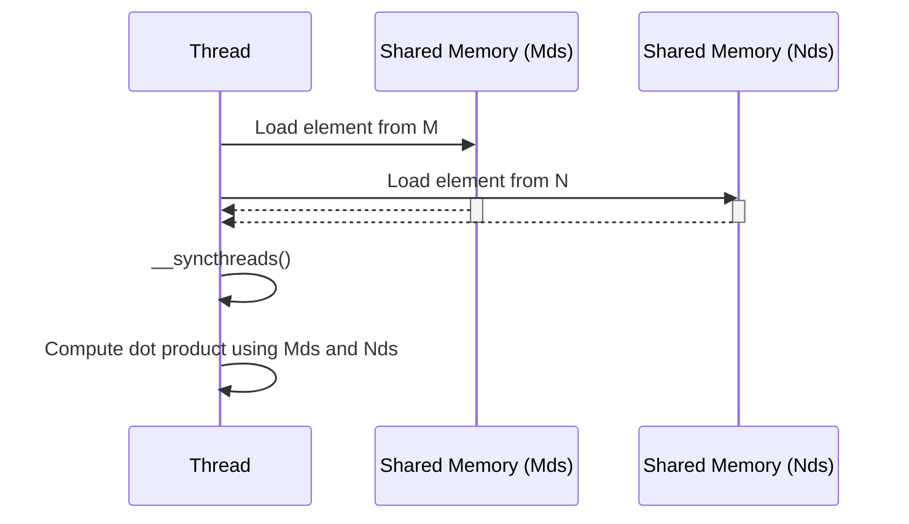
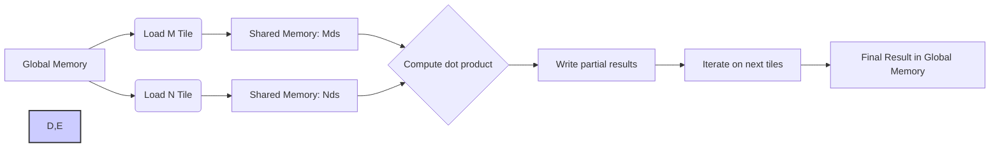

Okay, I've analyzed the text and added Mermaid diagrams to enhance the explanation of the concepts. Here's the enhanced text with the diagrams:

## Variáveis `Mds` e `Nds` na Memória Compartilhada: Armazenando *Tiles* para a Multiplicação de Matrizes

```mermaid
graph LR
    A[Global Memory] --> B["Load Tile of M"];
    A --> C["Load Tile of N"];
    B --> D[Shared Memory "Mds"];
    C --> E[Shared Memory "Nds"];
    D --> F[Threads within a Block compute partial results using data from Mds and Nds];
    E --> F
    F --> G["Accumulate partial results"]
    G --> H[Result matrix in Global Memory]
    style A fill:#f9f,stroke:#333,stroke-width:2px
    style H fill:#f9f,stroke:#333,stroke-width:2px
    style D,E fill:#ccf,stroke:#333,stroke-width:2px

```

### Introdução

Em kernels CUDA que utilizam a estratégia de *tiling* para multiplicação de matrizes, o uso de variáveis na memória compartilhada para armazenar os *tiles* das matrizes de entrada é essencial para o desempenho. As variáveis `Mds` e `Nds` representam esses arrays de memória compartilhada que são utilizados para guardar *tiles* das matrizes M e N, respectivamente. Este capítulo explora em detalhes a declaração das variáveis `Mds` e `Nds`, seu uso para armazenar *tiles* das matrizes M e N, e seu papel crucial no cálculo do produto escalar em kernels CUDA.

### Declaração de `Mds` e `Nds` na Memória Compartilhada

As variáveis `Mds` e `Nds` são declaradas como arrays na memória compartilhada, utilizando o qualificador `__shared__` no código do kernel CUDA, o que garante que estas variáveis sejam compartilhadas por todas as threads dentro de um mesmo bloco. Essas variáveis são fundamentais para a implementação da estratégia de *tiling* e para o uso eficiente da memória compartilhada.

**Conceito 1: Declaração de `Mds` e `Nds` como Arrays Compartilhados**

As variáveis `Mds` e `Nds` são declaradas como *arrays* na memória compartilhada, com o uso do qualificador `__shared__`, o que possibilita que as threads de um mesmo bloco tenham acesso à mesma área de memória.

**Lemma 1:** *As variáveis `Mds` e `Nds` são declaradas com o qualificador `__shared__`, o que indica que elas são alocadas na memória compartilhada e acessíveis por todas as threads de um mesmo bloco.*

*Prova:* O qualificador `__shared__` faz com que as variáveis sejam alocadas em memória compartilhada. $\blacksquare$

**Conceito 2: Armazenamento de Tiles das Matrizes M e N**

As variáveis `Mds` e `Nds` são utilizadas para armazenar os *tiles* das matrizes M e N, respectivamente. Cada *tile* representa um subconjunto da matriz original, e este subconjunto é utilizado para computar o produto escalar de uma região da matriz resultante.

**Corolário 1:** *As variáveis `Mds` e `Nds` armazenam *tiles* das matrizes M e N na memória compartilhada, permitindo que as threads acessem os dados de forma local, com baixo custo, e reduzindo acessos a memória global.*

*Derivação:* As variáveis servem de ponte entre a memória global e os registradores, armazenando dados temporários para facilitar o acesso e reutilização pelas threads. $\blacksquare$

### Uso de `Mds` e `Nds` na Multiplicação de Matrizes

Na multiplicação de matrizes com *tiling*, o processo de carregamento de dados envolve as seguintes etapas:

1.  **Cálculo de Índices:** Cada thread calcula os índices dos elementos de M e N que precisa carregar para `Mds` e `Nds`.
2.  **Carregamento na Memória Compartilhada:** Cada thread carrega um elemento de M para `Mds` e um elemento de N para `Nds`, com base nos índices calculados.
3.  **Sincronização:** Uma barreira de sincronização ( `__syncthreads()`) garante que todas as threads do bloco tenham concluído o carregamento dos elementos em `Mds` e `Nds`.
4. **Computação:** Após o carregamento, as threads podem usar os dados armazenados nas variáveis `Mds` e `Nds` para calcular o produto escalar, sem necessitar de mais acessos à memória global.

**Conceito 3: Uso das Variáveis em um Kernel CUDA**


As variáveis `Mds` e `Nds` são utilizadas pelas threads para carregar os dados e realizar o produto escalar.

**Lemma 2:** *As variáveis `Mds` e `Nds` são utilizadas pelas threads de um bloco para armazenar *tiles* de M e N na memória compartilhada, permitindo a computação dos produtos escalares de forma eficiente.*

*Prova:* As variáveis são a ponte entre a memória global e a unidade de processamento. $\blacksquare$

### Organização das Variáveis na Memória Compartilhada

As variáveis `Mds` e `Nds` são organizadas como arrays bidimensionais na memória compartilhada, com dimensões correspondentes ao tamanho do *tile*. Essa organização permite que cada thread acesse seus elementos correspondentes em cada fase do carregamento e cálculo do produto escalar. A organização dos dados em um *array* bidimensional na memória compartilhada também pode otimizar o acesso à memória compartilhada e reduzir a possibilidade de *bank conflicts*, mas esse layout precisa ser escolhido cuidadosamente.

**Conceito 4: Layout Bidimensional das Variáveis**

As variáveis `Mds` e `Nds` são usualmente organizadas como *arrays* bidimensionais na memória compartilhada, o que facilita o acesso aos dados pelas threads.

**Corolário 2:** *As variáveis `Mds` e `Nds` são organizadas como arrays bidimensionais na memória compartilhada para facilitar o acesso e a reutilização dos dados pelas threads que calculam a matriz resultante.*

*Derivação:* O uso de *arrays* bidimensionais para o armazenamento de *tiles* facilita o acesso a memória para realizar as operações de produto escalar. $\blacksquare$

### Reutilização de `Mds` e `Nds` em Múltiplas Fases

Um aspecto crucial da abordagem faseada da multiplicação de matrizes com *tiling* é a reutilização das variáveis `Mds` e `Nds` em múltiplas fases. Após o carregamento inicial de um subconjunto de *tiles* e o cálculo do produto escalar com esses *tiles*, as mesmas variáveis `Mds` e `Nds` são reutilizadas para carregar e computar o produto escalar com os próximos subconjuntos de *tiles*. A reutilização da memória permite que grandes matrizes sejam processadas mesmo com a limitada capacidade da memória compartilhada.

**Conceito 5: Reutilização das Variáveis nas Fases**

As mesmas variáveis `Mds` e `Nds` são reutilizadas em múltiplas fases, armazenando diferentes conjuntos de *tiles*, o que possibilita um maior aproveitamento do espaço da memória compartilhada.

**Lemma 3:** *As variáveis `Mds` e `Nds` são reutilizadas em múltiplas fases do kernel, permitindo um uso mais eficiente da memória compartilhada e o processamento de grandes conjuntos de dados.*

*Prova:* O uso das mesmas variáveis para diferentes dados permite a execução de operações sobre grandes volumes de dados. $\blacksquare$

### Diagrama Detalhado de `Mds` e `Nds`

**Explicação:** O diagrama ilustra como as variáveis `Mds` e `Nds` são utilizadas, com os dados sendo carregados e as threads calculando o produto escalar, e como elas são reutilizadas em cada fase.

### Análise Matemática do Uso de `Mds` e `Nds` na Memória Compartilhada

Podemos representar matematicamente a utilização das variáveis `Mds` e `Nds` em um kernel de multiplicação de matrizes com *tiling* da seguinte forma:

Suponha que:

*   $T$ seja a dimensão dos *tiles* (T x T).
*   $S_{Mds}$ seja o tamanho da memória compartilhada alocada para `Mds`.
*   $S_{Nds}$ seja o tamanho da memória compartilhada alocada para `Nds`.
*   $S_{total}$ seja o tamanho total da memória compartilhada usada.

O tamanho da memória compartilhada para cada array é dado por:

$$S_{Mds} = T^2 \times sizeof(float)$$

$$S_{Nds} = T^2 \times sizeof(float)$$

O tamanho total da memória compartilhada utilizada é dado por:

$$S_{total} = S_{Mds} + S_{Nds} = 2T^2 \times sizeof(float)$$

Essa equação mostra como o tamanho dos *tiles* (T) influencia o consumo de memória compartilhada e, por conseguinte, o número de threads que podem ser executadas simultaneamente, e a importância da reutilização das variáveis `Mds` e `Nds` para otimizar o uso da memória compartilhada.

**Lemma 4:** *A utilização das variáveis `Mds` e `Nds` como *arrays* bidimensionais na memória compartilhada permite o armazenamento e acesso eficiente aos *tiles* das matrizes de entrada.*

*Prova:* A utilização das variáveis como *arrays* bidimensionais possibilita o acesso dos dados pelas threads de forma direta, de acordo com os seus índices. $\blacksquare$

**Corolário 3:** *A reutilização das variáveis `Mds` e `Nds` em múltiplas fases permite o processamento de matrizes maiores do que o tamanho disponível na memória compartilhada, de forma eficiente.*

*Derivação:* A reutilização das variáveis permite o processamento de grandes volumes de dados mesmo quando a capacidade da memória é limitada. $\blacksquare$

### Pergunta Teórica Avançada

**Como a escolha do tamanho do *tile* (definido por `TILE_WIDTH`) afeta a quantidade de registradores utilizados por cada thread, a ocupação do Streaming Multiprocessor (SM), e o desempenho do kernel de multiplicação de matrizes com *tiling*?**

**Resposta:**
A escolha do tamanho do *tile*, definido pela constante `TILE_WIDTH` no código CUDA, tem um impacto significativo na quantidade de registradores utilizados por cada thread, na ocupação do Streaming Multiprocessor (SM) e, por conseguinte, no desempenho do kernel de multiplicação de matrizes com *tiling*.

*   **Uso de Registradores:** O tamanho do *tile* afeta indiretamente o número de registradores utilizados por cada thread. Um tamanho de *tile* maior significa que cada thread terá mais trabalho a fazer, o que pode levar a uma maior utilização de registradores, pois a thread precisará armazenar temporariamente resultados e índices adicionais. Por outro lado, um tamanho de *tile* menor significa que cada thread terá menos trabalho a fazer, o que pode levar a uma menor utilização de registradores.

*   **Ocupação do SM:** A ocupação do SM é a porcentagem da capacidade do SM que está sendo utilizada pelas threads. Um tamanho de *tile* maior pode reduzir a ocupação do SM, pois o número de threads por bloco será reduzido para acomodar os *tiles* maiores na memória compartilhada. Por outro lado, um tamanho de *tile* muito pequeno pode levar a uma subutilização da capacidade do SM, pois menos threads serão necessárias para processar os *tiles*.

*   **Desempenho do Kernel:** O desempenho do kernel depende de um equilíbrio entre o uso de registradores, a ocupação do SM e o número de acessos à memória global. Um tamanho de *tile* que reduz o número de acessos à memória global e permite uma boa ocupação do SM é desejável, mas o uso excessivo de registradores ou um tamanho de *tile* muito grande que limite o número de threads ativas pode reduzir o desempenho.

**Otimização:** O programador deve considerar os seguintes pontos para otimizar o tamanho do *tile*:

*   **Limite de Registradores:** O programador deve ter em mente o limite de registradores por thread, para que o compilador não utilize memória local para as variáveis de um thread, o que causaria um *spilling*, reduzindo a performance.
*   **Limite da Memória Compartilhada:** O tamanho do *tile* deve ser escolhido de forma que a memória compartilhada seja utilizada sem exceder sua capacidade.
*  **Limite da Ocupação do SM:** O programador deve procurar maximizar a ocupação do SM, de forma que as unidades de processamento do SM sejam utilizadas ao máximo.
*  **Largura de Banda:** A escolha do tamanho do tile também impacta a largura de banda necessária para a memória compartilhada e a coalescência de acessos.

**Lemma 6:** *A escolha do tamanho do tile (definido por `TILE_WIDTH`) afeta a utilização de registradores, a ocupação do SM, o acesso a memória compartilhada e o desempenho do kernel de multiplicação de matrizes com tiling, sendo necessário um planejamento cuidadoso para atingir a melhor performance.*

*Prova:* Cada um dos pontos mencionados afeta o desempenho do kernel, e o tamanho do *tile* afeta todos eles. $\blacksquare$

**Corolário 5:** *A otimização de kernels CUDA de multiplicação de matrizes com *tiling* exige a escolha cuidadosa do tamanho do *tile* para garantir um balanço adequado entre o uso de registradores, a ocupação do SM, e o acesso eficiente a memória, e evitar o *spilling*, a subutilização e os conflitos de acesso à memória compartilhada.*

*Derivação:* Otimizar a aplicação requer um balanceamento entre todos os recursos do device, em particular o tamanho do *tile*. $\blacksquare$

### Conclusão

As variáveis `Mds` e `Nds` são essenciais para a implementação da multiplicação de matrizes com *tiling* em CUDA. Elas são alocadas na memória compartilhada e utilizadas para armazenar os *tiles* das matrizes M e N, respectivamente. A abordagem faseada, através da reutilização das variáveis `Mds` e `Nds` em múltiplas fases do kernel, permite otimizar o uso da memória compartilhada e processar grandes conjuntos de dados. A escolha adequada do tamanho do *tile* e a compreensão do funcionamento do carregamento colaborativo e da sincronização são fundamentais para o desenvolvimento de aplicações CUDA eficientes e de alto desempenho.

### Referências

[^11]: "In Figure 5.12, lines 1 and 2 declare Mds and Nds as shared memory variables. Recall that the scope of shared memory variables is a block. Thus, one pair of Mds and Nds will be created for each block and all threads of a block have access to the same Mds and Nds. This is important since all threads in a block must have access to the M and N values loaded into Mds and Nds by their peers so that they can use these values to satisfy their input needs." *(Trecho do Capítulo 5, página 112)*

**Deseja que eu continue com as próximas seções?**
