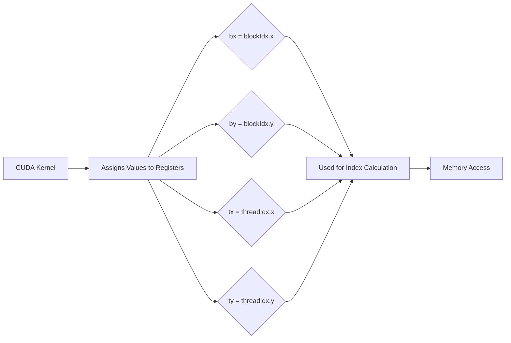
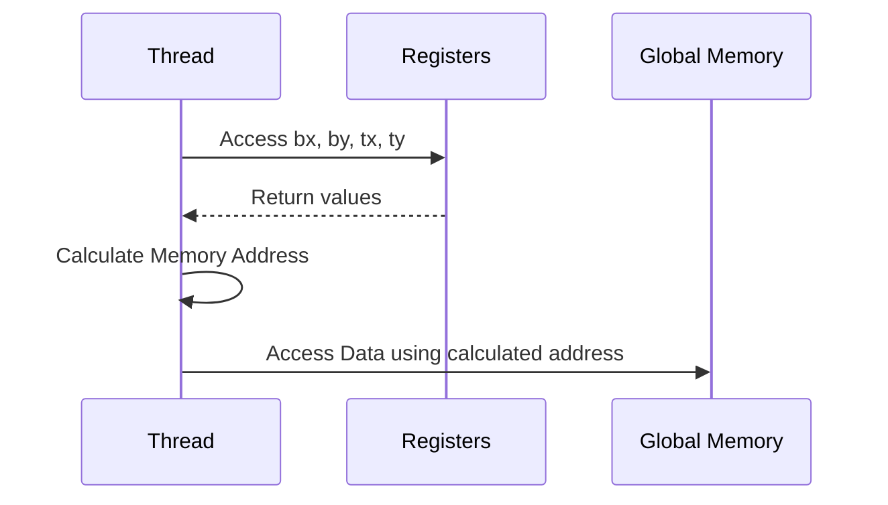
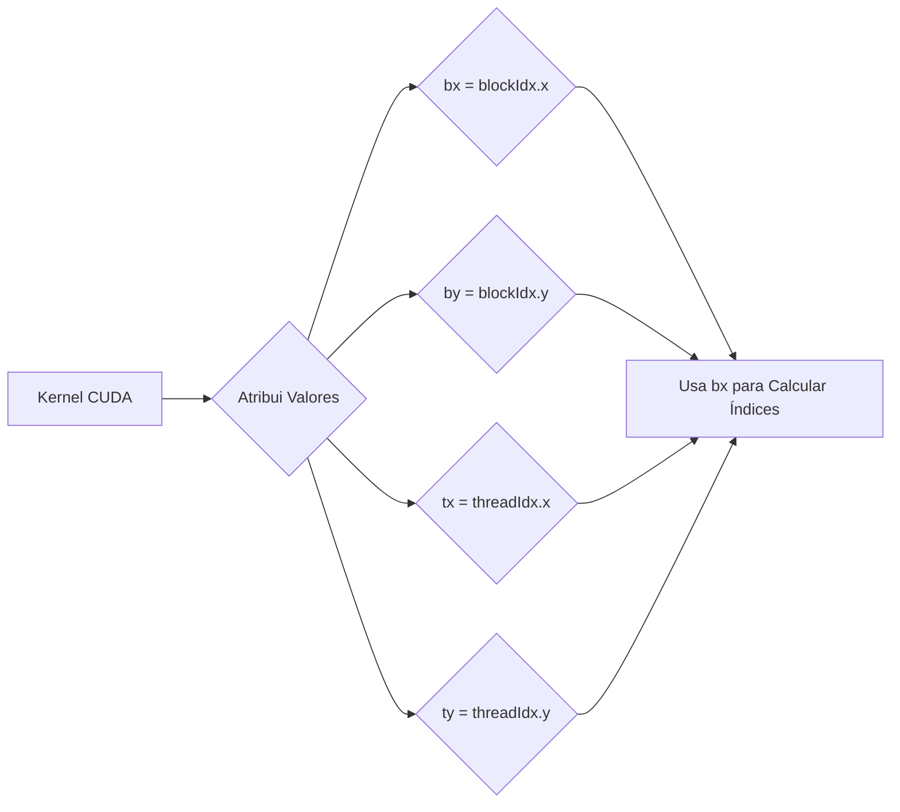
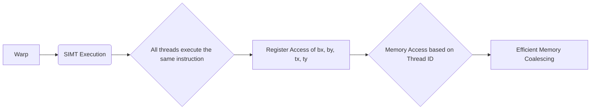

Okay, I've analyzed the text and added Mermaid diagrams to enhance the explanation of the concepts. Here's the enhanced text:

## Variáveis de Registrador `bx`, `by`, `tx` e `ty`: Acesso Rápido aos Identificadores de Threads e Blocos em CUDA

### Introdução

Em kernels CUDA, o acesso eficiente aos identificadores de threads (`threadIdx`) e blocos (`blockIdx`) é crucial para o cálculo de índices e para o controle do fluxo de execução. As variáveis `bx`, `by`, `tx` e `ty` são utilizadas para armazenar esses identificadores de forma local em registradores, o que permite acesso rápido e eficiente. Este capítulo explora em detalhes o uso dessas variáveis, como os identificadores de thread e bloco são armazenados em registradores, e como esse acesso rápido é fundamental para o cálculo de índices e otimização de desempenho em kernels CUDA.

### Armazenamento de Identificadores em Registradores

Em um kernel CUDA, os identificadores de threads e blocos (`threadIdx` e `blockIdx`) são informações que são frequentemente acessadas por cada thread para determinar qual porção dos dados ela deve processar. Para garantir um acesso rápido a essas informações, elas são armazenadas em registradores através das variáveis `bx`, `by`, `tx` e `ty`, conforme ilustrado na Figura 5.12 do contexto.

**Conceito 1: Armazenamento de `threadIdx` e `blockIdx`**

As variáveis `bx`, `by`, `tx` e `ty` são usadas para armazenar valores de `threadIdx` e `blockIdx` em registradores, o que garante acesso rápido e local a essas variáveis.

**Lemma 1:** *As variáveis `bx`, `by`, `tx` e `ty` armazenam os valores de `blockIdx.x`, `blockIdx.y`, `threadIdx.x`, e `threadIdx.y`, respectivamente, em registradores, para acesso rápido por cada thread durante a execução do kernel.*

*Prova:* A atribuição dos valores de `blockIdx` e `threadIdx` nas variáveis faz com que o valor seja acessível por registradores. $\blacksquare$

**Conceito 2: Variáveis Automáticas em Registradores**

As variáveis `bx`, `by`, `tx` e `ty` são geralmente declaradas como variáveis automáticas dentro do kernel, o que significa que o compilador aloca automaticamente registradores para armazená-las. Variáveis automáticas em CUDA são, geralmente, armazenadas em registradores.

**Corolário 1:** *O uso de variáveis automáticas para armazenar os identificadores `threadIdx` e `blockIdx` garante que essas informações sejam acessadas de forma eficiente, já que o acesso a registradores é muito mais rápido do que o acesso a outras formas de memória.*

*Derivação:* O uso de registradores para armazenar essas variáveis garante o acesso rápido a informações que são utilizadas com frequência. $\blacksquare$

### Acesso Rápido e Local aos Identificadores

O armazenamento dos identificadores de threads e blocos em registradores permite um acesso rápido e local a essas informações. Como os registradores são a forma de memória mais rápida, com a menor latência, o acesso a essas variáveis é praticamente imediato. Isso é crucial para o desempenho de kernels CUDA, onde o acesso a esses identificadores é feito com frequência para calcular endereços de memória e controlar o fluxo de execução.

**Conceito 3: Vantagens do Acesso a Registradores**

O acesso a registradores é muito rápido e eficiente, o que reduz o tempo de processamento do kernel.

**Lemma 2:** *O armazenamento das variáveis `bx`, `by`, `tx` e `ty` em registradores permite um acesso rápido e local aos identificadores de thread e bloco, melhorando o desempenho do kernel.*

*Prova:* Os registradores são a forma de memória mais rápida do device CUDA. $\blacksquare$

**Conceito 4: Evitando Acessos Desnecessários a Memória**

Ao utilizar registradores para armazenar os identificadores, o kernel evita a necessidade de acessar esses identificadores a partir da memória global, que seria muito mais lenta. Isso contribui para a redução do tráfego da memória global, e permite maior tempo de processamento por parte do processador.

**Corolário 2:** *O uso de registradores para os identificadores `threadIdx` e `blockIdx` evita acessos desnecessários à memória global e melhora o desempenho do kernel.*

*Derivação:* A redução do uso da memória global, que possui maior latência, leva a um ganho de performance. $\blacksquare$

### Utilização para Cálculo de Índices

As variáveis `bx`, `by`, `tx` e `ty` são utilizadas para calcular os índices dos elementos das matrizes de entrada e da matriz resultante que cada thread deve processar. Esses cálculos de índices são realizados com frequência dentro dos kernels, de forma que o acesso rápido às informações da thread e bloco é fundamental para a performance do kernel. O tempo de acesso a essas variáveis é crucial, já que elas são utilizadas em diversos cálculos, como o cálculo da posição da thread dentro do bloco, ou o cálculo da posição do elemento a ser processado.

**Conceito 5: Cálculo de Índices para Acesso à Memória**

As variáveis `bx`, `by`, `tx`, e `ty` são utilizadas para calcular os índices das matrizes que serão usadas por cada thread do kernel.

**Lemma 3:** *O acesso rápido aos identificadores de thread e bloco, através das variáveis `bx`, `by`, `tx` e `ty`, é essencial para a eficiente computação dos índices de memória em kernels CUDA.*

*Prova:* Os índices das matrizes são calculados a partir de `threadIdx` e `blockIdx`. $\blacksquare$

### Controle de Fluxo de Execução

Além do cálculo de índices, as variáveis `bx`, `by`, `tx` e `ty` podem ser utilizadas para controlar o fluxo de execução de um kernel. Por exemplo, elas podem ser utilizadas em declarações condicionais (`if` e `else`) para que diferentes threads sigam diferentes caminhos de execução. No entanto, o uso de variáveis locais (como `tx` e `ty`) em condicionais, pode levar a *warp divergence*, o que pode degradar a performance.

**Conceito 6: Controle de Fluxo do Kernel**

As variáveis `bx`, `by`, `tx` e `ty` podem ser utilizadas para controlar o fluxo de execução de um kernel.

**Corolário 3:** *As variáveis `bx`, `by`, `tx` e `ty`, além de calcular os índices para o acesso à memória, também servem para controlar o fluxo de execução do kernel, utilizando condicionais de forma eficiente.*

*Derivação:* O uso dos valores de `threadIdx` e `blockIdx` nas condicionais, podem definir o comportamento de cada thread, de forma independente. $\blacksquare$

### Diagrama Detalhado das Variáveis de Registrador

**Explicação:** O diagrama demonstra como os valores de `blockIdx` e `threadIdx` são armazenados em registradores e como esses valores são usados para calcular os índices de acesso às matrizes.

### Análise Matemática do Uso de Registradores

Podemos representar matematicamente a vantagem de utilizar registradores para armazenar os valores de identificadores, considerando os tempos de acesso à memória.

Suponha que:

*   $T_{reg}$ seja o tempo de acesso a um registrador.
*   $T_{global}$ seja o tempo de acesso à memória global.
*   $N$ seja o número de vezes que o `blockIdx` e `threadIdx` são acessados.

O tempo total de acesso à memória sem usar registradores seria:

$$
T_{total\_sem} = N \times T_{global}
$$

O tempo total de acesso à memória usando registradores seria:

$$
T_{total\_com} = N \times T_{reg}
$$

Como $T_{reg} << T_{global}$, o tempo de acesso a memória com o uso de registradores é muito menor.

**Lemma 4:** *A utilização de registradores para armazenar os valores de `blockIdx` e `threadIdx` reduz o tempo total de acesso a essas variáveis, devido à baixa latência dos registradores.*

*Prova:* A relação $T_{reg} << T_{global}$ demonstra que o tempo de acesso a registradores é muito menor que o tempo de acesso a memória global. $\blacksquare$

**Corolário 4:** *Kernels CUDA que utilizam registradores para armazenar os valores de `blockIdx` e `threadIdx` tendem a ter uma performance maior, pois o acesso a essas variáveis é feito de forma muito mais rápida.*

*Derivação:* A redução do tempo de acesso as variáveis através do uso de registradores aumenta a eficiência e a performance. $\blacksquare$

### Pergunta Teórica Avançada

**Como a arquitetura SIMT (Single Instruction, Multiple Threads) e o escalonamento de *warps* afetam o uso das variáveis `bx`, `by`, `tx` e `ty` dentro de um kernel CUDA, e como o programador pode planejar o código para maximizar a eficiência do acesso a esses valores?**

**Resposta:**

A arquitetura SIMT e o escalonamento de *warps* em um Streaming Multiprocessor (SM) afetam diretamente o uso das variáveis `bx`, `by`, `tx` e `ty` dentro de um kernel CUDA, e o programador pode planejar o código para maximizar a eficiência do acesso a esses valores da seguinte forma:

*   **Arquitetura SIMT:** Em uma arquitetura SIMT, threads são agrupadas em *warps*, e todas as threads do warp executam a mesma instrução ao mesmo tempo. O acesso a `threadIdx` e `blockIdx` é diferente para cada thread do mesmo *warp*. Em uma arquitetura SIMT, é importante que os cálculos com `threadIdx`, `blockIdx` sejam feitos com o uso de registradores, para que a execução seja feita de forma rápida e eficiente para todos os threads do *warp*.
*   **Escalonamento de Warps:** O escalonador de *warps* do SM decide qual *warp* irá executar em seguida. É importante que a computação seja planejada para que as threads do *warp* não necessitem de dados que dependem de cálculos de outras threads, para evitar *stalls* e que o escalonador tenha que mudar a execução para outro warp.
*  **Uso de Registradores:** Os valores de `threadIdx` e `blockIdx`, armazenados nas variáveis `bx`, `by`, `tx` e `ty`, são armazenados em registradores, e são acessados de forma muito rápida por todas as threads do *warp*, e essa característica da arquitetura deve ser usada a favor do kernel. O uso de registradores para essas variáveis possibilita o acesso eficiente aos dados necessários para cada thread do *warp*.
*  **Layout dos Dados:** É fundamental garantir que o acesso aos dados ocorra de forma contígua para evitar que o escalonador necessite de um número elevado de trocas de *warp* durante a execução, e o uso dos valores de `threadIdx` e `blockIdx` é fundamental para mapear as threads aos dados. O acesso aos dados deve ser otimizado para cada *warp* de forma a utilizar o padrão de acesso para que os acessos sejam coalescidos na memória global, e que a memória compartilhada seja utilizada de forma eficiente.

**Otimização do Código:** O programador pode usar os seguintes métodos para a otimização do código:

*  **Evitar Uso Condicional:** Evitar o uso de condicionais com variáveis que dependem de `threadIdx` ou `blockIdx`, para que o fluxo de execução seja o mesmo para todas as threads do *warp*.
*  **Utilizar Cálculo de Índices Otimizado:** Utilizar cálculo de índices que reduza o número de operações, para diminuir o tempo de execução das instruções e o número de registradores usados em cada thread.
*   **Planejar o Acesso a Memória:** O acesso a memória deve ser planejado para que os dados da memória global e compartilhada sejam carregados corretamente, utilizando os valores de `threadIdx` e `blockIdx` de forma eficiente, para garantir a coalescência dos acessos.

**Lemma 6:** *A arquitetura SIMT e o escalonamento de warps afetam o uso das variáveis `bx`, `by`, `tx` e `ty` dentro de um kernel CUDA, e um planejamento adequado do código para o uso dos identificadores de thread e bloco é essencial para maximizar a eficiência do kernel.*

*Prova:* A organização da execução das threads pela arquitetura SIMT e o escalonamento de *warps* têm um impacto direto na performance dos acessos a memória. $\blacksquare$

**Corolário 5:** *A otimização de kernels CUDA deve considerar a arquitetura SIMT, o escalonamento dos *warps* e o uso de registradores para otimizar o uso das variáveis `bx`, `by`, `tx` e `ty` e o acesso à memória, de forma a obter a melhor performance possível.*

*Derivação:* A arquitetura do hardware deve ser considerada durante a escrita do código do kernel, para que os seus recursos sejam usados de forma correta e eficiente. $\blacksquare$

### Conclusão

As variáveis `bx`, `by`, `tx` e `ty` são fundamentais em kernels CUDA, pois permitem que cada thread tenha acesso rápido aos seus identificadores de bloco e thread. Ao armazenar esses identificadores em registradores, o kernel consegue evitar acessos à memória global e otimizar o cálculo de índices e o controle do fluxo de execução. A compreensão do uso adequado dessas variáveis é essencial para o desenvolvimento de aplicações CUDA eficientes e de alto desempenho.

### Referências

[^11]: "Lines 3 and 4 save the threadIdx and blockIdx values into automatic variables and thus into registers for fast access. Recall that automatic" *(Trecho do Capítulo 5, página 112)*

**Deseja que eu continue com as próximas seções?**
