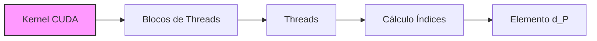
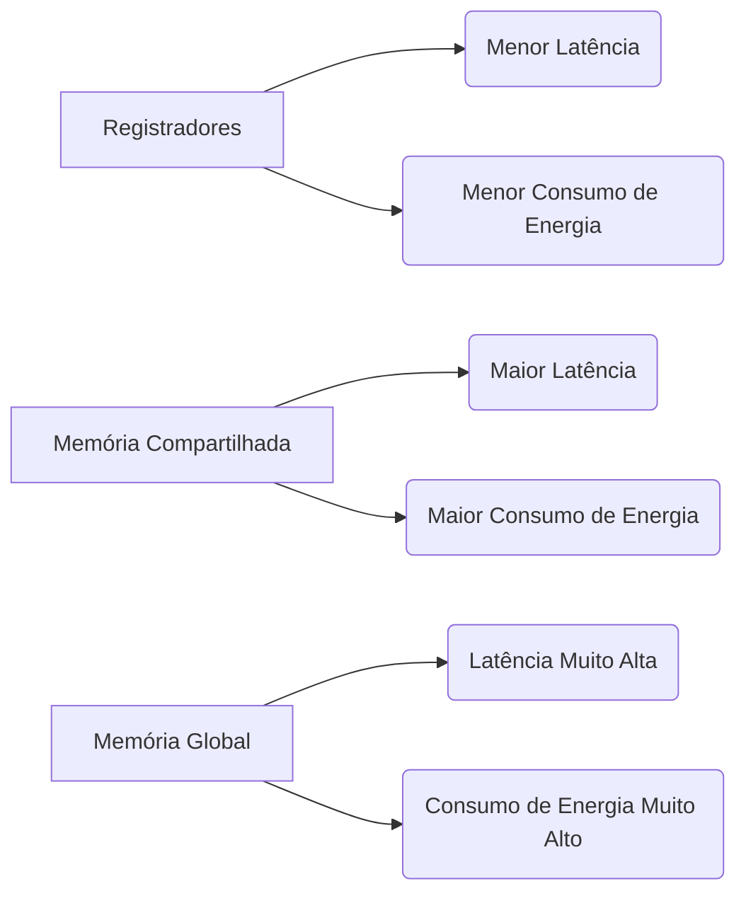

Okay, I've analyzed the text and added Mermaid diagrams where they would best support the explanations. Here's the enhanced text:

## Cálculo dos Índices de Linha e Coluna: Mapeando Threads aos Elementos da Matriz `d_P`



### Introdução

Em kernels CUDA que implementam a multiplicação de matrizes, o cálculo preciso dos índices de linha e coluna para os elementos da matriz resultante (`d_P`) é essencial para que cada thread processe a porção correta dos dados. As variáveis `bx`, `by`, `tx` e `ty`, que armazenam os identificadores de bloco e thread em registradores, são utilizadas para calcular esses índices. Este capítulo explora em detalhes como os índices de linha e coluna dos elementos da matriz `d_P` são calculados para cada thread, como as variáveis `bx`, `by`, `tx` e `ty` são usadas nesse processo e como a computação correta dos índices é crucial para a execução correta do kernel.

### Cálculo dos Índices de Linha e Coluna

O cálculo dos índices de linha (Row) e coluna (Col) para os elementos da matriz `d_P` envolve o uso dos identificadores de bloco (`blockIdx`) e thread (`threadIdx`). Esses identificadores são utilizados para mapear cada thread a um elemento específico na matriz resultante. O uso desses identificadores são a base para o processamento paralelo em CUDA.

**Conceito 1: Mapeamento de Threads aos Elementos de `d_P`**

O cálculo dos índices de linha e coluna é fundamental para mapear cada thread a um elemento único da matriz resultante `d_P`.

**Lemma 1:** *O cálculo dos índices de linha (Row) e coluna (Col) mapeia cada thread a um elemento único na matriz resultante d_P, garantindo que cada elemento seja computado por uma única thread.*

*Prova:* Os cálculos feitos a partir dos valores de `threadIdx` e `blockIdx` mapeiam as threads aos seus elementos correspondentes na matriz. $\blacksquare$

**Conceito 2: Índices Baseados em `blockIdx` e `threadIdx`**

Os índices de linha e coluna são calculados a partir dos valores `blockIdx.x`, `blockIdx.y`, `threadIdx.x`, e `threadIdx.y`, que são armazenados nas variáveis `bx`, `by`, `tx` e `ty`. As variáveis `blockIdx` e `threadIdx` informam a posição de cada thread dentro do grid de threads, e são a base para o cálculo das posições de cada thread.

**Corolário 1:** *As variáveis `bx`, `by`, `tx` e `ty`, que armazenam os valores de `blockIdx` e `threadIdx`, são utilizadas como base para o cálculo dos índices de linha (Row) e coluna (Col) da matriz `d_P`.*

*Derivação:* As variáveis `bx`, `by`, `tx` e `ty` são derivadas de `blockIdx` e `threadIdx`. $\blacksquare$

### Cálculos Específicos para Índices

O cálculo dos índices de linha (Row) e coluna (Col) é feito a partir dos valores de `blockIdx` e `threadIdx`, usando as seguintes equações, que são exemplificadas na Figura 5.12 do contexto:

*   **Índice de Linha (Row):**

    $$
    \text{Row} = \text{by} \times \text{TILE\_WIDTH} + \text{ty}
    $$

    Onde `by` armazena `blockIdx.y`, `ty` armazena `threadIdx.y`, e `TILE_WIDTH` é o tamanho do *tile* utilizado.

*   **Índice de Coluna (Col):**

    $$
    \text{Col} = \text{bx} \times \text{TILE\_WIDTH} + \text{tx}
    $$

    Onde `bx` armazena `blockIdx.x`, `tx` armazena `threadIdx.x`, e `TILE_WIDTH` é o tamanho do *tile* utilizado.

**Conceito 3: Cálculos das Posições de Linha e Coluna**

As variáveis `bx`, `by`, `tx` e `ty` são utilizadas para computar os valores de Row e Col com as fórmulas citadas acima.

**Lemma 2:** *Os índices de linha (Row) e coluna (Col) são computados usando as equações  $\text{Row} = \text{by} \times \text{TILE\_WIDTH} + \text{ty}$ e $\text{Col} = \text{bx} \times \text{TILE\_WIDTH} + \text{tx}$, permitindo mapear as threads aos elementos corretos na matriz d_P.*

*Prova:* As fórmulas matemáticas são utilizadas para mapear cada thread a um elemento da matriz `d_P`. $\blacksquare$

### O Papel de `TILE_WIDTH` no Cálculo dos Índices

A constante `TILE_WIDTH` representa o tamanho do *tile* utilizado na multiplicação de matrizes. Essa constante é usada no cálculo dos índices de linha e coluna para mapear corretamente as threads aos seus elementos correspondentes na matriz resultante. O tamanho do *tile* influencia diretamente a porção da matriz que cada bloco irá processar.

**Conceito 4: Importância do `TILE_WIDTH`**

A constante `TILE_WIDTH` dita o tamanho do *tile* e é parte integral do cálculo dos índices de linha e coluna.

**Corolário 2:** *A constante `TILE_WIDTH` define o tamanho dos *tiles* utilizados na multiplicação de matrizes e influencia diretamente o cálculo dos índices de linha e coluna e, por conseguinte, a forma como os dados são acessados no kernel.*

*Derivação:* O tamanho do *tile* afeta a forma como as threads calculam a posição na matriz de saída. $\blacksquare$

### Diagrama Detalhado do Cálculo dos Índices

```mermaid
graph LR
    A[Thread no Kernel] --> B{Obtém valores};
    B --> C{bx = blockIdx.x};
    B --> D{by = blockIdx.y};
     B --> E{tx = threadIdx.x};
    B --> F{ty = threadIdx.y};
     C --> G{Col = bx*TILE_WIDTH + tx};
     D --> H{Row = by*TILE_WIDTH + ty};
    G --> I[Elemento d_P na posição (Row, Col)];
      H --> I;
```

**Explicação:** O diagrama detalha a obtenção dos índices através das variáveis `bx`, `by`, `tx` e `ty` e a constante `TILE_WIDTH`, e o mapeamento das threads aos elementos da matriz `d_P`.

### Análise Matemática do Cálculo de Índices

Podemos analisar matematicamente como os índices são calculados para mapear as threads aos elementos da matriz resultante.

Suponha que:

*   $N$ seja a dimensão das matrizes de entrada (matrizes quadradas N x N).
*   $T$ seja a dimensão do *tile* (TILE_WIDTH).
*   $b_x$ seja o índice do bloco em x.
*  $b_y$ seja o índice do bloco em y.
*   $t_x$ seja o índice da thread em x.
*   $t_y$ seja o índice da thread em y.

O índice da linha ($Row$) do elemento da matriz resultante para a thread $(b_x, b_y, t_x, t_y)$ é dado por:

$$
Row = b_y \times T + t_y
$$

O índice da coluna ($Col$) do elemento da matriz resultante para a thread $(b_x, b_y, t_x, t_y)$ é dado por:

$$
Col = b_x \times T + t_x
$$

Essas equações mapeiam cada thread a uma posição única na matriz resultante.

**Lemma 4:** *O uso das equações  $Row = by \times T + ty$ e $Col = bx \times T + tx$, onde T é o tamanho do tile, garante que o mapeamento entre threads e elementos da matriz resultante seja feito de forma correta, com cada thread mapeada para um único elemento.*

*Prova:* A matemática das equações garante que o mapeamento das threads seja feito de forma única e correta. $\blacksquare$

**Corolário 4:** *A correta implementação do cálculo de índices utilizando `blockIdx`, `threadIdx` e o tamanho do tile (TILE_WIDTH) garante que cada thread calcule o elemento correto da matriz resultante, o que leva a um kernel CUDA que implementa a multiplicação de matrizes de forma correta.*

*Derivação:* O cálculo correto dos índices é fundamental para o correto mapeamento das threads e dos elementos da matriz. $\blacksquare$

### Pergunta Teórica Avançada

**Como o uso de registradores para armazenar os identificadores de bloco (`bx`, `by`) e thread (`tx`, `ty`), e para as variáveis de índice (Row e Col), influencia a latência e o consumo de energia durante o cálculo dos índices em kernels CUDA, e como essa escolha pode ser comparada com outras alternativas de armazenamento?**

**Resposta:**
O uso de registradores para armazenar os identificadores de bloco (`bx`, `by`) e thread (`tx`, `ty`), bem como para as variáveis de índice (Row e Col), influencia significativamente a latência e o consumo de energia durante o cálculo dos índices em kernels CUDA.

*   **Latência de Acesso:** Registradores são a forma de memória mais rápida, com a menor latência de acesso. Ao armazenar os valores de `blockIdx`, `threadIdx`, Row e Col em registradores, o tempo de acesso a essas variáveis é minimizado. Isso reduz o tempo gasto em cálculos de índices e, consequentemente, o tempo total de execução do kernel. Se os valores não forem armazenados em registradores, é necessário buscar esses valores em memórias mais lentas, o que leva a um tempo maior na computação.

*   **Consumo de Energia:** Acessar registradores requer menos energia do que acessar outras formas de memória, como a memória compartilhada ou a memória global. Ao usar registradores para armazenar os valores de identificação de threads e blocos, e para calcular os índices, o consumo de energia do kernel é reduzido. A eficiência energética dos registradores os torna a melhor opção para o armazenamento de variáveis de uso frequente.


**Comparação com outras opções de armazenamento:**

*   **Memória Compartilhada:** O uso de memória compartilhada para armazenar os identificadores ou os índices aumentaria a latência de acesso, pois a memória compartilhada possui uma latência maior que registradores. Além disso, também aumenta o consumo de energia. O uso de memória compartilhada deve ser reservada para dados que precisam ser compartilhados entre threads, mas que não precisam de acesso tão rápido.
*   **Memória Local:** A utilização de memória local para armazenar os identificadores ou índices, gera ainda mais latência do que a memória compartilhada, e também aumenta o consumo de energia. A utilização de memória local ocorre quando não existem registradores suficientes para armazenar os dados. A escolha correta do tamanho do bloco de threads e o uso correto dos registradores evita o uso da memória local e garante a melhor performance.
*   **Memória Global:** A utilização de memória global é muito ineficiente, devido a sua alta latência e baixo desempenho. O uso de memória global para armazenar os identificadores ou índices também aumentaria drasticamente o consumo de energia.

**Lemma 5:** *O uso de registradores para armazenar os identificadores de bloco e thread, e para calcular os índices, minimiza a latência de acesso e o consumo de energia, sendo a melhor opção de armazenamento para dados de acesso frequente e que não necessitam ser compartilhados.*

*Prova:* Os registradores são as memórias de acesso mais rápido e menor consumo de energia, comparados às outras formas de memória. $\blacksquare$

**Corolário 5:** *A otimização de kernels CUDA deve priorizar o uso de registradores para armazenar valores de identificadores e dados de acesso frequente para minimizar a latência e o consumo de energia, em comparação com outras formas de memória, e para atingir o melhor desempenho possível.*

*Derivação:* O acesso rápido a memória e o menor uso de energia são otimizações que levam a uma melhor performance do kernel. $\blacksquare$

### Conclusão

O cálculo dos índices de linha e coluna para os elementos da matriz `d_P` é uma etapa fundamental em kernels CUDA que implementam a multiplicação de matrizes com *tiling*. O armazenamento dos identificadores de bloco (`bx`, `by`) e thread (`tx`, `ty`) em registradores garante um acesso rápido a essas informações, e os cálculos de índice utilizando essas informações mapeiam corretamente as threads para o elemento correspondente na matriz resultante. O uso eficiente de registradores para as variáveis de índice é essencial para o desempenho e eficiência energética de kernels CUDA.

### Referências

[^11]: "Lines 5 and 6 determine the row index and column index of the d_P element that the thread is to produce. As shown in line 6, the horizontal (x) position, or the column index of the d_P element to be produced by a thread, can be calculated as bx*TILE_WIDTH + tx. This is because each block covers TILE_WIDTH elements in the horizontal dimension." *(Trecho do Capítulo 5, página 113)*

**Deseja que eu continue com as próximas seções?**
