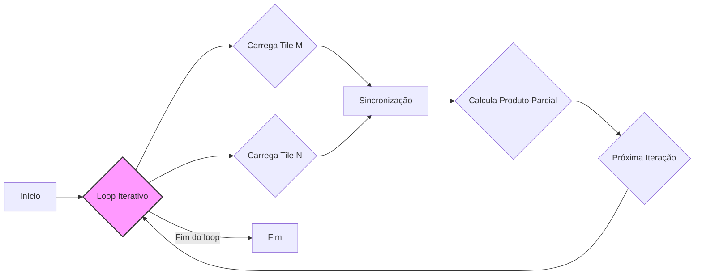
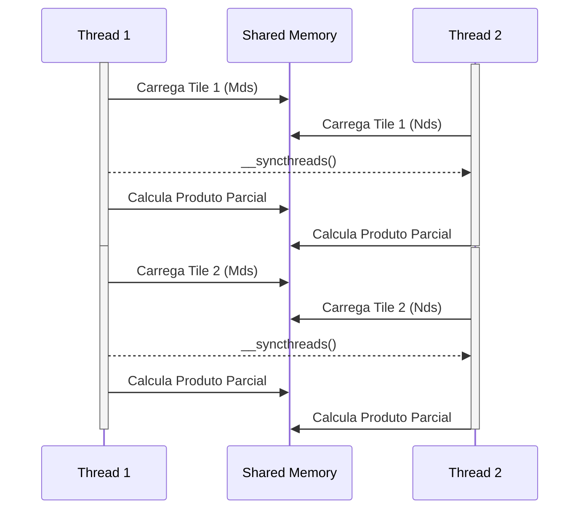
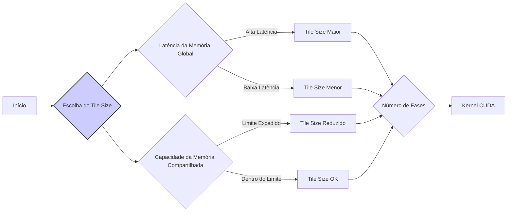

Okay, I've analyzed the text and added Mermaid diagrams to enhance understanding where appropriate. Here's the modified text with the diagrams:

## Iteração em *Loop* e Abordagem Faseada: Processando Matrizes com *Tiles* em Múltiplas Etapas



### Introdução

Na implementação de kernels CUDA que utilizam a estratégia de *tiling* para multiplicação de matrizes, um *loop* é frequentemente utilizado para iterar sobre diferentes fases da computação. Cada iteração desse *loop* corresponde a uma fase em que os *tiles* das matrizes M e N são carregados na memória compartilhada, e uma parte do produto escalar é calculada. Este capítulo explora em detalhes o uso desse *loop* para iterar sobre as fases da computação, como cada iteração corresponde ao carregamento e processamento de *tiles* diferentes e como a abordagem faseada otimiza o uso da memória e do tempo de processamento.

### O *Loop* para Iterar sobre Fases

Em kernels CUDA que utilizam a abordagem faseada para multiplicação de matrizes com *tiling*, um *loop* é utilizado para controlar a iteração sobre as diferentes fases da computação. Cada iteração desse *loop* representa uma fase em que as threads carregam *tiles* específicos das matrizes M e N na memória compartilhada, e executam uma parte do cálculo do produto escalar. A Figura 5.12 do contexto ilustra esse processo.

**Conceito 1: Uso do *Loop* para Iterar sobre Fases**

O *loop* itera sobre as fases do kernel, controlando o carregamento dos *tiles* e a computação dos produtos escalares.

**Lemma 1:** *Um loop é utilizado para controlar a iteração sobre as diferentes fases do kernel CUDA, permitindo o carregamento e processamento de tiles em etapas sequenciais, reutilizando a memória compartilhada.*

*Prova:* O *loop* é o mecanismo que garante que todas as fases sejam executadas. $\blacksquare$

**Conceito 2: Cada Iteração Corresponde a uma Fase**

Cada iteração do *loop* corresponde a uma fase da computação, na qual as threads de um bloco carregam um conjunto específico de *tiles* na memória compartilhada, executam o cálculo de parte do produto escalar e reutilizam a memória compartilhada na próxima fase.

**Corolário 1:** *Cada iteração do loop corresponde a uma fase de cálculo, em que um novo subconjunto de dados das matrizes M e N são processados, garantindo a reutilização da memória compartilhada e minimizando acessos a memória global.*

*Derivação:* O *loop* garante que cada conjunto de dados é processado usando o mesmo mecanismo da abordagem faseada. $\blacksquare$

### Funcionamento do *Loop* e as Fases de Carregamento e Cálculo

Dentro do *loop*, o carregamento colaborativo dos *tiles* das matrizes M e N na memória compartilhada é feito de forma faseada. As threads do bloco trabalham em conjunto para carregar um subconjunto dos *tiles* em cada iteração. Uma barreira de sincronização ( `__syncthreads()`) garante que todas as threads tenham concluído o carregamento antes que o cálculo do produto escalar seja iniciado. Após o cálculo do produto escalar, a mesma área da memória compartilhada será utilizada para carregar o próximo subconjunto de *tiles*.

**Conceito 3: Operações em Cada Fase**

Em cada fase, os dados são carregados, a sincronização é feita e o produto escalar é calculado, antes da próxima fase começar.

**Lemma 2:** *Em cada iteração do loop, as threads executam os passos de carregamento colaborativo dos *tiles* na memória compartilhada, a sincronização para garantir a integridade dos dados e o cálculo da parte correspondente do produto escalar.*

*Prova:* O *loop* executa os mesmos passos para cada fase. $\blacksquare$

**Conceito 4: Reutilização da Memória Compartilhada**

A abordagem faseada utiliza as mesmas variáveis da memória compartilhada (`Mds` e `Nds`) em múltiplas fases do kernel. Os dados de um subconjunto de *tiles* são carregados nessas variáveis, os cálculos são realizados, e na próxima fase, os dados são sobrepostos por novos subconjuntos de *tiles*, reutilizando a mesma região da memória compartilhada.



**Corolário 2:** *A reutilização das variáveis da memória compartilhada em múltiplas fases do loop garante que grandes matrizes possam ser processadas mesmo com a capacidade limitada da memória compartilhada.*

*Derivação:* A reutilização da memória compartilhada reduz a quantidade total de memória necessária, o que possibilita o processamento de grandes volumes de dados. $\blacksquare$

### A Variável de Controle do *Loop*

O *loop* itera sobre as fases da computação com uma variável de controle, geralmente chamada de `m`. Essa variável indica qual subconjunto de *tiles* está sendo processado na fase atual. A variável `m` é utilizada nos cálculos dos endereços de memória global onde os dados dos *tiles* estão armazenados.

**Conceito 5: Variável de Controle do *Loop***

A variável `m` controla o número de iterações do *loop*, e portanto o número de fases do kernel.

**Lemma 3:** *A variável de controle do loop (geralmente `m`) indica o número de fases e é utilizada para calcular os endereços de memória dos *tiles* que serão carregados na memória compartilhada.*

*Prova:* O uso da variável de controle no *loop* itera sobre o número de fases e indica qual *tile* está sendo processado. $\blacksquare$

### Cálculo de Endereços de Memória com `m`

A variável `m` é utilizada para calcular os endereços de memória global dos *tiles* que devem ser carregados na memória compartilhada em cada fase. Esses endereços são utilizados no carregamento colaborativo, onde cada thread calcula o endereço de memória global onde deve buscar sua parte de dados. A variável m é usada para calcular o *offset* do *tile* a ser carregado em cada fase.

**Conceito 6: Uso de `m` no Cálculo de Endereços**

A variável `m` é utilizada para computar o endereço de memória dos *tiles* que precisam ser carregados a cada iteração do *loop*.

**Corolário 3:** *A variável de controle do *loop* (m) é utilizada para calcular os endereços de memória dos *tiles* que serão carregados na memória compartilhada em cada fase da computação, garantindo que cada *tile* seja carregado no momento correto.*

*Derivação:* O valor de `m` incrementa o endereço de forma a acessar um *tile* diferente a cada fase da computação. $\blacksquare$

### Diagrama Detalhado do *Loop* e Abordagem Faseada

```mermaid
graph LR
    A[Início do Loop (m = 0)] --> B{Calcula Endereços com m};
    B --> C{Carrega Tile M na Memória Compartilhada};
    B --> D{Carrega Tile N na Memória Compartilhada};
    C --> E[Sincronização __syncthreads()];
    D --> E;
    E --> F[Calcula Produto Escalar Parcial];
    F --> G{m++};
    G -- "m < Número de Fases" --> B;
    G -- "m >= Número de Fases" --> H[Fim do Loop];
```

**Explicação:** O diagrama mostra o fluxo de execução do *loop*, com a variável de controle `m` incrementando, e o processo sendo repetido até que todas as fases sejam executadas.

### Análise Matemática do Impacto do *Loop* e da Abordagem Faseada

Para analisar matematicamente o impacto do *loop* na eficiência da multiplicação de matrizes com *tiling*, podemos considerar o seguinte modelo:

Suponha que:

*   $N$ seja a dimensão das matrizes de entrada (matrizes quadradas N x N).
*   $T$ seja a dimensão do *tile* (TILE_WIDTH).
*   $F$ seja o número de fases do *loop*.
* $T_{load}$ seja o tempo de carregamento de um tile.
* $T_{compute}$ seja o tempo de computação do produto escalar parcial para um tile.

O número de fases é dado por:
$$F = \frac{N}{T}$$

O tempo total gasto no processamento dos dados é dado por:

$$
T_{total} = F \times (T_{load} + T_{compute})
$$

Onde, o número de fases ($F$) é proporcional ao inverso do tamanho do *tile*, e o tempo total de execução diminui quando a reutilização de dados é feita da forma mais eficiente possível.

**Lemma 4:** *O loop permite que o kernel processe as matrizes em etapas, sendo cada etapa um carregamento de dados e uma computação. A reutilização da memória compartilhada através do loop permite otimizar o uso da memória e o desempenho do kernel.*

*Prova:* A divisão do kernel em etapas de processamento e o uso do *loop* para controlar as etapas permite o processamento de matrizes maiores do que o tamanho da memória disponível. $\blacksquare$

**Corolário 4:** *Kernels CUDA que utilizam um loop para iterar sobre as fases da computação de matrizes com tiling tendem a ter maior desempenho, pois utilizam a memória compartilhada de forma mais eficiente e reduzem o número de acessos à memória global.*

*Derivação:* O uso do *loop* garante que a reutilização da memória seja feita de forma eficiente, o que resulta em menor tempo de acesso a memória e consequentemente maior performance. $\blacksquare$

### Pergunta Teórica Avançada

**Como a latência da memória global e a capacidade da memória compartilhada influenciam a escolha do tamanho do *tile* (`TILE_WIDTH`) e, por consequência, o número de fases (`m`) em um kernel CUDA de multiplicação de matrizes com *tiling*?**

**Resposta:**

A latência da memória global e a capacidade da memória compartilhada são dois fatores críticos que influenciam diretamente a escolha do tamanho do *tile* (`TILE_WIDTH`) e, por consequência, o número de fases (`m`) em um kernel CUDA de multiplicação de matrizes com *tiling*.

*   **Latência da Memória Global:** A latência da memória global é o tempo necessário para acessar dados nessa memória. O tamanho do *tile* influencia o número de acessos à memória global. Tiles menores levam a mais fases, e portanto mais acessos à memória global, e tiles maiores diminuem o número de acessos, mas podem levar a outros problemas, como aumento do consumo de registradores. Se a latência da memória global for alta, é preferível usar *tiles* maiores para reduzir o número de acessos à memória global, e por consequência, reduzir o tempo de espera pelos dados a serem carregados.

*   **Capacidade da Memória Compartilhada:** A capacidade da memória compartilhada é limitada. O tamanho do *tile* deve ser escolhido de forma que todos os dados necessários para a computação caibam na memória compartilhada. *Tiles* muito grandes podem exceder a capacidade da memória compartilhada, levando a erros de compilação e execução. É importante escolher um tamanho de *tile* que utilize a capacidade da memória compartilhada de forma eficiente, sem que a memória compartilhada seja o fator limitante da performance.

*  **Número de Fases e *Loop*:** O número de fases ($F$) é determinado pelo tamanho do *tile*: $F = \frac{N}{T}$ , onde N é a dimensão da matriz, e T é o tamanho do *tile*. A variável do *loop* (`m`) varia entre 0 e F-1. Um número menor de fases diminui o número de iterações do *loop*, o que reduz o número de vezes que a memória compartilhada precisa ser acessada, o que pode ser desejável em algumas arquiteturas. No entanto, menos fases exigem *tiles* maiores, o que pode gerar outros problemas como maior uso de registradores e conflitos de acesso a memória compartilhada.



**Equilíbrio:** O programador deve considerar todos os fatores para escolher o tamanho do *tile* apropriado para o hardware específico.

*   **Compensar a Latência:** Escolher *tiles* maiores para compensar a alta latência da memória global e reduzir o número de acessos.
*   **Respeitar a Memória Compartilhada:** Escolher *tiles* que respeitem o limite da memória compartilhada para que o processamento seja feito sem *spilling* ou erros de alocação.
*   **Escolher o Número Adequado de Fases:** Escolher o número de fases ideal para o melhor desempenho, considerando o *trade-off* entre a latência da memória global, o número de acessos a memória compartilhada, a utilização de registradores e a ocupação do SM.

**Lemma 6:** *A escolha do tamanho do tile (`TILE_WIDTH`) e o número de fases (`m`) na multiplicação de matrizes com tiling depende da latência da memória global e da capacidade da memória compartilhada, e deve ser cuidadosamente planejada para obter a melhor performance.*

*Prova:* O tamanho do *tile* impacta a utilização da memória compartilhada e o número de acessos a memória global. $\blacksquare$

**Corolário 5:** *A otimização de kernels CUDA que utilizam multiplicação de matrizes com tiling exige a escolha cuidadosa do tamanho do tile, que por consequência define o número de fases, considerando tanto a latência da memória global quanto a capacidade e características da memória compartilhada, e o melhor balanceamento entre esses fatores para atingir o melhor desempenho possível.*

*Derivação:* A combinação correta da escolha do tamanho do tile e do número de fases, considerando as características do device, permite a melhor performance. $\blacksquare$

### Conclusão

O uso de um *loop* para iterar sobre as fases da computação na multiplicação de matrizes com *tiling* é uma técnica fundamental para otimizar o uso da memória compartilhada, da memória global, e aumentar o desempenho. A reutilização de variáveis na memória compartilhada, a sincronização das threads e a computação dos produtos escalares em cada fase são os principais aspectos do kernel e são otimizados pelo planejamento cuidadoso do uso do *loop*. A escolha do tamanho do *tile* e do número de fases deve ser feita de acordo com as características do hardware e as necessidades do problema, buscando o equilíbrio ideal entre a localidade de acesso à memória, o uso da memória compartilhada, a latência da memória global e a ocupação do SM.

### Referências

[^11]: "Line 8 of Figure 5.12 marks the beginning of the loop that iterates through all the phases of calculating the final d_P element. Each iteration of the loop corresponds to one phase of the calculation shown in Figure 5.11." *(Trecho do Capítulo 5, página 113)*

**Deseja que eu continue com as próximas seções?**
