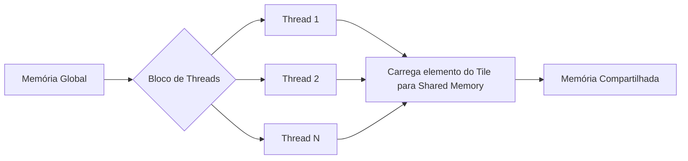
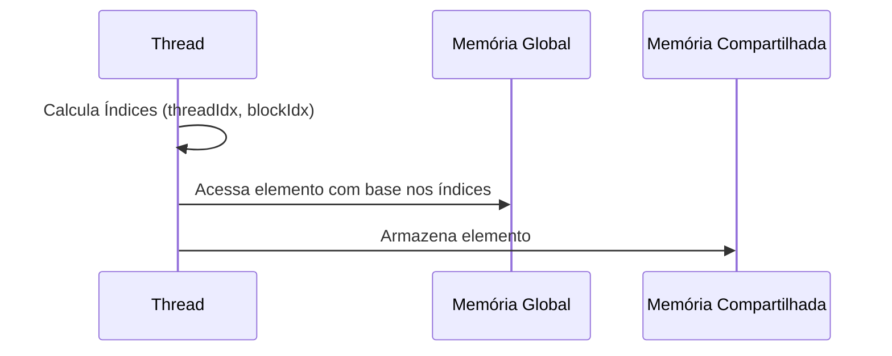
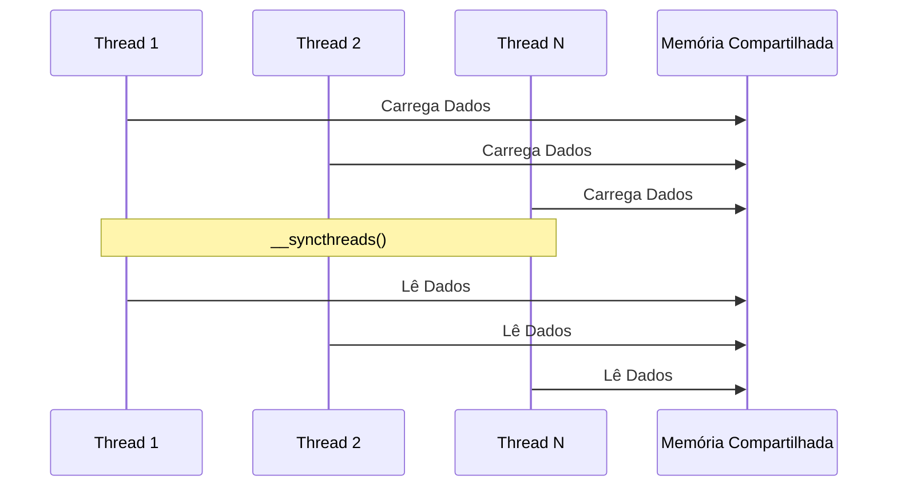
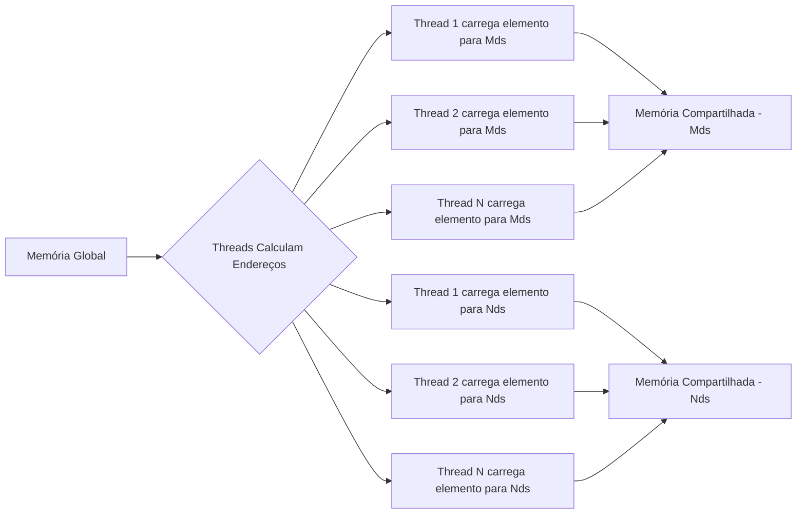

Okay, I've added Mermaid diagrams to the provided text to enhance the explanation of collaborative tile loading in CUDA. Here's the enhanced version:

## Carregamento Colaborativo de *Tiles* em CUDA: Dividindo o Trabalho entre as Threads

### Introdução

Na implementação da multiplicação de matrizes com *tiling* em CUDA, o carregamento dos *tiles* para a memória compartilhada é uma etapa fundamental para o desempenho. O **carregamento colaborativo de *tiles*** é uma técnica que permite que as threads de um mesmo bloco trabalhem em conjunto para carregar os elementos dos *tiles* na memória compartilhada. Este capítulo explora em detalhes o aspecto colaborativo desse processo, como cada thread contribui carregando um elemento específico do *tile* e como essa forma de carregamento garante o uso eficiente da memória compartilhada e a redução de acessos à memória global.

### Divisão do Trabalho entre as Threads

No carregamento colaborativo de *tiles*, o trabalho de carregar os elementos do *tile* é dividido entre as threads de um mesmo bloco. Em vez de cada thread carregar todos os elementos do *tile*, cada thread carrega apenas um elemento, ou uma pequena porção de dados, que é então armazenado na memória compartilhada. Essa divisão do trabalho permite que o carregamento do *tile* seja realizado de forma mais eficiente e em paralelo pelas diferentes threads do bloco.

**Conceito 1: Divisão do Trabalho no Carregamento de Tiles**

O carregamento de cada *tile* é dividido entre as threads, de forma que cada thread carregue apenas uma pequena porção dos dados.

**Lemma 1:** *No carregamento colaborativo de *tiles* em CUDA, o trabalho de carregar os dados na memória compartilhada é dividido entre as threads de um bloco, de forma que cada thread contribui com o carregamento de um elemento.*

*Prova:* A colaboração das threads possibilita que um *tile* seja carregado por várias threads. $\blacksquare$

**Conceito 2: Carregamento de um Elemento por Thread**

Em cada etapa do carregamento colaborativo de *tiles*, cada thread é responsável por carregar um único elemento da matriz M e um elemento da matriz N, utilizando seus identificadores de thread e bloco para determinar quais elementos devem ser carregados.

**Corolário 1:** *O carregamento colaborativo garante que cada thread carregue uma porção dos dados do tile, evitando que uma única thread seja responsável por carregar todos os elementos.*

*Derivação:* A colaboração das threads garante que o carregamento do *tile* ocorra de forma paralela. $\blacksquare$

### Determinação dos Índices dos Elementos

Para que cada thread carregue o elemento correto, o processo de carregamento colaborativo utiliza os valores `threadIdx` e `blockIdx` que cada thread possui para calcular o endereço da memória global e da memória compartilhada onde o dado correto deve ser carregado. Como cada thread tem seu identificador único, cada thread carregará seu elemento correspondente.

**Conceito 3: Cálculo dos Índices para Carregamento**

Os identificadores de thread e bloco são utilizados para calcular os índices dos elementos que cada thread deve carregar.

**Lemma 2:** *As threads usam seus identificadores de bloco (`blockIdx`) e thread (`threadIdx`), armazenados nas variáveis `bx`, `by`, `tx` e `ty`, para calcular os endereços de memória global e compartilhada dos elementos que devem ser carregados no carregamento colaborativo.*

*Prova:* Os identificadores únicos de cada thread são utilizados para calcular o endereço de memória de cada elemento. $\blacksquare$

### As Variáveis `Mds` e `Nds` como Destino do Carregamento

Os elementos carregados pelas threads são armazenados nas variáveis `Mds` e `Nds` na memória compartilhada. Essas variáveis são utilizadas para que as threads realizem o cálculo do produto escalar, depois que todos os elementos dos *tiles* forem carregados. Como a memória compartilhada é uma memória on-chip, o tempo de acesso é muito menor comparado a memória global.

**Conceito 4: Armazenamento em `Mds` e `Nds`**

Os dados são carregados na memória compartilhada nas variáveis `Mds` e `Nds`, para posterior utilização pelas threads do bloco.

**Corolário 2:** *No carregamento colaborativo, cada thread carrega sua porção de dados na memória compartilhada nas variáveis Mds e Nds, que serão utilizadas posteriormente no cálculo do produto escalar.*

*Derivação:* As variáveis `Mds` e `Nds` são o destino dos dados carregados colaborativamente. $\blacksquare$

### O Uso Eficiente da Memória Compartilhada

O carregamento colaborativo garante que a memória compartilhada seja utilizada de forma eficiente. Ao invés de cada thread carregar seu próprio subconjunto de dados, cada thread carrega uma pequena porção de cada *tile*, o que evita que haja partes da memória compartilhada ociosas, e garante que a memória seja utilizada para carregar uma cópia do *tile*, que pode ser utilizado por todos os threads. A sincronização por meio de `__syncthreads()` garante que todas as threads terminem de carregar os elementos antes que o cálculo do produto escalar seja iniciado.

**Conceito 5: Uso Eficiente da Memória Compartilhada**

O carregamento colaborativo garante que a memória compartilhada seja utilizada de forma eficiente, armazenando os dados utilizados por várias threads.

**Lemma 3:** *O carregamento colaborativo de *tiles* garante um uso eficiente da memória compartilhada, pois cada thread contribui para preencher a memória compartilhada, e os dados são carregados uma única vez, antes de serem reutilizados pelas threads.*

*Prova:* O carregamento da memória compartilhada de forma colaborativa evita que a memória seja subutilizada. $\blacksquare$

### Sincronização e a Integridade dos Dados

A sincronização usando a função `__syncthreads()` garante que o processo de carregamento dos dados seja feito de forma correta. As threads precisam sincronizar antes de computar o produto escalar. Se alguma thread iniciar o cálculo sem que a memória compartilhada esteja completamente carregada, os resultados podem ser incorretos ou inconsistentes.

**Conceito 6: Sincronização para Garantir a Integridade dos Dados**

A sincronização é necessária para que todas as threads carreguem seus dados antes que o produto escalar seja iniciado.

**Corolário 3:** *A sincronização entre as threads usando `__syncthreads()` é essencial para garantir que todos os elementos de um tile tenham sido carregados corretamente na memória compartilhada antes que o cálculo do produto escalar seja iniciado, o que garante a integridade dos dados e a correção dos resultados.*

*Derivação:* A sincronização impede que uma thread acesse dados que ainda não foram carregados na memória compartilhada. $\blacksquare$

### Diagrama Detalhado do Carregamento Colaborativo

**Explicação:** O diagrama ilustra como diferentes threads carregam diferentes porções do *tile* nas variáveis `Mds` e `Nds` na memória compartilhada.

### Análise Matemática do Carregamento Colaborativo

Podemos analisar matematicamente a eficiência do carregamento colaborativo de *tiles* da seguinte forma:

Suponha que:

*   $N$ seja o número total de elementos de um *tile*.
*   $P$ seja o número de threads no bloco.

O número de elementos que cada thread carrega com o carregamento colaborativo é:

$$
\frac{N}{P}
$$

Se cada thread precisasse carregar todos os elementos de um *tile* sem carregamento colaborativo, o número total de acessos à memória global seria:
$$ N \times P $$

Com o carregamento colaborativo, o número total de acessos a memória global é:

$$N $$

A redução no número de acessos é:
$$
\frac{N \times P}{N} = P
$$

O número de acessos a memória global é reduzido por um fator igual ao número de threads, demonstrando que o carregamento colaborativo permite uma utilização mais eficiente da largura de banda da memória global.

**Lemma 4:** *O carregamento colaborativo de *tiles* divide o trabalho entre as threads, de forma que cada thread carregue somente uma parte dos dados, o que reduz o número de acessos à memória global em um fator proporcional ao número de threads que colaboram.*

*Prova:* O número de acessos a memória global é reduzido por um fator igual ao número de threads colaborando. $\blacksquare$

**Corolário 4:** *Kernels CUDA que utilizam o carregamento colaborativo de *tiles* são mais eficientes no uso da memória global e atingem maior desempenho, devido a maior eficiência da utilização da largura de banda da memória.*

*Derivação:* A redução de acessos a memória global leva a um uso mais eficiente da largura de banda da memória, e um aumento de performance do kernel. $\blacksquare$

### Pergunta Teórica Avançada

**Como o uso de memória compartilhada para armazenar *tiles* das matrizes M e N afeta a utilização da cache L1 e a ocorrência de *bank conflicts*, e como o programador deve considerar esses fatores para otimizar o desempenho do kernel?**

**Resposta:**
O uso de memória compartilhada para armazenar os *tiles* das matrizes M e N afeta diretamente a utilização da cache L1 e a ocorrência de *bank conflicts*, e o programador deve considerar esses fatores para otimizar o desempenho do kernel.

*   **Cache L1:** A cache L1 é um cache *on-chip* que armazena os dados da memória global que são acessados com frequência. Quando os dados são carregados da memória global para a memória compartilhada, eles também são armazenados na cache L1. O acesso a memória compartilhada é mais rápido do que o acesso ao cache L1. Se o programador usar de forma eficiente a memória compartilhada e carregar na memória compartilhada dados que são usados com frequência, o acesso ao cache L1 é reduzido, o que melhora a performance.

*   ***Bank Conflicts*:** A memória compartilhada é dividida em *banks*, que podem ser acessados simultaneamente por threads do mesmo warp. Se múltiplas threads de um mesmo warp acessam o mesmo *bank* de memória, um *bank conflict* ocorre, o que serializa o acesso e reduz o desempenho do kernel. É importante que o programador escolha um padrão de acesso a memória compartilhada que evite ou diminua o número de *bank conflicts*.

**Otimização da Memória Compartilhada:** Para otimizar o uso da memória compartilhada e minimizar os *bank conflicts*, o programador deve:

*   **Escolher Tamanho Adequado do Tile:** O tamanho do *tile* deve ser escolhido de forma que ele caiba na memória compartilhada disponível, mas também que minimize o uso da cache L1.
*   **Layout Otimizado dos Dados:** O layout dos dados na memória compartilhada deve ser escolhido de forma que o acesso seja coalescido, e que o acesso a diferentes *banks* ocorra de forma uniforme para todas as threads do mesmo *warp*, reduzindo o número de *bank conflicts*.
*   **Utilizar o Padding:** A técnica de *padding* é usada para alocar *tiles* na memória de forma que os acessos pelas threads sejam distribuídos entre os diferentes bancos da memória compartilhada, reduzindo os *bank conflicts*.
*  **Analisar o Padrão de Acesso:** O programador deve analisar cuidadosamente o padrão de acesso à memória de cada thread para evitar *bank conflicts*, e garantir que a leitura na memória compartilhada seja eficiente.

**Lemma 5:** *O uso da memória compartilhada para armazenar os tiles das matrizes M e N afeta a utilização da cache L1 e a ocorrência de *bank conflicts*, e o programador deve planejar cuidadosamente o uso da memória compartilhada para maximizar a eficiência e minimizar a latência do acesso.*

*Prova:* A forma como a memória compartilhada é utilizada tem impacto na performance. $\blacksquare$

**Corolário 5:** *A otimização de kernels CUDA que utilizam memória compartilhada para multiplicação de matrizes com tiling deve considerar a escolha adequada do tamanho do tile, o layout dos dados na memória compartilhada e o padrão de acesso, para otimizar o uso do cache L1, minimizar bank conflicts e maximizar o desempenho do kernel.*

*Derivação:* Os fatores apresentados afetam diretamente o desempenho do kernel, e devem ser considerados para otimizar a performance. $\blacksquare$

### Conclusão

O carregamento colaborativo de *tiles* é uma técnica essencial para o desenvolvimento de kernels CUDA eficientes na multiplicação de matrizes. Ao dividir o trabalho de carregamento entre as threads de um bloco, cada thread carregando um elemento específico, e utilizar a sincronização e a memória compartilhada, o carregamento colaborativo reduz o número de acessos à memória global, aumenta o CGMA ratio e aumenta o desempenho do kernel. O planejamento do padrão de acesso e a distribuição dos dados na memória compartilhada são elementos fundamentais para garantir um acesso eficiente à memória.

### Referências

[^11]: "In each phase, all threads in a block collaborate to load a tile of M elements and a tile of N elements into the shared memory. This is done by having every thread in a block to load one M element and one N element into the shared memory, as illustrated in Figure 5.11." *(Trecho do Capítulo 5, página 110)*

**Deseja que eu continue com as próximas seções?**
