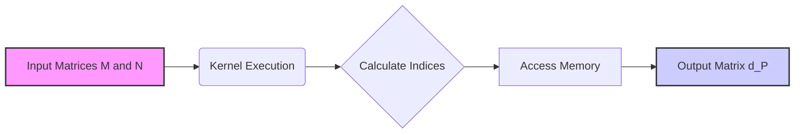
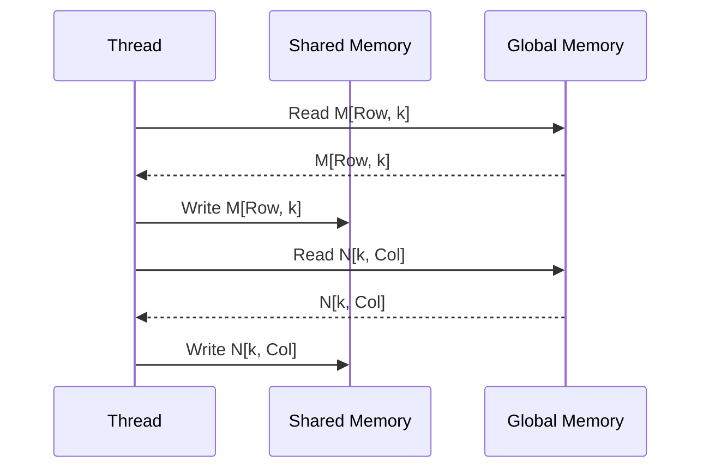

Okay, I've analyzed the text and added Mermaid diagrams to enhance understanding of the concepts. Here's the enhanced text with the diagrams:

## Validação do Cálculo de Endereços: Verificando a Correção com um Exemplo de *Tiles* 2x2



### Introdução

Em kernels CUDA de multiplicação de matrizes com *tiling*, o cálculo correto dos endereços de memória é fundamental para garantir que cada thread acesse a porção de dados correspondente. Uma forma de verificar se o cálculo de endereços está correto é utilizar um exemplo simples, como o caso de *tiles* 2x2, e rastrear o comportamento de cada thread. Este capítulo explora em detalhes como podemos validar o cálculo de endereços utilizando um exemplo de multiplicação de matrizes com *tiles* 2x2, como os índices de linha e coluna são calculados para cada thread e como esses índices se relacionam com os dados correspondentes nas matrizes de entrada e saída.

### Validação do Cálculo de Endereços com um Exemplo Simples

A validação do cálculo de endereços é feita utilizando um exemplo simples de multiplicação de matrizes com *tiles* 2x2. A simplicidade desse exemplo permite acompanhar e verificar manualmente o comportamento de cada thread, garantindo que os cálculos de índices e os acessos à memória estejam corretos.

**Conceito 1: Validação com Exemplo de *Tiles* 2x2**

A validação do cálculo de endereços é feita utilizando um exemplo simples, com *tiles* 2x2, para melhor rastrear o comportamento de cada thread.

**Lemma 1:** *A validação do cálculo de endereços em kernels CUDA é feita através de um exemplo simples com tiles 2x2, que permite verificar manualmente o comportamento de cada thread, e garantir que os cálculos de índice estejam corretos.*

*Prova:* O rastreamento da execução de um código é mais fácil de ser feito quando o conjunto de dados envolvido é pequeno. $\blacksquare$

**Conceito 2: Rastreamento do Comportamento de Cada Thread**

Ao utilizar um exemplo simples de *tiles* 2x2, é possível rastrear manualmente o comportamento de cada thread do bloco, verificando se os cálculos dos endereços dos dados que serão carregados em memória compartilhada e processados estão corretos.

**Corolário 1:** *O uso de um exemplo simples com tiles 2x2 permite o rastreamento individual da execução de cada thread, o que simplifica o processo de validação do cálculo dos endereços.*

*Derivação:* A simplicidade do exemplo torna a validação mais fácil, pois é possível rastrear o resultado dos cálculos para cada thread. $\blacksquare$

### Índices de Linha e Coluna em um Exemplo 2x2

Considerando o exemplo de multiplicação de matrizes com *tiles* 2x2 (Figura 5.11 do contexto), cada bloco contém quatro threads, e os índices de linha e coluna dos elementos da matriz `d_P` são calculados da seguinte forma:

1.  **Thread (0,0):**
    *   `Row = by * TILE_WIDTH + ty = 0 * 2 + 0 = 0`
    *   `Col = bx * TILE_WIDTH + tx = 0 * 2 + 0 = 0`
    *   Elemento da matriz `d_P` : `d_P[0][0]`
2.  **Thread (0,1):**
    *   `Row = by * TILE_WIDTH + ty = 0 * 2 + 1 = 1`
    *   `Col = bx * TILE_WIDTH + tx = 0 * 2 + 0 = 0`
    *   Elemento da matriz `d_P` : `d_P[1][0]`
3.  **Thread (1,0):**
    *   `Row = by * TILE_WIDTH + ty = 0 * 2 + 0 = 0`
    *   `Col = bx * TILE_WIDTH + tx = 0 * 2 + 1 = 1`
    *   Elemento da matriz `d_P` : `d_P[0][1]`
4.  **Thread (1,1):**
    *   `Row = by * TILE_WIDTH + ty = 0 * 2 + 1 = 1`
    *   `Col = bx * TILE_WIDTH + tx = 0 * 2 + 1 = 1`
    *   Elemento da matriz `d_P` : `d_P[1][1]`

**Conceito 3: Cálculo de Índices para cada Thread**

Cada thread calcula seu índice de linha (Row) e coluna (Col) para acessar o elemento correto da matriz `d_P`.

**Lemma 2:** *No exemplo com *tiles* 2x2, os índices de linha e coluna para cada thread (0,0), (0,1), (1,0) e (1,1) são calculados corretamente a partir de `blockIdx` e `threadIdx` de acordo com as equações:  `Row = by * TILE_WIDTH + ty` e `Col = bx * TILE_WIDTH + tx`.*

*Prova:* Os cálculos dos índices demostram que cada thread é mapeada ao seu elemento correto. $\blacksquare$

### Acesso aos Dados nas Matrizes M e N

Além dos índices de `d_P`, a validação deve considerar o cálculo dos endereços de memória para cada elemento das matrizes M e N que cada thread carrega na memória compartilhada, em cada fase da computação. Na Figura 5.11 do contexto, é possível rastrear como as threads carregam os dados para a memória compartilhada durante a primeira fase. Os elementos de M são acessados usando o índice Row, e os elementos de N são acessados utilizando o índice Col.



**Conceito 4: Carregamento de Dados de M e N**

O carregamento dos elementos de M e N na memória compartilhada é feito utilizando os índices de linha e coluna calculados a partir de `blockIdx` e `threadIdx`.

**Corolário 2:** *A validação do cálculo de endereços em um kernel CUDA exige a verificação dos índices de linha e coluna de d_P, mas também o mapeamento dos dados que cada thread deve carregar para memória compartilhada das matrizes M e N, usando os índices de `blockIdx` e `threadIdx` de cada thread.*

*Derivação:* O acesso correto aos dados das matrizes M e N é fundamental para a computação do produto escalar de forma correta. $\blacksquare$

### Rastreamento Manual do Fluxo de Execução

O rastreamento manual do fluxo de execução de cada thread com esse exemplo simples é fundamental para garantir que o cálculo dos endereços da memória esteja correto. Analisando o exemplo com os *tiles* 2x2, podemos verificar se cada thread acessa o elemento correto da matriz `d_P`, e se os elementos das matrizes M e N que são carregados na memória compartilhada correspondem aos valores corretos para calcular aquele elemento.

**Conceito 5: Rastreamento Manual da Execução**

Rastrear o fluxo de execução de cada thread permite verificar o cálculo de índices e o carregamento de dados.

**Lemma 3:** *O rastreamento manual do fluxo de execução de cada thread, para o exemplo de *tiles* 2x2, permite verificar a correção dos cálculos de endereço, dos acessos à memória global e do cálculo do produto escalar na implementação da multiplicação de matrizes.*

*Prova:* O rastreamento manual permite a verificação detalhada do funcionamento do kernel. $\blacksquare$

### Diagrama Detalhado do Cálculo de Endereços
```mermaid
graph LR
    A[Thread (bx,by,tx,ty)] --> B{Calcula Índices};
     B --> C[Row = by*TILE_WIDTH + ty];
    B --> D[Col = bx*TILE_WIDTH + tx];
    C --> E[Calcula Índice em Matriz M];
    D --> F[Calcula Índice em Matriz N];
    E --> G[Carrega Elemento M na Memória Compartilhada];
    F --> H[Carrega Elemento N na Memória Compartilhada];
      G --> I[Computa d_P[Row][Col]];
     H --> I;
```

**Explicação:** O diagrama mostra como as threads calculam os índices de Row e Col a partir dos seus identificadores, e como esses índices são utilizados para carregar dados das matrizes M e N para a memória compartilhada e para o cálculo do elemento correspondente na matriz `d_P`.

### Análise Matemática da Validação do Cálculo de Endereços

A validação do cálculo de endereços pode ser formalizada matematicamente da seguinte forma:

Suponha que:

*  $T$ seja o tamanho dos *tiles*.
*  $b_x$ seja o índice do bloco em x.
*  $b_y$ seja o índice do bloco em y.
*  $t_x$ seja o índice da thread em x.
*  $t_y$ seja o índice da thread em y.
* $M[i, j]$ represente o elemento na linha *i* e coluna *j* da matriz M
*  $N[i, j]$ represente o elemento na linha *i* e coluna *j* da matriz N
* $d_P[i, j]$ represente o elemento na linha *i* e coluna *j* da matriz resultante.

O elemento da matriz resultante que a thread $(b_x, b_y, t_x, t_y)$ irá calcular é:

$$ d_P[b_y \times T + t_y, b_x \times T + t_x]$$

Os elementos das matrizes M e N que a thread $(b_x, b_y, t_x, t_y)$ deve acessar são:
$$M[b_y \times T + t_y, k]$$

$$N[k, b_x \times T + t_x]$$

Onde k varia de 0 a T.

A validação do cálculo do índice consiste em verificar que a relação entre a posição da thread, os dados acessados e o elemento calculado em $d_P$ sejam consistentes.

**Lemma 4:** *A validação do cálculo de endereços consiste em verificar que cada thread acessa o elemento correto em cada matriz (M, N, e d_P), conforme as equações mostradas, para um exemplo com *tiles* 2x2.*

*Prova:* A análise matemática garante que os cálculos dos índices são feitos de forma correta, de modo que o mapeamento das threads aos dados seja feito de forma precisa. $\blacksquare$

**Corolário 3:** *O uso de um exemplo simples como o de tiles 2x2 e o cálculo manual dos índices para cada thread permite uma validação precisa do funcionamento do código.*

*Derivação:* O rastreamento do código em um exemplo simples permite verificar o funcionamento do kernel de forma mais precisa. $\blacksquare$

### Conclusão

A validação do cálculo de endereços em kernels CUDA de multiplicação de matrizes com *tiling* é um passo fundamental para garantir que o código funcione corretamente e atinja o máximo de performance. Através do uso de um exemplo simples com *tiles* 2x2, é possível rastrear o comportamento de cada thread, verificar a correção dos cálculos de índices e do carregamento dos dados para memória compartilhada, o que permite identificar erros e otimizar o código para que seja executado corretamente e com eficiência.

### Referências

[^11]: "Readers should use the small example in Figures 5.5 and 5.6 to verify that the address calculation works correctly." *(Trecho do Capítulo 5, página 114)*

**Deseja que eu continue com as próximas seções?**
