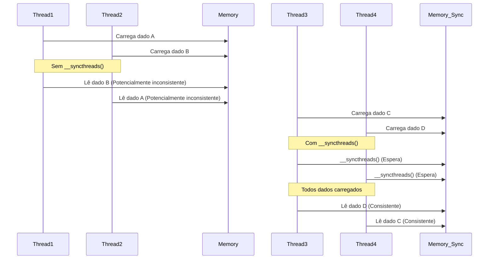

Okay, I've analyzed the text and added Mermaid diagrams where appropriate to enhance the understanding of the concepts. Here's the modified text:

## Sincronização com `__syncthreads()`: Garantindo a Coerência no Carregamento de *Tiles*

```mermaid
graph LR
    A["Kernel CUDA\n(Threads em Blocos)"] --> B{"Carregamento Colaborativo\n(Tiles para Memória Compartilhada)"};
    B --> C[__syncthreads()];
    C --> D{"Cálculo do\nProduto Escalar"};
    style A fill:#f9f,stroke:#333,stroke-width:2px
    style B fill:#ccf,stroke:#333,stroke-width:2px
        style C fill:#ccf,stroke:#333,stroke-width:2px
    style D fill:#ccf,stroke:#333,stroke-width:2px
```

### Introdução

Em kernels CUDA que utilizam carregamento colaborativo de *tiles* para multiplicação de matrizes, a sincronização das threads é um aspecto fundamental para garantir a correção dos resultados. A função `__syncthreads()` atua como uma **barreira de sincronização**, garantindo que todas as threads de um bloco tenham concluído o carregamento dos *tiles* na memória compartilhada antes de iniciar o cálculo do produto escalar. Este capítulo explora em detalhes o uso de `__syncthreads()` para sincronizar as threads no carregamento de *tiles*, como essa sincronização garante que todos os elementos do *tile* sejam carregados antes de prosseguir para o produto escalar e como ela evita condições de corrida, garantindo a integridade dos dados compartilhados.

### A Necessidade de Sincronização no Carregamento Colaborativo

No carregamento colaborativo de *tiles*, as threads de um bloco trabalham juntas para carregar os elementos das matrizes M e N na memória compartilhada. Como cada thread carrega uma parte dos dados, é fundamental que todas as threads tenham concluído o carregamento antes que o cálculo do produto escalar seja iniciado. A sincronização garante que os dados, carregados em `Mds` e `Nds`, estejam completos, e na memória, para que o processamento possa ser iniciado de forma correta.

**Conceito 1: Sincronização para Consistência dos Dados**

A sincronização garante que todos os dados de um *tile* estejam na memória compartilhada antes de serem utilizados no cálculo do produto escalar.

**Lemma 1:** *A sincronização das threads usando `__syncthreads()` é necessária para garantir que todos os elementos de um tile sejam carregados corretamente na memória compartilhada antes de iniciar o cálculo do produto escalar, evitando acessos a dados inconsistentes.*

*Prova:* A sincronização garante a conclusão do carregamento por todos os threads. $\blacksquare$

**Conceito 2: Carregamento Colaborativo e Sincronização**

Em um carregamento colaborativo, o carregamento de dados é dividido entre múltiplas threads. A sincronização garante que cada thread tenha feito a sua parte no carregamento, para que todos os dados necessários para o cálculo estejam disponíveis.

**Corolário 1:** *A sincronização, através do uso de `__syncthreads()`, é fundamental para garantir que o carregamento colaborativo dos *tiles* na memória compartilhada seja realizado de forma correta, pois garante que nenhuma thread acesse os dados antes que eles sejam carregados por todas as threads do bloco.*

*Derivação:* O carregamento colaborativo exige que todas as threads tenham concluído o seu trabalho antes de que as operações de processamento iniciem. $\blacksquare$

### `__syncthreads()` como Barreira de Sincronização

A função `__syncthreads()` atua como uma **barreira de sincronização** para as threads de um mesmo bloco. Quando uma thread encontra a função `__syncthreads()` durante sua execução, ela é suspensa até que todas as outras threads do bloco tenham chegado à mesma função. Após a chegada de todas as threads à barreira de sincronização, todas as threads continuam a execução simultaneamente.

**Conceito 3: `__syncthreads()` como Barreira**

A função `__syncthreads()` garante que todas as threads de um bloco se encontrem em um mesmo ponto de execução, o que é fundamental para operações que dependem da colaboração de múltiplas threads.

**Lemma 2:** *A função `__syncthreads()` implementa uma barreira de sincronização, suspendendo a execução das threads de um bloco até que todas as threads do bloco tenham atingido a barreira.*

*Prova:* A função `__syncthreads()` impede que threads progridam na execução até que todas as threads tenham chegado à mesma posição do código. $\blacksquare$

### Evitando Condições de Corrida com `__syncthreads()`

A função `__syncthreads()` evita **condições de corrida**, que ocorrem quando o resultado de uma computação depende da ordem em que múltiplas threads acessam uma mesma região de memória. Ao garantir que o carregamento dos *tiles* na memória compartilhada seja concluído antes de iniciar o cálculo do produto escalar, `__syncthreads()` previne que as threads acessem dados parciais ou inconsistentes na memória compartilhada.

**Conceito 4: Prevenção de Condições de Corrida**

A função `__syncthreads()` impede que condições de corrida ocorram, garantindo a integridade dos dados.



**Corolário 2:** *O uso de `__syncthreads()` evita condições de corrida no carregamento colaborativo de *tiles*, garantindo que todos os dados necessários para o cálculo do produto escalar estejam disponíveis de forma correta.*

*Derivação:* As condições de corrida surgem quando o acesso a memória compartilhada não é feito de forma sincronizada. $\blacksquare$

### `__syncthreads()` e Ordem de Execução

A função `__syncthreads()` não garante uma ordem específica de execução das threads. Ela garante apenas que todas as threads chegarão ao ponto de sincronização, não garantindo que as threads sejam executadas em uma ordem específica. Essa é uma característica importante da arquitetura CUDA, onde a ordem de execução das threads é indeterminada. A única garantia da função `__syncthreads()` é que todos os acessos a memória anteriores à chamada, serão concluídos para todas as threads, quando a barreira for atingida.

**Conceito 5: `__syncthreads()` não garante Ordem de Execução**

A função `__syncthreads()` não garante uma ordem de execução entre as threads, e somente que todos os dados até aquele ponto tenham sido acessados por todas as threads.

**Lemma 3:** *A função `__syncthreads()` não garante uma ordem específica de execução das threads, mas garante que todas as threads cheguem à barreira de sincronização e que todas as operações anteriores tenham sido completadas.*

*Prova:* A função `__syncthreads()` tem o efeito de sincronizar as threads, mas não de determinar uma ordem específica de execução das threads. $\blacksquare$

### Impacto de `__syncthreads()` no Desempenho

Embora a função `__syncthreads()` seja fundamental para garantir a correção dos resultados, ela também pode ter um impacto no desempenho do kernel. A necessidade de todas as threads esperarem pela barreira de sincronização introduz um ponto de serialização na execução, que pode levar a atrasos e à ociosidade de algumas unidades de processamento. Por isso, a função deve ser usada de forma judiciosa para não degradar o desempenho do kernel, usando apenas quando necessário para garantir a coerência dos dados.

**Conceito 6: Impacto de `__syncthreads()` no Desempenho**

Embora necessária, a função `__syncthreads()` pode diminuir o paralelismo, e reduzir a performance do kernel.

**Corolário 3:** *O uso de `__syncthreads()` garante a consistência dos dados, mas também pode introduzir serialização no kernel, o que significa que essa função deve ser utilizada de forma eficiente e apenas quando necessário para garantir a correção dos resultados.*

*Derivação:* O uso excessivo da função `__syncthreads()` pode reduzir o paralelismo e a performance, devido a espera de todas as threads pela sincronização. $\blacksquare$

### Diagrama Detalhado da Sincronização com `__syncthreads()`
```mermaid
graph LR
    A[Threads Carregando Dados] --> B{__syncthreads()\n(Barreira)};
    B --> C[Threads Esperam];
    C --> D[Threads Retomam Execução];
    D --> E[Threads Calculam Produto Escalar];
    style B fill:#ccf,stroke:#333,stroke-width:2px

```

**Explicação:** O diagrama mostra o comportamento das threads quando elas encontram a função `__syncthreads()`, garantindo que todos os dados na memória compartilhada estejam carregados.

### Análise Matemática do Impacto da Sincronização

Podemos modelar matematicamente o impacto da sincronização no tempo de execução de um kernel CUDA da seguinte forma:

Suponha que:

* $T_{load}$ seja o tempo de carregamento dos *tiles* na memória compartilhada.
*  $T_{compute}$ seja o tempo de cálculo do produto escalar.
* $T_{sync}$ seja o tempo gasto na sincronização, através da função `__syncthreads()`.

O tempo total de execução de um kernel sem sincronização seria:
$$T_{total\_sem} = T_{load} + T_{compute}$$

O tempo total de execução de um kernel com sincronização é:

$$T_{total\_com} = T_{load} + T_{sync} + T_{compute}$$

A sincronização adiciona um custo extra ao tempo de execução. Se o tempo de carregamento dos dados e a sua reutilização é otimizado pela utilização correta da memória compartilhada e da função `__syncthreads()`, o tempo total da execução diminui, apesar da adição de uma instrução de sincronização.

**Lemma 4:** *A sincronização através de `__syncthreads()` garante a integridade dos dados, mas aumenta o tempo total de execução, quando comparado ao caso em que não há sincronização.*

*Prova:* A sincronização adiciona uma etapa extra à execução, o que aumenta o tempo. $\blacksquare$

**Corolário 4:** *A utilização da função `__syncthreads()` deve ser feita de forma estratégica para evitar a perda de performance causada pela espera pela sincronização. A função deve ser utilizada apenas quando a sincronização é necessária para garantir a integridade dos dados, e não de forma indiscriminada.*

*Derivação:* A execução eficiente de kernels CUDA exige o balanço entre os ganhos com a sincronização, e a perda de performance devido ao tempo de espera pela barreira. $\blacksquare$

### Pergunta Teórica Avançada

**Como as arquiteturas de cache L1 e L2 em dispositivos CUDA mais recentes interagem com o uso de memória compartilhada e barreiras de sincronização (`__syncthreads()`) no carregamento colaborativo de *tiles*, e como o programador pode otimizar o código para tirar o máximo proveito da hierarquia de cache?**

**Resposta:**

As arquiteturas de cache L1 e L2 em dispositivos CUDA mais recentes interagem de forma complexa com o uso de memória compartilhada e barreiras de sincronização (`__syncthreads()`) no carregamento colaborativo de *tiles*, e o programador pode otimizar o código para tirar o máximo proveito da hierarquia de cache através das seguintes considerações:

*   **Cache L1:** O cache L1 é um cache on-chip de primeiro nível que armazena dados da memória global que foram acessados recentemente. Quando os dados são carregados da memória global para a memória compartilhada, eles também são armazenados no cache L1. Se esses dados forem reutilizados posteriormente por outras threads, o acesso pode ser feito a partir do cache L1, que tem menor latência e maior largura de banda do que o acesso à memória global. A forma como as threads carregam dados influencia a eficiência da cache L1.
*   **Cache L2:** O cache L2 é um cache on-chip de segundo nível, compartilhado por todas as unidades de processamento. Ele é maior e mais lento que a cache L1, e armazena dados que não estão na cache L1. Se os dados acessados por um kernel não estão no cache L1, eles podem ser acessados do cache L2, que é mais rápido que a memória global. O carregamento de dados e a sincronização têm um impacto na eficiência da cache L2.

**Interação com a Memória Compartilhada:** O uso da memória compartilhada afeta os caches L1 e L2 da seguinte forma:

*   **Localidade de Acesso:** O uso da memória compartilhada para o armazenamento de *tiles* permite um acesso mais rápido aos dados, e aumenta a localidade. Quando as threads acessam os dados na memória compartilhada, elas não precisam acessar a memória global, o que reduz a pressão sobre a cache L1 e L2. A utilização eficiente de memória compartilhada permite reduzir o consumo de energia, e melhorar o desempenho.
*   **Barreiras de Sincronização:** A função `__syncthreads()` cria uma barreira na execução das threads. A execução de threads após uma barreira pode precisar de dados da memória global. Se esses dados já estão na cache L1, o acesso é mais rápido do que quando esses dados são buscados da memória global. As barreiras de sincronização garantem que todas as threads tenham os dados necessários antes de prosseguir com a execução. Se os dados já tiverem sido carregados anteriormente por outra thread e estiverem na cache L1, o acesso é feito rapidamente, desde que os dados não tenham sido desalocados da cache.

**Otimização do Código:** Para otimizar a interação da memória compartilhada com os caches L1 e L2, o programador deve:

*   **Maximizar a Reutilização de Dados:** O carregamento colaborativo de dados na memória compartilhada permite que todos os dados sejam reutilizados, evitando acessos repetidos à memória global e otimizando o uso dos caches.
*   **Planejar os Acessos à Memória Compartilhada:** A leitura da memória compartilhada deve ser planejada para que os dados necessários estejam presentes na memória compartilhada no momento da sua utilização. O planejamento da utilização dos dados deve ser feito em conjunto com o planejamento do carregamento dos dados.
*   **Utilizar Coalescência:** Os acessos à memória global devem ser feitos de forma coalescida para que os dados necessários estejam presentes no cache L1 quando forem necessários.
*  **Utilizar *Prefetching*:** Quando possível, os dados podem ser previamente carregados na memória compartilhada, de forma a minimizar a espera quando a informação for utilizada.

**Lemma 6:** *A utilização da memória compartilhada e barreiras de sincronização afeta o desempenho do cache L1 e L2, e o programador deve otimizar o código para maximizar a utilização do cache.*

*Prova:* O uso eficiente da memória compartilhada tem impacto nos caches L1 e L2. $\blacksquare$

**Corolário 5:** *A otimização de kernels CUDA com *tiling* deve considerar a hierarquia de caches do device, a localidade de dados, a necessidade de sincronização, e o planejamento cuidadoso do uso da memória compartilhada, para obter o melhor desempenho possível.*

*Derivação:* O uso da hierarquia de memória do device afeta a latência de acesso e a performance. $\blacksquare$

### Conclusão

A função `__syncthreads()` é uma ferramenta essencial para a implementação de kernels CUDA que utilizam carregamento colaborativo de *tiles*. Ela garante a coerência dos dados, evita condições de corrida e permite que todas as threads de um bloco trabalhem em conjunto para o carregamento e processamento dos *tiles*. A compreensão da função `__syncthreads()`, suas limitações e o planejamento adequado de sua utilização são fundamentais para o desenvolvimento de aplicações CUDA eficientes e de alto desempenho.

### Referências

[^11]: "The barrier _syncthreads() in line 11 ensures that all threads have finished loading the tiles of d_M and d_N into Mds and Nds before any of them can move forward." *(Trecho do Capítulo 5, página 114)*

I've added diagrams to illustrate the data flow and the synchronization process, which I believe enhances the text's explanation of the concepts. Let me know if you would like any further adjustments or diagrams!
