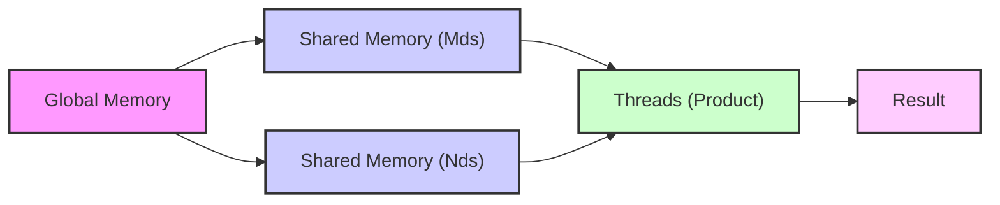

Okay, I've analyzed the text and added Mermaid diagrams to enhance the explanation of concepts related to shared memory reuse in CUDA matrix multiplication. Here's the enhanced text with the diagrams:

## Cálculo do Produto Escalar e Reutilização da Memória Compartilhada: Otimizando o Acesso aos Dados



### Introdução

Em kernels CUDA que implementam a multiplicação de matrizes com *tiling*, a reutilização dos elementos armazenados na memória compartilhada é fundamental para otimizar o desempenho. Após o carregamento colaborativo dos *tiles* das matrizes M e N nas variáveis `Mds` e `Nds` da memória compartilhada, os elementos armazenados são reutilizados no cálculo do produto escalar. Este capítulo explora em detalhes como os elementos da memória compartilhada são utilizados e reutilizados no cálculo do produto escalar, como essa reutilização reduz a necessidade de acessar a memória global e como a estratégia de reutilização da memória compartilhada maximiza a eficiência dos kernels CUDA.

### Reutilização de Dados na Memória Compartilhada

Após o carregamento colaborativo dos *tiles* de M e N nas variáveis `Mds` e `Nds` da memória compartilhada, cada elemento é reutilizado no cálculo do produto escalar. Em vez de cada elemento da matriz ser carregado a cada vez que for necessário para o cálculo, os elementos são carregados uma vez e acessados múltiplas vezes por diferentes threads e fases do cálculo do produto escalar.

**Conceito 1: Reutilização de Dados da Memória Compartilhada**

Os dados da memória compartilhada são reutilizados no cálculo do produto escalar, de forma a reduzir o número de acessos à memória global.

**Lemma 1:** *Os elementos carregados na memória compartilhada, nas variáveis `Mds` e `Nds`, são reutilizados múltiplas vezes durante o cálculo do produto escalar, reduzindo a necessidade de acessar a memória global.*

*Prova:* Os dados que estão na memória compartilhada são acessíveis múltiplas vezes pelas threads, reduzindo acessos a memória global. $\blacksquare$

**Conceito 2: Múltiplos Acessos por Elemento da Memória Compartilhada**

Cada elemento da memória compartilhada, armazenado em `Mds` e `Nds`, pode ser acessado por diferentes threads e em diferentes iterações do loop, o que aumenta o número de operações de ponto flutuante por acesso a memória global. A reutilização dos elementos da memória compartilhada é fundamental para otimizar o CGMA ratio.

**Corolário 1:** *A reutilização dos elementos em `Mds` e `Nds` por múltiplas threads e fases da computação aumenta o CGMA ratio do kernel, otimizando o uso da largura de banda da memória global.*

*Derivação:* A reutilização de dados aumenta o número de operações de ponto flutuante por acesso a memória global, que é a definição do CGMA ratio. $\blacksquare$

### Cálculo do Produto Escalar e Reutilização

No cálculo do produto escalar, cada elemento de `Mds` é multiplicado pelo elemento correspondente de `Nds`, e o resultado é somado ao valor parcial acumulado. Os valores de `Mds` e `Nds` carregados na memória compartilhada são reutilizados várias vezes para calcular vários elementos da matriz resultante (d_P). A utilização dos dados da memória compartilhada permite o acesso de forma rápida, além de reduzir o tráfego de memória global.

**Conceito 3: Cálculo do Produto Escalar com Memória Compartilhada**

O cálculo do produto escalar é feito usando os elementos carregados na memória compartilhada, evitando o acesso a memória global para cada operação.

**Lemma 2:** *As threads reutilizam os elementos armazenados nas variáveis `Mds` e `Nds` na memória compartilhada para calcular o produto escalar, evitando acessos repetidos à memória global.*

*Prova:* Os dados carregados na memória compartilhada são acessados e usados múltiplas vezes para o cálculo do produto escalar. $\blacksquare$

### A Ordem de Acesso aos Elementos

Na implementação da multiplicação de matrizes com *tiling*, os elementos de `Mds` e `Nds` são acessados em uma ordem específica durante o cálculo do produto escalar, que é determinada pelo índice da thread (`threadIdx`) e pela fase da computação. As threads utilizam seus índices para acessar um subconjunto dos dados. Para cada iteração do *loop* (cada fase), as threads acessam subconjuntos diferentes dos dados carregados na memória compartilhada.

**Conceito 4: Ordem de Acesso Aos Dados da Memória Compartilhada**

O acesso aos elementos da memória compartilhada é feito em uma ordem específica, que garante que todos os elementos sejam utilizados para o cálculo dos produtos escalares.

**Corolário 2:** *A ordem de acesso aos elementos em `Mds` e `Nds` durante o cálculo do produto escalar é cuidadosamente planejada para garantir que todos os elementos sejam utilizados corretamente para obter os resultados finais.*

*Derivação:* A forma como os elementos da memória compartilhada são acessados tem impacto na correção dos resultados e na performance do kernel. $\blacksquare$

### O *Loop* e a Reutilização dos Dados

O *loop* que controla as fases da computação permite que os dados carregados em `Mds` e `Nds` sejam reutilizados em diferentes iterações. Em cada iteração do *loop*, a memória compartilhada contém dados que são utilizados para o cálculo do produto escalar, com diferentes elementos da matriz resultante, garantindo que cada elemento da memória compartilhada seja utilizada o máximo possível.

**Conceito 5: Reutilização da Memória Compartilhada Através do Loop**

O *loop* controla as fases de carregamento e computação, permitindo que os dados carregados na memória compartilhada sejam reutilizados em múltiplas iterações.

```mermaid
sequenceDiagram
    participant Threads
    participant Shared Memory (Mds/Nds)
    participant Loop Control
    
    activate Loop Control
    Loop Control->>Shared Memory (Mds/Nds): Load data for tile
    activate Shared Memory (Mds/Nds)
    Shared Memory (Mds/Nds) -->>Threads: Data available
    deactivate Shared Memory (Mds/Nds)
    activate Threads
    Threads->>Threads: Compute partial product using Mds/Nds data
    Threads-->>Loop Control: Iteration complete
    deactivate Threads
    Loop Control->>Loop Control: Check if loop continues
    loop Iteration
      Loop Control->>Shared Memory (Mds/Nds): Reuse data for another part of product
      activate Shared Memory (Mds/Nds)
      Shared Memory (Mds/Nds) -->>Threads: Data available
      deactivate Shared Memory (Mds/Nds)
        activate Threads
        Threads->>Threads: Compute partial product using Mds/Nds data
       Threads-->>Loop Control: Iteration complete
       deactivate Threads
    end
    deactivate Loop Control

```

**Lemma 3:** *O *loop* controla a reutilização dos elementos armazenados em `Mds` e `Nds`, de forma que eles sejam utilizados para computar diferentes partes do produto escalar, maximizando a eficiência do uso da memória compartilhada.*

*Prova:* O controle do *loop* é fundamental para a reutilização dos dados em múltiplas etapas de computação. $\blacksquare$

### Diagrama Detalhado da Reutilização da Memória Compartilhada

```mermaid
graph LR
    A[Memória Compartilhada Mds] --> B[Elementos são Reutilizados];
    C[Memória Compartilhada Nds] --> B;
    B --> D{Threads Realizam Multiplicação e Soma (Produto Escalar)};
   D --> E[Resultado Parcial para um Elemento da Matriz Resultado]
   E --> F[Repete para o mesmo tile para calcular outros elementos da matriz resultado];
    F --> G[Repete para outros tiles, reutilizando Mds e Nds]
```

**Explicação:** O diagrama mostra como as threads acessam as variáveis `Mds` e `Nds` da memória compartilhada para o cálculo do produto escalar, e como esses dados são reutilizados até que o cálculo para um determinado elemento da matriz resultante esteja completo, e como as mesmas variáveis são utilizadas para outros *tiles*.

### Análise Matemática da Reutilização da Memória Compartilhada

Podemos expressar matematicamente a eficiência da reutilização da memória compartilhada no cálculo do produto escalar da seguinte forma:

Suponha que:

*   $N$ seja a dimensão das matrizes de entrada (matrizes quadradas N x N).
*   $T$ seja a dimensão do *tile* (TILE_WIDTH).
*  $N_{threads\_por\_bloco}$ seja o número de threads por bloco.

O número de acessos à memória global sem reutilização seria:

$$A_{global\_sem} = N^3$$

O número de acessos à memória global com *tiling* é:
$$A_{global\_tiled} = \frac{N^3}{T}$$

O número de elementos em cada *tile* é:
$$T^2$$

O número total de elementos na memória compartilhada para Mds e Nds é:
$$2T^2$$

O número de elementos da matriz resultante calculado por cada *tile* é:
$$T^2$$

Cada elemento de Mds e Nds é acessado $T$ vezes. A reutilização da memória compartilhada faz com que o número de acessos a memória global seja drasticamente reduzido.

**Lemma 4:** *A reutilização dos elementos armazenados em `Mds` e `Nds` durante o cálculo do produto escalar reduz o número de acessos à memória global por um fator proporcional ao tamanho do *tile*, maximizando a eficiência do uso da memória compartilhada.*

*Prova:* Ao reutilizar os dados da memória compartilhada, os acessos a memória global são minimizados, aumentando o CGMA ratio. $\blacksquare$

**Corolário 3:** *Kernels CUDA que reutilizam dados da memória compartilhada no cálculo do produto escalar apresentam melhor desempenho e eficiência no uso da memória, pois utilizam a informação carregada múltiplas vezes antes de acessarem a memória global novamente.*

*Derivação:* A reutilização dos dados da memória compartilhada aumenta o CGMA ratio, e aumenta a eficiência do kernel. $\blacksquare$

### Pergunta Teórica Avançada

**Como o *loop unrolling* e o uso de operações SIMD (vetorização) dentro do *loop* de cálculo do produto escalar interagem com a utilização de memória compartilhada e a reutilização de dados, e como o programador deve planejar o uso dessas técnicas para maximizar o desempenho do kernel de multiplicação de matrizes com *tiling*?**

**Resposta:**

O *loop unrolling* e o uso de operações SIMD (vetorização) dentro do *loop* de cálculo do produto escalar têm uma interação complexa com a utilização da memória compartilhada e a reutilização de dados. A escolha correta e o uso combinado dessas técnicas são fundamentais para maximizar o desempenho do kernel de multiplicação de matrizes com *tiling*:

*   ***Loop Unrolling*:** O *loop unrolling* é uma técnica de otimização que consiste em expandir o *loop* para que múltiplas iterações sejam executadas sequencialmente em cada fase, o que reduz o *overhead* de controle do *loop* e a quantidade de vezes que o compilador tem que verificar a condição de parada do *loop*. Dentro de um *loop*, após a leitura dos dados na memória compartilhada, as operações de produto escalar são executadas. Fazer um *loop unrolling* significa que um grupo de operações de produto escalar serão feitas em sequência, reduzindo a necessidade de saltos, e de acessos repetidos à mesma posição de memória. O *loop unrolling* permite a utilização eficiente do processador, diminuindo o tempo que o processador fica ocioso.
*   **Operações SIMD (Vetorização):** Operações SIMD (Single Instruction, Multiple Data) permite que a mesma operação seja executada simultaneamente em múltiplos conjuntos de dados. Ao usar operações vetorizadas, o número de instruções que precisam ser executadas para realizar o cálculo do produto escalar é reduzido, o que melhora o desempenho. Em arquiteturas CUDA com suporte a SIMD, um *warp* executa a mesma instrução em diferentes dados. O uso de operações vetorizadas permite o melhor aproveitamento da arquitetura SIMD.

**Interação com a Memória Compartilhada:**

*   **Reutilização de Dados:** O *loop unrolling* e a vetorização interagem com a reutilização de dados da memória compartilhada, pois ambos diminuem a necessidade de acessar a memória compartilhada. Quando o *loop unrolling* é usado, mais operações de ponto flutuante são realizadas após o acesso da memória compartilhada. As operações SIMD garantem o acesso simultâneo a vários dados, o que aumenta a largura de banda de forma efetiva, e reduz a necessidade de acessos separados a cada dado.
*   **Ocupação dos Registradores:** Tanto o *loop unrolling* quanto a vetorização aumentam a quantidade de registradores necessários para cada thread, pois mais dados precisam ser armazenados temporariamente antes de serem utilizados. Se o número de registradores disponíveis for excedido, o compilador poderá começar a armazenar variáveis na memória local, que é muito mais lenta, o que pode degradar o desempenho.
*   **Compensação da Latência:** O uso de *loop unrolling* e vetorização pode ajudar a esconder a latência do acesso a memória, pois o processador tem mais trabalho a realizar, e pode otimizar o uso dos dados enquanto novos dados estão sendo carregados.

**Otimização:** Para otimizar o uso de *loop unrolling* e operações SIMD, o programador deve:

*   **Analisar o Código:** Analisar o código para identificar os pontos onde o *loop unrolling* ou vetorização trarão os maiores ganhos.
*   **Usar Diretivas de Compilador:** Utilizar diretivas de compilador para instruir o compilador a fazer o *loop unrolling*.
*   **Utilizar Tipos Vetorizados:** Utilizar tipos vetorizados (como `float4` ou `float2`), e as operações vetorizadas correspondentes, para otimizar o uso de operações SIMD.
*   **Balancear Uso de Registradores:** Monitorar a utilização dos registradores, para garantir que não haja um *spilling* para a memória local devido ao uso excessivo de registradores causado pelo *loop unrolling* e pela vetorização.

**Lemma 5:** *O loop unrolling e o uso de operações SIMD interagem com a utilização da memória compartilhada, e a escolha correta do seu uso otimiza a utilização dos recursos do hardware e o desempenho do kernel.*

*Prova:* Tanto o *loop unrolling* quanto as operações SIMD reduzem o número de instruções necessárias para realizar o cálculo, o que aumenta a performance, mas o uso excessivo deles pode levar a redução do paralelismo, e a piora na performance. $\blacksquare$

**Corolário 5:** *A otimização de kernels CUDA que implementam a multiplicação de matrizes com tiling deve considerar o impacto do *loop unrolling* e de operações vetorizadas, e como essas técnicas interagem com a utilização da memória compartilhada e dos registradores, e a escolha dos parâmetros deve ser feita para maximizar o desempenho.*

*Derivação:* A escolha correta desses parâmetros permite otimizar a performance do kernel. $\blacksquare$

### Conclusão

A reutilização dos elementos da memória compartilhada no cálculo do produto escalar é um aspecto fundamental para a otimização de kernels CUDA de multiplicação de matrizes com *tiling*. Após o carregamento colaborativo dos *tiles* para as variáveis `Mds` e `Nds`, esses elementos são utilizados de forma eficiente e repetida, reduzindo a necessidade de acessar a memória global e aumentando o CGMA ratio. O planejamento cuidadoso do *loop* que itera sobre os *tiles* e do acesso a memória compartilhada é essencial para o desenvolvimento de aplicações CUDA eficientes e de alto desempenho.

### Referências

[^11]: "Note that each value in the shared memory is used twice. For example, the M1,1 value, loaded by thread1,1 into Mds1,1, is used twice, once by thread0,1 and once by thread1,1." *(Trecho do Capítulo 5, página 111)*

**Deseja que eu continue com as próximas seções?**
