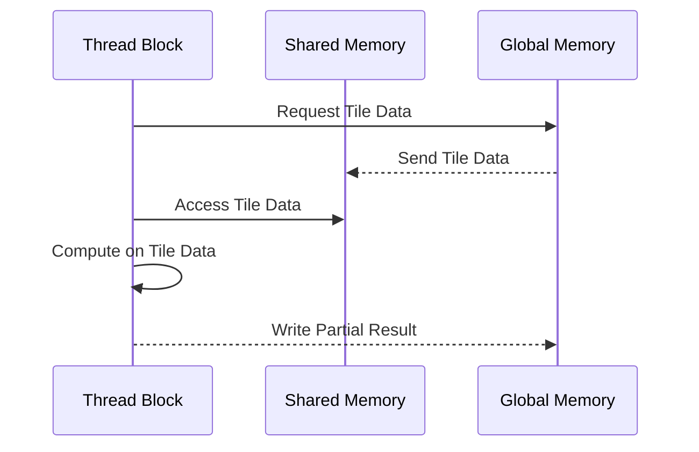

Okay, I've analyzed the text and added Mermaid diagrams to enhance the explanation of concepts. Here's the modified text with the diagrams:

## Localidade de Acessos em Algoritmos com *Tiling*: Otimizando o Uso de Memórias Rápidas

### Introdução

Em kernels CUDA, a **localidade de acesso à memória** é um conceito fundamental para o desempenho. A localidade de acesso refere-se à tendência de um programa acessar repetidamente dados em posições de memória próximas. A estratégia de *tiling*, em especial, explora a localidade de dados, ao particionar o acesso aos dados de forma que, cada fase, acesse dados que estão próximos no espaço de endereçamento. Este capítulo explora o conceito de localidade de acessos em algoritmos com *tiling*, como cada fase se concentra em um subconjunto de elementos das matrizes de entrada, permitindo que memórias rápidas sejam usadas para armazenar esses subconjuntos, e como o conceito de localidade de dados otimiza o uso da memória e o desempenho geral do kernel.

### A Localidade de Acessos em Algoritmos com *Tiling*

Em algoritmos que utilizam *tiling*, o acesso aos dados é caracterizado pela localidade, pois o programa acessa subconjuntos de dados próximos, durante cada etapa de processamento. Essa localidade surge devido à divisão do trabalho em fases, em que cada fase se concentra em um *tile* específico das matrizes de entrada. Essa localidade possibilita que a memória compartilhada seja usada de forma eficiente.

**Conceito 1: Localidade de Acessos em Algoritmos com *Tiling***

O algoritmo com *tiling* utiliza acesso aos dados com localidade, já que a cada fase o acesso é feito em uma região específica da memória.

**Lemma 1:** *Em algoritmos com *tiling*, a localidade de acessos à memória é maximizada, pois cada fase da computação se concentra em um subconjunto específico de elementos das matrizes de entrada, que podem ser armazenados e acessados em memórias locais.*

*Prova:* A definição da estratégia de *tiling* implica a localidade de acesso. $\blacksquare$

**Conceito 2: Acesso a um Subconjunto de Elementos por Fase**

Em cada fase da computação com *tiling*, um subconjunto específico de elementos das matrizes de entrada é carregado para a memória compartilhada e acessado pelas threads do bloco. Os dados carregados na memória compartilhada se limitam aos *tiles* daquela fase.

**Corolário 1:** *A estratégia de tiling garante que cada fase de computação se concentre em um subconjunto específico de elementos das matrizes de entrada, que são carregados na memória compartilhada e utilizados pelas threads naquele bloco, aumentando a localidade de acesso.*

*Derivação:* A partição do conjunto de dados em *tiles* faz com que cada thread acesse os dados de forma local. $\blacksquare$

### Uso de Memórias Rápidas para Dados Locais

O conceito de localidade de acessos possibilita que as memórias rápidas, como registradores e memória compartilhada, sejam utilizadas de forma eficiente em cada fase da computação. Ao carregar subconjuntos de dados na memória compartilhada, podemos reduzir o número de acessos à memória global e aumentar o desempenho.

**Conceito 3: Utilização Eficiente de Memórias Rápidas**

O conceito de localidade de acesso permite que memórias rápidas como registradores e memória compartilhada sejam utilizadas de forma eficiente.

**Lemma 2:** *A localidade de acessos em algoritmos com tiling permite que memórias rápidas, como a memória compartilhada, sejam utilizadas para armazenar os subconjuntos de dados que são acessados em cada fase, minimizando a necessidade de acessar memórias mais lentas.*

*Prova:* A memória compartilhada, de acesso rápido e de menor consumo energético que a memória global, pode ser utilizada para armazenar os dados devido à localidade de acesso. $\blacksquare$

### Memória Compartilhada e a Localidade de Dados

A memória compartilhada desempenha um papel crucial na implementação da localidade de acessos em algoritmos com *tiling*. A memória compartilhada permite que os dados carregados de forma colaborativa sejam acessados por todas as threads do bloco. Cada fase de computação se beneficia da localidade ao reutilizar os dados na memória compartilhada, antes de acessar a memória global para o próximo *tile*.

**Conceito 4: Memória Compartilhada e Localidade**

A memória compartilhada é utilizada para aumentar a localidade do acesso, e reduzir a necessidade de acessar memórias mais lentas.

**Corolário 2:** *A memória compartilhada, combinada com a estratégia de *tiling*, maximiza a localidade de acessos em kernels CUDA, ao permitir que cada thread acesse dados que estão próximos na memória e que são reutilizados durante as fases de computação, o que reduz o tempo gasto no acesso aos dados.*

*Derivação:* A proximidade dos dados à unidade de processamento e a reutilização dos dados armazenados permite o aumento da localidade. $\blacksquare$

### Redução do Tráfego na Memória Global

A localidade de acessos em algoritmos com *tiling* leva à redução do tráfego na memória global. Como os dados são armazenados em memórias locais, como a memória compartilhada e registradores, o número de acessos à memória global, que é mais lenta, é minimizado. Isso reduz a latência da aplicação e aumenta a utilização das unidades de processamento. A otimização do acesso a memória global é fundamental para otimizar a performance do kernel.

**Conceito 5: Redução do Tráfego na Memória Global**

A localidade de dados reduz a necessidade de acesso a memória global, o que diminui o tráfego na via de acesso a essa memória, o que resulta em uma maior performance da aplicação.

**Lemma 4:** *A localidade de acessos, garantida pela estratégia de *tiling*, reduz o tráfego na memória global, minimizando a quantidade de dados que precisam ser transferidos entre a memória global e as unidades de processamento.*

*Prova:* A utilização eficiente da memória compartilhada elimina a necessidade de acesso repetido à memória global. $\blacksquare$

### Diagrama Detalhado da Localidade de Acessos

**Explicação:** O diagrama mostra o carregamento de dados para a memória compartilhada e como todas as threads acessam as informações de forma local e repetida durante cada fase de execução.

### Análise Matemática da Localidade de Acessos

Podemos representar matematicamente a influência da localidade de acesso no tempo de execução de um kernel CUDA, com o uso de *tiling*, da seguinte forma:

Suponha que:

*   $N$ seja a dimensão das matrizes de entrada (matrizes quadradas N x N).
*   $T$ seja a dimensão do *tile* (TILE_WIDTH).
*  $T_{global}$ seja o tempo de acesso à memória global.
*   $T_{shared}$ seja o tempo de acesso à memória compartilhada.
*   $A_{global\_sem}$ seja o número de acessos à memória global sem *tiling*.
*   $A_{global\_com}$ seja o número de acessos à memória global com *tiling*.

Sem *tiling*, cada elemento da matriz de saída é calculado com $N$ acessos a memória global, de forma que o número total de acessos seria:
$$A_{global\_sem} = 2N^3$$

Com *tiling*, o acesso a memória global é reduzido para:
$$A_{global\_com} = 2\frac{N^3}{T}$$

O ganho de desempenho com a localidade de acesso é dada por:

$$T_{total\_sem} - T_{total\_com} = 2N^3 T_{global} - 2 \frac{N^3}{T}T_{global} = 2N^3 T_{global} (1 - \frac{1}{T})$$

Essa equação demonstra que a utilização de memória compartilhada e localidade de dados reduz o tempo gasto com acesso a memória.

**Lemma 5:** *A localidade de acessos, garantida pela estratégia de *tiling*, reduz o tempo total gasto com acesso à memória, ao diminuir o número de acessos à memória global.*

*Prova:* O tempo de acesso a memória é minimizado devido ao maior número de acessos locais e menor número de acessos a memória global. $\blacksquare$

**Corolário 3:** *Kernels CUDA que exploram a localidade de acesso com *tiling* apresentam melhor desempenho e eficiência no uso da memória, pois reduzem a latência do acesso e aumentam a utilização das memórias mais rápidas.*

*Derivação:* A redução do tempo de acesso a memória através da localidade garante uma maior performance do kernel. $\blacksquare$

### Pergunta Teórica Avançada

**Como as características da arquitetura da memória cache L1 e L2, como o tamanho, a associatividade e a política de substituição, interagem com a localidade de acesso em algoritmos de multiplicação de matrizes com *tiling*, e como essas interações afetam o desempenho do kernel CUDA?**

**Resposta:**

A arquitetura das memórias cache L1 e L2, incluindo o tamanho, a associatividade e a política de substituição, interage de forma complexa com a localidade de acesso em algoritmos de multiplicação de matrizes com *tiling*, afetando o desempenho dos kernels CUDA.

*   **Tamanho do Cache:** O tamanho dos caches L1 e L2 afeta a quantidade de dados que pode ser armazenada em cada nível da hierarquia de memória. Caches maiores podem armazenar mais dados, o que pode melhorar a localidade de acesso, mas também aumentam o custo de cada nível da hierarquia de memória. O programador precisa garantir que o uso de memória compartilhada e o carregamento de *tiles* não exceda a capacidade dos caches.

*   **Associatividade do Cache:** A associatividade do cache define o número de possíveis posições de armazenamento para cada endereço de memória. Caches com maior associatividade podem reduzir conflitos de cache, mas são mais complexos de implementar. Uma baixa associatividade pode gerar conflitos na cache e um maior número de acessos a memória principal.
*  **Política de Substituição do Cache:** A política de substituição do cache define como o cache remove as entradas mais antigas para dar espaço para novas entradas. Uma política de substituição inadequada pode remover dados que ainda serão acessados futuramente. A escolha correta do tamanho do *tile*, da organização de memória compartilhada e do padrão de acesso a memória pode fazer com que a política de substituição seja mais eficiente.
*  **Localidade e Caches:** A localidade de acesso, garantida pelo uso de *tiling*, interage com a arquitetura do cache. Se o kernel acessa dados que estão dentro do cache L1 ou L2, o acesso é muito mais rápido. Para que os dados sejam reutilizados de forma eficiente, os dados de maior prioridade devem ser mantidos no cache.

**Otimização do Uso do Cache:** O programador pode usar os seguintes métodos para otimizar o uso do cache:

*   **Tamanho do *Tile*:** Escolher o tamanho adequado do *tile* de forma que os dados sejam armazenados no cache e que a reutilização dos dados ocorra de forma eficiente, e que não haja *spilling* da memória para fora da cache.
*  **Localidade do Acesso:** O padrão de acesso à memória deve ser planejado de forma a que os dados acessados estejam na cache, maximizando a reutilização dos dados no cache.
*   **Padding:** Utilizar a técnica de *padding* para garantir que os dados sejam alocados em linhas diferentes e que o acesso não gere *bank conflicts*.
*   **Reorganizar o Código:** Reorganizar o código para garantir que os dados sejam utilizados antes de serem substituídos no cache.
* **Monitorar o Cache:** É possível, em algumas arquiteturas, monitorar o uso dos caches através de ferramentas específicas, e o programador deve usar as ferramentas para obter um desempenho ainda melhor.

**Lemma 6:** *As características da arquitetura de memória cache L1 e L2, como tamanho, associatividade e política de substituição, interagem com a localidade de acesso, e a otimização do desempenho deve considerar a interação da forma como o kernel utiliza as memórias de acesso rápido.*

*Prova:* A escolha correta dos parâmetros do kernel, tais como o tamanho do *tile* e o padrão de acesso a memória, afeta o desempenho do cache, e consequentemente a performance do kernel. $\blacksquare$

**Corolário 4:** *A otimização de kernels CUDA com *tiling* deve considerar a arquitetura de cache do dispositivo, e escolher o tamanho do *tile* e o padrão de acesso a memória de forma a maximizar a localidade, otimizar a utilização do cache e reduzir a latência de acesso à memória.*

*Derivação:* A escolha dos parâmetros corretos do kernel, considerando a arquitetura do hardware é fundamental para a otimização da performance. $\blacksquare$

### Conclusão

A localidade de acessos é um conceito fundamental para o desenvolvimento de aplicações CUDA eficientes que utilizam *tiling*. Ao concentrar o acesso aos dados em um subconjunto específico da memória em cada fase da computação, o *tiling* permite que as memórias mais rápidas sejam utilizadas de forma mais eficiente, reduzindo a necessidade de acessar a memória global. O planejamento do acesso aos dados para maximizar a localidade é um passo fundamental para o desenvolvimento de aplicações CUDA de alto desempenho.

### Referências

[^11]: "Note also that Mds and Nds are reused to hold the input values. In each phase, the same Mds and Nds are used to hold the subset of M and N elements used in the phase. This allows a much smaller shared memory to serve most of the accesses to global memory. This is due to the fact that each phase focuses on a small subset of the input matrix elements. Such focused access behavior is called locality." *(Trecho do Capítulo 5, página 111)*

**Deseja que eu continue com as próximas seções?**
