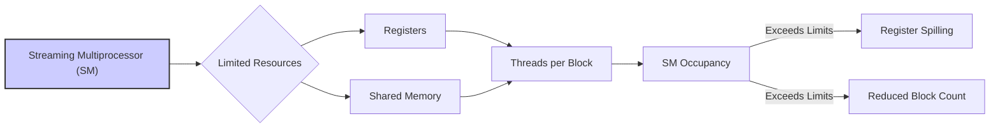
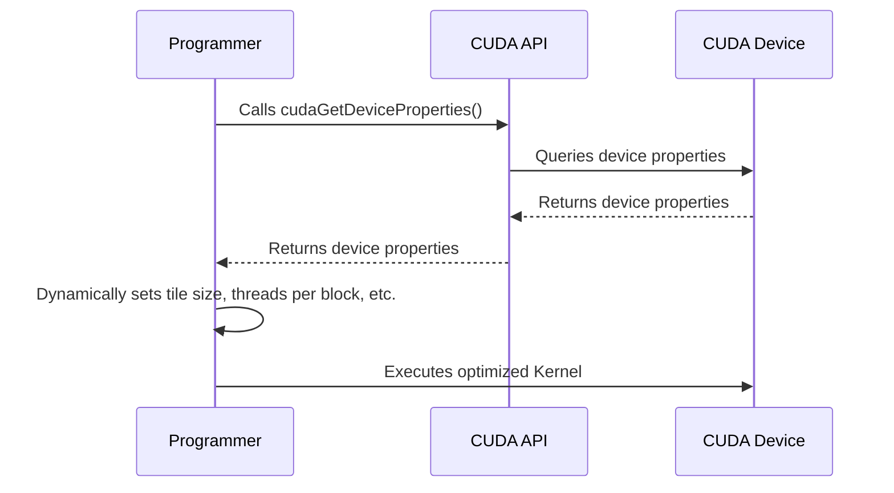

Okay, I've analyzed the text and added Mermaid diagrams to enhance understanding. Here's the modified text with the diagrams included:

## Limitações de Recursos em CUDA: Impacto no Paralelismo e Desempenho de Kernels

```mermaid
graph LR
    A[Streaming Multiprocessor (SM)] --> B{"Limited Resources\n(Registers, Shared Memory)"};
    B --> C[Impact on Parallelism];
    C --> D[Reduced Performance\n(Spilling, Reduced Block Count)];
    style A fill:#f9f,stroke:#333,stroke-width:2px
```

### Introdução

Em kernels CUDA, o desempenho é diretamente influenciado pela forma como os recursos do hardware, como **registradores** e **memória compartilhada**, são utilizados. Cada Streaming Multiprocessor (SM) em um dispositivo CUDA oferece uma quantidade limitada desses recursos, o que impõe restrições ao número de threads que podem ser executadas simultaneamente e, consequentemente, ao nível de paralelismo que um kernel pode alcançar. Este capítulo explora em detalhes as limitações dos recursos de hardware em dispositivos CUDA, como essas limitações afetam o nível de paralelismo de um kernel, como o uso excessivo desses recursos pode reduzir o desempenho e a necessidade do programador planejar o uso de recursos de acordo com as limitações do device.

### Limitações de Registradores e Memória Compartilhada

Os registradores e a memória compartilhada são memórias de acesso rápido, localizadas *on-chip* em cada SM. No entanto, a quantidade desses recursos é limitada, e esse limite impõe restrições ao número de threads que podem ser executadas simultaneamente em cada SM. A capacidade desses recursos são diferentes para cada arquitetura de *device* CUDA.

**Conceito 1: Limitação de Registradores e Memória Compartilhada por SM**

A quantidade de registradores e de memória compartilhada por SM é limitada.

**Lemma 1:** *A quantidade de registradores e memória compartilhada disponíveis em cada Streaming Multiprocessor (SM) é limitada, e esse limite impõe restrições ao número de threads que podem ser executadas simultaneamente.*

*Prova:* Os recursos são limitados fisicamente pela arquitetura do hardware. $\blacksquare$

**Conceito 2: Impacto no Nível de Paralelismo**

As limitações de registradores e memória compartilhada impactam diretamente o nível de paralelismo que um kernel pode alcançar. Quanto mais recursos cada thread necessitar, menos threads poderão ser executadas simultaneamente no mesmo SM.

**Corolário 1:** *O número de threads que podem ser executadas simultaneamente em um SM é limitado pela quantidade de recursos disponíveis, o que impõe uma restrição ao nível de paralelismo que um kernel pode alcançar.*

*Derivação:* A quantidade de recursos por SM impõe um limite ao número de threads que podem ser executadas em paralelo. $\blacksquare$

### Excedendo as Limitações de Recursos: Impacto no Desempenho

Quando um kernel excede as limitações de recursos disponíveis em um SM, o compilador/runtime CUDA precisa utilizar estratégias alternativas que podem degradar o desempenho do kernel:

*   ***Spilling* de Registradores:** Se o kernel utiliza mais registradores do que o disponível, o compilador pode realizar um *spilling*, que consiste em armazenar os valores de algumas variáveis na memória local, que é muito mais lenta do que os registradores. Isso aumenta a latência de acesso aos dados e reduz o desempenho do kernel.
*   **Redução do Número de Blocos:** Se o kernel utiliza mais memória compartilhada por bloco do que o permitido, o número de blocos que podem ser executados simultaneamente no mesmo SM é reduzido, o que diminui a ocupação do SM e o paralelismo do kernel.

**Conceito 3: Efeitos da Exaustão de Recursos**

O uso excessivo de registradores e memória compartilhada leva a redução do número de threads e blocos que são executados em um SM, e o uso de memórias mais lentas, reduzindo a performance da aplicação.

**Lemma 2:** *Exceder as limitações de recursos (registradores e memória compartilhada) em um SM pode levar a spilling de registradores para memória local e à redução do número de blocos por SM, diminuindo o paralelismo e o desempenho do kernel.*

*Prova:* Os mecanismos para lidar com o uso excessivo de recursos degradam a performance do kernel. $\blacksquare$

### Ocupação do SM e Uso Eficiente dos Recursos

A ocupação do SM (Streaming Multiprocessor occupancy) é uma métrica que indica a porcentagem da capacidade de um SM que está sendo utilizada por threads ativas. A ocupação ideal do SM é atingida quando o número de threads que está rodando é suficiente para esconder a latência do acesso a memória. A escolha correta do número de threads e do uso de registradores e memória compartilhada é fundamental para garantir uma boa ocupação do SM e, por consequência, o melhor desempenho possível.

**Conceito 4: Ocupação do SM e Desempenho**

O uso eficiente dos recursos do hardware é fundamental para uma boa ocupação do SM, o que se traduz em maior performance.

**Corolário 2:** *A otimização de kernels CUDA exige o planejamento cuidadoso do uso de registradores e memória compartilhada para atingir um bom nível de ocupação do SM e maximizar o desempenho do kernel.*

*Derivação:* A otimização do uso dos recursos disponíveis maximiza o paralelismo e o desempenho. $\blacksquare$

### Otimização do Uso dos Recursos

A otimização do uso dos recursos em kernels CUDA envolve:

*   **Reduzir o Uso de Registradores:** Utilizar registradores apenas quando necessário e evitar o uso excessivo de variáveis locais.
*   **Otimizar o Uso da Memória Compartilhada:** Usar a memória compartilhada de forma estratégica, evitando armazenar dados desnecessários e garantindo o acesso eficiente e o layout correto dos dados para reduzir *bank conflicts*.
*   **Balancear o Número de Threads:** Escolher um número adequado de threads por bloco para utilizar a capacidade do SM de forma eficiente, sem exceder os limites de recursos e sem reduzir o paralelismo.
*   **Utilizar Versões Otimizadas do Kernel:** Para dispositivos diferentes, pode ser necessário escolher versões diferentes do kernel, que utilizem um número de registradores e memória compartilhada adequado para cada arquitetura de hardware.

### Diagrama das Limitações de Recursos



**Explicação:** O diagrama demonstra que a quantidade limitada de registradores e memória compartilhada limita a quantidade de threads e blocos que podem ser executados simultaneamente, e como o uso excessivo leva ao *spilling* e redução da ocupação.

### Análise Matemática do Impacto das Limitações de Recursos

Podemos representar matematicamente o impacto das limitações de recursos no desempenho de kernels CUDA da seguinte forma:

Suponha que:

*  $R_{max}$ seja o número máximo de registradores por SM.
*  $S_{max}$ seja o tamanho máximo da memória compartilhada por SM.
*   $R_{thread}$ seja o número de registradores utilizados por thread.
*   $S_{block}$ seja a quantidade de memória compartilhada utilizada por bloco.
*   $N_{threads}$ seja o número de threads por bloco.
*   $N_{blocos}$ seja o número de blocos.

O número máximo de threads que podem ser executadas simultaneamente em um SM, é limitado pelo número de registradores:
$$N_{threads} \leq \frac{R_{max}}{R_{thread}}$$

O número máximo de blocos que podem ser executados simultaneamente em um SM, é limitado pela quantidade de memória compartilhada:
$$ N_{blocos} \leq \frac{S_{max}}{S_{block}} $$

O número de threads ativas por SM é limitado pelo menor valor entre $N_{threads}$ e $N_{blocos} \times N_{threads}$. O uso excessivo dos recursos (registradores ou memória compartilhada), limita o número de threads e blocos e consequentemente a performance.

**Lemma 4:** *O desempenho de kernels CUDA é limitado pelos recursos do hardware, como registradores e memória compartilhada, e o programador deve balancear o uso desses recursos para alcançar o máximo de ocupação do SM.*

*Prova:* O número de blocos e threads que podem ser executados é limitado pelos recursos de cada SM. $\blacksquare$

**Corolário 3:** *A otimização de kernels CUDA deve considerar as limitações de registradores e memória compartilhada, evitando o uso excessivo desses recursos para que o número de threads ativas e o número de blocos ativos seja maximizado, e o desempenho seja o maior possível.*

*Derivação:* O balanceamento do uso dos recursos disponíveis no hardware maximiza a performance do kernel. $\blacksquare$

### Pergunta Teórica Avançada

**Como as diferentes gerações de dispositivos CUDA (com diferentes arquiteturas de SMs e capacidades de memória) afetam a escolha do tamanho do *tile* (`TILE_WIDTH`), do número de threads por bloco e do uso de registradores em kernels de multiplicação de matrizes, e como o programador pode adaptar o código para obter o máximo desempenho em diferentes plataformas?**

**Resposta:**

As diferentes gerações de dispositivos CUDA, com diferentes arquiteturas de SMs e capacidades de memória, impactam significativamente a escolha do tamanho do *tile* (`TILE_WIDTH`), do número de threads por bloco e do uso de registradores em kernels de multiplicação de matrizes. A adaptação do código para diferentes plataformas é fundamental para obter o máximo desempenho possível.

*   **Arquiteturas de SMs:** Cada geração de dispositivos CUDA possui arquiteturas de SMs diferentes, com variações no número de unidades de processamento, na capacidade de registradores por SM, na capacidade de memória compartilhada por SM e no tamanho da *cache* L1 e L2. Essas diferenças impactam diretamente o nível de paralelismo que um kernel pode alcançar, e a quantidade de recursos que podem ser utilizados por thread. Por exemplo, dispositivos com arquiteturas mais antigas podem ter menos registradores por thread, o que exige que o código utilize menos registradores, ou que o programador tenha o cuidado de garantir que o compilador não faça *spilling* para a memória local, que é mais lenta.

*   **Capacidade de Memória:** A capacidade de memória compartilhada e registradores também varia de geração em geração. A escolha do tamanho do *tile* deve considerar a capacidade da memória compartilhada para que não haja uma utilização excessiva, que possa limitar o paralelismo. Se a quantidade de registradores for limitada, o código deve ser escrito para minimizar o uso de registradores, o que impacta diretamente o planejamento da estratégia de *tiling*.

**Adaptação do Código:** Para adaptar o código para diferentes plataformas, o programador deve:

*   **Utilizar Consultas ao Device:** Utilizar as funções da API CUDA, como `cudaGetDeviceProperties()`, para obter informações sobre a arquitetura, capacidade de memória e registradores do dispositivo em que o kernel está sendo executado. Utilizar essas informações para escolher a versão mais adequada do kernel para aquele hardware.
*   **Definir Tamanho do Tile Dinamicamente:** O tamanho do *tile* pode ser definido dinamicamente, com base nas capacidades do dispositivo.
*   **Testar o Desempenho:** Testar o desempenho do kernel com diferentes configurações em diferentes dispositivos para encontrar a melhor configuração.
*   **Utilizar Versões do Kernel Otimizadas:** Criar versões diferentes do kernel, otimizadas para diferentes arquiteturas, e utilizar a versão correta para cada hardware, através de compilação condicional.
*   **Utilizar Estratégias de *Tuning*:** Usar técnicas de *tuning* que permitam a escolha automática de diferentes parâmetros do kernel (como o tamanho do *tile*, o número de threads, o *loop unrolling*), para cada arquitetura.



**Lemma 5:** *As diferentes arquiteturas de SMs e capacidades de memória em dispositivos CUDA de diferentes gerações afetam a escolha do tamanho do tile, do número de threads por bloco e do uso de registradores. O código do kernel deve ser adaptado para cada arquitetura para o melhor desempenho.*

*Prova:* Cada arquitetura tem suas próprias características de desempenho, e o mesmo código pode apresentar diferentes performances dependendo da arquitetura. $\blacksquare$

**Corolário 5:** *A otimização de kernels CUDA para diferentes plataformas exige o conhecimento das arquiteturas de cada device, e o uso de técnicas de programação e compilação que permitam a adaptação do código para as características específicas do hardware, maximizando o desempenho em todas as plataformas.*

*Derivação:* Cada arquitetura de dispositivo tem características e limitações diferentes. A otimização da aplicação exige a adaptação do código às características de cada dispositivo. $\blacksquare$

### Conclusão

As limitações de recursos em dispositivos CUDA impõem restrições ao nível de paralelismo que um kernel pode alcançar. O uso eficiente dos registradores e da memória compartilhada é crucial para o desempenho de kernels CUDA. O planejamento cuidadoso do uso desses recursos e o equilíbrio entre o número de threads e o uso da memória são essenciais para otimizar o desempenho de kernels CUDA e para tirar o máximo proveito da arquitetura do hardware.

### Referências

[^11]: "While 16,384 is a large number, it only allows each thread to use a very limited number of registers considering the number of threads that can reside in each SM. To support 1,536 threads, each thread can use only 16,384÷1,536 = 10 registers. If each thread uses 11 registers, the number of threads able to be executed concurrently in each SM will be reduced. Such reduction is done at the block granularity." *(Trecho do Capítulo 5, página 115)*

**Deseja que eu continue com as próximas seções?**
