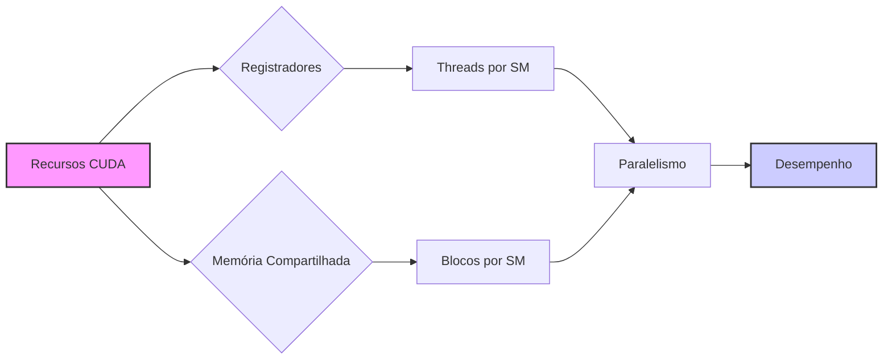
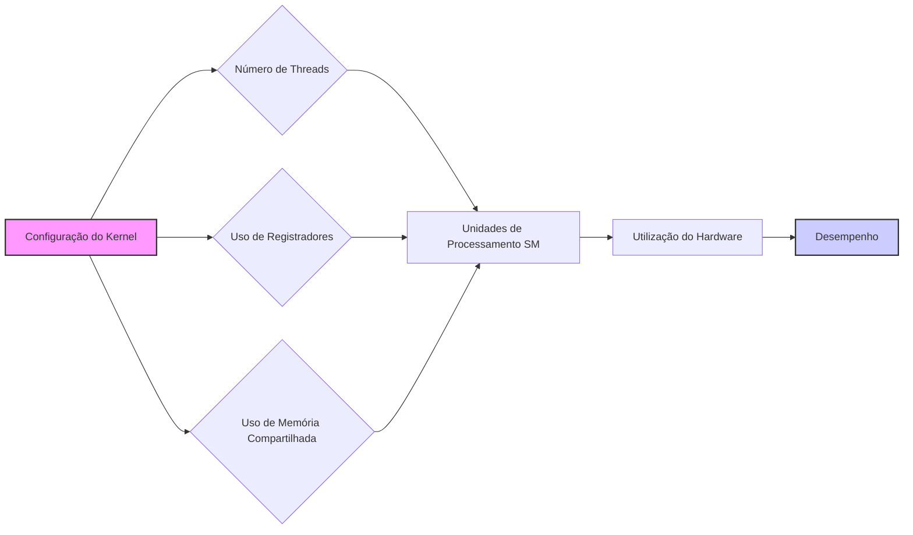
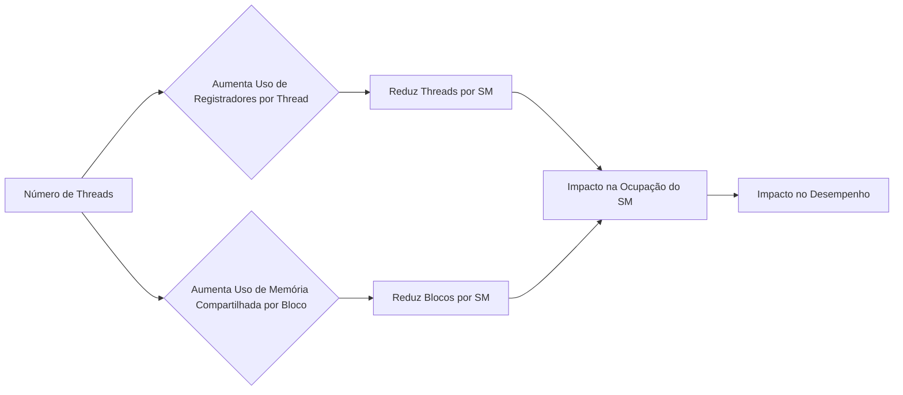

Okay, I've analyzed the text and added Mermaid diagrams to enhance the explanation of CUDA resource trade-offs. Here's the enhanced text:

## *Trade-offs* em CUDA: Balanceando o Uso de Recursos para Otimizar o Paralelismo

### Introdução

Em kernels CUDA, a otimização do desempenho exige um planejamento cuidadoso sobre como os recursos de hardware, como **registradores** e **memória compartilhada**, são utilizados. A quantidade de recursos disponíveis por Streaming Multiprocessor (SM) é limitada, e a escolha do número de threads por bloco e do uso desses recursos envolve *trade-offs* que afetam o nível de paralelismo que um kernel pode alcançar, e também a utilização do hardware. Este capítulo explora em detalhes esses *trade-offs* entre o número de threads e a quantidade de registradores e memória compartilhada utilizados por cada thread, e como essas escolhas impactam o número de threads em um SM e a utilização dos recursos de hardware.

### *Trade-off* entre Número de Threads e Uso de Registradores

Em CUDA, a quantidade de registradores disponíveis em um SM é finita. O número de registradores utilizados por cada thread afeta diretamente o número de threads que podem ser executadas simultaneamente em um SM. Quanto mais registradores cada thread utilizar, menos threads poderão ser executadas no mesmo SM, e vice-versa. Esse *trade-off* é fundamental para balancear o uso dos registradores e o nível de paralelismo do kernel.

**Conceito 1: *Trade-off* entre Registradores e Número de Threads**

A escolha do número de registradores utilizados por cada thread afeta o número máximo de threads que podem ser executadas em um SM.

**Lemma 1:** *Existe um *trade-off* entre a quantidade de registradores utilizados por cada thread e o número de threads que podem ser executadas simultaneamente em um SM. O aumento do uso de registradores por thread reduz o número de threads que podem ser executadas em paralelo.*

*Prova:* Como o número total de registradores é fixo por SM, o aumento do uso por thread reduz o número de threads simultâneas. $\blacksquare$

**Conceito 2: Impacto na Ocupação do SM**

A escolha de um número baixo de registradores por thread permite a execução de mais threads no mesmo SM. No entanto, se o número de registradores for muito baixo, a performance das threads pode ser reduzida. A escolha ideal equilibra a quantidade de registradores utilizados por thread e o número de threads em execução, buscando a melhor ocupação do SM (Streaming Multiprocessor occupancy).

**Corolário 1:** *A escolha do número de registradores por thread afeta a ocupação do SM, de forma que o programador deve equilibrar o uso de registradores e o número de threads em execução para otimizar o uso dos recursos do SM e maximizar o desempenho.*

*Derivação:* O uso excessivo de registradores pode reduzir a ocupação do SM, limitando o número de threads que podem ser executadas simultaneamente, o que limita o paralelismo da aplicação. $\blacksquare$

### *Trade-off* entre Número de Threads e Uso de Memória Compartilhada

Além dos registradores, a memória compartilhada também é um recurso limitado em cada SM. O número de threads que podem ser executadas simultaneamente é afetado pela quantidade de memória compartilhada utilizada por cada bloco de threads, já que a memória compartilhada é utilizada para troca de informações entre threads do mesmo bloco. Se a quantidade de memória compartilhada utilizada por cada bloco for muito alta, o número de blocos que podem ser executados em um SM é reduzido.

**Conceito 3: *Trade-off* entre Memória Compartilhada e Número de Threads**

A escolha do uso da memória compartilhada pelas threads afeta o número de blocos de threads que podem ser executados em um SM.

**Lemma 2:** *Existe um *trade-off* entre a quantidade de memória compartilhada utilizada por cada bloco e o número de blocos que podem ser executados simultaneamente em um SM. O aumento do uso de memória compartilhada por bloco reduz o número de blocos que podem ser executados em paralelo.*

*Prova:* Como a quantidade de memória compartilhada é limitada por SM, o aumento do uso por bloco reduz o número de blocos ativos. $\blacksquare$

**Conceito 4: Otimizando a Ocupação do SM com Memória Compartilhada**

Um uso excessivo de memória compartilhada por bloco reduz a quantidade de blocos que podem ser executados simultaneamente no SM, diminuindo a ocupação. O programador deve planejar o uso da memória compartilhada de forma a manter a ocupação do SM em um nível adequado.

**Corolário 2:** *O uso da memória compartilhada afeta o número de blocos que podem ser executados simultaneamente no SM, e a otimização do desempenho exige um balanço entre o uso da memória compartilhada, o número de blocos ativos e o nível de paralelismo.*

*Derivação:* O uso excessivo da memória compartilhada reduz o número de blocos ativos, e o número de blocos é um componente do paralelismo. $\blacksquare$

### Impacto na Utilização do Hardware

A forma como os recursos de hardware (registradores e memória compartilhada) são utilizados tem um impacto direto na utilização das unidades de processamento do SM. Um planejamento adequado da utilização desses recursos garante que as unidades de processamento estejam trabalhando ativamente, sem ficarem ociosas aguardando por acesso a memória. Uma escolha incorreta do número de threads, e um uso incorreto de registradores e memória compartilhada pode levar à subutilização das unidades de processamento.

**Conceito 5: Utilização das Unidades de Processamento**

A escolha do número de threads, e a forma como registradores e memória compartilhada são utilizadas, tem um impacto direto na utilização das unidades de processamento do SM.

**Lemma 3:** *A utilização inadequada dos recursos de hardware (registradores e memória compartilhada) pode levar à subutilização das unidades de processamento em um SM, diminuindo o desempenho do kernel.*

*Prova:* Se as unidades de processamento estiverem esperando por dados ou por instruções, o desempenho é diminuído. $\blacksquare$

### Encontrando o Equilíbrio Ideal

A otimização do desempenho de kernels CUDA requer um planejamento cuidadoso para encontrar um equilíbrio adequado entre o número de threads por bloco, a quantidade de registradores utilizados por cada thread e a quantidade de memória compartilhada utilizada por bloco. Esse equilíbrio depende das características do problema e da arquitetura do dispositivo CUDA, e a melhor forma de obtê-lo é através da experimentação e da análise do desempenho.

**Conceito 6: Encontrando o Ponto de Equilíbrio**

A escolha dos parâmetros de configuração do kernel exige um equilíbrio entre a utilização de registradores, memória compartilhada, e o número de threads por bloco para maximizar a ocupação do SM e o desempenho.

**Corolário 3:** *A otimização de kernels CUDA requer um balanço cuidadoso entre o número de threads, o uso de registradores e o uso de memória compartilhada para maximizar a ocupação do SM e, consequentemente, o desempenho.*

*Derivação:* A performance é maximizada quando todos os recursos são utilizados de forma eficiente e balanceada. $\blacksquare$

### Diagrama dos *Trade-offs* entre Recursos

**Explicação:** O diagrama demonstra como o aumento do uso de recursos individuais por thread ou por bloco tem um impacto negativo no número de threads ou blocos que podem ser executados no SM, o que afeta a ocupação do SM e, consequentemente, a performance.

### Análise Matemática dos *Trade-offs*

Podemos analisar matematicamente os *trade-offs* no uso dos recursos em CUDA, considerando as seguintes relações:

Suponha que:

*   $R_{total}$ seja a quantidade total de registradores disponíveis por SM.
*   $S_{total}$ seja o tamanho total da memória compartilhada disponível por SM.
*   $R_{thread}$ seja o número de registradores utilizados por thread.
*   $S_{block}$ seja o tamanho da memória compartilhada utilizada por bloco.
*  $N_{threads}$ seja o número de threads por bloco.
*   $N_{blocks}$ seja o número de blocos que podem ser executados simultaneamente em um SM.

O número máximo de threads que podem ser executadas em um SM é limitado pelos registradores:
$$N_{threads} \leq \frac{R_{total}}{R_{thread}}$$

O número máximo de blocos que podem ser executados em um SM é limitado pela memória compartilhada:
$$N_{blocks} \leq \frac{S_{total}}{S_{block}}$$

Essas equações mostram claramente o *trade-off* entre o número de threads por bloco, a utilização de registradores e o uso de memória compartilhada, e como a escolha desses parâmetros deve equilibrar a utilização de todos os recursos.

**Lemma 4:** *Existe um *trade-off* fundamental entre o uso de registradores e memória compartilhada por thread e o número de threads e blocos que podem ser executados simultaneamente em um SM. O aumento do uso de um recurso reduz a utilização do outro recurso.*

*Prova:* O número de recursos (registradores e memória compartilhada) é limitado, de modo que o aumento de uso de um recurso reduz o uso do outro. $\blacksquare$

**Corolário 4:** *A otimização do desempenho de kernels CUDA exige que o programador analise cuidadosamente o problema a ser resolvido, as limitações de hardware, e o impacto da escolha do número de threads por bloco e o uso de registradores e memória compartilhada sobre o desempenho do kernel, para que os recursos do hardware sejam utilizados de forma eficiente.*

*Derivação:* A escolha da configuração ótima do kernel para o hardware específico exige um entendimento profundo dos *trade-offs* envolvidos. $\blacksquare$

### Pergunta Teórica Avançada

**Como a utilização de *loop unrolling* e a vetorização de operações dentro do kernel interagem com o *trade-off* entre o uso de registradores e a ocupação do SM, e como o programador pode encontrar um equilíbrio para maximizar o desempenho em diferentes dispositivos CUDA?**

**Resposta:**
A utilização de *loop unrolling* e a vetorização de operações dentro do kernel interagem de forma complexa com o *trade-off* entre o uso de registradores e a ocupação do SM, e o programador precisa equilibrar esses fatores para maximizar o desempenho em diferentes dispositivos CUDA.

*   ***Loop Unrolling*:** O *loop unrolling* é uma técnica de otimização que desenrola o *loop*, fazendo com que um grupo de instruções sejam executadas sem a verificação da condição de parada, o que reduz o *overhead* de controle do *loop*. O *loop unrolling* pode aumentar a utilização dos registradores, pois mais dados e resultados intermediários precisam ser armazenados temporariamente antes de serem utilizados em operações futuras. O aumento da utilização de registradores pode reduzir o número de threads ativas por SM, e reduzir o paralelismo. O *loop unrolling* deve ser utilizado com cautela, balanceando os ganhos e perdas de desempenho.

*   **Vetorização de Operações:** A vetorização de operações, utilizando as extensões SIMD, permite que a mesma operação seja feita em múltiplos conjuntos de dados de uma só vez. A vetorização também aumenta a utilização dos registradores, pois os dados vetorizados são armazenados em um único registrador, que tem um tamanho maior. Se o número de registradores utilizados por cada thread for muito alto devido ao uso de vetorização, o número de threads por SM será reduzido, diminuindo o paralelismo.
*  **Ocupação do SM:** A ocupação do SM é a porcentagem da capacidade do SM que está sendo utilizada pelas threads ativas. O *loop unrolling* e a vetorização podem aumentar a utilização dos registradores e, consequentemente, diminuir a ocupação do SM. Para que a ocupação seja maximizada, o número de registradores e o número de threads devem ser balanceados. A escolha desses parâmetros para um dado dispositivo deve ser feita de forma experimental e cuidadosa.

**Otimização do Uso de Recursos:** O programador deve considerar as seguintes recomendações ao utilizar *loop unrolling* e vetorização:

*   **Balancear o Uso de Registradores:** Monitorar a utilização de registradores de forma a evitar que o compilador use a memória local para o *spilling* das variáveis. A escolha adequada das instruções e a utilização correta da vetorização reduzem o uso dos registradores.
*   **Utilizar o Loop Unrolling com Cautela:** Usar o *loop unrolling* apenas quando ele realmente traz benefícios para a performance, em geral, loops com um número fixo de iterações são bons candidatos para *loop unrolling*.
*   **Usar Operações Vetorizadas:** Utilizar tipos vetorizados (como `float2` ou `float4`) e suas operações vetorizadas correspondentes para melhorar a eficiência do código e reduzir o uso de registradores.
*  **Experimentar:** Utilizar a experimentação e fazer medições de performance para decidir qual combinação de tamanho do *tile*, *loop unrolling* e vetorização fornece o melhor desempenho para um dado dispositivo.

**Lemma 6:** *O loop unrolling e a vetorização de operações, utilizados em conjunto com a otimização do uso de memória compartilhada, têm impacto no uso de registradores e na ocupação do SM e, portanto, o programador deve balancear esses fatores, de acordo com as capacidades de cada device, para obter o máximo desempenho.*

*Prova:* A otimização da performance envolve um entendimento de como cada recurso do hardware é utilizado, e quais os *trade-offs* do uso de cada recurso. $\blacksquare$

**Corolário 5:** *A otimização de kernels CUDA para diferentes plataformas requer o entendimento dos *trade-offs* entre *loop unrolling*, vetorização e o uso de registradores e memória compartilhada, e a escolha cuidadosa dos parâmetros de compilação e execução para cada dispositivo, para atingir o desempenho ótimo.*

*Derivação:* O balanceamento do uso dos recursos, e a escolha de qual recurso deve ser priorizado, permite que a melhor performance seja alcançada. $\blacksquare$

### Conclusão

Em kernels CUDA, o desempenho é um delicado balanceamento entre o nível de paralelismo, o uso de registradores, o uso de memória compartilhada e o acesso a memória global. A escolha correta do número de threads por bloco e o uso adequado desses recursos são fundamentais para o desenvolvimento de aplicações CUDA eficientes. A compreensão dos *trade-offs* entre o número de threads e o uso de registradores e memória compartilhada permite que os programadores alcancem um bom equilíbrio na utilização dos recursos e obtenham o melhor desempenho possível.

### Referências

[^11]: "While CUDA registers and shared memory can be extremely effective in reducing the number of accesses to global memory, one must be careful not to exceed the capacity of these memories." *(Trecho do Capítulo 5, página 115)*

**Deseja que eu continue com as próximas seções?**
