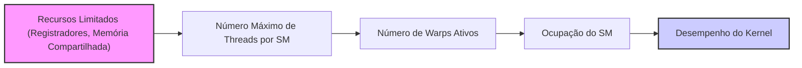
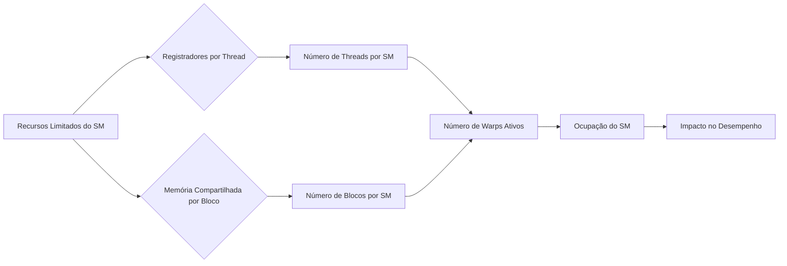
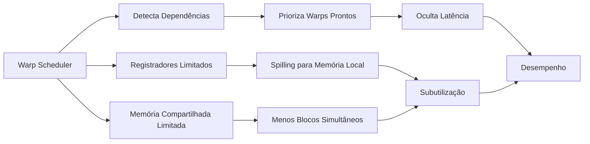

Okay, I've analyzed the text and added Mermaid diagrams to enhance understanding of the concepts. Here's the enhanced text:

## O Impacto da Limitação de Recursos no Paralelismo CUDA: Restrições na Ocupação do SM e no Escalonamento de *Warps*



### Introdução

Em arquiteturas CUDA, o desempenho dos kernels depende da capacidade de utilizar de forma eficiente os recursos disponíveis nos Streaming Multiprocessors (SMs). No entanto, a quantidade de recursos como **registradores** e **memória compartilhada** em cada SM é limitada. Essas limitações impõem restrições ao número de threads que podem estar presentes simultaneamente em um SM e, por consequência, afetam o número de *warps* que o SM pode agendar e executar. Este capítulo explora em detalhes como essas limitações de recursos afetam o número máximo de threads que podem estar presentes simultaneamente em um SM, como o uso excessivo de registradores ou memória compartilhada pode reduzir a capacidade do SM de agendar *warps*, e como essas limitações impõem *trade-offs* que precisam ser considerados durante o desenvolvimento e a otimização de kernels CUDA.

### Limitação de Recursos e a Presença de Threads no SM

A quantidade limitada de registradores e memória compartilhada em um SM impõe um limite superior ao número de threads que podem estar presentes e ativas simultaneamente. Se cada thread utiliza uma grande quantidade de registradores e/ou memória compartilhada, o número total de threads que podem ser executadas em um SM é reduzido.

**Conceito 1: Limite no Número de Threads por SM**

A quantidade limitada de recursos em um SM impõe um limite superior ao número de threads que podem estar ativas simultaneamente nesse SM.

**Lemma 1:** *As limitações de registradores e memória compartilhada em um SM impõem um limite superior ao número máximo de threads que podem estar presentes simultaneamente em um SM.*

*Prova:* A capacidade do hardware é limitada. $\blacksquare$

**Conceito 2: Impacto do Uso de Registradores e Memória Compartilhada**

Quanto mais registradores e memória compartilhada cada thread utiliza, menos threads podem ser executadas simultaneamente no SM. O uso excessivo desses recursos leva à redução do paralelismo e da ocupação do SM.

**Corolário 1:** *O uso excessivo de registradores ou memória compartilhada por thread limita o número de threads que podem estar presentes simultaneamente em um SM, o que reduz o paralelismo e a ocupação do SM.*

*Derivação:* O uso excessivo de recursos individuais limita o uso de outros recursos que poderiam aumentar o paralelismo. $\blacksquare$

### Impacto na Capacidade de Agendamento de *Warps*

As limitações de recursos também afetam a capacidade do SM de agendar e executar *warps*. Um *warp* é um grupo de 32 threads que executam a mesma instrução simultaneamente (SIMT). Se o número de threads que estão em execução por SM for reduzido devido a limitações de recursos, o número de *warps* ativos no SM também é reduzido, o que diminui a possibilidade de o escalonador de *warps* do SM encontrar *warps* prontos para executar a qualquer momento.

```mermaid
sequenceDiagram
    participant SM
    participant WarpScheduler as Warp Scheduler
    participant Warp1
    participant Warp2
    participant Warp3
    SM ->> WarpScheduler: Solicita warps para execução
    WarpScheduler -->> SM: Retorna warp 1 para execução
    WarpScheduler -->> SM: Retorna warp 2 para execução
    WarpScheduler -->> SM: Retorna warp 3 para execução
    Note over Warp1, Warp2, Warp3: Execução SIMT
    SM ->> WarpScheduler: Solicita mais warps
    WarpScheduler -->> SM: Poucos warps prontos
    SM ->> SM: Subutilização
```

**Conceito 3: Impacto das Limitações no Escalonamento de Warps**

A limitação dos recursos utilizados pelas threads de um SM limita a quantidade de *warps* que podem ser executadas, diminuindo a ocupação e o potencial de paralelismo.

**Lemma 2:** *O uso excessivo de registradores ou memória compartilhada em um SM reduz a capacidade do SM de agendar warps, pois limita o número de threads que podem ser executadas simultaneamente.*

*Prova:* A capacidade limitada de recursos impacta o número de *warps* que podem ser executados, o que afeta o paralelismo e, portanto, a capacidade de ocultar a latência de acesso à memória. $\blacksquare$

### A Ocupação do SM e o Paralelismo

A ocupação do SM (Streaming Multiprocessor Occupancy) é uma métrica que indica a porcentagem da capacidade do SM que está sendo utilizada por threads ativas, ou seja, o nível de paralelismo da execução. Um kernel com alta ocupação do SM é capaz de utilizar melhor os recursos do hardware e obter um melhor desempenho. O número ideal de threads ativas por SM é obtido quando a latência do acesso a memória é completamente escondida, utilizando outros *warps* que não estão aguardando dados para execução.

**Conceito 4: A Ocupação do SM como Métrica de Utilização**

A ocupação do SM indica o nível de utilização da capacidade de computação do hardware, e é um indicativo do paralelismo do kernel.

**Corolário 1:** *A limitação de recursos (registradores e memória compartilhada) afeta a ocupação do SM e sua capacidade de agendar *warps*, o que influencia diretamente o nível de paralelismo e a performance do kernel.*

*Derivação:* Uma ocupação baixa do SM indica que o hardware não está sendo utilizado ao máximo, e o desempenho da aplicação está longe de ser o ideal. $\blacksquare$

### O Efeito da Subutilização de Recursos

Quando a quantidade de threads que podem ser executadas em um SM é limitada devido ao uso excessivo de registradores ou memória compartilhada, a capacidade do SM de escalonar *warps* é reduzida. Isso pode levar à subutilização das unidades de processamento do SM, já que o escalonador tem menos *warps* para escolher, o que reduz a possibilidade de esconder a latência do acesso a memória e, por consequência, o desempenho do kernel.

**Conceito 5: Subutilização de Recursos e Desempenho**

O uso excessivo de registradores e memória compartilhada leva a subutilização da capacidade do hardware, diminuindo o paralelismo e o desempenho da aplicação.

**Lemma 3:** *O uso excessivo de registradores ou memória compartilhada pode reduzir a ocupação do SM e a capacidade de o escalonador encontrar warps prontos para execução, o que leva a uma subutilização das unidades de processamento e à degradação do desempenho.*

*Prova:* O uso de recursos em excesso impede que a capacidade de processamento do SM seja usada ao máximo. $\blacksquare$

### Otimizando o Uso de Recursos para o Paralelismo

Para otimizar o desempenho de kernels CUDA, é fundamental planejar cuidadosamente como os recursos do SM são utilizados. O programador deve:

*   **Balancear o Uso de Registradores e Memória Compartilhada:** Escolher um número adequado de registradores e memória compartilhada que não exceda a capacidade de cada SM e não limite a capacidade de execução de várias threads e vários blocos simultaneamente.
*   **Utilizar um Número Adequado de Threads:** Escolher um número de threads por bloco que permita uma boa ocupação do SM, sem levar à subutilização dos recursos, ou ao uso de memórias mais lentas, como a memória local, devido ao *spilling*.
*   **Monitorar a Ocupação do SM:** Utilizar ferramentas de análise de desempenho para monitorar a ocupação do SM e ajustar os parâmetros do kernel de acordo com as características da arquitetura do dispositivo CUDA.
* **Utilizar Versões Diferentes do Kernel:** Criar versões diferentes do mesmo kernel, com diferentes padrões de uso de memória e threads, e escolher a versão adequada para cada arquitetura CUDA.

### Diagrama da Relação entre Recursos e Ocupação do SM



**Explicação:** O diagrama mostra como o uso excessivo de registradores e memória compartilhada limita o número de threads e blocos por SM, o que diminui a capacidade de agendar *warps* e, por consequência, a ocupação do SM.

### Análise Matemática do Impacto dos Recursos na Ocupação do SM

Podemos analisar matematicamente como a limitação dos recursos afeta a ocupação do SM da seguinte forma:

Suponha que:

*  $R_{SM}$ seja o número total de registradores disponíveis no SM.
*  $S_{SM}$ seja a capacidade total de memória compartilhada disponível no SM.
*  $R_{thread}$ seja o número de registradores utilizados por thread.
*  $S_{block}$ seja a capacidade de memória compartilhada utilizada por bloco.
* $N_{threads\_block}$ seja o número de threads por bloco.

O número máximo de threads que podem ser executadas simultaneamente em um SM, devido a limitação de registradores, é dado por:
$$N_{threads\_max\_reg} = \frac{R_{SM}}{R_{thread}}$$

O número máximo de blocos que podem ser executados simultaneamente em um SM, devido a limitação de memória compartilhada, é dado por:
$$N_{blocks\_max\_shmem} = \frac{S_{SM}}{S_{block}}$$

O número total de threads por SM que o dispositivo suporta é limitado pelo menor valor entre o número de threads limitado por registradores e o número de threads limitado pela memória compartilhada:
$$N_{threads\_SM} = min(N_{threads\_max\_reg}, N_{blocks\_max\_shmem} \times N_{threads\_block})$$

Essa equação ilustra como o uso excessivo de registradores ou memória compartilhada limita o número de threads ativas e o paralelismo, enquanto o uso equilibrado maximiza a ocupação do SM e o desempenho.

**Lemma 4:** *A capacidade limitada de registradores e memória compartilhada impõe um limite superior ao número de threads que podem ser executadas simultaneamente em um SM, e o uso excessivo de registradores ou memória compartilhada reduz o paralelismo e a ocupação do SM.*

*Prova:* O número de recursos é limitado e impõe um limite no número de threads. $\blacksquare$

**Corolário 4:** *A otimização de kernels CUDA requer que o programador escolha o número de threads, e planeje o uso da memória compartilhada e dos registradores de forma a utilizar o SM ao máximo, sem exceder os limites dos recursos disponíveis, para atingir a máxima performance.*

*Derivação:* A escolha correta desses parâmetros permite que o hardware seja utilizado de forma eficiente. $\blacksquare$

### Pergunta Teórica Avançada

**Como as arquiteturas de *warp scheduler* de diferentes gerações de GPUs CUDA interagem com as limitações de registradores e memória compartilhada, e como o programador pode adaptar seu código para aproveitar ao máximo os recursos do escalonador e minimizar os efeitos da subutilização?**

**Resposta:**

As arquiteturas de *warp scheduler* (escalonador de *warps*) de diferentes gerações de GPUs CUDA interagem de maneira complexa com as limitações de registradores e memória compartilhada, e a forma como o programador planeja o kernel pode influenciar a eficiência da utilização do hardware.

*   **Arquitetura do *Warp Scheduler*:** O *warp scheduler* é o componente do SM responsável por escolher quais *warps* estão prontos para executar e as instruções que serão executadas. Em arquiteturas mais antigas, o escalonamento de *warps* poderia ser feito de forma menos eficiente do que nas arquiteturas mais novas. Arquiteturas de *warp scheduler* mais modernas conseguem detectar dependências de dados e instrução, fazendo com que um *warp* espere até que os dados estejam disponíveis, enquanto outros *warps* são executados.
*   **Limitações de Registradores:** A falta de registradores causa *spilling*, que utiliza a memória local, o que é muito mais lento que o acesso a registradores. O escalonador de *warps* pode ter dificuldade de encontrar *warps* que estejam prontos para executar, mesmo que existam outros *warps* na memória, devido a essa espera por dados.
*   **Limitações de Memória Compartilhada:** A falta de memória compartilhada limita o número de blocos que podem ser executados simultaneamente no SM, o que também diminui o número de *warps* disponíveis para execução e diminui a ocupação do SM, o que diminui a possibilidade do escalonador encontrar *warps* prontos para execução e esconder a latência de acesso a memória global.



**Otimização do Código:** O programador pode utilizar as seguintes estratégias para maximizar o uso do escalonador de *warps*:

*   **Utilizar Registradores com Sabedoria:** Evitar o uso excessivo de registradores, para permitir o uso eficiente do escalonador.
*   **Otimizar o Uso da Memória Compartilhada:** Utilizar a memória compartilhada de forma estratégica, utilizando técnicas de *tiling*, e evitando *bank conflicts*.
*   **Minimizar a Divergência:** Minimizar o *warp divergence* no código, para que o escalonador tenha sempre *warps* com instruções prontas para executar.
*   **Monitorar a Ocupação:** Utilizar as ferramentas de medição para monitorar a ocupação do SM e o nível de paralelismo da aplicação.
*   **Adaptar o Código:** O código deve ser adaptado para as diferentes arquiteturas do dispositivo CUDA. As diferentes capacidades de memória, diferentes número de registradores e arquiteturas de *warp scheduler* diferentes afetam o resultado da execução, e o código deve ser adaptado para cada caso.

**Lemma 7:** *A arquitetura de warp scheduler em diferentes gerações de GPUs CUDA interage com a limitação dos registradores e da memória compartilhada, e a escolha adequada do número de threads por bloco, o uso de registradores e o uso de memória compartilhada é fundamental para obter uma boa ocupação do SM e maximizar o desempenho.*

*Prova:* As arquiteturas de *warp scheduler* diferem entre dispositivos, e a escolha da melhor estratégia deve levar essas diferenças em consideração. $\blacksquare$

**Corolário 6:** *A otimização de kernels CUDA para diferentes plataformas exige o entendimento da arquitetura de *warp scheduler* de cada device e como ele interage com as limitações de registradores e memória compartilhada, para que a escolha dos parâmetros do kernel seja feito da forma mais apropriada para aquela arquitetura, e o melhor desempenho seja obtido.*

*Derivação:* O entendimento de como o escalonador de *warps* funciona é fundamental para otimizar a performance. $\blacksquare$

### Conclusão

As limitações de recursos em dispositivos CUDA, como a quantidade de registradores e memória compartilhada por SM, impõem restrições ao nível de paralelismo que um kernel pode alcançar. A escolha correta do número de threads por bloco e o planejamento do uso da memória compartilhada e de registradores é fundamental para garantir uma boa ocupação do SM, e um bom desempenho da aplicação. O programador precisa ter um entendimento profundo desses *trade-offs* para desenvolver aplicações CUDA que utilizem ao máximo os recursos disponíveis e atinjam o melhor desempenho possível.

### Referências

[^11]: "Note that the number of registers available to each SM varies from device to device. An application can dynamically determine the number of registers available in each SM of the device used and choose a version of the kernel that uses the number of registers appropriate for the device." *(Trecho do Capítulo 5, página 116)*

**Deseja que eu continue com as próximas seções?**
